# 揭开 BigQuery 保留的神秘面纱

> 原文：<https://medium.com/google-cloud/demystifying-bigquery-reservations-5e3ac87a4ff8?source=collection_archive---------0----------------------->

## 了解如何混合统一费率和按需定价


迈克·彼得鲁奇在 [Unsplash](https://unsplash.com?utm_source=medium&utm_medium=referral) 上的照片

BigQuery 是 Google Cloud 的 EB 级数据仓库。它通过数据仓库即服务和现收现付的概念彻底改变了市场。

BigQuery 完全分离了计算层和存储层，这反映在它的定价上。您需要分别支付计算和存储费用。

专注于计算层，通过[按需定价](https://cloud.google.com/bigquery/pricing#on_demand_pricing)，您只需为您的查询实际读取的字节付费，并且您可以获得每个项目高达 [2000 个可突发插槽](https://cloud.google.com/bigquery/quotas#query_jobs) *的计算能力。这是一台触手可及的超级计算机。

*一个[槽](https://cloud.google.com/bigquery/docs/slots)是 BigQuery 计算能力的度量单位。插槽越多，速度越快。

然而，许多复杂的组织需要遵循内部流程和治理规则。这些组织希望将他们的预算分配给不同的小组，并确保每个人都在分配的开支范围内。

对于这些用例，BigQuery 支持[统一费率定价](https://cloud.google.com/bigquery/pricing#flat_rate_pricing)。您提前购买以时段表示的预留计算能力，承诺[年、月或**分钟**(弹性时段)](https://cloud.google.com/bigquery/docs/reservations-concepts#commitment_plans)。

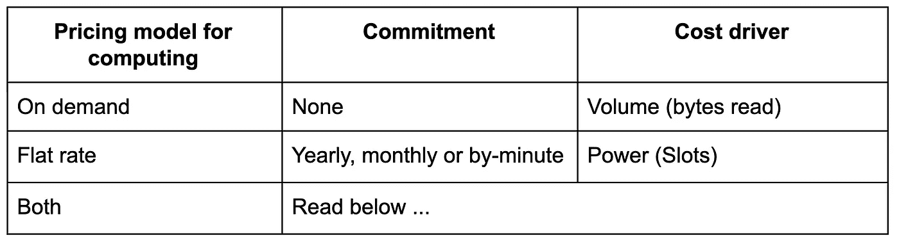

# 查询的原始项目

你可能没有注意到这一点，但是


这可以通过查看这个命令行变得非常清楚


原始项目(蓝色)是通过 project_id 参数指定的，而被查询的表的项目(绿色)被表示为表全名的一部分。

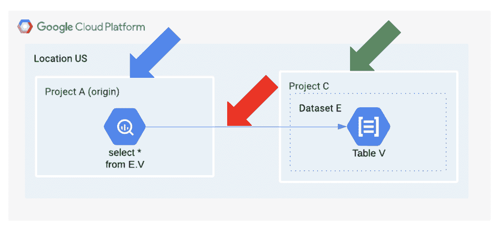

*例子中涉及的项目*

即使在使用 BigQuery web UI 时，这些概念也是可见的。

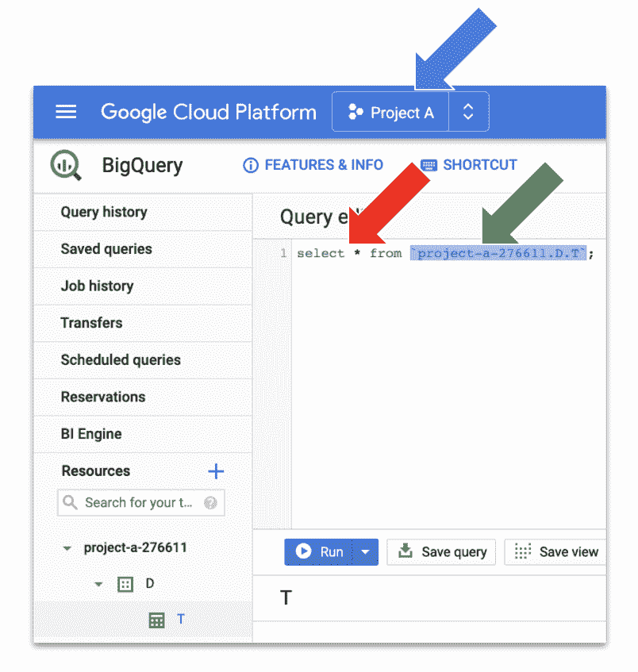

*web 用户界面中的部分查询*

澄清了“查询的原始项目”的概念并提供了一种可视化的方法后，我们可以继续关注统一费率模型。

# 为项目分配时段

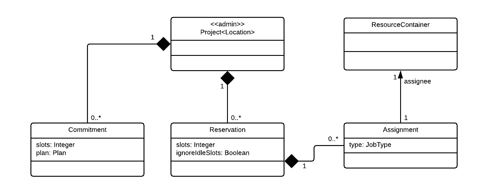

*预约 API 的数据模型*

在 BigQuery 中，您可以通过[承诺](https://cloud.google.com/bigquery/docs/reservations-concepts#commitments)购买一定数量的插槽。它指定所需的插槽数量以及最短时间段(年、月、分钟)。承诺时间越长，每个时段的价格越低。

通过[预约](https://cloud.google.com/bigquery/docs/reservations-concepts#reservations)，你将购买的插槽分成几个部分，并给它们起一个名字。

[分配](https://cloud.google.com/bigquery/docs/reservations-concepts#assignments)将预约指定的时段数量分配给一个或多个项目。

概括地说，您购买插槽并将其分配给项目。

统一费率模型要求(至少)一个项目通过启用[保留 API](https://cloud.google.com/bigquery/docs/reference/reservations/rest) 而被选入**管理项目**角色。它可以是任何项目，但你可能希望有一个专门的项目，只是为了保持事情清晰和分离。

只能在管理项目中创建承诺、预订和分配。任务可以指向任何项目。

承诺、预订和分配具有位置范围。换句话说，承诺的时段不能分布在多个位置，但是可以在多个位置购买承诺。

通过 CLI 或 API，一切都可以在 BigQuery web UI 中轻松完成。

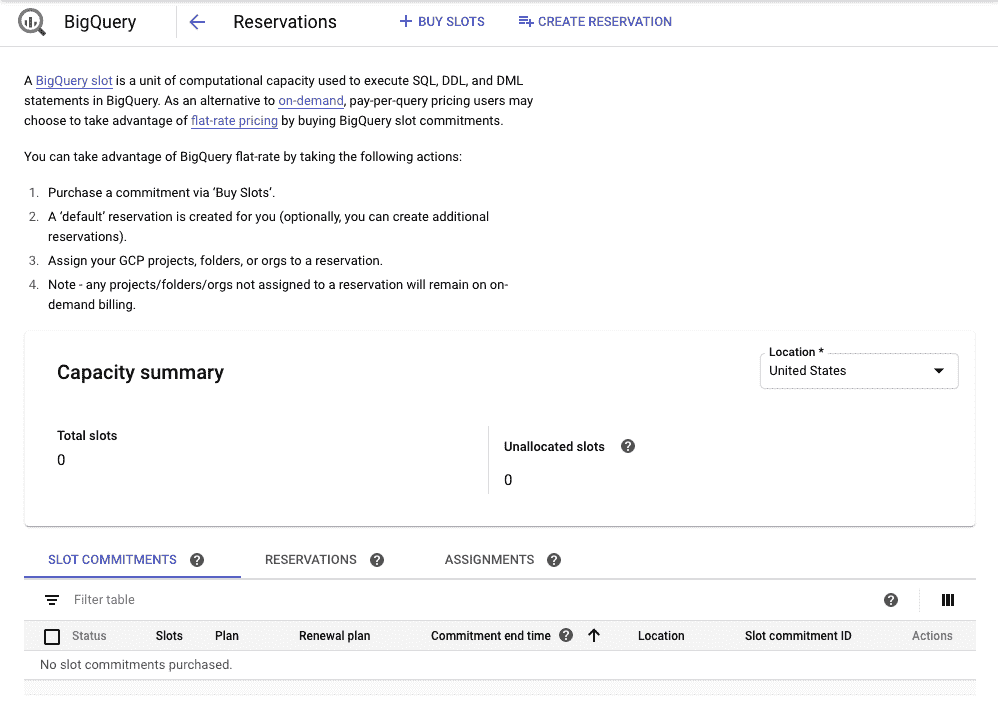

*网络用户界面中的预订面板*

可能的配置是无限的，但这里有一些简单的例子:

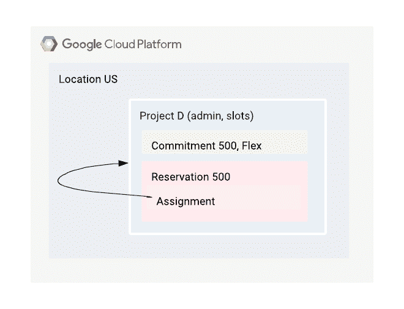

*分配给管理项目的所有插槽*

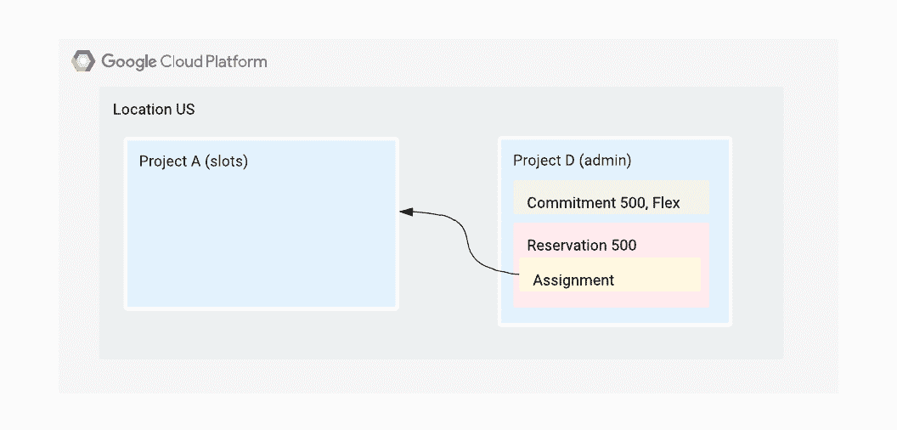

*分配给另一个项目的所有插槽*

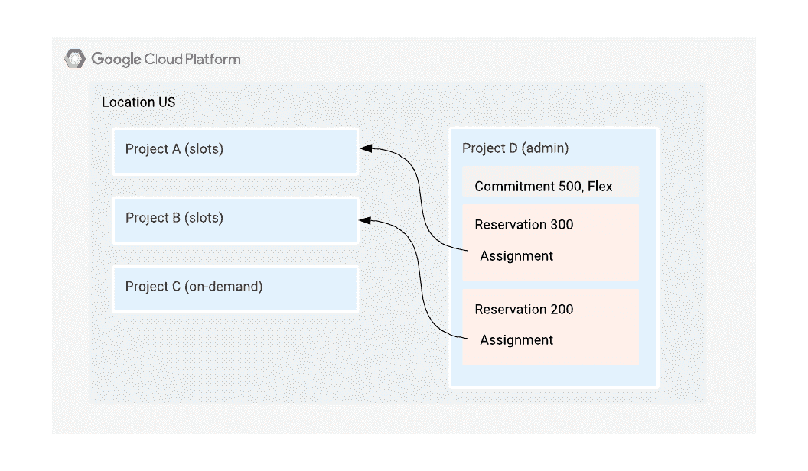

项目 A 有 300 个插槽，项目 B 有 200 个插槽，项目 C 没有插槽

# 更改查询的定价模式

现在我们已经将插槽分配给了一个项目，我们如何使用它们呢？

**通过更改查询的原始项目**，可以**更改资源和定价模型**。

*   如果原始项目没有任何**分配**，查询将使用**按需模型**。
*   如果原始项目有一个**分配**，那么查询将使用**统一费率模型**，并且可以访问分配的插槽。

在下面的例子中，我们有一个分配了插槽的项目 A 和一个没有插槽的项目 B。在第一个示例中，项目 A 是起点，因此应用了统一费率模型。

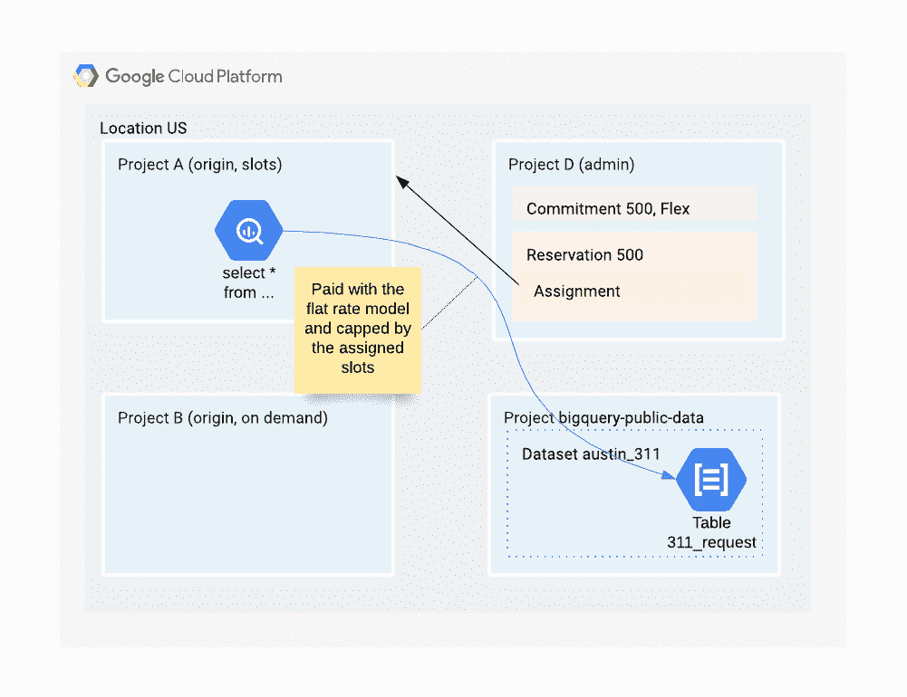

*统一费率示例*

在第二个例子中，执行完全相同的查询，但是这次原始项目是项目 b。因为它没有槽，所以使用按需模型。

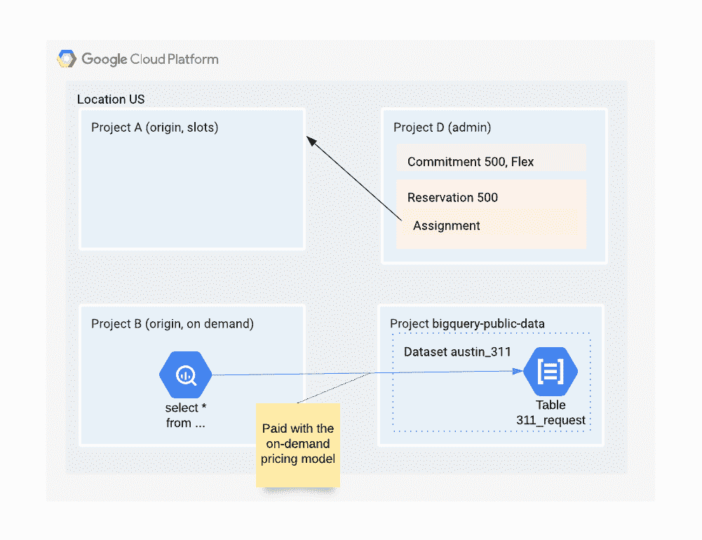

*点播示例*

我们现在可以暂停一会儿，后退一步，试着理解整个画面。

预留背后的想法是将位置(或不)分配给一组项目。然后，根据期望的定价模型和您需要的时段，在这些项目上分配工作负载(查询)。

因为原始项目是在运行时定义的，所以这个查询/ orgin_project 分配不必是静态的。它可以随时更改，甚至就在运行查询之前。

通过将其与[资源层次](https://cloud.google.com/resource-manager/docs/cloud-platform-resource-hierarchy)以及多个管理项目相结合，高度高级的工作负载管理配置成为可能。

# 约束用户

我们可以想象这样一种情况，用户组 X(如工程)在项目 X 上有 20000 个专用槽，用户组 Y(如财务)在项目 Y 上有 500 个专用槽，用户被要求只能使用他们自己的项目。

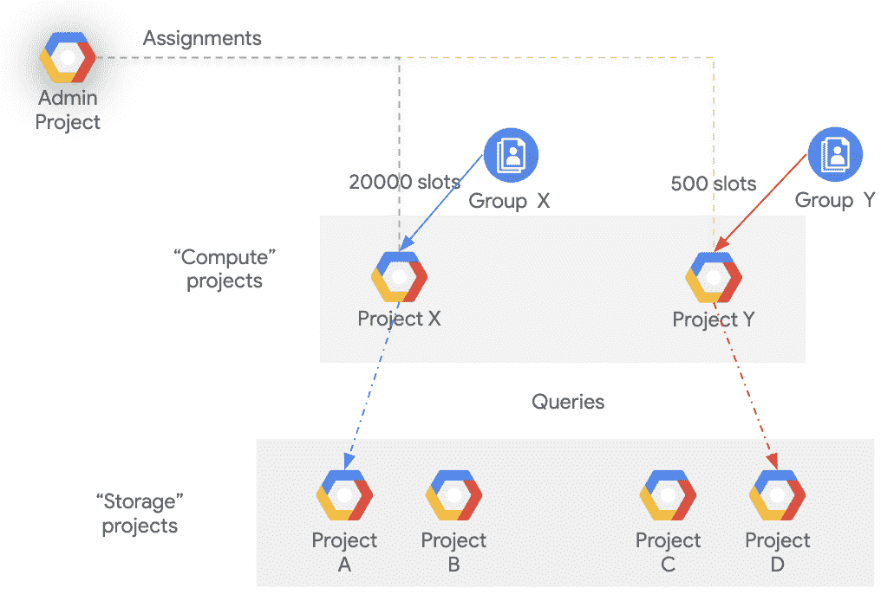

根据我们到目前为止所解释的，没有什么可以阻止 Y 组的不耐烦用户使用项目 X 上可用的更高能力。毕竟，他只需要使用项目 X 作为他的查询的来源。

在这种情况下，[*big query . jobs . create*](https://cloud.google.com/bigquery/docs/access-control#bq-permissions)权限可以帮助我们。只有当用户(或组)对某个项目拥有此权限时，他才能将其作为原点。权限包含在[*roles/big query . job user*](https://cloud.google.com/bigquery/docs/access-control#bigquery)和 *roles/bigquery.user* 中。

回到我们的例子，我们必须确保每个组在所有的项目中有这些角色中的一个，并且只有它可以用作源。

```
* Group X
  * Project X: roles/bigquery.jobUser
  * Project Y: -
* Group Y
  * Project X: -
  * Project Y: roles/bigquery.jobUser
```

# 限制按需使用

可以使用类似的方法来限制一组用户的按需使用。例如，我们可以强制组 Z 仅使用按需模式，最高可达 10tb/天。

我们创建一个项目 Z，不为它分配槽，而是将[自定义配额](https://cloud.google.com/bigquery/docs/custom-quotas)“big Query API—每天的查询使用量”配置为 10 TB。然后，我们只在项目 Z 中将 *roles/bigquery.jobUser* 分配给组 Z。

这样，Z 组只能使用项目 Z 作为原点。因此，他们的所有查询都将使用按需定价，并侵蚀配置的配额。

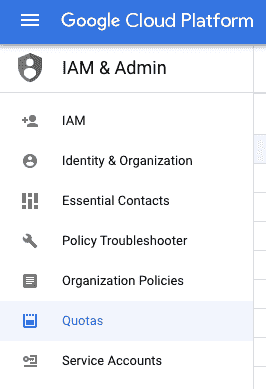

*配额菜单*

这可以重复进行以创建多个独立的存储桶，如果需要，甚至可以使用自定义配额“BigQuery API —每个用户每天的查询使用量”来限制每个用户的使用量。

其他提示是[限制每次查询的字节数](https://cloud.google.com/bigquery/docs/best-practices-costs#limit_query_costs_by_restricting_the_number_of_bytes_billed)以及监控使用情况，如这里的[所述](https://cloud.google.com/blog/products/data-analytics/taking-a-practical-approach-to-bigquery-cost-monitoring)。

# 关闭

在本文中，我们了解到:

1.  计算定价有两种类型，按需定价和统一定价，您的组织可能需要这两种类型。
2.  通过为您的查询选择正确的“原始项目”,您可以根据具体情况使用它们。
3.  您可以购买统一费率的计算能力(插槽、承诺)并将其分配(预留、分配)给特定用户(项目、角色)。
4.  按需使用也可以被分配和控制。

为了庆祝 BigQuery 十周年，谷歌为[的试用时段](https://cloud.google.com/bigquery/pricing#trial-slots-pricing)提供 95%的折扣。我鼓励你开始尝试保留。只需登录[谷歌云控制台](https://console.cloud.google.com/)并购买每分钟承诺([弹性时段](https://cloud.google.com/blog/products/data-analytics/introducing-bigquery-flex-slots))。

更新 20200812:现在你甚至可以只购买 [100 个插槽](https://cloud.google.com/blog/products/data-analytics/bigquery-flexible-pricing-starting-with-100-slots)。