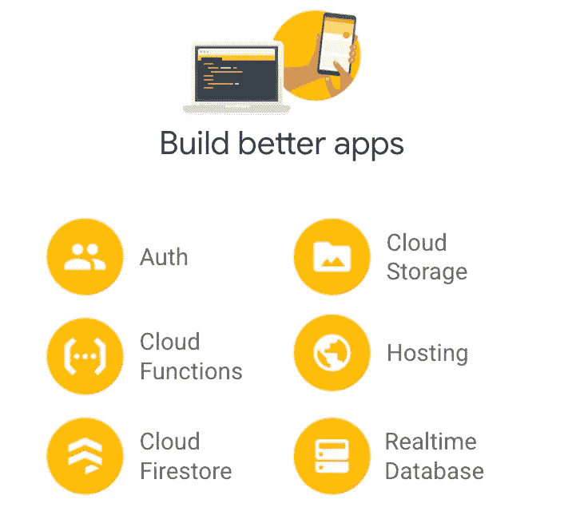

# 揭开火焰基地的神秘面纱——第一部分

> 原文：<https://medium.com/google-cloud/demystifying-firebase-part-1-a06339069f92?source=collection_archive---------0----------------------->

firebase——快速构建应用的新生态系统

> [*全球 7.1%的创业公司从事金融科技行业。其次是生命科学和医疗保健，占 6.8%，人工智能占 5.0%，游戏占 4.7%，广告技术占 3.3%，教育技术占 2.8%。*](https://firstsiteguide.com/startup-stats/#:~:text=7.1%25%20of%20the%20startups%20in%20the%20world%20operate%20in%20the%20Fintech%20industry.%20Followed%20by%20Life%20sciences%20and%20healthcare%20with%206.8%25%2C%20Artificial%20intelligence%20with%205.0%25%2C%20Gaming%20with%204.7%25%2C%20Adtech%20with%203.3%25%2C%20and%20Edtech%20with%202.8%25.) *很明显，现代初创公司都致力于构建跨行业的改变游戏规则的解决方案。*

从上面的引用中我们可以知道最有趣的事实是:超过 69%的初创企业是从家庭企业起步的。其中，约 58%的初创公司在初创阶段可支配的资金不足 2.5 万美元。更不用说大多数初创公司都在采用“移动优先”的解决方案。

有了上述信息，了解如何优化和利用最佳技术组合的诀窍就变得非常重要，这些技术组合本质上有助于增加创业生态系统的收入/利润。

Firebase(不再仅仅是一个移动 BaaS)本身就是一个不断发展的生态系统，它为任何初创公司提供了将他们的想法付诸实践的机会，消除了复杂的传统 SDLC 流程。

在“揭开 Firebase 神秘面纱”系列的第 1 部分中，我们将解开 Firebase 提供的所有基本服务，在短时间内将您的想法变为现实。

Firebase 本质上是一个完整的生态系统，包含一套服务，可以大致分为三类。

1.  建设
2.  分析
3.  推动参与

在本系列的第一部分中，我们将关注 Bucket 1 (Build ),它将帮助开发人员使用 Firebase 构建一个快速原型，甚至构建一个完整的生产级应用程序。

在 **Build** 下，我们有以下服务，通常帮助开发人员构建他们的应用。

> ***一个有趣的事实——*** *你知道 Firebase 是 Envolve 在 2011 年开发的* ***吗？*** *它最初是作为构建聊天应用程序的实时数据库而开发的。*

**Firebase 认证**

大多数应用程序需要更好地了解用户的身份，以便通过个性化提供更好的内容。Firebase Authentication 提供易于使用的 SDK、后端服务和现成的 UI 库来验证您的用户。它还提供了多种渠道让您的用户进行身份验证，即密码、电话号码和流行的身份提供商，如谷歌、脸书、Twitter、Github、苹果等。或者甚至让您构建自己的自定义身份验证逻辑。通过提供者的身份验证是通过安全的 oAuth 机制进行的。

> ***你知道吗？*** *默认情况下，通过认证的用户可以读写 Firebase 实时数据库和云存储中的数据。您可以通过修改您的* [*Firebase 实时数据库*](https://firebase.google.com/docs/database/security/index) *和* [*云存储安全规则*](https://firebase.google.com/docs/storage/security/index) *来控制这些用户的访问。*

**fire base 的云函数**

Firebase 的云功能是一个无服务器平台，允许开发人员运行他们的后端代码来响应由 Firebase 特性和 HTTP 请求触发的事件。这实质上意味着平台有能力自我扩展和自我管理，最重要的是，你只需为调用、CPU 利用率等付费。在函数运行期间。

有许多与这种无服务器功能相关的用例

*   当用户在您的应用程序排行榜上时通知他们
*   执行数据库清理
*   移动密集型计算，让您的应用响应迅速

或者，通过引入人工智能/人工智能技术来增加应用程序的复杂性

*   利用[云视觉 API](https://cloud.google.com/vision) 进行图像分析和图像标记
*   处理用户的付款
*   使用谷歌翻译翻译信息
*   向 webhook 发送请求以触发任何管道

> ***你知道吗？*** *每个功能都是孤立运行的，在自己的环境中有自己的配置。*

**Firebase 云存储**

它是为 Google scale 打造的最强大、最简单、最具成本效益的对象存储服务。用于云存储的 Firebase SDKs 为您的 Firebase 应用程序的文件上传和下载添加了 Google 安全性，无论网络质量如何。

为什么选择云存储？

*   **稳健的操作-** 上传&下载稳健，它们从停止的地方重新启动，节省您的用户时间&带宽
*   **强大的安全性-** 开发人员可以使用声明式安全模型，基于文件名、大小、内容类型或任何其他元数据来实现对对象的细粒度访问
*   **高可扩展性-** 当你的应用病毒式传播时，能够承受甚至是千兆字节的规模。

> ***你知道吗？*** *Firebase 的云存储支持从原型到生产的整个过程，同样的基础设施也支持 Spotify & Google Photos。*

**Firebase 托管**

Firebase 托管提供了一种快速安全的方式来托管您的 web 应用程序，静态、动态甚至微服务。开发人员可以快速部署他们的 web 应用程序，并通过全球内容交付网络(CDN)提供内容。它还提供了各种各样的特性，使得开发人员可以方便地快速部署应用程序。

为什么选择 Firebase 托管？

*   **快速交付内容** -上传的每个文件都缓存在全球 CDN 边缘的固态硬盘上。为您的内容自动选择最佳压缩方法。
*   **模拟&共享** -在本地托管的 URL 上模拟您的更改。使用临时 URL 与您的团队成员共享您的更改。Firebase Hosting 还提供了与 Github 的简单集成，用于预览您的内容。
*   **在一个命令中部署**——在一个命令中部署 web 应用程序的新版本，如果您需要撤销更改，只需单击回滚功能即可。

> ***你知道吗？*** *Firebase 主机提供零配置 SSL，因此您的内容总是安全地交付。*

**云 Firestore vs Firebase 实时数据库**

这两个数据库都支持移动优先、实时 SDK 和离线应用的本地数据存储。云 Firestore 和实时数据库都是 NoSQL 数据库。

Cloud Firestore 是 Firebase 的最新数据库，建立在 Firebase 实时数据库的成功之上。它有更直观的数据模型，对更快的查询有更丰富的支持，并且比实时数据库更具可扩展性。

何时选择云 Firestore

*   需要高级查询、排序和事务
*   数据库的大小预计将从千兆字节增长到千兆字节
*   预计会有更多读取繁重的数据库
*   离线查询经常在数据库上运行
*   需要单一数据库
*   数据通常存储为组织成集合的文档
*   典型的用例，如产品目录、购物车、订单等。

**Firebase 实时数据库**是 Firebase 团队推出的第一款产品。这是一个高效、低延迟的解决方案，用于构建需要跨各种客户端实时同步状态的移动应用程序。

很多时候，当谈到 Firestore 与实时数据库时，开发人员总是困惑于选择正确的一个。让我们通过引入一个清单来简化它

何时选择实时数据库

*   主要用基本查询同步数据
*   减少频繁更改的数据
*   简单的 JSON 树(存储数据的模型)
*   离线查询很少或从不运行
*   需要许多数据库
*   典型的使用案例，如聊天机器人、位置跟踪、绘图板等。

> ***你知道吗？*** *通常，开发人员最终会选择一个会产生大量成本的数据库，而基于用例的简单数据库切换会大幅降低成本。*

至此，我们完成了“揭开 Firebase 神秘面纱”系列的第 1 部分。在第 2 部分中，我们将了解更多关于 Firebase 的**分析**服务，这些服务可以帮助开发人员更好地了解他们的终端用户在应用程序中的交互和事件。