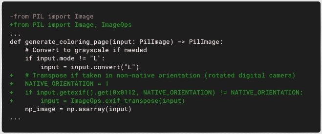
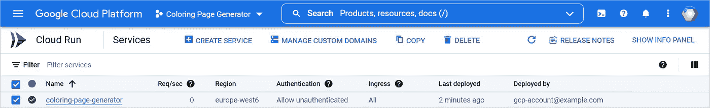

# 使用云运行在几分钟内部署一个彩色页面生成器

> 原文：<https://medium.com/google-cloud/deploy-a-coloring-page-generator-in-minutes-with-cloud-run-bff59e59d890?source=collection_archive---------0----------------------->

# 👋你好

你写过剧本改造过形象吗？你是和别人分享了这个脚本还是在多台电脑上运行了它？您需要更新脚本或安装说明多少次？最后是把它做成一个服务还是一个在线应用？如果你的脚本是有用的，你可能想让其他人也能使用它。部署处理服务是一种经常性的需求——这种需求伴随着一系列挑战。无服务器技术让您轻松高效地应对这些挑战。

在这篇文章中，你将看到如何…

*   创建一个生成彩色页面的图像处理服务
*   使用最少的资源使其在线可用

…并且用不到 200 行 Python 和 JavaScript 就完成了这一切！

# 🛠️工具

要构建和部署着色页面生成器，您需要一些工具:

*   处理图像的库
*   web 应用程序框架
*   网络服务器
*   使演示全天候可用的无服务器解决方案

# 🧱建筑

以下是使用云运行的着色页面生成器的一种可能架构:

这是工作流程:

*   1.用户打开 web 应用程序:浏览器请求主页面。
*   2.云跑服务 app HTML 代码。
*   3.浏览器请求额外的所需资源。
*   4.云运行服务于 CSS、JavaScript 和其他资源。
*   A.用户选择一幅图像，前端将图像发送到`/api/coloring-page`端点。
*   B.后端处理输入图像并返回输出图像，用户可以通过浏览器查看、下载或打印输出图像。

# 🐍软件栈

当然，有许多不同的软件栈可以用来实现这样的架构。

下面是一个基于 Python 的好例子:

它包括:

*   [Gunicorn](https://pypi.org/project/gunicorn) :生产级的 WSGI HTTP 服务器
*   烧瓶:一个流行的 web 应用框架
*   scikit-image :一个广泛的图像处理库

在名为`requirements.txt`的文件中定义这些应用依赖关系:

# 🎨图像处理

如何去除图像中的颜色？一种方法是通过检测对象边缘，并在结果图像中移除除边缘之外的所有内容。这可以通过 [Sobel](https://wikipedia.org/wiki/Sobel_operator) 滤波器来完成，这是一种卷积滤波器，可以检测图像强度变化最大的区域。

创建一个名为`main.py`的 Python 文件，定义一个图像处理函数，并在其中使用来自 scikit-image 的 Sobel 滤波器和其他函数:

> *注意:NumPy 和 Pillow 库作为 scikit-image 的依赖项自动安装。*

例如，下面是如何在每个步骤中处理“云跑”徽标:

# ✨网络应用

## 后端

为了暴露两个端点(`GET /`和`POST /api/coloring-page`)，在`main.py`中添加烧瓶路线:

## 前端

在浏览器端，编写一个 JavaScript 函数，调用`/api/coloring-page`端点并接收处理后的图像:

你的应用程序的基础就在那里。现在你只需要添加 HTML + CSS + JS 的混合来完成想要的用户体验。

## 地方发展

要在您的计算机上开发和测试应用程序，一旦您的环境设置完毕，请确保您拥有所需的依赖项:

将以下区块添加到`main.py`。仅当您手动运行应用程序时，它才会执行:

运行您的应用程序:

Flask 启动本地 web 服务器:

> *注意:在这种模式下，您使用的是开发 web 服务器(不适合生产)。接下来，您将使用 Gunicorn(一种生产级服务器)来设置部署以服务于您的应用程序。*

你都准备好了。在你的浏览器中打开`localhost:8080`，测试，提炼，迭代。

# 🚀部署

一旦您的应用程序准备就绪，您可以在一个名为`Procfile`的文件中用这一行代码定义它的服务方式:

在此阶段，以下是典型项目中的文件:

就这样，您现在可以从源文件夹部署您的应用程序了:

# 引擎盖下的⚙️

命令行输出详细描述了所有不同的步骤:

间接调用 Cloud Build 来容器化你的 app。它的核心组件之一是 Google Cloud [Buildpacks](https://github.com/GoogleCloudPlatform/buildpacks) ，它可以从您的源代码自动构建一个生产就绪的容器映像。以下是主要步骤:

*   云构建获取源代码。
*   Buildpacks 自动检测应用程序语言(这里是 Python ),并使用相应的安全基础映像。
*   Buildpacks 安装应用依赖项(在 Python 的`requirements.txt`中定义)。
*   Buildpacks 配置服务入口点(在 Python 的`Procfile`中定义)。
*   云构建将容器映像推送到[工件注册表](https://cloud.google.com/artifact-registry)。
*   Cloud Run 基于这个容器映像创建服务的新版本。
*   云运行将生产流量路由到 it 部门。

> 注意:
> - Buildpacks 目前支持以下运行时:Go，Java，。NET、Node.js 和 Python。
> -基本映像由谷歌积极维护，扫描安全漏洞，并修补已知问题。这意味着，当您部署更新时，您的服务基于尽可能安全的映像。
> -如果您需要构建自己的容器映像，例如使用自定义运行时，您可以添加自己的`Dockerfile`，Buildpacks 将使用它。

# 💫更新

来自真实用户的更多测试显示了一些问题。

首先，该应用程序不处理用数码相机在非原生方向拍摄的照片。您可以使用 EXIF 方向数据来解决这个问题:

此外，该应用程序对输入图像中的细节过于敏感。绘画中的纹理或图片中的噪声会在处理后的图像中产生许多边缘。您可以通过预先添加去噪步骤来改进处理算法:

这个额外的步骤使彩色页面更干净，并减少了打印时使用的墨水量:

重新部署，应用程序会自动更新:

# 🎉它是活的

该应用在 Cloud Run 中显示为一项服务:

服务控制面板为您提供了应用使用的概览:

就是这样；您的图像处理应用已投入生产！

# 🤯它是无服务器的

在这种架构中使用云运行有很多好处:

*   您的应用程序全天候可用。
*   环境是完全可管理的:您可以专注于您的代码，而不用担心基础设施。
*   您的应用程序可通过 HTTPS 自动使用。
*   您可以将您的应用程序映射到自定义域。
*   云运行会自动扩展实例的数量，并且计费只包括代码运行时使用的资源。
*   如果您的应用程序未被使用，云运行将缩减至零。
*   如果你的应用程序获得了更多的流量(想象一下它成为了新闻)，那么 Cloud Run 可以根据需要的实例数量进行扩展。
*   您可以通过微调许多设置来控制性能和成本:CPU、内存、并发、最小实例、最大实例等等。
*   每个月，[免费层](https://cloud.google.com/run/pricing)免费提供前 50 个 vCPU 小时、100 个 GiB 小时和 200 万个请求。

# 💾源代码

该项目仅包含 7 个文件和不到 200 行 Python + JavaScript 代码。

您可以重复使用此演示作为基础来构建您自己的图像处理应用程序:

*   在 GitHub 上查看源代码。
*   有关在几分钟内自行部署应用程序的分步说明，请参见[“从头部署”](https://github.com/PicardParis/cherry-on-py/blob/main/cr_image_processing/DEPLOY.md)。

# 🖖·莫尔

*   尝试演示并生成自己的彩色页面。
*   [了解更多关于云跑的](https://cloud.google.com/run/docs)。
*   如需更多云内容，请在 Twitter ( [@PicardParis](https://twitter.com/PicardParis) )或 LinkedIn ( [in/PicardParis](https://linkedin.com/in/PicardParis) )上关注我，并随时联系任何反馈或问题。

# 📜同样在这个系列中

1.  [总结视频](/google-cloud/️-auto-generate-video-summaries-with-a-machine-learning-model-and-a-serverless-pipeline-c2f261c8035c?source=friends_link&sk=f94ff51885c51dd52539848ce04654ab)
2.  [跟踪视频对象](/google-cloud/video-object-tracking-as-a-service-18eb4227df34?source=friends_link&sk=c9602c33c77aa950a59282b6de5c0c57)
3.  [人脸检测和处理](/google-cloud/face-detection-and-processing-in-300-lines-of-code-38dc51a115d4?source=friends_link&sk=cc252ab86eab9ed2e8583963d0598661)
4.  处理图像

*原载于 2022 年 4 月 5 日* [*谷歌云博客*](https://cloud.google.com/blog/topics/developers-practitioners/deploy-coloring-page-generator-minutes-cloud-run) *。*