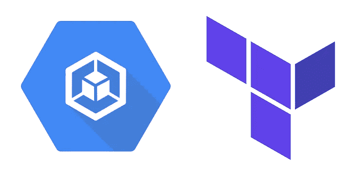

# 通过 Terraform 将 Go API 部署到 Google Kubernetes 引擎

> 原文：<https://medium.com/google-cloud/deploy-a-go-api-to-google-kubernetes-engine-via-terraform-bb3eb7a479a4?source=collection_archive---------1----------------------->

如何仅使用 Terraform 创建一个简单的 Golang API 并将其部署到 GKE 集群。

Terraform 和 GKE 标志

在开始之前，请注意，需要在 GCP 设置 [Terraform creds 才能执行任何基础设施操作。](/google-cloud/terraform-credentials-setup-in-gcp-c81c8ebaff5d)

步骤:

1.  创建、对接和发布公开 http 端点的 go 应用程序