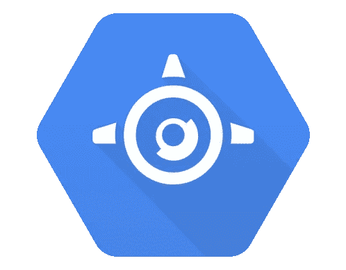

# 在 Google App Engine Flex 上部署 Ratpack 应用程序

> 原文：<https://medium.com/google-cloud/deploy-a-ratpack-app-on-google-app-engine-flex-6ab59a90f6cf?source=collection_archive---------0----------------------->

对于我在会议上的演示，我经常使用像 [Ratpack](https://ratpack.io/) 、 [Grails](https://grails.org/) 或 [Gaelyk](http://gaelyk.appspot.com/) 这样的框架，它们基于 [Apache Groovy](http://www.groovy-lang.org/) 编程语言。在[上一篇文章](http://glaforge.appspot.com/article/binge-streaming-web-apis-with-ratpack-cloud-endpoints-app-engine-flex-and-streamdata-io)中，我已经使用了 Ratpack，但是是在稍微复杂一点的用例上，但是这一次，我想分享一个快速的 Ratpack hello world，并将其部署在 [Flex](https://cloud.google.com/appengine/docs/flexible/) 上。

我从一个由 [Lazybones](https://github.com/pledbrook/lazybones) (一个使用打包项目模板的简单项目创建工具)生成的 hello world 模板开始，它是我与 [SDKman](http://sdkman.io/) (一个用于管理多个软件开发工具包的并行版本的工具)一起安装的。但是你显然可以继续使用你自己的 Ratpack 应用程序。如果您已经有了应用程序，请随意跳过下一部分。


## **创建 Ratpack 项目**

```
# install SDKman
curl -s "https://get.sdkman.io" | bash# install lazybones with sdkman
sdk install lazybones# create your hello world Ratpack app from a template
lazybones create ratpack flex-test-1
```

然后，您可以通过以下方式快速运行您的应用:

```
cd flex-test-1 ./gradlew run
```

打开浏览器进入 [http://localhost:5050](http://localhost:5050) 查看你的应用程序运行情况。

我们将使用 distTar 任务来创建我们的应用程序的发行版，因此使用:

```
./gradlew distTar
```



## 为灵活做好准备

要在 App Engine Flex 上运行我们的应用程序，我们需要做两件事:1)将其封装为 Docker 容器，2)创建 app.yaml 应用程序描述符。先说 Docker。创建一个 docker 文件，并适当地修改路径名(将“flex-test-1”替换为创建项目的目录名):

```
FROM gcr.io/google_appengine/openjdk8
VOLUME /tmp
ADD build/distributions/flex-test-1.tar /
ENV JAVA_OPTS='-Dratpack.port=8080 -Djava.security.egd=file:/dev/./urandom'
ENTRYPOINT ["/flex-test-1/bin/flex-test-1"]
```

我使用开放的 JDK 8 作为我的定制运行时。我添加了我的 tarred 项目，并指定运行端口 8080(按照 Flex 的要求)，并定义了我生成的启动脚本的入口点。

我的 app.yaml 文件(用于 App Engine Flex)非常短，表明我正在使用灵活的环境:

```
runtime: customenv: flex
threadsafe: true
```

在 Google 云平台上创建和部署您的项目

```
gcloud app deploy
```

过一会儿，你的 Ratpack 就应该启动并运行了！

*最初发表于*[*【glaforge.appspot.com】*](http://glaforge.appspot.com/article/deploy-a-ratpack-app-on-google-app-engine-flex)*。*