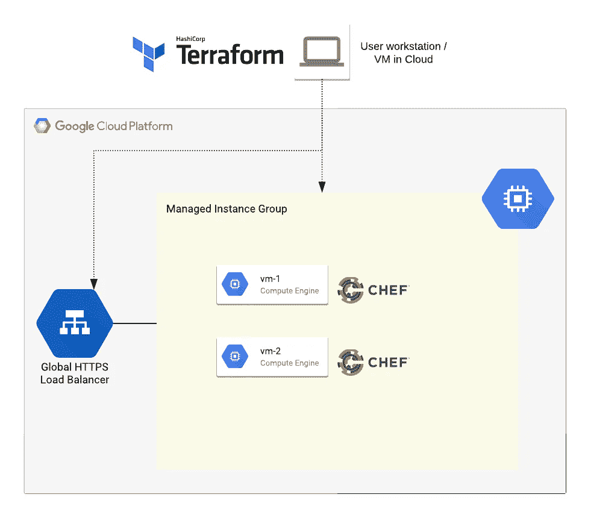

# 在 GCP 用 Terraform 和 Chef 部署一个简单的网站

> 原文：<https://medium.com/google-cloud/deploy-a-simple-website-with-terraform-and-chef-on-gcp-7c3b607624e8?source=collection_archive---------0----------------------->

Terraform 用于创建基础架构，Chef 用于引导 GCE 虚拟机实例

你为一家科技初创公司工作，你的 SaaS 应用程序需要部署在云中，比如明天，首席技术官要求你迅速施展一些魔法，让它尽快部署在云中。现在，当你在互联网上寻找终极 IaC 最佳实践时，这篇令人惊讶的索引博客文章会出现在你搜索的顶部，它会告诉你如何使用一些真正好的…