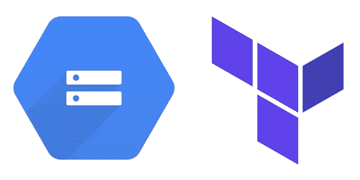

# 通过 Terraform 将一个静态 HTML 网站部署到 Google 云存储中

> 原文：<https://medium.com/google-cloud/deploy-a-static-html-website-to-google-cloud-storage-via-terraform-b26ce2fc582a?source=collection_archive---------0----------------------->

如何在 Google 云平台中创建一个 GCS bucket 并向其部署一个静态 HTML 文件，只需要使用 Terraform。

谷歌云存储+ Terraform 徽标

在开始之前，请注意，需要在 GCP 设置 [Terraform creds 才能执行任何基础设施操作。](/google-cloud/terraform-credentials-setup-in-gcp-c81c8ebaff5d)

我们的目标可以分为 3 步:

1.  确定最低…