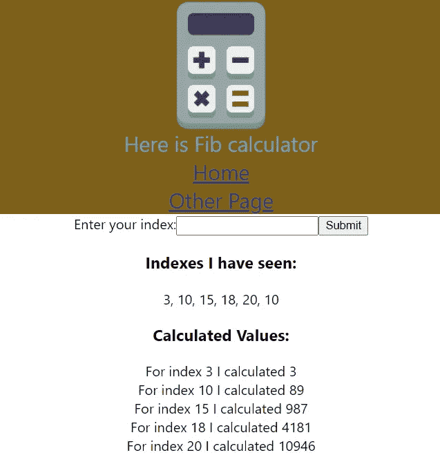

# 在 GCP 上使用 Terraform 部署一个带有 Let's Encrypt 和 Kubernetes 的 Web 应用程序(第 2 部分)

> 原文：<https://medium.com/google-cloud/deploy-a-web-application-with-lets-encrypt-and-kubernetes-using-terraform-on-gcp-part-2-5dcc3d1d36ac?source=collection_archive---------1----------------------->

# 介绍

在[上一篇文章](/google-cloud/deploy-a-web-application-with-lets-encrypt-and-kubernetes-using-terraform-on-gcp-part-1-a491bd3eae24?sk=7fba62c7722c0fdf39dbc1ae0d715f25)中，我们学习了如何部署一个我们自己制作的真正的应用程序。假设我们已经构建了我们的应用程序，下一个问题是我们如何维护我们的代码。在这一部分，我们将讨论如何维护我们的代码和更新我们的应用程序。

