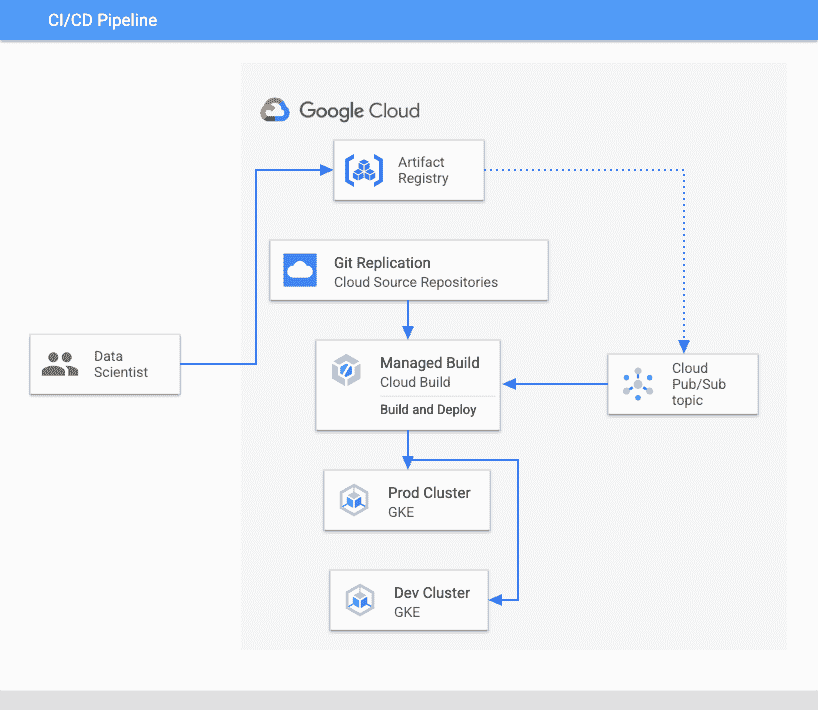
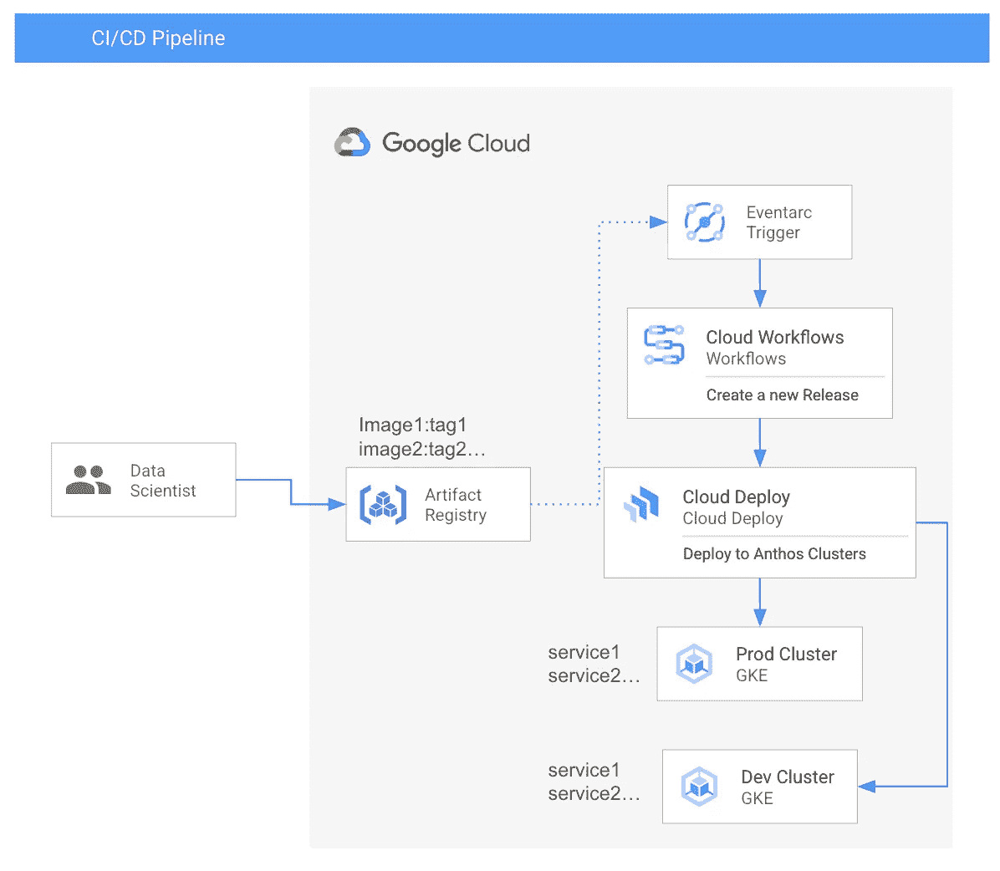
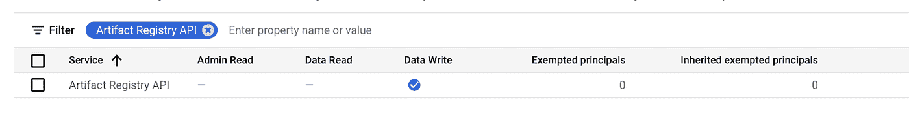

# 通过云部署和云工作流将机器学习模型部署到边缘服务器

> 原文：<https://medium.com/google-cloud/deploy-machine-learning-models-to-the-edge-server-with-cloud-deploy-and-cloud-workflows-cfc1540ef6fc?source=collection_archive---------3----------------------->

# 背景

我正在测试我的机器学习模型，这些模型由外部系统导出为容器图像。一旦完成模型训练，它将创建一个配置了服务框架的容器映像，并将映像推送到 Google Cloud Artifact Registry。

为了测试模型，我需要:

1.  用最新的图像标记更新我的 Kubernetes 部署 yaml 文件。
2.  连接到我的 Kubernetes 集群。
3.  kubectl 应用 yaml 文件。

这是一个创建工作流来自动运行它的完美用例。

# 要求

*   当一个新的容器映像被推送到 Artifact Registry 时，它会自动触发一个工作流来将容器部署到目标 Anthos 集群(测试和登台)。
*   该解决方案必须能够处理多个容器映像和服务映射。也就是说，如果我将 modelA 和 modelB 推送到注册表中，我希望它们作为 ServiceA 和 ServiceB 自动部署到 Anthos 集群中。
*   部署到下一个环境需要我的批准。

# 解决方案—云发布/订阅和云构建

当一个新的容器映像被推送到注册中心时，容器注册中心和工件注册中心都发送[通知](https://cloud.google.com/container-registry/docs/configuring-notifications)。下图说明了第一种解决方案架构。



*   当一个新的容器映像被推送到注册表时，它会触发一个通知事件。并且该事件被路由到云发布/订阅主题
*   由事件触发的云构建管道。它
*   从源代码库中提取 Kubernetes 清单模板文件。
*   更新模板文件。
*   部署到目标环境。

# 挑战

这种架构面临的主要挑战是

*   它不支持批准。因此，一旦工作流完成，每个版本都将被部署到目标环境中。
*   它需要云构建触发器，这就需要 Git 或云源代码库。在我的例子中，我不需要 Git 存储库。此外，如果我想遵守资源位置限制，云源存储库只提供一个预览“区域实例”。

# 解决方案—云部署和云工作流

第二种架构如下图所示。



在这个架构中。当一个新的容器映像被推送到注册表时，它

*   激发通知事件。Eventarc Trigger 接收事件并触发云工作流工作流。
*   该工作流调用 Cloud Deploy API 来启动 Skaffold 清单文件的交付管道
*   Cloud Deploy 交付管道呈现 Kubernets 清单文件，并创建一个发布。

为了让端到端的流工作，我

*   使用目标环境配置创建 Skaffold 配置
*   创建交付管道配置
*   将此模型容器的 Kubernets 清单模板文件上传到云存储桶
*   创建一个云工作流工作流，它调用云部署 API 来启动上面创建的交付管道。在 API 调用中，我配置了 skaffoldConfigUri 和 skaffoldConfigPath，以便交付管道知道将 Skaffold 配置拉到哪里。
*   创建一个 Eventarc 触发器，它监听特定的工件注册容器映像并触发上面创建的云工作流。

# 创建云部署交付渠道

*   **创建一个 Skaffold yaml 文件**

Skaffold 用于呈现不同环境的清单，在我的例子中，我在每个环境中使用相同的模型，所以这个模型很简单。这是我的萨克福德。

*   **创建交货管道定义文件。**

这是您定义管道外观的地方。在我的例子中，我有两个环境，暂存和生产。两者都是 Anthos 连接的集群。

我还创建了一个服务帐户`deploy-service@${GOOGLE_CLOUD_PROJECT}.iam.gserviceaccount.com`，并授予它所需的角色。哪些是

*   **roles/event arc . event receiver**
*   **角色/工作流.调用者**
*   **角色/事件 arc.serviceAgent**

下面是交付管道的定义。

*   **创建一个 Kubernetes 清单文件**

这些是 kubernetes yaml 文件，将由 Skaffold 呈现，并最终应用于目标集群。

*   **更新模板文件**

每个交付管道都绑定到特定的环境配置。所以我写了一个简单的脚本，当我有一个新版本时更新环境变量。

*   **创建输送管道**

```
gcloud deploy apply --file pipeline.yaml --region="${GOOGLE_CLOUD_DEFAULT_REGION}" --project="${GOOGLE_CLOUD_PROJECT}"
```

# 创建云工作流

云工作流是一个 HTTP API orchestractor，它还提供了一个 HTTP API 接口，以便客户端应用程序通过 API 调用启动工作流。

在我的例子中，Cloud Workflows 工作流除了调用 Cloud Deploy API 之外什么也不做。我需要这个，因为 Cloud Deploy 本身通过 [API 调用](https://cloud.google.com/deploy/docs/architecture)与外部应用程序或 CI 解决方案集成。

注意，这里我们配置了`buildArtifacts`来告诉 ska ffold`inference-model`需要用值`${image_location}`来渲染，这是我们在工作流的`decode_message`步骤中创建并计算的变量。

最后部署工作流。

部署云工作流工作流

# 上传 Skaffold 配置文件

为了让 Cloud deploy 能够呈现结果，我们需要告诉它我们的资产在哪里，在我们的工作流中，我们已经配置了`skaffoldConfigUri`和`skaffoldConfigPath` 。因此，这里我们将资产上传到预先创建的云存储空间。

```
tar -czvf skaffold.tar.gz skaffold.yaml viai-model*gsutil cp /skaffold.tar.gz gs://${GOOGLE_CLOUD_PROJECT}_cloudbuild/${PROD_CLUSTER}/”
```

# 启用审计日志

为了让 Eventarc 触发工件注册工作，我们需要启用审计日志。



# 创建 Eventarc 触发器

当新的容器图像被推送到工件注册表时，Eventarc 接收该事件并触发事件目标工作流。如果我们有多个容器图像，我们需要一个过滤器来指定哪个容器图像是感兴趣的图像。并且只在到达工件注册处时触发下游工作流。

Eventarc 有一个“[路径模式](https://cloud.google.com/eventarc/docs/path-patterns)，允许您在 Eventarc 触发器上设置资源过滤器。在我的例子中，我想要监听推到工件注册中心的特定容器图像。假设图像 URL 是`https://us-east1/my-project/my-repository/my-image:tag`，路径模式是`resourceName=/projects/my-preoject/locations/east-us1/repositories/my-registry/dockerImages/my-Image*`

创建一个 Eventarc 触发器，在推送容器映像时触发云工作流。

# 测试工作流程

现在我们有了 Evnetarc 触发器，它只在所需的容器映像被推送到集群时触发。我有一个触发云部署交付渠道的工作流。

要测试端到端的场景，只需将新的映像推送到工件注册中心。请注意，必须推送图像以精确匹配您在 Eventarc 触发路径模式过滤器中指定的 URL。