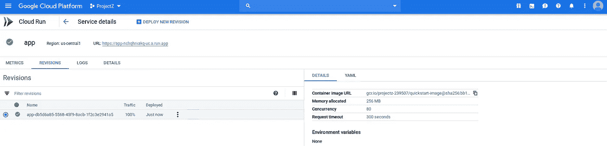

# Google cloud run——将容器化应用部署到⚡的无服务器环境中

> 原文：<https://medium.com/google-cloud/deploy-serverless-container-google-cloud-run-68d716af7716?source=collection_archive---------0----------------------->


云运行

[Cloud Run](https://cloud.google.com/run) 是一个托管计算平台，使您能够运行无状态容器。

云运行是无服务器的:它将所有基础设施管理抽象化，因此您可以专注于最重要的事情—构建优秀的应用程序。


它是从 [Knative](https://cloud.google.com/knative/) 构建的，让你选择运行完全由云运行管理的容器，或者在你的 [Google Kubernetes Engine](https://cloud.google.com/kubernetes) 集群中运行 GKE 上的云运行。

在本文中，我们将:

1.  设置云外壳
2.  演示项目文件和 Dockerfile 文件
3.  使用云构建构建我们的 Docker 映像，并将其推送到 Google 容器注册表
4.  使用 Google Cloud Shell 和 Container Registry 接口从 Google Container Registry 部署到云运行

# 设置云外壳

我将使用 [Google Cloud Shell](https://cloud.google.com/shell/) 来管理 Google Cloud Platform 上的资源，假设您已经在 PC 上安装了它。

```
gcloud auth login
gcloud config set project <PROJECT_ID>
gcloud config set compute/zone us-central1-f
gcloud services enable run.googleapis.com
gcloud components install beta
```

其中<project_id>是您的 GCP 项目 ID。</project_id>

# 演示项目文件和 Dockerfile 文件

本文的演示项目文件将只是`index.js`和`package.json`。我们还会有一个`Dockerfile`来树立我们的形象。

GitHub 上的演示项目文件

请随意使用您自己的项目文件。

*我们不会在 PC 上构建 Docker 映像，Google Cloud Build 允许我们使用 Docker 文件构建 Docker 映像，我们已经有了 Docker 文件，然后*将映像推送到容器注册表😊

# 使用云构建构建 Docker 映像，并将其推送到 Google 容器注册表

让我们使用 [Google Cloud Build](https://cloud.google.com/cloud-build) 来构建我们的 Docker 映像，并将该映像推送到容器注册中心。两者都可以通过简单地运行以下命令来完成:

```
gcloud builds submit --tag gcr.io/[PROJECT_ID]/quickstart-image .
```

就是这样！我们已经建立了我们的码头形象，现在在集装箱注册。


集装箱登记上的码头图像

*注意，如果您正在构建更大的图像，您可以传递一个超时参数，例如:* `*--timeout=600s*`

# 部署到从 Google 容器注册表运行的云

我们既可以从云外壳部署，也可以直接从容器注册界面部署。

# 从云外壳部署

```
gcloud beta run deploy --image gcr.io/<PROJECT-ID>/quickstart-image
```

我们将被要求输入*服务名*和其他一些选项。如果成功，您将获得服务 URL😀

# 从容器注册界面部署

点击图像名称，通过选择选项列表中的`Deploy to Cloud Run`部署*最新的*。


部署到云运行

我们还需要定义*服务名*和认证选项。


创建服务

云运行还允许我们为部署定义额外的选项，如*环境变量*、*内存分配。*


云运行的附加选项

点击`Create`，喝一口果汁。瞧啊。
我们的容器化应用运行在云上，无需服务器😀



[https://app-nchqhrxakq-UC . a . run . app](https://app-nchqhrxakq-uc.a.run.app/)


[https://app-nchqhrxakq-UC . a . run . app](https://app-nchqhrxakq-uc.a.run.app/)

不使用服务时，云运行不收费。
您可以使用自定义域，而不是 Cloud Run 为部署的服务提供的默认地址。

Cloud Run 也运行在 Google Kubernetes 引擎上，这为您管理基础设施提供了更大的灵活性。下面的推文对此给出了更多的见解。

关于云运行的其他资源::
📚[云运行产品概述](https://cloud.google.com/run/)
📯[云润发布博文](https://cloud.google.com/blog/products/serverless/announcing-cloud-run-the-newest-member-of-our-serverless-compute-stack)
📹[云润发射下一个 19](https://youtu.be/xVuuvZkYiNM)💻[牛逼云跑](https://github.com/steren/awesome-cloudrun)t28】⚡[云事件](https://cloudevents.io/)t31】☁️[牛逼](https://knative.dev/)

> *感谢通读！如果我错过了任何步骤，如果有些事情不太适合你，或者如果这个指南有帮助，请告诉我。*

[最初发布于 Mercurie 博客](https://blog.mercurie.ng/google-cloud-run-deploying-containerized-application-to-serverless-enviroment/)