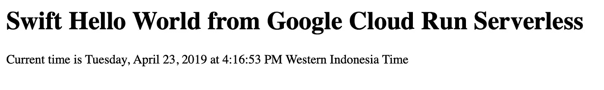
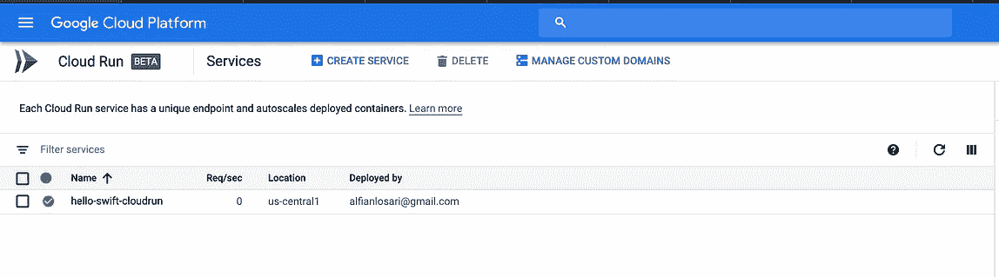
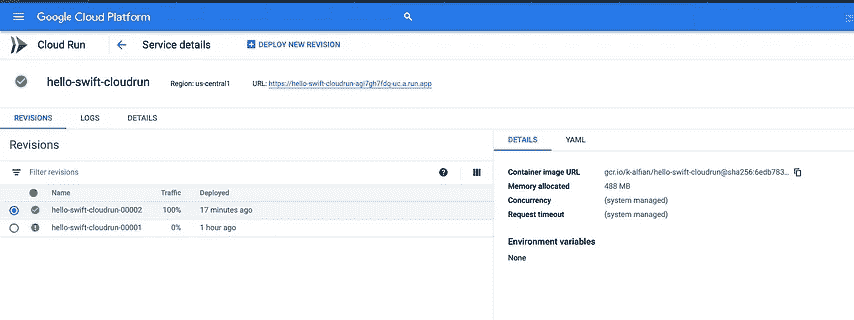

# 5 分钟内将 Swift HTTP 无服务器容器部署到 Google Cloud Run

> 原文：<https://medium.com/google-cloud/deploy-swift-http-serverless-container-to-google-cloud-run-in-5-minutes-alfian-losari-98389d34d4b8?source=collection_archive---------1----------------------->


你也可以使用下面的链接在我的 Xcoding With Alfian 博客网站上阅读这篇文章。

[](https://www.alfianlosari.com/posts/deploy-swift-http-containt-to-google-cloud-run-in-5minutes) [## 将 Swift HTTP 无服务器容器部署到 Google Cloud 在 5 分钟内运行| Xcoding with Alfian |…

### 在 Google Cloud Next 2019 上，谷歌刚刚推出了 Google Cloud Run。这是一种无服务器计算服务，它…

www.alfianlosari.com](https://www.alfianlosari.com/posts/deploy-swift-http-containt-to-google-cloud-run-in-5minutes) 

在 Google Cloud Next 2019 上，谷歌刚刚推出了 Google Cloud Run。这是一种无服务器计算服务，这意味着我们不必自己管理基础设施。它基于容器，所以我们只需要提供包含我们的 HTTP 服务器应用程序和部署的 Dockerfile。该服务将通过来自客户端的 HTTP 请求进行调用，付款将使用按使用付费模式。

Google Cloud 为云运行提供了许多功能，例如:

1.  快速自动缩放，根据流量自动缩放我们的应用程序。
2.  基于容器，使用 Docker 容器来构建和部署我们的服务。
3.  没有 DevOps。我们所需要做的就是部署我们的容器，谷歌云将为我们管理所有其余的事情。
4.  基于 Knative，可移植性意味着我们也可以跨平台部署到 Google Kubernetes 引擎(GKE 集群)。
5.  用 StackDriver 集成日志和监控。
6.  能够使用我们自己的自定义域。

你可以通过下面的官方链接直接从谷歌了解更多关于 Cloud Run 的信息。

[](https://cloud.google.com/run/) [## 云运行|谷歌云

### 在完全托管的环境中或在您自己的 GKE 集群中运行无状态 HTTP 容器。

cloud.google.com](https://cloud.google.com/run/) 

# 我们将建造什么

在本文中，我们将使用 Dockerfile 将一个简单的 Swift HTTP Server 应用程序部署到 Google Cloud Run。为此，我们将使用带有命令行的 Google Cloud SDK。我们只需要执行 4 项主要任务:

1.  准备我们的 HTTP Swift 应用程序。
2.  构建 Dockerfile 文件。
3.  上传到容器注册表。
4.  将容器部署到 Google Cloud Run。

# 设置 Google 云

在你开始之前，这里有一些你需要的东西:

1.  注册并登录谷歌云平台。([https://console.cloud.google.com/](https://console.cloud.google.com/))。
2.  下载 Google Cloud SDK 并安装到您的机器上。([https://cloud.google.com/sdk/install](https://cloud.google.com/sdk/install))。
3.  从 Google Cloud 控制台创建一个新项目。
4.  确保按照这里的所有步骤为您的项目激活 Google Cloud Run API。([https://cloud.google.com/run/docs/setup](https://cloud.google.com/run/docs/setup))。

# 准备我们的 HTTP Swift 申请

打开您的终端/shell，创建一个名为`hello-swift-cloudrun`的新目录，并导航到该目录。

```
mkdir hello-swift-cloudrun
cd hello-swift-cloudrun
```

在目录中，创建一个新的 swift 包。

```
swift package init --type executable
```

接下来，打开`Package.swift`，将下面的代码复制到文件中。我们将添加`Swifter` tiny HTTP 服务器库作为在 Swift 中运行我们的 HTTP 服务器的依赖项。

```
/ swift-tools-version:5.0
// The swift-tools-version declares the minimum version of Swift required to build this package.import PackageDescriptionlet package = Package(
    name: "hello-swift-cloudrun",
    dependencies: [
        .package(url: "[https://github.com/httpswift/swifter.git](https://github.com/httpswift/swifter.git)", .upToNextMajor(from: "1.4.6"))
    ],
    targets: [
        .target(
            name: "hello-swift-cloudrun",
            dependencies: ["Swifter"]),
        .testTarget(
            name: "hello-swift-cloudrunTests",
            dependencies: ["hello-swift-cloudrun"]),
    .]
)
```

接下来，从`Sources`目录中打开`main.swift`文件。复制下面的代码。

以下是它执行的操作:

1.  注册 2 条路线`/html`和`/api`。这些路由将返回包含使用`DateFormatter`格式化的当前日期的响应。`html`路径将以`HTML`格式返回文本，而`api`路径将以`JSON`格式返回响应。
2.  从环境变量中检索`PORT`。
3.  启动`HTTPServer`通过`PORT`监听端口中的请求。

在终端上键入以下命令，尝试构建并运行服务器。

```
swift build
swift run
```

要进行测试，请打开浏览器并导航至地址`[http://localhost:8080/html](http://localhost:8080/html`)`。您应该会在浏览器中看到显示当前时间的文本。



Swift HTTP 服务器

# 构建 Dockerfile 文件

接下来，我们将通过创建`Dockerfile`来容器化我们的应用程序。创建文件并复制下面的代码。

```
FROM ibmcom/swift-ubuntu:latestWORKDIR /usr/src/appCOPY . .RUN swift build --configuration releaseCMD [ "swift", "run", "--configuration", "release"  ]
```

这将把所有文件复制到容器映像，然后使用发布配置运行`swift build`。它还将在构建完成后运行服务器。

# 上传到容器注册表

接下来，我们需要将我们的容器上传到`Cloud Registry`。确保为您的项目检索您的`project id`。运行下面的命令。

```
gcloud builds submit --tag gcr.io/[PROJECT-ID]/hello-swift-cloudrun
```

等待容器构建过程完成，然后上传到容器注册表。它会将`success`消息打印到终端。

您可以使用此命令检查成功上传的容器列表。

```
gcloud container images list
```

# 部署容器到 Google Cloud Run

最后，我们需要将图像部署到 Google Cloud Run。键入以下命令。

```
gcloud config set run/region us-central1
gcloud beta run deploy --image gcr.io/[PROJECT-ID]/hello-swift-cloudrun --memory 512M --allow-unauthenticated
```

以下是它执行的几项操作:

1.  将部署区域设置为`us-central1`。
2.  在本例中，从容器注册表路径部署映像`hello-swift-cloudrun`。
3.  配置使用 512M 内存使用。
4.  允许未经身份验证的请求调用 HTTP。

您可以从内存、并发性和请求超时等方面配置其他内容。查看下面的链接

[](https://cloud.google.com/run/docs/configuring/memory-limits) [## 配置内存限制|云运行| Google 云

### 无论您的企业是刚刚踏上数字化转型之旅，还是已经走上数字化转型之路，谷歌云的解决方案…

cloud.google.com](https://cloud.google.com/run/docs/configuring/memory-limits) 

部署成功完成后，终端会打印出我们可以使用的已部署服务的`URL endpoint`。打开浏览器并导航至:

1.  [https://$URL/html](/$URL/html)
2.  [https://$URL/](/$URL/api) api

# 通过仪表板监控

您可以从控制台仪表板查看所有部署到云运行的服务。

[https://console.cloud.google.com/run](https://console.cloud.google.com/run?project=k-alfian)



云运行仪表板

在这里，您还可以管理自定义域、删除和创建服务，以及查看您部署的服务的日志。

**！！！确保在你完成这篇文章后删除所有你创建的资源，以避免账单！！！**

# 结论

您可以在下面的存储库中克隆完成的项目。

[](https://github.com/alfianlosari/SwiftCloudRun) [## alfianlosari/SwiftCloudRun

### 使用 Google Cloud Run 的 Swift HTTP 无服务器 Docker 部署示例- alfianlosari/SwiftCloudRun

github.com](https://github.com/alfianlosari/SwiftCloudRun) 

就这样，通过简单的步骤，我们已经使用 Docker 将我们的无服务器后端部署到 Google Cloud Run managed auto scaling 服务。无服务器范例为我们提供了快速执行的速度和可靠性，因为我们的应用程序的规模会随着时间的推移而增长⚡️⚡️⚡️.