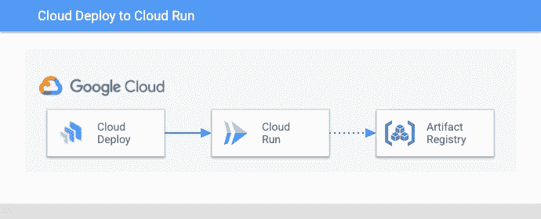
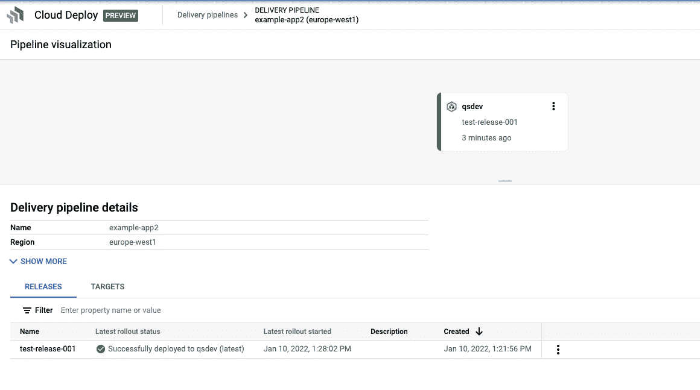
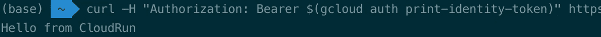

# 部署到云从云部署运行

> 原文：<https://medium.com/google-cloud/deploy-to-cloud-run-from-cloud-deploy-4f83628cf045?source=collection_archive---------0----------------------->

**2022–09–15 更新:** Cloud Deploy 现在支持原生云运行([链接](https://cloud.google.com/deploy/docs/deploy-app-run))。我改编了这篇博文来反映这一点。



[Google Cloud Deploy](https://cloud.google.com/deploy) ，是谷歌全新的全托管连续交付服务，便于扩展。它允许您在 YAML 定义您的连续交付管道，并在 GCP 运行它们。对于这篇博文，如果你对 Skaffold、Cloud Run 和 Helm 有一些基本的了解，可能会有所帮助。你可以在我的例子[回购](https://github.com/cgrotz/blog-examples/tree/main/cloud-delpoy-to-cloud-run)中找到片段。

Cloud Deploy 允许您创建和操作部署管道，而无需托管基础架构并将应用程序版本部署到 Google Kubernetes Engine (GKE)和 Cloud Run。Cloud Deploy 在幕后使用 [Skaffold](https://skaffold.dev/) 来管理部署。Skaffold 是一个很棒的工具，它允许你明确地声明你的持续开发周期，专注于开发而不是把事情粘在一起。

## 设置

你需要在你运行的机器上安装 Skaffold，Helm 和 Docker。你还需要一个 Docker 注册表，我推荐[工件注册表](https://cloud.google.com/artifact-registry)。

建议不要使用默认的计算服务帐户运行您的应用程序，因此让我们为云运行服务创建一个服务帐户，它不需要任何额外的权限。

```
gcloud iam service-accounts create runner --project $GOOGLE_CLOUD_PROJECT
```

接下来，我们创建一个服务帐户来运行 Cloud Deploy，并赋予它适当的权限。

```
gcloud iam service-accounts create deployer --project $GOOGLE_CLOUD_PROJECT# Allow the deployer SA to run Cloud Deploy jobs
gcloud projects add-iam-policy-binding $GOOGLE_CLOUD_PROJECT \
    --member=serviceAccount:deployer@$GOOGLE_CLOUD_PROJECT.iam.gserviceaccount.com \
    --role="roles/clouddeploy.jobRunner"# Allow the deployer SA to create Cloud Run services
gcloud projects add-iam-policy-binding $GOOGLE_CLOUD_PROJECT \
    --member=serviceAccount:deployer@$GOOGLE_CLOUD_PROJECT.iam.gserviceaccount.com \
    --role="roles/run.developer"# Allow the deployer service account to impersonate the Runner SA
gcloud iam service-accounts add-iam-policy-binding runner@$GOOGLE_CLOUD_PROJECT.iam.gserviceaccount.com \
--role roles/iam.serviceAccountUser \
--member "serviceAccount:deployer@$GOOGLE_CLOUD_PROJECT.iam.gserviceaccount.com" \
--project $GOOGLE_CLOUD_PROJECT
```

现在我们已经准备好设置部署管道了。我在我的示例回购中准备了一切，供您检查:

[](https://github.com/cgrotz/blog-examples/tree/main/cloud-deploy-to-cloud-run) [## blog-examples/cloud-deploy-to-cloud-run at main cgrotz/blog-examples

### 我的博客中提到的小例子。通过在…上创建帐户，为 cgrotz/blog-examples 开发做出贡献

github.com](https://github.com/cgrotz/blog-examples/tree/main/cloud-deploy-to-cloud-run) 

我想在守则中指出几件事。首先你应该检查一下`clouddeploy.yaml`中的变量，并为`PROJECT_ID`、`REGION`和`DEPLOYER_SA_EMAIL`设置正确的值。在`run-dev.yaml`中，将`service_account`替换为我们为运行云运行服务而创建的服务帐户的名称。

## 让我们进行云部署

为了构建示例应用程序，只需调用 Skaffold build。它将构建 Docker 映像并将其推送到远程存储库。您需要捕获图像的标签，我们将在下一步中需要它。

```
skaffold build --default-repo <your repo base path>
```

让我们应用管道，这将在 Cloud Deploy 中配置管道，之后您将能够在 web ui 中看到它。

```
gcloud beta deploy apply --file=clouddeploy.yaml \
                         --region=$REGION \
                         --project=$GOOGLE_CLOUD_PROJECT
```

为了创建一个版本，您将需要来自前面构建步骤的 Docker 映像信息。创建发行版只需要这个简单的命令:

```
gcloud beta deploy releases create test-release-001 \
  --project=$GOOGLE_CLOUD_PROJECT \
  --region=$REGION \
  --delivery-pipeline=example-app \
  --images=app=<repo>:<tag_to_deploy>
```

接下来你需要推广这个版本，你也可以通过 [web ui](https://console.cloud.google.com/deploy/delivery-pipelines?_ga=2.222358235.1547780063.1641801270-1776040249.1639939346) 来做，但是你可以通过命令行来做:

```
gcloud beta deploy releases promote --release=test-release-001 \
  --to-target=qsdev \
  --delivery-pipeline=example-app \
  --project=$GOOGLE_CLOUD_PROJECT \
  --region=$REGION
```

这将触发部署，一段时间后，您的应用程序应该部署到云运行。



现在我们可以用`gcloud run services list`检索已部署服务的列表。复制正确服务的 URL。你应该可以用

```
curl -H "Authorization: Bearer $(gcloud auth print-identity-token)" SERVICE_URL
```

输出应该如下所示:



就是这样！我们现在有一个部署到云运行的工作云部署管道。