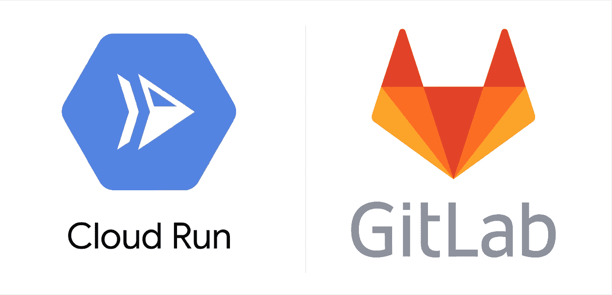
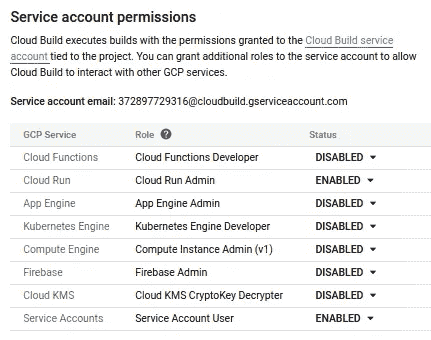
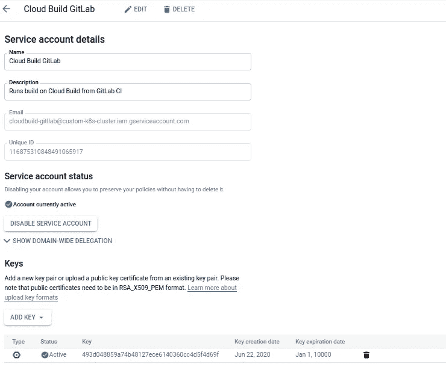
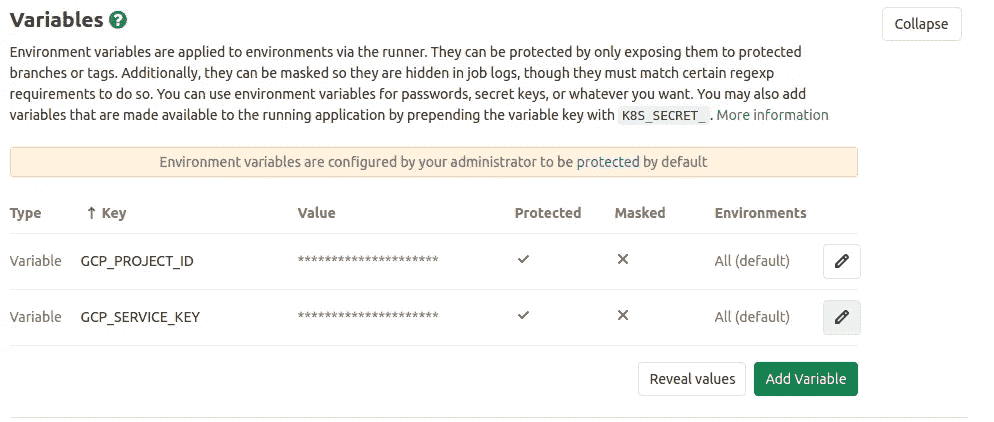

# 使用 GitLab CI 部署到云运行

> 原文：<https://medium.com/google-cloud/deploy-to-cloud-run-using-gitlab-ci-e056685b8eeb?source=collection_archive---------0----------------------->

云运行| GitLab

> 在本文中，我将使用 [GitLab CI](https://docs.gitlab.com/ee/ci/) 和[云构建](https://cloud.google.com/cloud-build)，指导部署无服务器容器化应用到[云运行](https://cloud.google.com/run)。

> *Cloud Run 是一个托管计算平台，支持您运行可自动扩展的无状态无服务器容器。*
> 
> Cloud Build 是一项在 Google 云平台基础设施上执行构建的服务。
> 
> GitLab CI 服务是 GitLab 的一部分，每当开发人员将代码推送到应用程序报告时，它就构建和测试软件。

# 先决条件

*   创建一个[谷歌云平台(GCP)项目](https://console.cloud.google.com/project)，或者使用一个现有的项目。
*   创建一个 [GitLab Repo](https://gitlab.com/projects/new) 。
*   启用[云运行 API](https://console.developers.google.com/apis/api/run.googleapis.com/overview) 。
*   启用[云构建 API](https://console.cloud.google.com/cloud-build/builds) 。
*   克隆 [*样本*代码](https://gitlab.com/Timtech4u/vue-cloudrun)或者用 *Dockerfile* 设置你自己的代码。

# 为 Google Cloud Build 创建服务帐户

*   在 Google Cloud 上，浏览**云构建>设置。**
*   在**服务账户权限下，**确保**云运行&服务账户**被**启用**，这允许你部署到云运行。

*   因为我已经给了云构建足够的权限，所以我可以在 **IAM & Admin >服务帐户上创建云构建服务帐户。** 我将创建一个服务帐户(名为[@](http://twitter.com/custom)PROJECT.iam.gserviceaccount.com)并给它一个*云构建服务代理。* 在已创建服务账户页面，点击**添加密钥> JSON** 。

创建密钥后的服务帐户页面

# 配置 GitLab CI 以使用服务帐户

在 GitLab repo 上，浏览**设置> CI/CD >变量。**

**GitLab 回购设定> CI/CD >变量**

如上所示，我为***GCP _ 项目 _ID*** 创建了一个变量，其值为谷歌云项目 ID，为***GCP _ 服务 _ 密钥*** 创建了一个变量，其值为之前创建的 JSON 服务帐户的内容。

# 持续部署到云运行

只剩下几个步骤，我的应用程序将直接从我们的 GitLab repo 持续部署到 Cloud Run。

我的[应用](https://gitlab.com/Timtech4u/vue-cloudrun)也有一个 Dockerfile，它被配置为在端口 8080(云运行的默认端口)上运行。

最后，我创建了一个***Cloud Build . YAML***文件，其中包含了构建& deploy by Cloud Build 和**的命令。gitlab-ci.yml** 文件，在推送代码时触发部署过程。

下面是我的云构建配置项文件的预览:

云构建配置项文件

以下是我的 GitLab CI 文件的预览:

GitLab CI 文件

**关于云构建的其他资源**

*   [云构建文档](https://cloud.google.com/cloud-build/docs/)
*   [云运行文档](https://cloud.google.com/run/docs)
*   [GitLab CI 文档](https://docs.gitlab.com/ee/ci/)