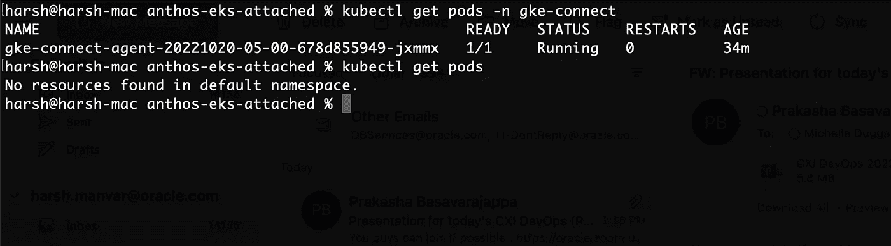

# 从 GCP·安索斯部署到 EKS

> 原文：<https://medium.com/google-cloud/deploy-to-eks-from-gcp-anthos-61b1dea304bb?source=collection_archive---------3----------------------->

每个企业都需要一个云计算解决方案来推动他们的数字化转型

 [## GCP·安索斯管理的 EKS 集群

### 跨您的环境进行现代化管理，以实现云优势

medium.com](/@harsh.manvar111/eks-cluster-managed-by-gcp-anthos-69cba0cb0bd0) 

如果你还没有读过之前的故事，请读一读，因为这个故事是那个故事的延续。跟随上面的媒体链接

和上一个故事一样，我们来看看如何将 EKS 星团与 GCP·安托什联系起来。

## 概观

在本文中，我们将尝试将 K8s 工作负载从 GCP anthos 控制台部署到 AWS EKS 集群。

## 先决条件

*   AWS 帐户
*   GCP 账户
*   连接到 Anthos 的 EKS 集群

如果您的群集尚未连接，请单击上面的链接进行连接。这将允许您从 GCP 控制台控制您的 EKS 集群。

在这里，EKS 集群没有在默认命名空间中运行任何 POD

让我们深入了解一下，一旦您的 EKS 成功连接到 Anthos 控制台

选择您计划部署工作负载的 EKS 集群，并确保它通过 Anthos 连接。

点击**部署**按钮

添加你的 docker 镜像路径，这里我们将使用 **nginx:latest**

您可以根据需要选择配置和环境变量。

最后选择通过 anthos 连接的 EKS 集群。

只要您单击“部署”,新容器就会从 GCP 的 EKS 集群中分离出来。

您可以通过运行命令来验证:kubectl get pods -n<namespace></namespace>

将能够列出部署及其所有必需的信息。您可以通过 GCP 控制台创建/编辑几乎所有与部署、服务、监控和日志记录相关的操作。

概述了如何在任何 EKS 上使用 GCP Anthos 服务部署和管理工作负载。要管理跨内部、各种云提供商和无服务器部署的大量 K8s 集群，您可以使用 Anthos。