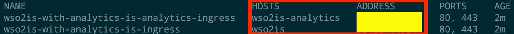

# 从头开始使用 Helm 在 GCE Kubernetes 集群中部署带有分析功能的 WSO2 Identity server

> 原文：<https://medium.com/google-cloud/deploy-wso2-identity-server-with-analytics-in-a-gce-kubernetes-cluster-using-helm-from-scratch-4ade7b6a510b?source=collection_archive---------0----------------------->


在本教程中，我将解释如何在 Google Kubernetes 集群中部署具有分析功能的 [WSO2 身份服务器](https://wso2.com/identity-and-access-management)。教程分为两部分，

*   配置基础设施
*   使用 Helm 部署 Kubernetes 工件

让我们从配置基础设施开始，

1.  如果您还没有 GCP 帐户，让我们创建一个 [GCP 免费轮胎](https://cloud.google.com/free/)。
2.  转到 Google 云平台仪表板，创建一个名为`helm-wso2`的新项目。
3.  通过从菜单中选择 Kubernetes 计算引擎并点击**启用计费**，为项目启用 Kubernetes 计算引擎。你可以从[这里](https://cloud.google.com/kubernetes-engine/docs/quickstart)找到更多细节。
4.  现在安装 [Gcloud](https://cloud.google.com/sdk/gcloud/) 一个用于管理谷歌云平台的命令行工具。你可以在这里找到如何为每个操作系统[安装它。](https://cloud.google.com/sdk/docs/quickstarts)

*   让我们通过在终端中执行以下命令来初始化 gcloud 命令行工具，

```
**gcloud init**
```

*   接受使用您的 Google 用户帐户登录的选项:

```
To continue, you must log in. Would you like to log in (Y/n)? Y
```

登录您的帐户并授予权限。

*   接下来从列表中选择项目`helm-wso2` 。

```
Which compute zone would you like to use as project default?
 [1] [helm-wso2]

 Please enter your numeric choice:1
```

*   选择 **us-east1-b** 作为项目的默认地区，

```
Do you want to configure a default Compute Region and Zone? (Y/n)? Y
```

5.接下来安装用于管理 Kubernetes 集群的`kubectl`命令行工具

```
**gcloud components install kubectl**
```

现在您已经安装了必要的工具来部署一个 **Kubernetes 集群**。

6.通过执行以下命令创建一个 Kubernetes 集群，

```
**gcloud container clusters create helm-wso2-kubernetes --machine-type=n1-standard-2 --zone=us-east1-b**
```

7.执行以下命令，为 `**helm-wso2-kubernetes**` Kubernetes 集群配置 **kubectl**

```
**gcloud container clusters get-credentials helm-wso2-kubernetes**
```

8.为群集启用基于角色的访问控制

```
**kubectl create clusterrolebinding cluster-admin-binding \
--clusterrole cluster-admin --user <EMAIL>**
```

在此用您的 Gmail 地址替换<email>。</email>

9.通过执行以下命令部署入口控制器，

```
**kubectl apply -f** [**https://raw.githubusercontent.com/kubernetes/ingress-nginx/master/deploy/mandatory.yaml**](https://raw.githubusercontent.com/kubernetes/ingress-nginx/master/deploy/mandatory.yaml) **--username admin --password $(gcloud container clusters describe helm-wso2-kubernetes | grep password | awk '{print $2}') && kubectl apply -f** [**https://raw.githubusercontent.com/kubernetes/ingress-nginx/master/deploy/provider/cloud-generic.yaml**](https://www.google.com/url?q=https://raw.githubusercontent.com/kubernetes/ingress-nginx/master/deploy/provider/cloud-generic.yaml&sa=D&source=hangouts&ust=1529915259231000&usg=AFQjCNHK_nbSy8rCjQ6QDcjbd_8_W2TySw)
```

10.现在您已经成功地部署了一个 Kubernetes 集群。您可以使用以下命令获取集群信息

```
**gcloud container clusters describe helm-wso2-kubernetes**
```

11.接下来，按照此处描述的[说明安装舵。暂时省略初始化。](https://docs.helm.sh/using_helm/#installing-helm)

12.安装完成后，让我们开始初始化头盔，

```
**kubectl create serviceaccount --namespace kube-system tiller && \****kubectl create clusterrolebinding tiller-cluster-rule --clusterrole=cluster-admin --serviceaccount=kube-system:tiller && \ helm init && \
kubectl patch deploy --namespace kube-system tiller-deploy -p '{"spec":{"template":{"spec":{"serviceAccount":"tiller"}}}}'**
```

**在接下来的几个步骤中，我们将创建一个网络文件系统，需要在生成的实例之间共享几个目录。**

13.转到下面列出的仪表板，在区域`us-east1-b`中创建一个名为`singlefs-1-helm-wso2`的单节点文件服务器，并使用默认设置。

```
[https://cloud.google.com/launcher/solution/click-to-deploy-images/singlefs](https://cloud.google.com/launcher/solution/click-to-deploy-images/singlefs)
```


**现在让我们登录到 NFS 实例来创建所需的目录。**

*   获取实例的密码

```
**gcloud compute instances \
describe singlefs-1-helm-wso2-vm \
--zone=us-east1-b \
--format='value(metadata.items[0].value)'**
```

*   SSH 到实例中，

```
**gcloud compute --project "helm-wso2" ssh --zone "us-east1-b" "singlefs-1-helm-wso2-vm"**
```

当系统询问时，输入上面获得的密码。

*   装入卷

```
**sudo mount -t nfs singlefs-1-helm-wso2-vm:/data /mnt**
```

*   创建以下目录

```
**mkdir -p /data/wso2is/deployment /data/wso2is/tenants /data/wso2is/analytics-data-1 /data/wso2is/analytics-data-2**
```

*   设置文件权限

```
**sudo useradd -u 802 wso2carbon && \
sudo groupadd -g 802 wso2 && \
sudo chown -R wso2carbon:wso2 /data/wso2is/**
```

就是这样！！！！！。您已经成功配置了环境。现在让我们进入下一部分。

在下面的步骤中，我们将使用 Helm 部署带有分析功能的 WSO2 Identity server。

1.  Git 克隆`wso2/kubernetes-is`库

```
git clone https://github.com/wso2/kubernetes-is.git
```

2.转到目录`kubernetes-is/helm/is-with-analytics`

```
cd kubernetes-is/helm/is-with-analytics
```

3. **is-with-analytics-conf** 目录包含配置。我们可以使用`is-with-analytics-conf**/**values.yaml`文件来输入配置值。

```
username: "<WSO2 subscription email>"
password:  "<WSO2 subscription password>"
email:  "<WSO2 subscription email>"namespace: "wso2"
svcaccount: "wso2svc-account"
serverIp: <NFS Server IP>
sharedDeploymentLocationPath: "/data/wso2is/deployment"
sharedTentsLocationPath: "/data/wso2is/tenants"
analytics1DataLocationPath: "/data/wso2is/analytics-data-1"
analytics2DataLocationPath: "/data/wso2is/analytics-data-2"
```

用您选择的编辑器打开此文件。

*   用您的 WSO2 订阅凭证替换`<WSO2 subscription email>` & `<WSO2 subscription password>`。如果您没有有效的 WSO2 订阅，请订阅 [**免费试用订阅**](https://wso2.com/subscription/free-trial) 。
*   替换`<NFS Server IP>`并添加 NFS 服务器的私有 IP 地址

您可以使用以下命令获取 NFS 服务器的私有 IP 地址，

```
**gcloud compute instances describe singlefs-1-helm-wso2-vm --zone=us-east1-b --format='value(networkInterfaces[0].networkIP)'**
```

4.让我们部署**带分析配置的**舵图

```
helm install --name is-with-analytics-conf is-with-analytics-conf
```

5.接下来部署 MySQL 数据库，

```
helm install --name wso2is-with-analytics-rdbms-service -f mysql/values.yaml stable/mysql --namespace wso2
```

通过执行以下命令验证 MySQL 服务器是否处于就绪状态，

```
kubectl get pods -n wso2 | grep 'wso2is-with-analytics-rdbms-service-mysql' | awk '{print $2}'
```

检查直到`0/1`变成`1/1`。

6.部署**is-with-analytics-deployment**掌舵图

```
helm install --name is-with-analytics-deployment  is-with-analytics-deployment/
```

检查部署是否启动并运行，

```
kubectl get pods -n wso2 | awk '{print $2}'
```

等待直到服务器的就绪状态从状态`0/1`变为`1/1`

7.为主机名添加`/etc/hosts`条目

*   获取主机名和 IP 地址

```
kubectl get ing -n wso2
```



*   将上述两个主机条目添加到`/etc/hosts`文件中

8.现在您可以在 [https://wso2is/carbon](https://wso2is/carbon) 中访问 WSO2 Identity server 管理控制台。