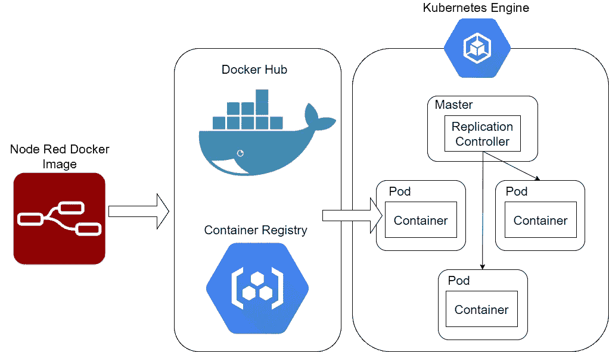
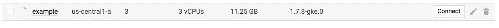

# 使用 Google 云平台将您的 Node Red 环境部署到 Kubernetes 集群上

> 原文：<https://medium.com/google-cloud/deploy-your-node-red-environment-onto-kubernetes-clusters-using-google-cloud-platform-2e4775c2e79f?source=collection_archive---------0----------------------->

Node Red 提供了快速编写代码和快速部署代码的能力。使用 Node Red 时出现主要问题是可伸缩性。在这个故事中，我将讲述如何在 Google 云平台上的 Kubernetes 集群上部署您的 Node Red 代码。



在本教程中，我们将创建一个节点红色 Docker 映像，然后将该映像上传到 Docker Hub 或 Google 云平台容器注册表。然后，我们将创建一个 Kubernetes 环境，提取我们构建的新图像，启动 Docker 容器，并创建多个 pod 来扩展我们的 Node Red 应用程序。

*   确保你已经安装了 Docker
*   设置您的 Google 云平台帐户
*   跟随谷歌云平台 Mac OS 快速入门:[https://cloud.google.com/sdk/docs/quickstart-mac-os-x](https://cloud.google.com/sdk/docs/quickstart-mac-os-x)
*   只需跟进 gcloud init

1.  运行命令

```
docker run -it -p 1880:1880 --name mynodered nodered/node-red-docker
```

关于该命令的更多信息，请访问 https://hub.docker.com/r/nodered/node-red-docker/

2.如果您打开 localhost :1880，您将处于节点红色控制台中。如果你想安装其他节点，你可以运行

```
docker exec -it mynodered /bin/bash
```

3.现在你在你的容器中运行命令行，你现在可以运行 npm 安装你想要运行的包。

```
npm install node-red-node-watson
```

然后，一旦你安装了所有你想使用的包，运行命令，这将重新启动容器

```
docker stop mynodered
docker start mynodered
```

4.一旦您建立了您的流，运行命令

```
//This command will create a new image from the container 
docker commit mynodered custom-image-name
```

5.您可以运行您的新映像，以确保通过命令对新映像进行了更改

```
docker run -d --restart=always -p 1880:1880 customer-image-name:version
```

6.一旦你对 docker 图像满意了，你就想把你的图像放入一个注册表，要么是 docker.hub，要么是 google 云平台注册表

```
//Google Container Registry Push Image 
[https://cloud.google.com/container-registry/docs/pushing-and-pulling](https://cloud.google.com/container-registry/docs/pushing-and-pulling)docker tag customer-image-name gcr.io/[project-id]/customer-image-namegcloud docker -- push gcr.io/[project-id]/customer-image-name//Docker Hub Push Image [https://docs.docker.com/datacenter/dtr/2.4/guides/user/manage-images/pull-and-push-images/](https://docs.docker.com/datacenter/dtr/2.4/guides/user/manage-images/pull-and-push-images/)docker tag [image id] your-hub-user-name/customer-image-name
docker push your-hub-user-name/customer-image-name
```

7.去你的谷歌云平台，选择一个项目。

8.接下来，转到 Kubernetes 引擎，单击“create cluster”并填写所需信息，即名称、描述、区域、大小，然后单击“create”。

9.创建集群后，单击文本下面的 Connect and copy:“通过运行以下命令配置 [kubectl](http://kubernetes.io/docs/user-guide/kubectl-overview/) 命令行访问”。接下来打开 Google Cloud Shell 并粘贴命令。



10.现在，您已连接到您的群集，现在我们希望提取我们的映像，并开始将我们的映像作为容器运行。

```
//Google Cloud Platform Pull Image from Registry 
kubectl run customName --replicas=4 --image=[gcr.io/](http://gcr.io/twiliochatbot-77dac/ai_now_chatbot)[project-id][/](http://gcr.io/twiliochatbot-77dac/ai_now_chatbot)custom-image-name --port=1880//Docker Hub Pull Image from Registry 
kubectl run customName --replicas=4 --image=your-hub-user-name/customer-image-name --port=1880--replicas 4
//this command will created the numbers of pods you want, in this case your are creating 4 pods --image=[gcr.io/](http://gcr.io/twiliochatbot-77dac/ai_now_chatbot)[project-id][/](http://gcr.io/twiliochatbot-77dac/ai_now_chatbot)custom-image-name 
//This command is referring to which image you want to pull --port=1880 
//This command refers to which port your want your docker container to run on, in this case port 1880
```

11.接下来，我们希望公开我们的应用程序，所以运行命令

```
kubectl expose deployment/projectName --type="LoadBalancer"
```

12.现在 docker 容器运行在集群上并对外公开。要查看正在运行的 IP 地址，请运行命令

```
kubectl get services
```

现在，您可以通过:EXTERNAL-IP:1880 登录到 Node-Red 实例。如果您想要更新 Node-Red，您需要更新您的映像，然后让您的集群指向新映像。