# 使用 Minikube 部署本地 Kubernetes 集群🚢 🚢

> 原文：<https://medium.com/google-cloud/deploying-a-local-kubernetes-cluster-using-minikube-abe94a2c7583?source=collection_archive---------1----------------------->

如何使用 Minikube 设置本地 Kubernetes 集群？？

## 介绍🚩🚩

各位读者好👋我认为，为了学习任何新技术或软件，用那种技术弄脏你的手是很重要的。只学习理论而不学习或很少学习经验对学习者没有任何用处。

***所以在本文中，我们将尝试了解*** :

*   什么是迷你库贝？？
*   在本地计算机上安装必备软件。(Docker & kubectl)
*   设置 Minikube 和使用 Minikube 部署三节点集群的步骤。

> 这将是一篇非常简短的文章。
> 所以，让我们毫不拖延地开始吧:)
> 
> *** *注意:我使用的操作系统是“Ubuntu 20 . 04 . 5”**

## 什么是迷你库贝？？🤔🤔

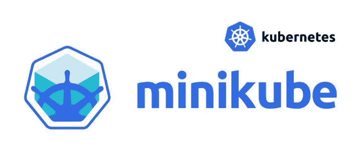

***Minikube 是一个轻量级的 Kubernetes 实现*** ，它在您的本地机器上创建一个虚拟机，并部署一个包含一个或多个节点的简单集群。
***Minikube 适用于 Linux、macOS 和 Windows 系统*** 。Minikube CLI 提供了使用群集的基本引导操作，包括启动、停止、状态和删除命令。

> **简单来说，Minikube 是一种软件，它帮助在您的本地机器上部署单个或多个节点的 Kubernetes 集群，无论是 windows、macOS 还是 Linux。**

## 设置先决条件[Docker & kubectl]😏 😏

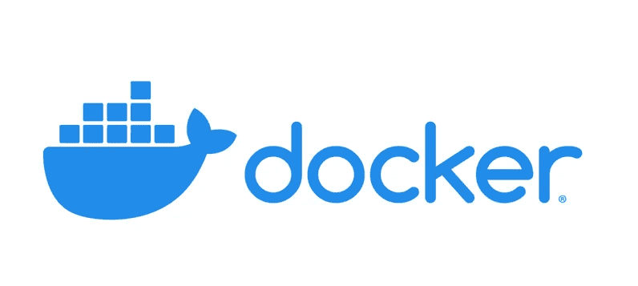

*   打开终端提示

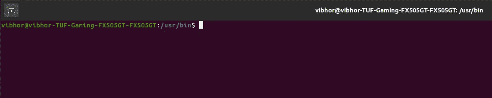

*   检查码头工人是否已经安装

```
docker --version
```

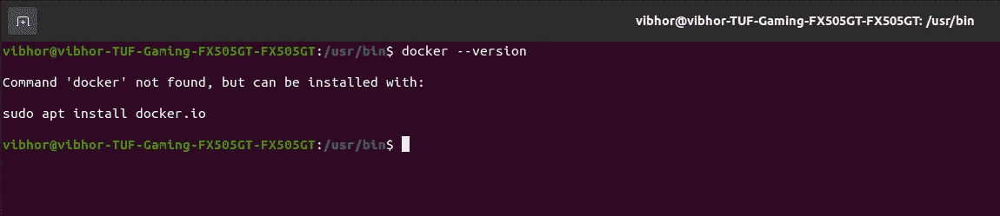

*   如果未安装 docker，请运行以下命令

```
sudo apt install docker.io
```

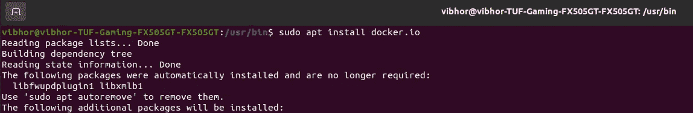

*   检查码头工人是否安装成功

```
docker --version
```

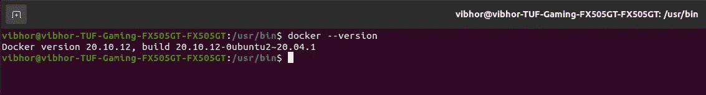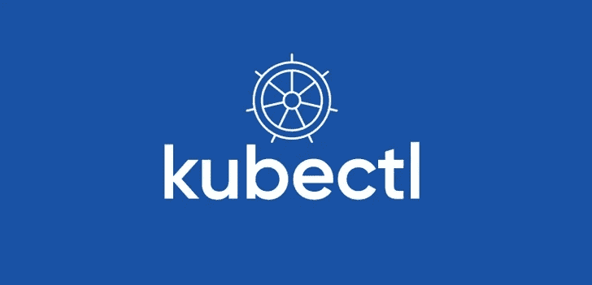

*   打开终端提示


*   检查是否已经安装了 kubectl

```
kubectl version
```

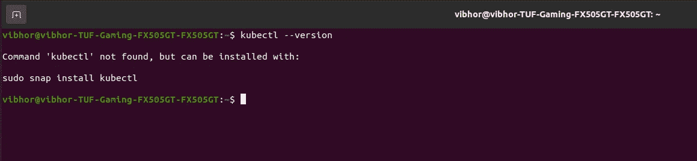

*   如果未安装 kubectl，请运行以下命令

```
sudo snap install kubectl --classic
```

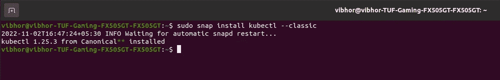

*   检查 kubectl 是否成功安装

```
kubectl
```

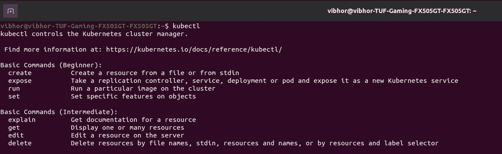

> 现在，我们已经成功安装了必备软件。让我们转到 Minikube 部分:)
> 
> *** *注意:以上演示&截图均在“Ubuntu 20 . 04 . 5”**上完成

## 设置 Minikube 和使用它部署三节点集群的步骤🤓 🤓


[艾丽莎·基比洛夫斯基](https://unsplash.com/@arkibbles?utm_source=medium&utm_medium=referral)在 [Unsplash](https://unsplash.com?utm_source=medium&utm_medium=referral) 上的照片

*   打开终端提示


*   检查 minikube 是否已经安装

```
minikube
```

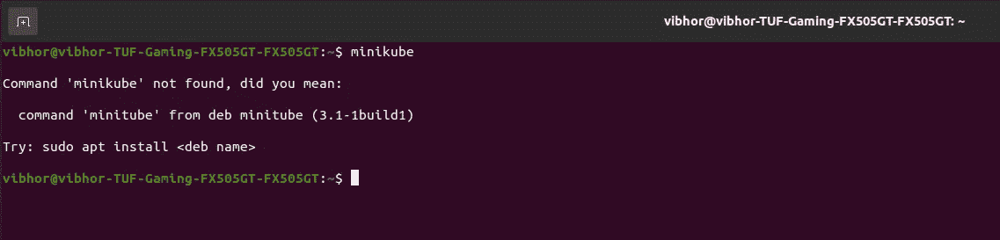

*   如果没有安装 minikube，则转到[官方页面](https://minikube.sigs.k8s.io/docs/start/#what-youll-need)

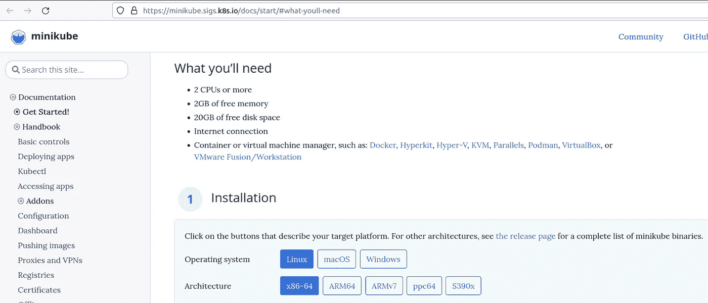

*   选择要安装 minikube 的机器类型。就像我在 Linux 上工作一样，所以我选择了下面显示的配置。**(确保这是正确的，因为取决于机器类型，它将产生安装 minikube 的链接)**

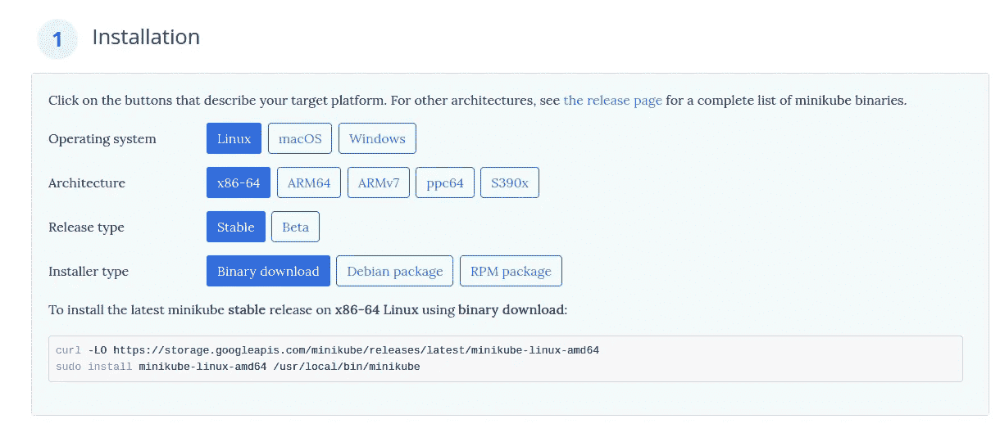

*   从[官方页面](https://minikube.sigs.k8s.io/docs/start/#what-youll-need)**[* *注意:对于不同的目标机器，命令会有所不同]** 复制并运行安装 minikube 的命令

```
curl -LO [https://storage.googleapis.com/minikube/releases/latest/minikube-linux-amd64](https://storage.googleapis.com/minikube/releases/latest/minikube-linux-amd64)sudo install minikube-linux-amd64 /usr/local/bin/minikube
```

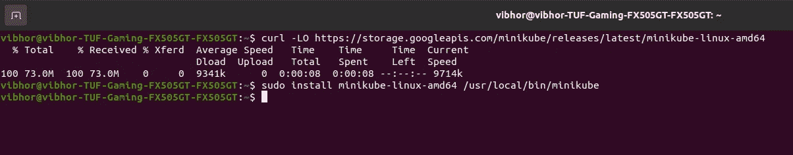

*   检查 minikube 是否安装成功

```
minikube version
```

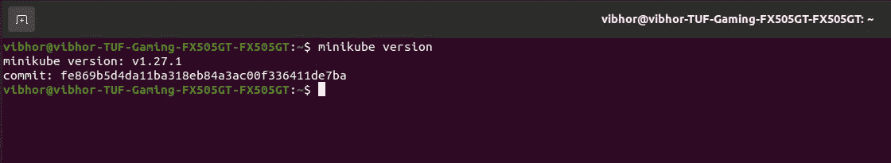

*   运行以下命令来触发一个 3 节点 Kubernetes 集群
    **[* *注意:以下命令将创建一个名为“local-cluster-vibhor”的 3 节点本地 Kubernetes 集群】**

```
minikube start --nodes 3 -p local-cluster-vibhor --driver=docker
```

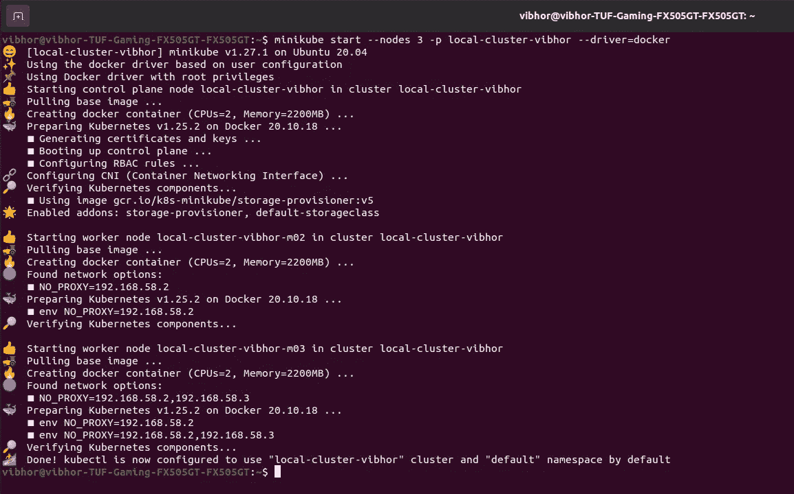

*   检查集群的部署是否正确

```
kubectl get nodes
```

一个主节点→ local-cluster-vibhor
两个从节点→ local-cluster-vibhor-m02，local-cluster-vibhor-m03

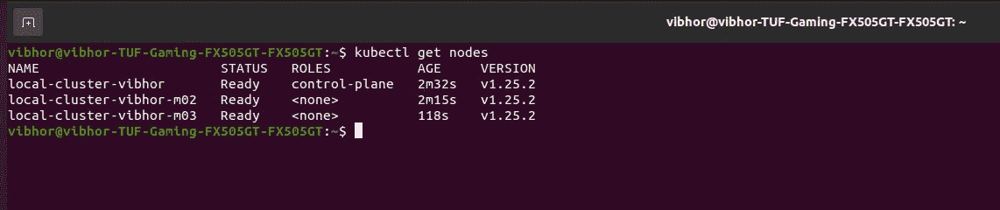

> 万岁！！🥳 🥳:现在，我们已经在本地计算机上成功部署了一个多节点集群。
> 
> *** *注:以上所有演示&截图均在“Ubuntu 20 . 04 . 5”**上完成

## 接下来呢？👀 👀


> 非常感谢你来到这里！这是本文的结尾。
> 但我们只是触及了 K8s 生态系统的表面:)】
> 还有很多，这将是一次有趣的旅程，我们将一起学习许多很酷的东西。
> 
> 请鼓掌并跟我来🙈如果你喜欢我的作品，并希望在未来更多地阅读我的作品:)

如果你对这篇文章有任何疑问，或者想聊聊天，请随时联系我的社交媒体账号

*推特—*[*https://twitter.com/ChindaVibhor*](https://twitter.com/ChindaVibhor)

*LinkedIn—*[*https://www.linkedin.com/in/vibhor-chinda-465927169/*](https://www.linkedin.com/in/vibhor-chinda-465927169/)

## 相关文章

[](/google-cloud/kubectl-commands-101-bbeec4c83e45) [## Kubectl 命令 101📝📝

### 开始 k8s 之旅必须知道的基本 kubectl 命令

medium.com](/google-cloud/kubectl-commands-101-bbeec4c83e45) [](/google-cloud/basics-of-yaml-e5897b8f11a0) [## YAML 基础知识📝📝

### 什么是 YAML？？

medium.com](/google-cloud/basics-of-yaml-e5897b8f11a0) 

我仍然会继续发表新的文章，涵盖我正在探索的一系列主题。

那都是乡亲们！！涂鸦:))