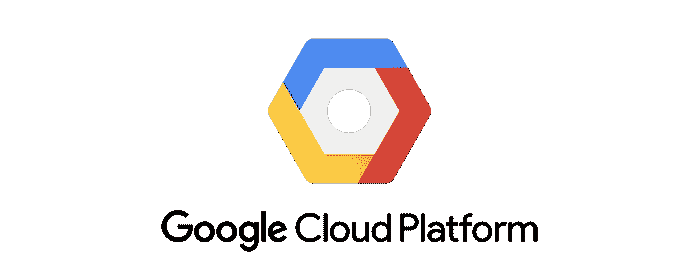
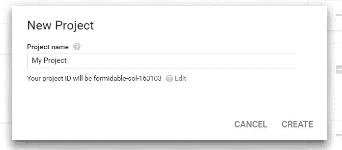
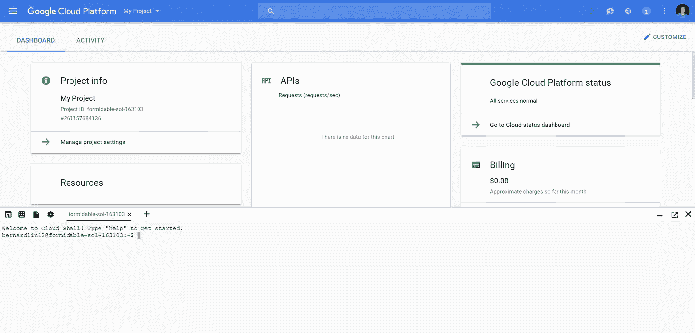
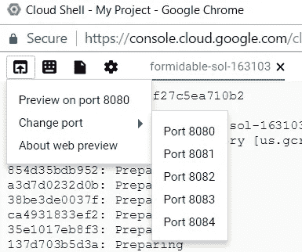
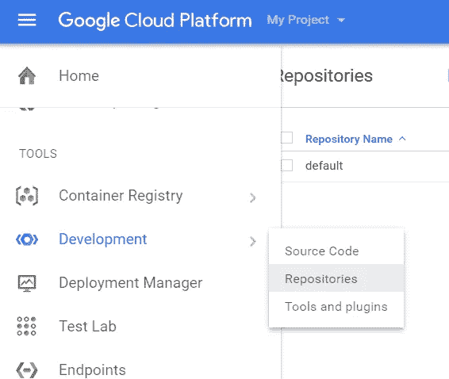
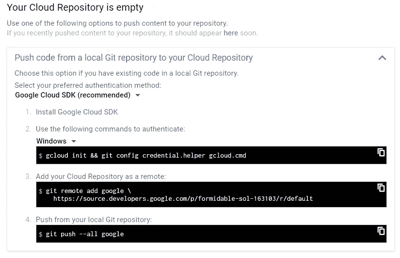
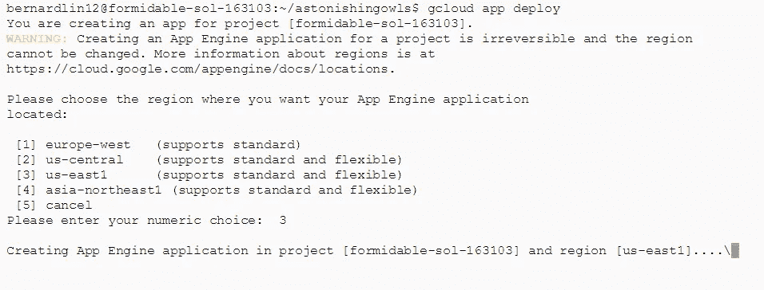
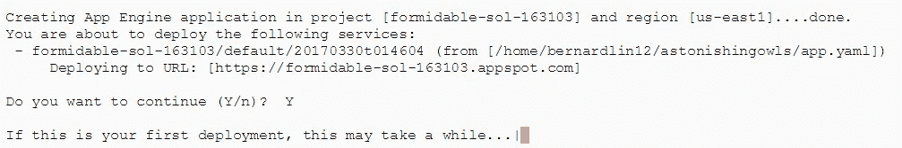
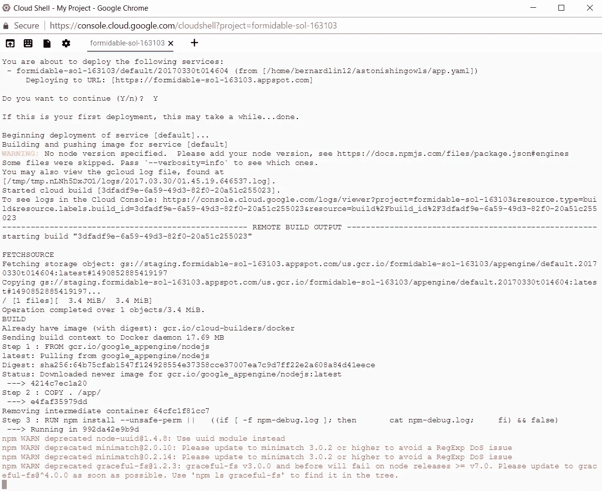
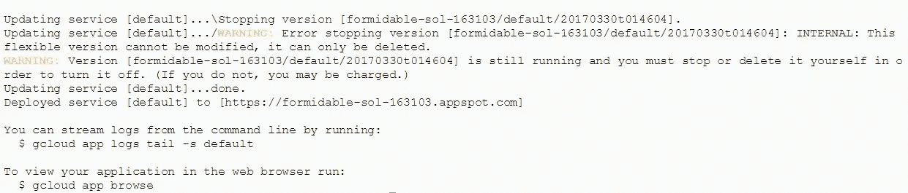

# 使用谷歌云的应用引擎部署 Node.js 应用

> 原文：<https://medium.com/google-cloud/deploying-a-node-js-app-on-google-cloud-8419de45e5dc?source=collection_archive---------0----------------------->

对于那些寻找部署应用的方法的人来说，谷歌云平台(GCP)可能不是他们想到的第一选择。Heroku 简单易用，而亚马逊的 AWS 是目前业内最受欢迎的平台。然而，GCP 提供了一些值得探索的独特工具(除了免费等级之外，[还提供 300 美元的试用积分)。](https://cloud.google.com/free/)

# 介绍

为软件公司的产品提供较低的准入门槛最符合它们的利益；某人越容易开始，用户就能越快地探索大门之外的东西。提供清晰易读的文档将大大降低这些障碍。Google 为他们的几个 API 提供了优秀的文档——然而，云部门可能有点缺乏清晰度。

在 GCP 上部署我的第一个 Node.js 应用程序遇到了很大的挫折。部分原因是我的错:我选择了使用许多尚未完全开发的工具。当它们充分工作时，它们将是生态系统中令人敬畏的新成员。现在，人们必须意识到潜在的陷阱，其中一些我将在下面介绍。

吸引我去 GCP 的是 Heroku 的易部署性(直接来自 Github，不需要 CLI，即使提供了 CLI)和 AWS 的强大功能相结合的潜力。(哦还有，我用了谷歌预测 API，它需要谷歌云 SDK。)

GCP 使得完全在浏览器中运行云外壳 CLI 界面、编辑文件和部署具有应用程序引擎的应用程序成为可能——这些功能使人们更容易探索 GCP，而无需太多投资和我们的探索主题。

# 入门指南

继续，登录 [GCP 控制台](http://cloud.google.com)，创建一个新项目！

新项目的时间到了！

在横跨页面的导航栏右侧，您会发现一个启动云外壳的图标。这将为您提供一个运行 Linux 的云引擎虚拟机，并配备了大量的正常功能(git、npm 和对 Node.js 的支持)和一些我们必须本地安装的功能(Google App Engine SDK、Google Cloud SDK)。提供的工具的完整列表可以在[这里](https://cloud.google.com/shell/docs/features#web_preview)找到。第一次出现时，外壳会出现在屏幕的底部，但是有一个选项可以将它弹出到自己的窗口中。

首次启动时的云壳

请记住，这个虚拟机是你的谷歌帐户唯一的，而不是你的项目。如果你下载了一个项目的回购，重新访问另一个项目的云壳，你会看到你以前的回购。**这个计算引擎实例也是*不同的，并且与将托管您部署的应用的应用引擎实例*分开。**

# 准备部署

继续将您的回购克隆到虚拟机中。这是您在部署前确保一切就绪的机会！如果您忘记了下面的任何内容，请随时从云壳工具栏启动谷歌的实验性在线文件编辑器(就我个人而言，我不是 VIM 之类的超级粉丝)。

你需要什么:

1.  一个 *app.yaml* 文件。至少，它应该类似于下面的示例。这让 App Engine 知道你想要什么配置。使用 flex 环境允许 App Engine 控制部署的几个方面，例如自动伸缩。如果您有任何 *process.env* 变量，这就是应该指定它们的地方。要获得该文件可以包含的内容的完整列表，请阅读[这里的](https://cloud.google.com/appengine/docs/flexible/nodejs/configuring-your-app-with-app-yaml)。

2.确保您的 *package.json* 包含一个“开始”脚本。在您的 VM 设置了您的应用引擎实例(例如，安装您可能需要的任何节点模块)之后，它将运行这个脚本。不要忘记用类似于 *node server.js* 的东西来启动你的服务器。

3.*(可选)*如果您选择在开发中的端口 8080(或 8081–8084)上启动您的服务器，您可以从云 Shell 获得快速预览。运行启动脚本并单击工具栏中的第一个图标，在新窗口中打开预览。

这里需要注意的是:预览版无法连接到 GCP 或其他地方的任何数据库。因为我所有的内容都在登录屏幕后面，所以每当我试图登录或创建新帐户时，预览总是抛出一个错误，这并没有特别的帮助。如果本地没有错误，它应该(有希望)在部署中工作。

启动 Web 预览

4.如果您选择使用文件编辑器进行任何更改，我建议您遵循这个步骤。转到 GCP 控制台内的汉堡菜单，向下滚动到工具子部分，将鼠标悬停在开发上，然后单击存储库。

存储库列表最初将为空，源代码选项只有在应用程序部署后才可用。最后,“源代码”选项卡将显示当前部署在 App Engine 上的代码。

现在，让我们创建一个新的存储库，并将其命名为“ *default* ”。这将是应用程序将从其中部署的回购。因为它是空的，所以我们可以在添加了作为远程的*默认* repo 之后，从云 Shell VM 推送我们的最终代码。

如果您使用的是 Cloud Shell，则步骤 1 和 2 已经完成

# 部署乐趣！

现在我们已经准备好部署我们的应用程序了！继续运行 repo 文件夹中的神奇命令: *gcloud app deploy。*你将被引导通过一系列提示。首先，一个位置:

然后，确认:

构建日志开始成形:

如果一切顺利，几分钟后将显示以下消息:

你可以通过运行 *gcloud app 浏览*或者进入[*https://*【PROJECT-ID】*. app spot . com*](https://[PROJECT-ID].appspot.com)(如果你还没改的话)来访问你的 app。