# 使用 GCP 在几分钟内部署 Python 无服务器功能

> 原文：<https://medium.com/google-cloud/deploying-a-python-serverless-function-in-minutes-with-gcp-19dd07e19824?source=collection_archive---------0----------------------->

女(☁️、🐍 ) = 🌈🌤️🐍🐍🐍…

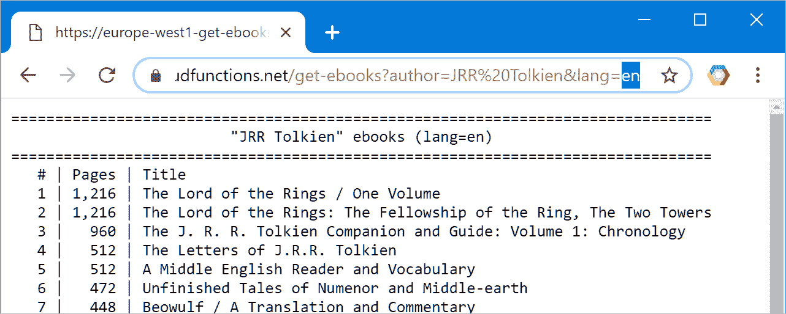

# 嘿 Pythonistas，w **e 可以部署 Python 函数！**

维基百科是我列出作者参考书目、电影记录的真实来源……不幸的是，并不是所有东西都可以以数字形式获得。例如，我想列出电子书形式的书籍。这是一个非常简单的任务，实际上是一个微服务。GCP 的云功能看起来非常适合这个。让我们从头开始检查一下。

# 几个问题

## 什么是云函数？

云功能是针对无服务器功能的托管服务。描述这种服务的首字母缩写词是 FaaS(功能为服务)。

## 什么是托管服务？

这是一项我不必管理的服务。我只是用它。

## 什么是无服务器功能？

像程序中的函数一样，无服务器(或云)函数是一个独立的单元，可以自然地隔离在 app 架构中。

## 它是如何工作的？

该功能是事件驱动的:代码将在触发时被调用，例如 HTTP 请求、上传到云存储的文件、发布的消息…

## 无服务器功能有什么好处？

*   代码本身可以直接部署在隔离的云功能中。
*   随着流量的发展，函数资源会自动伸缩(infra 为我处理这个问题)。
*   该功能高度可用(使用托管服务的一个好处)。
*   我只为我使用的东西付费:如果不使用功能，成本为零。

## 作为一名开发人员，我为什么喜欢 serverless？

*   我可以**专注于代码**。
*   我有一个**更清晰的**，还有**健壮和高性能的**、**架构**。
*   我可以睡在两只耳朵上。如果凌晨 2 点出现服务中断，可靠性工程师会处理这个问题。

## 我如何开始？

我只需要一个 GCP 账户。GCP 提供了慷慨的 [**免费等级**](https://cloud.google.com/free/) 让您开始尝试不同的产品:

*   第一次使用的用户可以获得 300 美元的免费积分，使用时间超过 12 个月。
*   此外，每个月，云功能的前 200 万次调用是免费的(低于其他高容量阈值)。

所以，除非我部署一个非常成功的函数，每个月调用几百万次，否则这不会花费任何成本。我说过我喜欢无服务器吗？

## 我的工具箱里有什么？

我可以通过三种方式使用云函数(或者一般的 GCP):

1.  从**图形用户界面(GUI)** :我可以直接从浏览器部署云功能，无需安装任何工具。这非常适合于监控或发现服务，也适合于快速原型化或调试。
2.  从**命令行界面(CLI)** :在一个合适的开发工作流中，我通常会编写所有的脚本并使用`gcloud` (GCP 的主要命令行工具)。
3.  来自**应用编程接口(API)** :所有的 GCP 服务都是基于 API 的，允许完全工业化的开发。当我使用 GUI 或 CLI 时，我实际上发起了对 REST API 的 web 请求。

## 我的作战计划是什么？

让我们部署一个简单的 HTTP 触发的云功能，首先从 GUI，然后从 CLI。不过还是先准备代码吧。

# 给我看看代码！

## “你好世界！”

Flask 是用于处理传入 HTTP 请求的底层框架。一个典型的“hello world”云函数就像这样简单:

这给出了，没有参数:


或者，使用参数:


## 定义 HTTP 入口点

我想用给定的语言打印出给定作者的可用电子书列表。基于上面的 hello world 示例，我可以定义这个简单的 Python 函数:

## 从 Google Books API 获取数据

`Requests`是“一个优雅而简单的 Python HTTP 库，为人类而建”([docs.python-requests.org](http://docs.python-requests.org))，的确如此。这使得查询一个 API(比如 [Google Books API](https://developers.google.com/books/docs/v1/reference/volumes/list) )变得非常容易:

## 以纯文本格式打印结果

Flask 自然会处理 HTML 模板，但是为了简单起见，让我们定义这个基本函数来返回一个纯文本结果:

# 从 GUI 部署云功能

GCP 提供了一个网络控制台，一个可以在任何浏览器上工作的图形用户界面，不需要预先安装。web 控制台非常适合测试一个功能(这就是我现在的情况)，快速构建概念验证，当然还有监控我的服务。

## 打开 web 控制台


前往[https://console.cloud.google.com](https://console.cloud.google.com)

## 创建新项目

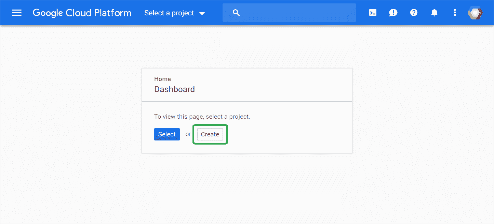

定义项目名称和 ID

## 从仪表板监控我的项目

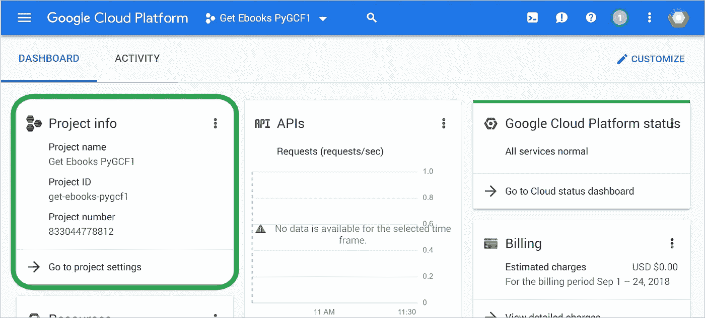

我的项目准备好了

## 使用“入门”快捷方式

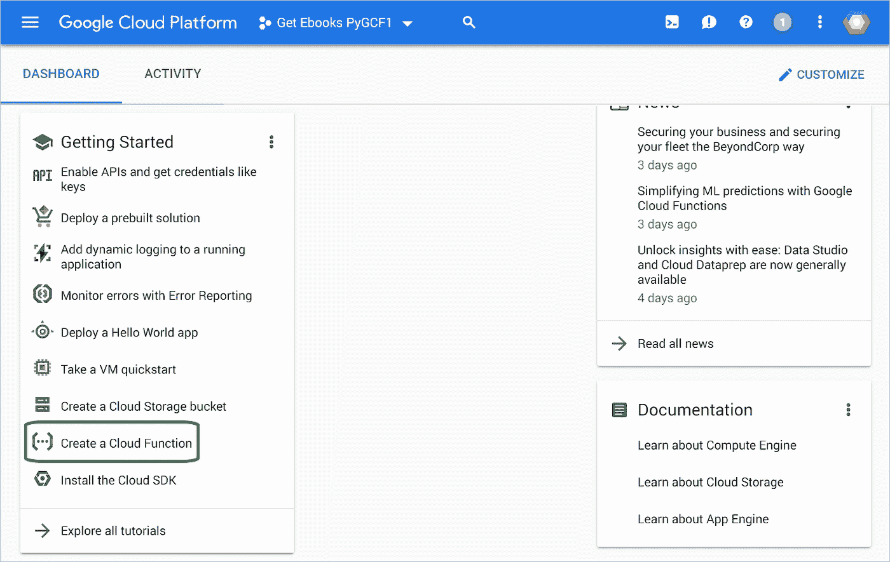

“入门”列出了最常见的任务

## 创建我的云功能

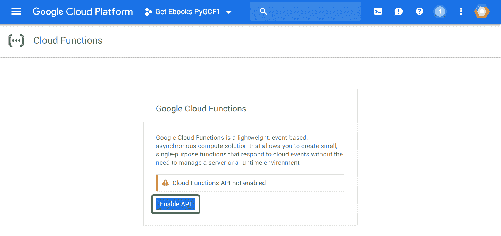

首先启用云函数 API(一个安全控件)

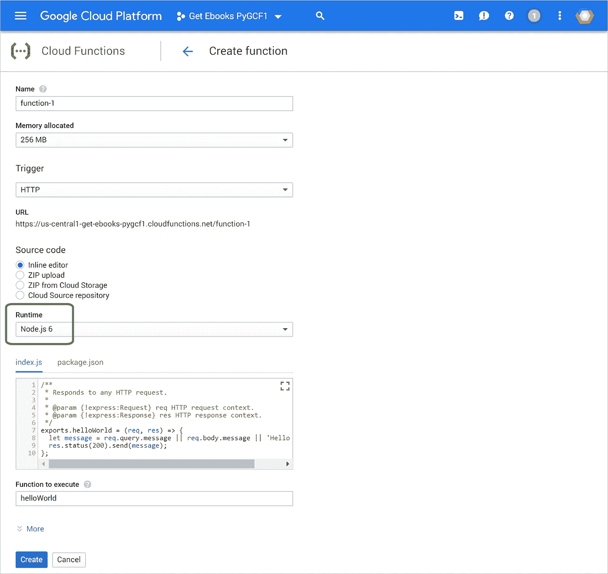

将运行时值从默认的“Node.js”切换到“Python”


新:你现在可以指定函数是私有的还是公共的。因为我们的用例是关于公开一个公共 API，所以确保选中了选项“允许未经身份验证的调用”。

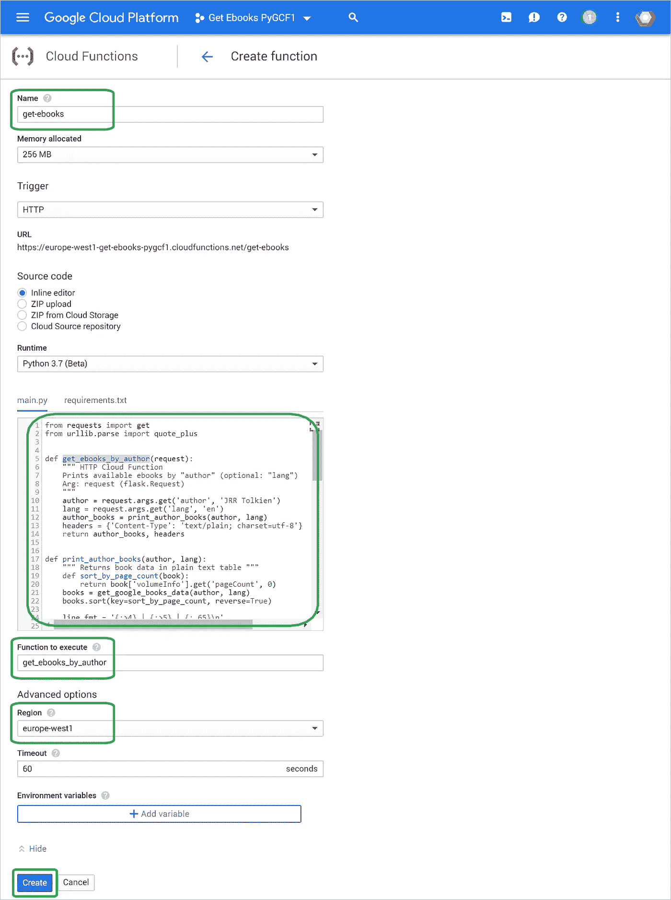

输入功能名称，[代码](https://raw.githubusercontent.com/PicardParis/cloud-snippets/master/python/gcf-get-ebooks/main.py)，入口点&区域，然后创建/部署功能

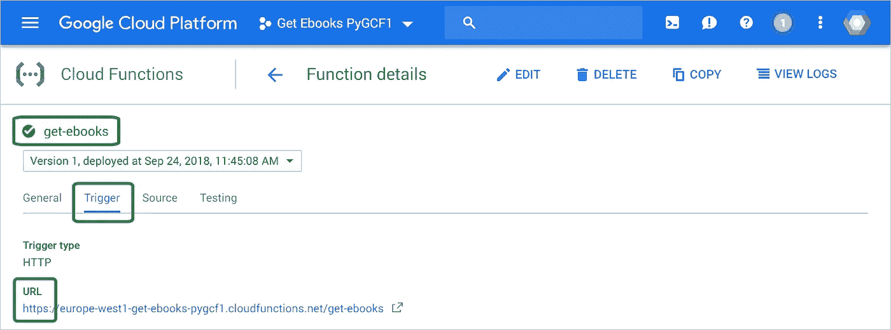

该功能已部署。一个简单的 HTTP 请求现在可以触发这个函数。

## 检查功能

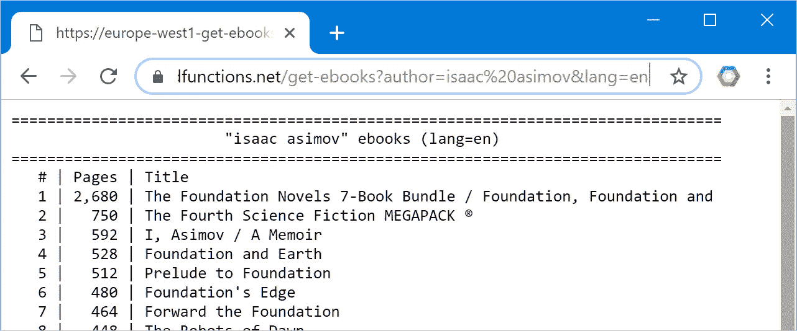

这个管用。对于实际的 API，结果当然是 json 格式，而不是纯文本格式。

## 删除项目

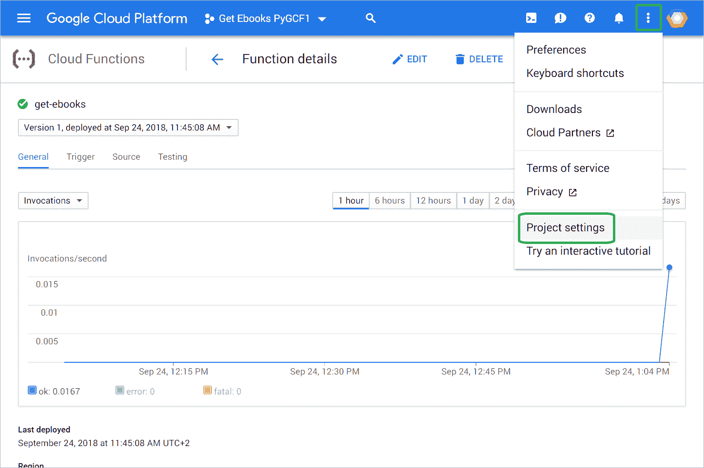

打开项目设置，然后关闭项目(实际上将在 30 天后删除)

# 从 CLI 部署云功能

如果您经常管理云项目，命令行界面(CLI)是首选工具。GCP 提供了 Cloud Shell，这是一个标准的 bash 环境，无需预先安装，直接在浏览器上运行。它背后的神奇之处在于，它自动处理到一个小虚拟机的 SSH 连接，在那里我需要的一切都是预先安装好的。主要的命令行实用程序是`gcloud`。让我们对每一步进行计时(⌛)

## 打开云壳(⌛15”)

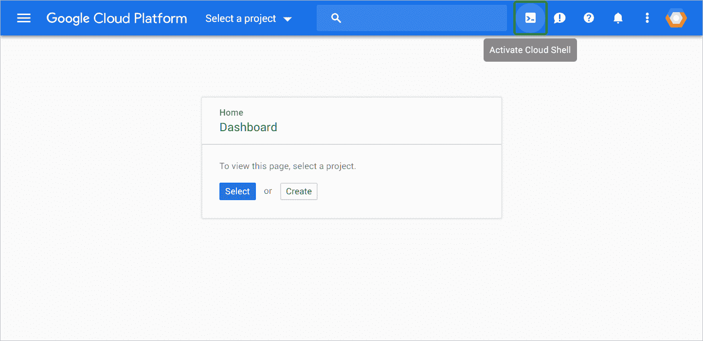

去[https://console.cloud.google.com](https://console.cloud.google.com)打开云壳

## 创建新项目(+11" → ⌛26 ")

```
**PROJECT_ID="MY-PROJECT-ID"**
**PROJECT_NAME="Get Ebooks PyGCF"****gcloud projects create $PROJECT_ID \
  --name="$PROJECT_NAME" \
  --set-as-default**Create in progress for [https://cloudresourcemanager.googleapis.com/v1/projects/...].
Waiting for [operations/cp...] to finish...done.
Updated property [core/project] to [PROJECT_ID].
```

注:项目标识在 GCP 是唯一的。我用了`get-ebooks-pygcf`，但是你应该自己定义。

## 将项目链接到我的账单账户(+5" → ⌛31 ")

```
**BILLING_ACCOUNT=$(gcloud beta billing accounts list \
  --format 'value(name)')****gcloud beta billing projects link $PROJECT_ID \
  --billing-account $BILLING_ACCOUNT**billingAccountName: billingAccounts/XXXXXX-YYYYYY-ZZZZZZ
billingEnabled: true
name: projects/PROJECT_ID/billingInfo
projectId: PROJECT_ID
```

## 启用云功能 API (+11" → ⌛42 ")

```
**gcloud services enable cloudfunctions.googleapis.com**Operation "operations/acf..." finished successfully.
```

## 获取代码(+3" → ⌛45 ")

```
**git clone** [**https://github.com/PicardParis/cloud-snippets.git**](https://github.com/PicardParis/cloud-snippets.git)Cloning into 'cloud-snippets'...
remote: Counting objects: 8, done.
remote: Compressing objects: 100% (6/6), done.
remote: Total 8 (delta 0), reused 8 (delta 0), pack-reused 0
Unpacking objects: 100% (8/8), done.**cd cloud-snippets/python/gcf-get-ebooks/**
**ls**main.py
```

## 部署功能(+1'42" → ⌛2'27)

```
**GCF_NAME="get-ebooks"**
**GCF_ENTRY="get_ebooks_by_author"**
**GCF_REGION="europe-west1"****gcloud functions deploy $GCF_NAME \
  --entry-point $GCF_ENTRY \
  --region $GCF_REGION \
  --runtime python37 \
  --trigger-http \
  --allow-unauthenticated**Deploying function (may take a while - up to 2 minutes)...done.
availableMemoryMb: 256
entryPoint: get_ebooks_by_author
httpsTrigger:
  url: https://GCF_REGION-PROJECT_ID.cloudfunctions.net/GCF_NAME
labels:
  deployment-tool: cli-gcloud
name: projects/PROJECT_ID/locations/GCF_REGION/functions/GCF_NAME
runtime: python37
serviceAccountEmail: ...
sourceUploadUrl: ...
status: ACTIVE
timeout: 60s
updateTime: 'YYYY-MM-DDThh:mm:ssZ'
versionId: '1'
```

注意事项:

*   第一次部署时间较长(设置环境)。如果我更新`main.py`并重新部署，更新需要大约 25 秒。
*   默认情况下，部署的功能是私有的(只能由 Google 云平台内的授权服务调用)。标志`--allow-unauthenticated`公开了这个函数(这样我们可以用下面的`curl`命令调用它)。除非您正在创建公共 API 或网站，否则通常不会在生产中使用此标志。

## 调用函数(+1" → ⌛2'28 ")

```
**GCF_URL=https://$GCF_REGION**[**-**](https://europe-west1-get-ebooks-pygcftest2.cloudfunctions.net/get-ebooks)**$PROJECT_ID.cloudfunctions.net/$GCF_NAME****curl "$GCF_URL?author=saint+exupery&lang=fr"**====================================================================
                  "saint exupery" ebooks (lang=fr)
====================================================================
   # | Pages | Title
   1 |   528 | Écrits de guerre (1939-1944)
   2 |   384 | Carnets
   3 |   240 | Lettres à sa mère
   5 |   180 | Les plus belles pensées d'Antoine de Saint-Exupéry
   6 |    48 | Saint-Exupéry - / Le Royaume des étoiles
   7 |    36 | Le Petit Prince raconté aux enfants
...**curl "$GCF_URL?author=jrr+tolkien&lang=de"**====================================================================
                   "jrr tolkien" ebooks (lang=de)
====================================================================
   # | Pages | Title
   1 | 1,568 | Der Herr der Ringe / Sonderausgabe
   2 |   964 | Das Buch der verschollenen Geschichten / 1\. & 2\. Teil
   3 |   720 | Nachrichten aus Mittelerde
   4 |   608 | Der Herr der Ringe - Die Gefährten / Neuüberarbeitung
   5 |   560 | Die Legende von Sigurd und Gudrún
   6 |   558 | Das Silmarillion
   7 |   444 | Der Herr der Ringe - Die Rückkehr des Königs / 
...
```

## 删除项目(+5" → ⌛2'33 ")

```
**gcloud projects delete $PROJECT_ID**
```

# 向上爬！

*   女(☁️、🐍 ) = 🌈🌤️🐍🐍🐍…
*   函数可以从:
    [https://Europe-west 1-get-ebooks-py GCF . cloud functions . net/get-ebooks？lang = en&author = jrr % 20 Tolkien](https://europe-west1-get-ebooks-pygcf.cloudfunctions.net/get-ebooks?lang=en&author=jrr%20tolkien)
*   代码片段可从本报告获得:
    [https://github . com/Picard Paris/cloud-snippets/tree/master/python/GCF-get-ebooks](https://github.com/PicardParis/cloud-snippets/tree/master/python/gcf-get-ebooks)
*   从头开始部署一个简单的云功能不到 3 分钟。
*   更新现有云功能只需不到 30 秒。


# 更新

*   2019.12.16:增加标志`--allow-unauthenticated`显式部署公共函数。

# 下一步是什么？

在几分钟内部署 Python 无服务器应用程序(敬请关注)…