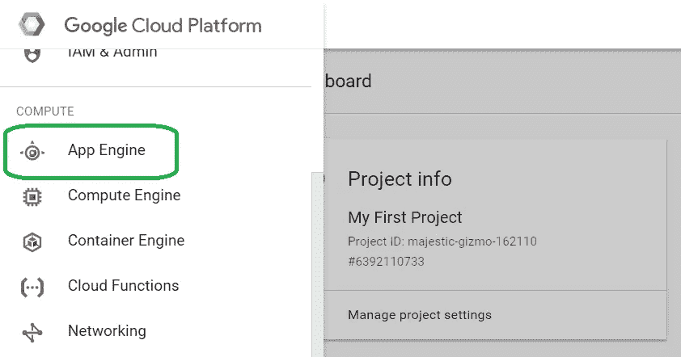
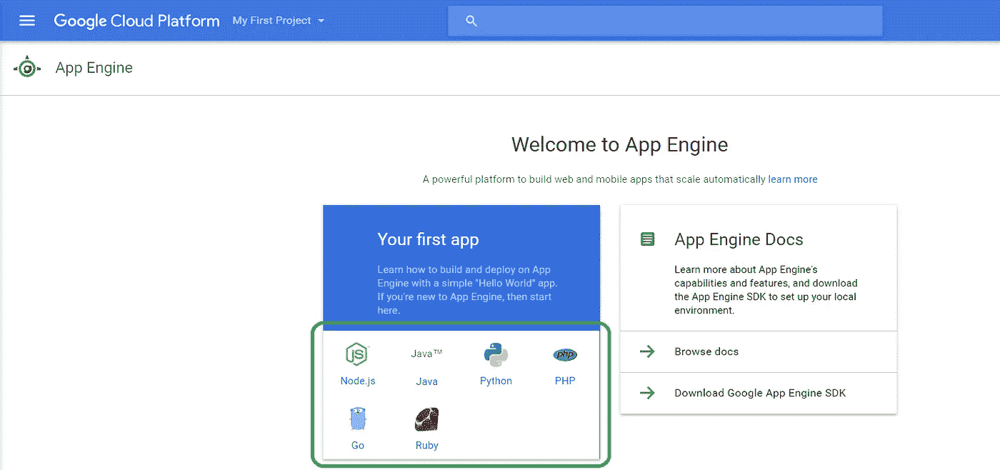
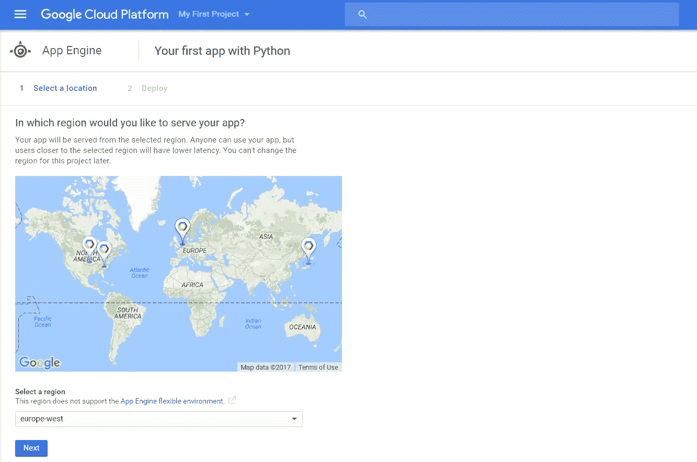
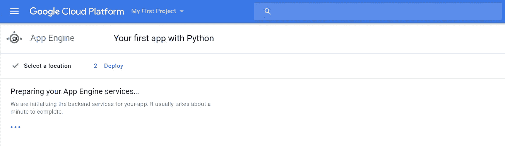
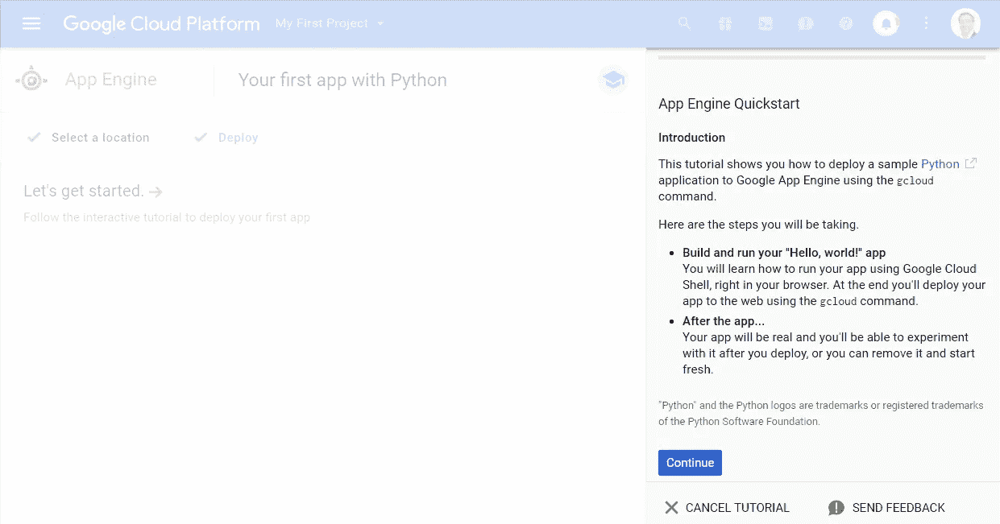
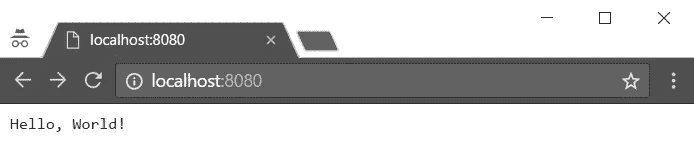
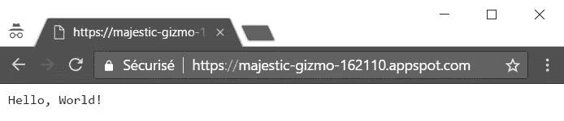
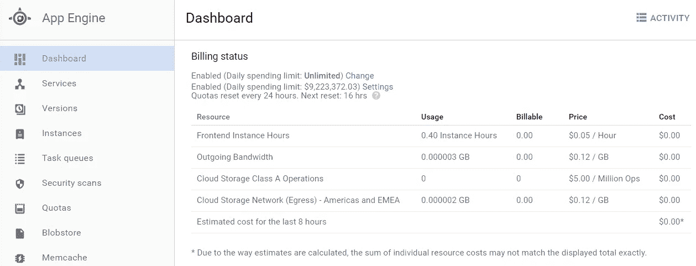

# 使用 GCP 在几分钟内部署无服务器环境

> 原文：<https://medium.com/google-cloud/deploying-a-serverless-env-in-minutes-with-gcp-22008c42dfa4?source=collection_archive---------1----------------------->

一旦建立了 GCP 帐户(见[之前的](/@PicardParis/experimenting-with-google-cloud-platform-441da66154ba))，只需要几分钟就可以从实际生产环境中启动无服务器应用程序。



选择应用引擎



让我们选择 Python，但这也可以是 Node.js、Java、PHP、Go 或 Ruby



为您的受众选择区域代表



环境不到一分钟就准备好了



从这里开始，您可以遵循交互式教程或尝试不同的方法，如下所示

如果遵循交互式教程，将会克隆一个源存储库。我愿意用最简单的方法从零开始，所以我取消了交互式教程，转而学习“[Python 应用引擎标准环境快速入门](https://cloud.google.com/appengine/docs/standard/python/quickstart)”教程。这再简单不过了。它包括以下内容:

*   安装并初始化“谷歌云 SDK”
*   获取`python-docs-samples/appengine/standard/hello_world`示例代码(需要 2 个文件，见下文)
*   本地测试 app(打开 [http://localhost:8080/](http://localhost:8080/) )
*   部署应用程序

## 最小的应用程序只需要 2 个文件

*   `main.py` (Python 源代码)

*   `app.yaml`(部署文件)

## 本地测试

```
$ **dev_appserver.py app.yaml**
INFO     2017-03-20 21:36:53,313 devappserver2.py:764] Skipping SDK update check.
INFO     2017-03-20 21:36:53,361 api_server.py:268] Starting API server at: [http://localhost:59317](http://localhost:59317)
INFO     2017-03-20 21:36:53,375 dispatcher.py:199] Starting module "default" running at: [http://localhost:8080](http://localhost:8080)
INFO     2017-03-20 21:36:53,375 admin_server.py:116] Starting admin server at: [http://localhost:8000](http://localhost:8000)
INFO     2017-03-20 21:39:20,387 module.py:806] default: "GET / HTTP/1.1" 200 13
```



## 部署到生产环境

```
$ **gcloud app deploy**You are about to deploy the following services:
 - majestic-gizmo-162110/default/... (from [...app.yaml])
     Deploying to URL: [https://majestic-gizmo-162110.appspot.com]Do you want to continue (Y/n)?  YBeginning deployment of service [default]...
File upload done.
                                                                                                                                                                                                                                                                                                                                                                                                                                                                                                                                                                                                                                                                                                                                                                                                                                                                                                                                                                                                                                                                                                                                                                                                                                                                                                                                                                                                                                                                                                                                                                                                                                                                                                                                                                                                                                                                                                                                                                                                                                                                                                                                                                                                                                                                                                                                                                                                                                                                                                                                                                                                                                                                                                                                                                                                                                                                                                                                                                                                                                                                                                                                                                                                                                                                                                                                                                                                                                                                                                                                                                                                                                                                                                                                                                                                                                                                                                                                                                                                                                                                                                                                                                                                                                                                                                                                                                                                                                                                                                                                                                                                                                                                                                                                                                                                                                                                                                                                                                                                                                                                                                                                                                                                                                                                                            Updating service [default]...done.
Deployed service [default] to [https://majestic-gizmo-162110.appspot.com]You can stream logs from the command line by running:
  $ gcloud app logs tail -s defaultTo view your application in the web browser run:
  $ gcloud app browse
```



## 计费状态

从应用程序部署的那一刻起，计费状态就会显示估计的成本。



## 关卡完成！

*   这再简单不过了。将无服务器应用从零开始部署到生产只需几分钟。
*   为了避免使用不必要的资源(以及潜在的收费)，删除测试项目(参见教程中的“[清理](https://cloud.google.com/appengine/docs/standard/python/quickstart#clean-up)”)
*   这太容易了。让我们开发一个应用程序，实际上做一些事情…

## 接下来…

[用 GCP 在几分钟内构建一个无服务器的 Python 应用](/@PicardParis/building-a-serverless-python-app-in-minutes-with-gcp-5184d21a012f)