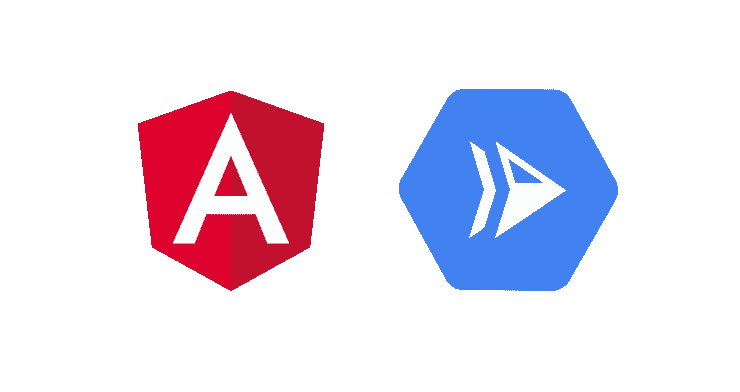

# 使用 Google Cloud Run 部署 Angular 应用

> 原文：<https://medium.com/google-cloud/deploying-an-angular-app-using-google-cloud-run-7a4d59048edd?source=collection_archive---------0----------------------->

## 了解如何使用 Google Cloud Run 创建、对接和部署您的容器化 Angular 应用程序。

TL；DR:工作实例 [Github repo](https://github.com/Marwan01/angular-cloudrun) 。

先决条件:

*   [节点](https://nodejs.org/en/)
*   [棱角分明的 CLI](https://angular.io/cli)
*   [码头工人](https://www.docker.com/products)