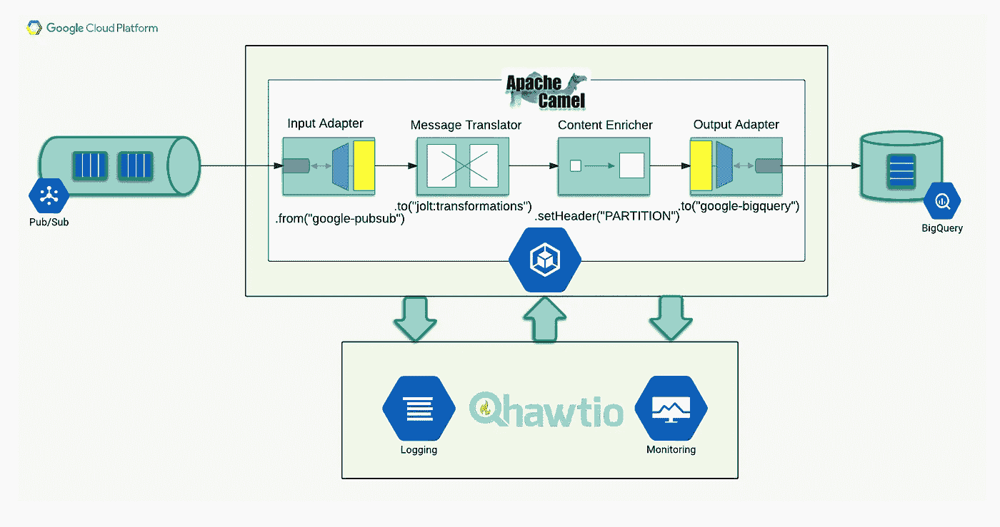
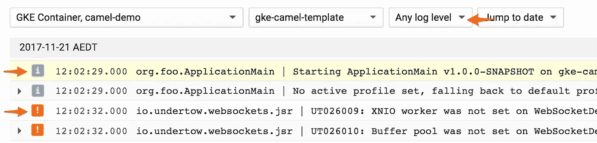
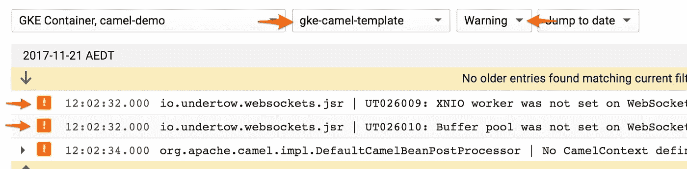
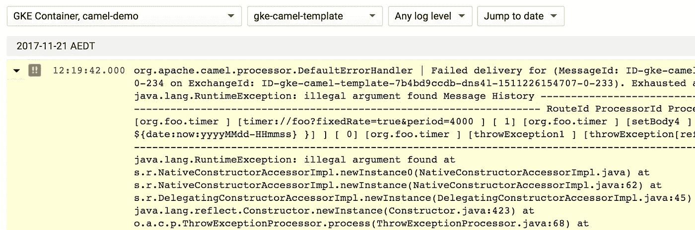
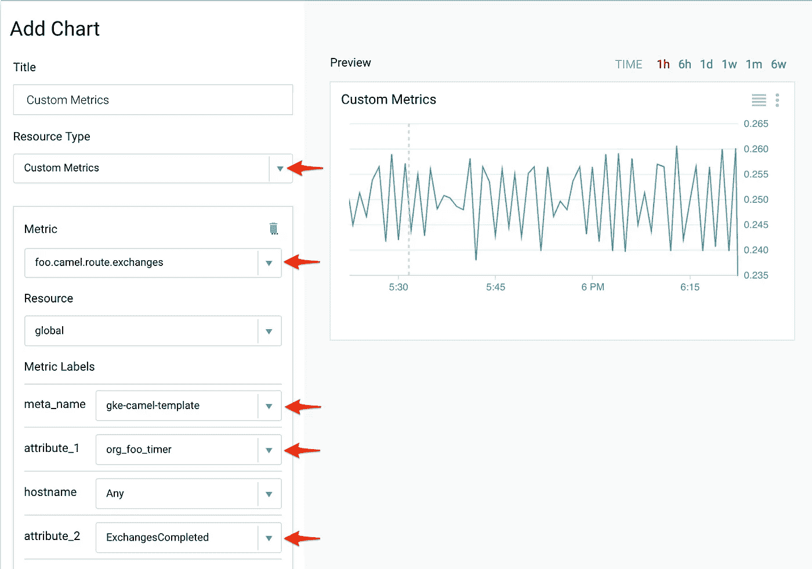
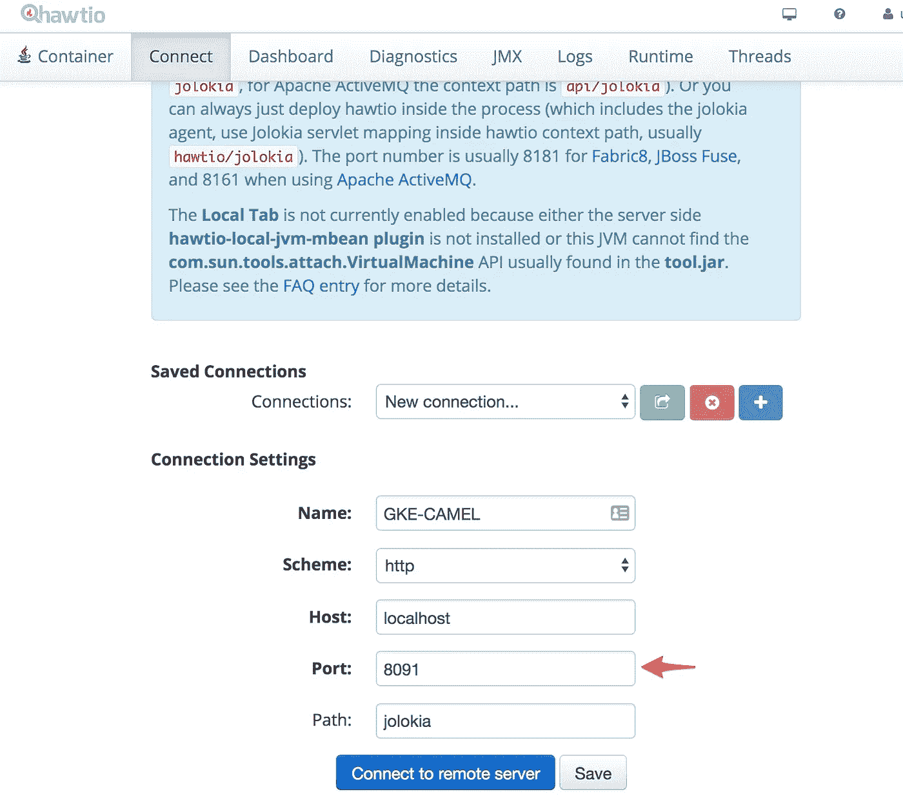
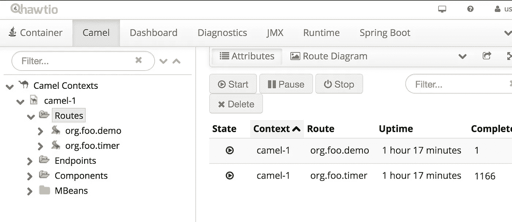

# 与 Apache Camel 和 Google 云平台的混合集成

> 原文：<https://medium.com/google-cloud/deploying-apache-camel-to-google-kubernetes-engine-a2b8290b070f?source=collection_archive---------0----------------------->

这篇文章来源于我在过去几个月中的一些讨论，涉及我们的云集成堆栈——Apache Camel 部署到 Google Kubernetes 引擎。所以我决定把思路总结在一个地方，需要的时候可以参考。

我将简要概述*为什么*以及*如何*的关键方面。

这里引用的例子是完全可操作的。我的 [GitHub 资源库](https://github.com/evmin/camel-kubernetes-demo)中提供了示例代码，包括获取[所需工具栈](https://github.com/evmin/camel-kubernetes-demo/blob/master/reference/02_toolstack_required.md)、[设置 Google 云基础设施](https://github.com/evmin/camel-kubernetes-demo/blob/master/reference/03_gcp_setup.md)、[构建和部署](https://github.com/evmin/camel-kubernetes-demo/blob/master/reference/04_build_deploy.md)过程的详细演练。

# 为什么是骆驼？

[Apache Camel](http://camel.apache.org) 是一个路由和中介引擎，可以被认为是 Gregor Hohpe 和 Bobby Woolf 定义的大多数[企业集成模式](http://www.enterpriseintegrationpatterns.com)的参考实现。

作为一个顶级的 Apache 项目，它得到了很好的支持，并带有一个慷慨的 [Apache2.0](http://www.apache.org/licenses/LICENSE-2.0.html) 许可，这是企业友好的。

它很容易扩展，提供了一个符合马丁·福勒描述的流畅接口原则(T21)的配置 DSL(包括大量的组件和适配器)。

要查看更详细的评论，请查看 Jonathan Anstey [的一篇非常精彩的摘要，该摘要介绍了与 Apache Camel](https://dzone.com/articles/open-source-integration-apache) 的开源集成。

# 为什么选择 Kubernetes 发动机？

为什么在无服务器计算越来越流行的世界里做容器和 Kubernetes 呢？

尽管我很喜欢无服务器架构，但基于容器的部署仍然被认为更加灵活。这种灵活性对于集成任务非常重要，在集成任务中，需求在依赖性、延迟和执行时间方面可能有些特殊。例如，无服务器部署对于长时间运行的流程不是特别友好。

另一方面，Docker 容器在无状态、易于定制和很好地处理异常任务之间取得了平衡。Kubernetes 作为新兴的事实上的标准的普遍采用，预先定义了管弦乐队的选择。这太棒了——看看为什么只需跟随一个典型的 DevOps 团队一天，并检查 Kubernetes 解决他们的挑战的方式。

# 为什么是谷歌？

谷歌是 Kuberenetes 的发源地。它源于谷歌大规模运行容器化应用的经验。因此，虽然市场上有一些 Kubernetes PAAS，但新功能通常会首先在谷歌云平台上发布。在我看来，出色的支持和优惠的价格使它成为最好的产品之一。

但是 GCP 不仅仅是库伯内特人。这是所有的附加功能——日志记录、监控、持久性、发布/订阅、分析等——所有这些都让开发人员易于使用。

Google Cloud Platform 提供了一种设计方法，架构师只需选择一组 PAAS 功能，就可以组成一个业务解决方案。然而，基础架构是由其他人运营的，对于同等的性能、功能和支持质量而言，这是一个更便宜的选择。

# 为什么骆驼在谷歌云平台？

但在已经丰富的谷歌云平台生态系统中，阿帕奇骆驼还有一席之地吗？是否真的需要它的能力？例如，为什么不使用 Spark 或 Apache Beam？两者都是可管理的基础设施——分别是 Dataproc 和 Dataflow。为什么不是后者？

事实上，数据流是一个神奇的产品。对于必须进行动态会话计算的大规模运营来说，它是不可替代的，并且它与 GCP 技术的其余部分的预集成非常棒。

但是，让我们考虑更简单的场景，在这种场景中，重点更多地放在消息处理和编排上，而不是数据处理，在这种场景中，每天只有几百万次交换需要处理，在这种场景中，需要集成大量外部系统。数据流会变得有点沉重和昂贵。

数据流的最低部署实体是虚拟机。半打纯数据流解决方案最终会花费相当大的成本。

此外，目前还没有太多的第三方系统适配器可用于数据流，因此集成需要努力和一些定制的低级代码。

这就是库伯内特斯骆驼的用武之地。最底层的部署实体是容器——即使配置了少量的适配器和组件，多个部署也可以放入一个虚拟机中。

现成可用的 Apache Camel 组件的数量使得集成和编排任务变得简单，并且 Google 生态系统也得以实现——有针对 Google PubSub 和 BigQuery 的预打包适配器。

从我的角度来看，Apache Camel 为遗留应用程序和复杂集成解决方案解锁了 Google 云平台，补充了现有的 Google 功能，如 Dataflow。

但是够了*“为什么？”*，让我们继续*“如何？”*。

# 怎么会？

本节涵盖了在 Google 云平台上解锁 Apache Camel 的关键实现方面:

*   配置和参数
*   记录
*   指标收集和监控
*   使用 Hawtio 控制台进行实时自省

# 示例场景

示例解决方案基于一个广为认可的[骆驼/ Spring Boot 组合](https://egkatzioura.com/2017/11/20/spring-boot-and-apache-camel)，实现了以下集成场景:

*   Camel 使用了来自 Google PubSub 订阅的一条消息
*   转换数据
*   更新标头以定义 BigQuery 表分区
*   写入 BigQuery 表



或者它在代码中的样子

JVM 和 Camel 的操作指标由 StackDriver Monitoring 收集，日志输出被定向到 Stackdriver Logging。

该解决方案被打包为 Docker 映像，存储在 GCP 容器注册中心，并部署到 GCP Kubernetes 引擎。

# 因素

Kubernetes 提供了两种现成的机制来将配置设置传递到容器中:配置映射或秘密。一旦在集群中定义了这些变量，它们的值就可以作为文件或环境变量供应用程序使用。

该演示依赖于 [Spring Boot 的外部化配置功能](https://docs.spring.io/spring-boot/docs/current/reference/html/boot-features-external-config.html)来接收这两种类型，这提供了在 CI/CD 生命周期的任何阶段覆盖它们的灵活性。

蓝图规定有四个地方可以配置 Spring Boot 属性:

1.  Spring Boot `application.properties`。不能覆盖此处定义的值。通常用于 Spring Boot 配置和不可修改的设置。
2.  自定义`default.properties`。开发人员通常在这里定义应用程序的默认设置。
3.  由`${external.config}` java 属性指向的可选文件。该文件通常供选择使用外部文件而不是环境变量的系统管理员使用。
4.  在 Docker 映像中或通过 Kubernetes 部署定义的环境变量。这些被 Spring Boot 捕获并转换成 Java 属性。

**请注意** —后三者的关系很重要。

选项 2 和 3 在`ApplicationMain.java`中明确配置:

并且它们的列表顺序定义了偏好:

*   在`default.properties`(选项 2)中定义的属性将被外部文件`${external.config}`(选项 3)中定义的值**覆盖**-如果在两者中定义了相同的关键字。
*   通过环境变量定义的值—选项 4 — **取代了来自任一属性文件的值。**

这样，开发人员可以选择使用一些定义良好的缺省值，提供他们自己的配置，并且允许管理员通过外部配置文件或环境变量来覆盖这些配置。

这种灵活性虽然很少需要，但在一些不常见的情况下非常有用。

# 记录

从表面上看，日志记录非常容易——Kubernetes 引擎自动将容器标准输出流发送给 Stackdriver 日志记录。不需要配置。简单！

然而，有几个问题。第一个——收集的每一行都成为一个单独的日志条目。这有什么不好？嗯，java 异常通常是多行堆栈跟踪——在多个日志条目中读取这些异常可能会有点混乱。

另一个有趣的地方是，这些条目将被记录为 INFO。Google Kubernetes 日志代理 FluentD 不知道如何解析它们以获得正确的严重性。有许多不同的格式，所以一个尺寸适合所有自动解决方案确实是一个难题。

但是，应用程序可以以 FluentD 能够理解的格式提供输出。格式是在`logback.xml`中定义的——一个 JSON 字符串，其中的字段名按照 FluentD 解析器的要求进行配置。感谢[Elastic.co](https://www.elastic.co/products/logstash)团队，他们提供了一个非常棒的 Logstash 组件，将多行堆栈跟踪封装到一个条目中！

检查输出:

```
kubectl logs -f deploy/gke-camel-template
```

输出:

```
{"severity":"INFO","message":"org.foo.ApplicationMain | Starting ApplicationMain v1.0.0-SNAPSHOT on gke-camel-template-7b4bd9ccdb-dns4l with PID 1 (/u00/lib/gke-camel-template-1.0.0-SNAPSHOT.jar started by root in /u00)"}
```

如您所见，严重性已经明确设置。让我们检查一下[堆栈驱动程序日志 UI](https://console.cloud.google.com/logs/viewer) 以确认它已经被正确解析:



一切都好。

这也允许一个很好的和容易的过滤，它甚至在流模式下工作，在流模式下，日志条目在[实时]到达时显示:



请注意异常是如何包含在单个条目中的:



另一个有趣的地方是，Google Stackdriver 日志允许基于日志的度量，并且将严重性作为选择条件可以使这个过程更快一些。

现在让我们看看运行容器的内部。

# 指标收集和监控

引用开尔文勋爵的话:

> 如果你不能衡量它，你就不能改进它。

抛开围绕这一表达本质的哲学争论，我希望大家都同意跟踪应用程序性能指标是至关重要的。

围绕从容器化应用程序中捕获指标，有两种通用方法——外部收集爬虫(sidecar 容器、节点服务等)或应用程序本身报告。

这里提出的选择可以被认为是两者之间的中间道路。

尽管它是“报告”模式，但它是由 JVM 代理实现的，与应用程序相隔离。

示例包括 [Jmxtrans 代理](https://github.com/jmxtrans/jmxtrans-agent)——一个 java 代理，它通过 JMX 定期检查应用程序，并通过特定的编写器向收集点报告指标，而 Goggle 云平台由 [Google Stackdriver 编写器](https://github.com/jmxtrans/jmxtrans-agent/tree/master/src/main/java/org/jmxtrans/agent/google)支持。

java 代理是完全独立的，虽然它是在应用程序之前加载的，但它不会干扰应用程序库。它是一个通用的 java 代理——只要支持 JMX，就可以与任何基于 JVM 的应用程序一起使用。

虽然出于演示的目的，度量收集器和配置文件包含在项目本身中，但更好的方法是将它们放入基本 Docker 映像中。

这样，虽然为收集 JVM 和 Apache Camel 指标提供了一个合理的默认配置，但如果开发人员或管理员需要更细粒度的自省，它仍然可以被不同的配置文件所取代。

Dockerfile 示例:

以及 metrics.xml 中的几个示例:

上面的 Camel 度量配置是一个模板，它指示代理捕获 JVM 中所有 Camel 上下文中所有路由的已完成交换的计数。

以这种方式收集的指标被归类为自定义指标，可通过 [Stackdriver 监控仪表板](https://app.google.stackdriver.com)获得。

请查看 [Jmxtrans 代理文档](https://github.com/jmxtrans/jmxtrans-agent)以了解关于占位符和一般配置的更多信息。关于规格与累积类型以及配置自定义指标的具体信息，请参考[Google stack driver Metrics API doco](https://cloud.google.com/monitoring/docs/)。

应用程序唯一需要明确提供的是 APM_META_NAME 环境变量——在原始部署的保护伞下对指标进行分组，类似于日志记录的方式。目前，Kubernetes 容器无法推断创建它的实体——是部署、作业还是 cron Job——因此它是一个强制配置选项。

该参数通常作为环境变量包含在 Kubernetes 部署 YAML 中:

请注意属性和元名称如何允许粒度度量选择:



还可以在自定义指标名称前添加前缀。在这种情况下，它是“foo ”,并且已在 metrics.xml 配置文件中明确定义:

```
<namePrefix>foo.</namePrefix>
```

**重要！**

GOOGLE_APPLICATION_CREDENTIALS 是一个环境变量，它通常为 GOOGLE 云平台驱动程序定义身份密钥的位置。

然而在这个例子中，即使 GOOGLE_APPLICATION_CREDENTIALS 环境变量被显式配置，Jmxtrans 代理 Google Stackdriver Writer **在 Google Kubernetes 引擎中执行时将忽略**它。Kubernetes 引擎集群通过内部 API 向 pods 提供服务帐户。Jmxtrans 代理 Stackdriver Writer 检查 API 在启动时是否可用。如果是这样，Kubernetes 集群服务帐户将被优先考虑。

这样，日志记录和监控操作都由同一个身份——集群服务帐户授权，而 GOOGLE_APPLICATION_CREDENTIALS 密钥只由应用程序使用。为了说明这一点，授予 GOOGLE_APPLICATION_CREDENTIALS 引用的键的唯一访问权限是 PubSub 和 BigQuery。

然而，当代理在 Kubernetes 集群之外运行时(即没有可用的内部 API)，它将退回到通过 GOOGLE_APPLICATION_CREDENTIALS 配置的身份。

# Hawtio 控制台

在生产中访问 Camel 上下文可能是快速解决问题的关键。Hawtio UI 通过其 Camel 插件提供了这种可能性(甚至允许修改路线！).

然而，将 Hawtio 组件与每个部署一起打包是不切实际的，因为这会增加相当大的内存开销，有时会使内存占用加倍。即使 RAM 很便宜，也应该避免用于微服务风格的部署。

幸运的是，Hawtio 也可以作为独立的应用程序运行——它只需要访问 Jolokia JMX 端点。这已经被 Spring Boot 实现了！

build.grade 摘录:

```
// Logging and Monitoring 
compile "org.jolokia:jolokia-core:1.3.7" 
compile "net.logstash.logback:logstash-logback-encoder:4.9"
```

Spring Boot 应用程序.属性:

```
server.port = 8091 
camel.springboot.jmxEnabled=true endpoints.jolokia.sensitive=false 
endpoints.health.sensitive=false
```

出于安全原因，Jolokia 港口没有暴露在集装箱之外，进入港口的唯一途径是通过隧道。Kubernetes 用它的`port-forward`命令提供了这样的隧道:

```
kubectl port-forward <pod_name> <port> # Executable example 
kubectl port-forward $(kubectl get po | grep gke-camel | cut -d" " -f1) 8091
```

这将有效地将本地机器上的端口 8091 映射到容器中的端口。

现在在独立模式下启动 Hawtio 并选择“连接”选项卡。将端口更改为 **8091** 并点击连接:



这为我们提供了远程 Camel 上下文的 Hawtio 控制台:



环顾四周——调试、跟踪、路由更新——它非常强大。

# 结论

这个演示展示了如何为 Google Kubernetes 引擎、PubSub、BigQuery 和 Stackdriver 配置 Camel 应用程序。

该蓝图提供了一种灵活、有弹性且可扩展的方法，经过了数十个生产集成部署的实战测试。

然而蓝图的基础是多方面的。任何基于 JVM 的应用程序都可以以这种方式部署——我们自己已经在基于 Apache Camel 和 Clojure 的解决方案中使用了这种方式。

由于 Kubernetes 是容器化部署的事实上的标准，这样的设置可以在任何地方复制——Azure、AWS、IBM、RedHat。

该代码不提供任何形式的担保，因此任何真正的使用风险自负。

# 支持

然而，对于这个想法，我建议考虑通过 [RedHat](https://www.redhat.com/en/technologies/jboss-middleware/fuse) 订阅 Apache Camel support。

能够接触到澳大利亚、英国和丹麦的优秀团队是无价的。他们的深刻理解和实践经验在很多情况下被证明是非常宝贵的。