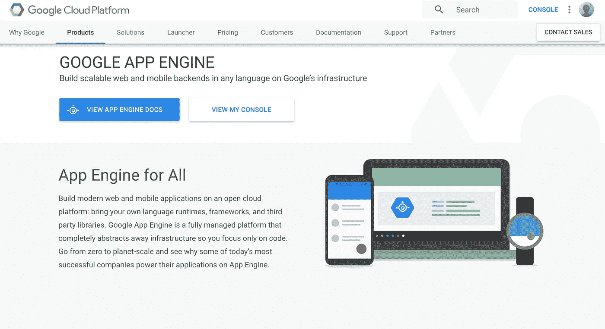
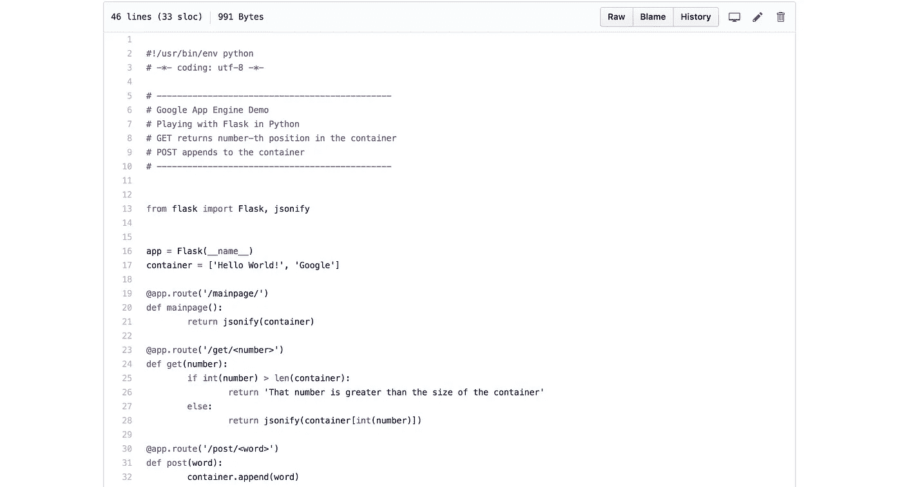

# 通过 Google App Engine 部署 API

> 原文：<https://medium.com/google-cloud/deploying-api-via-google-app-engine-1f0209ba5a5e?source=collection_archive---------0----------------------->

Google App Engine 是 Google Cloud Platform 中的一个工具，可以让你简单地部署你的应用，而不用太担心基础设施。在今年夏天，我偶然发现了这个工具来为 [Caila](https://medium.com/u/3799451b01e5?source=post_page-----1f0209ba5a5e--------------------------------) 部署 API，并了解到通过 Google App Engine 部署您的应用程序是多么简单。Amazon Web Services 有一个类似的产品，叫做 Elastic Beanstalk，功能相同，但是作为一个 Google 爱好者，我想快速浏览一下我演示的步骤。作为对该产品的介绍，你可以观看 https://www.youtube.com/watch?v=s1g4H4-MSJg 的[。](https://www.youtube.com/watch?v=s1g4H4-MSJg)

与 AWS 的弹性豆茎相比，谷歌应用引擎非常容易使用；有了 GAE，你所需要做的就是编写你的应用程序，并将其部署到谷歌云基础设施，而不需要自己配置和管理服务器(EC2、数据库、负载平衡器等)。).

Google Cloud 团队已经在 Github 中提供了大量的 python 样本代码，你可以通过 App Engine 使用它们。然而，为了演示，我在 Python3.5 上使用 Flask 创建了一个简单的 API，如这里【https://github.com/mchon89/Google_App_Engine_Demo[所提供的。以下是使用 App Engine 部署 flask 应用程序的步骤:](https://github.com/mchon89/Google_App_Engine_Demo)

API 代码的屏幕截图

1.  在你的本地计算机上安装 Google SDK，并确保你通过了认证过程
2.  在谷歌云控制台上启用应用引擎 API
3.  转到你的代码所在的文件夹，确保你有 YAML 和需求文本文件，在我的 Github 库中有引用。
4.  在您的终端上输入“gcloud app deploy”

我很惊讶这有多简单。只要你会写简单的 app 代码，部署你的 app 并没有你想象的那么难；如果你已经有一个工作代码，通过这个过程不会超过 10 分钟。更多细节，你可以随时去 App Engine 文档了解更多，[https://cloud.google.com/appengine/docs/](https://cloud.google.com/appengine/docs/)。