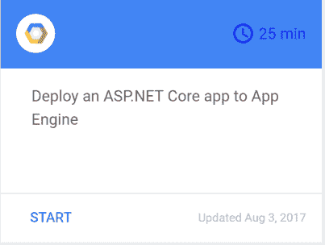

# 在应用引擎上部署 ASP.NET 核心应用

> 原文：<https://medium.com/google-cloud/deploying-asp-net-core-apps-on-app-engine-1e255d3c5a13?source=collection_archive---------0----------------------->

我喜欢在应用引擎(flex)上部署和运行容器化的 ASP.NET 核心应用程序的简单性。以至于，我最近创造了一个云分钟来展示给你看，就是这个。

它主要包括 3 个步骤:

1.  使用云壳中的 *dotnet* 命令行工具创建您的 ASP.NET 核心应用程序，并发布您的应用程序以获得一个自包含的 DLL。
2.  通过创建一个 *Dockerfile，*依赖于官方的应用程序引擎映像，并指向应用程序的自包含 DLL，将应用程序容器化。
3.  为 App Engine 创建一个 *app.yaml* 文件，使用 *gcloud* 部署到 App Engine。

就是这样！如果您想亲自经历这些步骤，我们也为您提供了一个代码实验室，您可以在此处访问[。](https://codelabs.developers.google.com/codelabs/cloud-app-engine-aspnetcore)

*原载于 2017 年 8 月 15 日 meteatamel.wordpress.com***。**