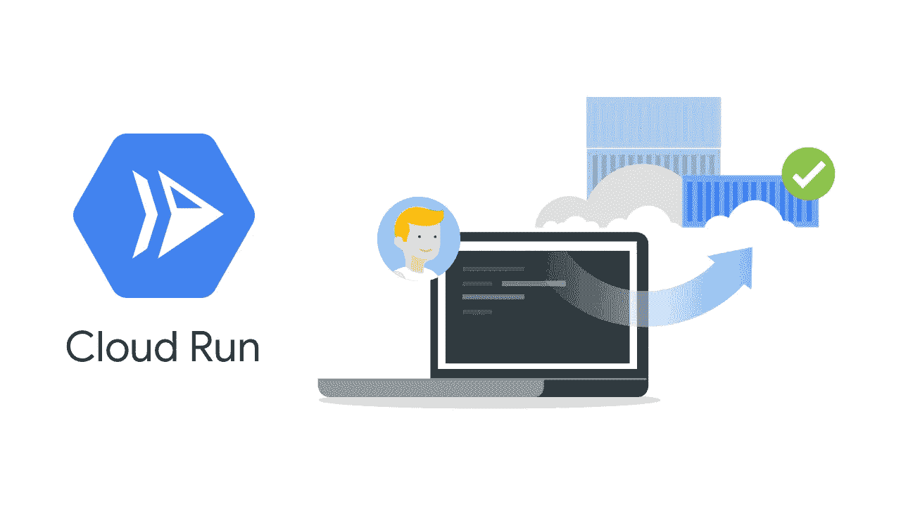

# 在<5mins

> 原文：<https://medium.com/google-cloud/deploying-containers-to-cloud-run-in-5mins-b03f1d8d4a64?source=collection_archive---------0----------------------->

> Update: 11/15/2019
> 将容器部署到云运行云运行现已普遍可用
> [点击此处了解更多信息](https://cloud.google.com/blog/products/serverless/knative-based-cloud-run-services-are-ga)



云运行

今天的软件开发人员可以专注于更快地构建应用程序，而不必担心他们的代码如何在其他环境中运行，这是因为容器化可以将应用程序及其配置和依赖性捆绑到一种跨不同环境运行的有效方式中。


部署容器(Docker 或 Kubernetes)也可能是一件令人头痛的事情，当你还必须负责提供底层基础设施时，然而，Google Cloud 为你提供了一种以无服务器方式将容器化的应用程序部署到云中的方法，称为 [**Cloud Run**](https://cloud.google.com/run/) ，它抽象出底层基础设施，自动运行和自动扩展你的无状态应用程序。

在本文中，我们将简要地构建和部署一个容器化的应用程序，并部署到 Cloud Run。

在您开始之前:
-设置一个 [Google Cloud 帐户&项目](https://cloud.google.com/gcp/getting-started/)
-设置 [Google Cloud Shell](https://cloud.google.com/shell/) 或[下载其 SDK](https://cloud.google.com/sdk/)
-克隆您的容器化应用程序或[复制我的示例](https://gist.github.com/Timtech4u/6639a92b4197ea831ba9b975c9b34a76)

我的代码片段

# 构建和发布容器图像

[云构建](https://cloud.google.com/cloud-build/)允许我们在云上构建 Docker 映像，我们所需要的只是我们的项目文件(其中包括一个 Docker 文件)。

下面的命令在云 Shell 上运行，以**构建**我们的 Docker 映像，并**将**映像推送到[容器注册表](https://cloud.google.com/container-registry/)。

```
gcloud builds submit --tag gcr.io/<PROJECT_ID>/demo-image .
```

用您的实际项目 ID 值替换`<PROJECT_ID>` 。

*注意，如果您正在构建更大的图像，您可以传递一个超时参数，例如:* `*--timeout=600s*`

# 部署到云运行

我们将使用以下命令从云 Shell 部署我们的映像:

```
gcloud beta run deploy demo-app --image gcr.io/<PROJECT_ID>/demo-image --region us-central1 --platform managed --allow-unauthenticated --quiet
```

嘣！应用程序容器已部署到云运行。😀

云运行值得团队研究，它通过允许部署到 Kubernetes 集群( [Cloud Run for Anthos](https://cloud.google.com/run/docs/quickstarts/prebuilt-deploy-gke) )等提供了可负担性、安全性、隔离性和灵活性。

这里有一个简短的演示，展示了使用 Cloud Run 部署和访问容器有多快。

另一个直接部署到云的简短演示使用 [Cloud Run 按钮从您的 Git 存储库运行。](https://www.youtube.com/watch?v=14B2zdoBnIY&list=PL1Szsm9yZH_fGfktEvfqOq4uj3sPabEJe&index=2)

查看更多关于云运行的资源:
📚[云润产品概述](https://cloud.google.com/run/)
💻[牛逼云跑](https://github.com/steren/awesome-cloudrun)
🙋[云运行常见问题解答](https://github.com/ahmetb/cloud-run-faq)

> 感谢您通读！如果我错过了任何步骤，如果有些事情不太适合你，或者如果这个指南有帮助，请告诉我。

[最初发布于 Mercurie 博客](https://blog.mercurie.ng/deploying-containers-to-cloud-run-in-5mins/)