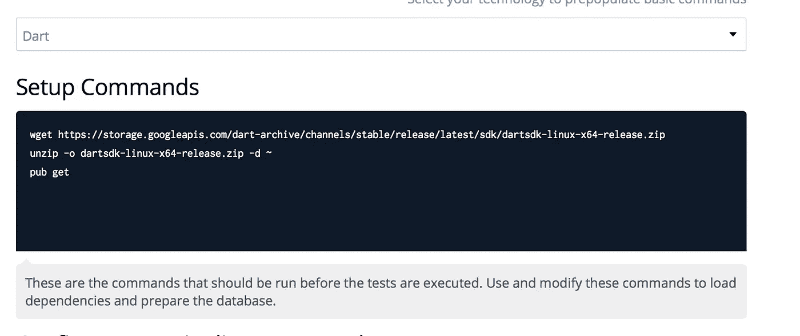
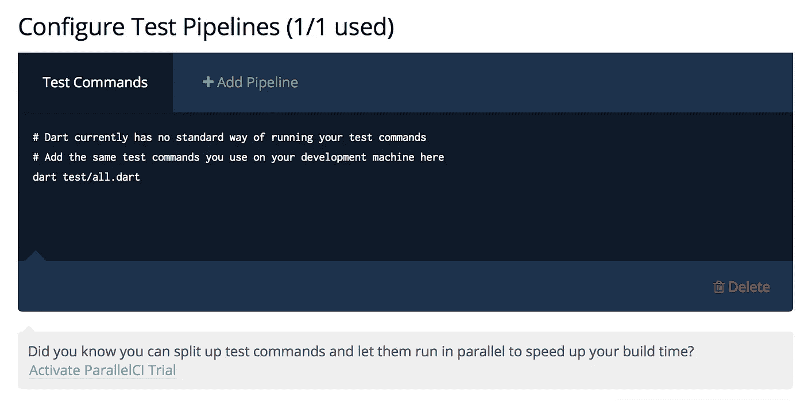
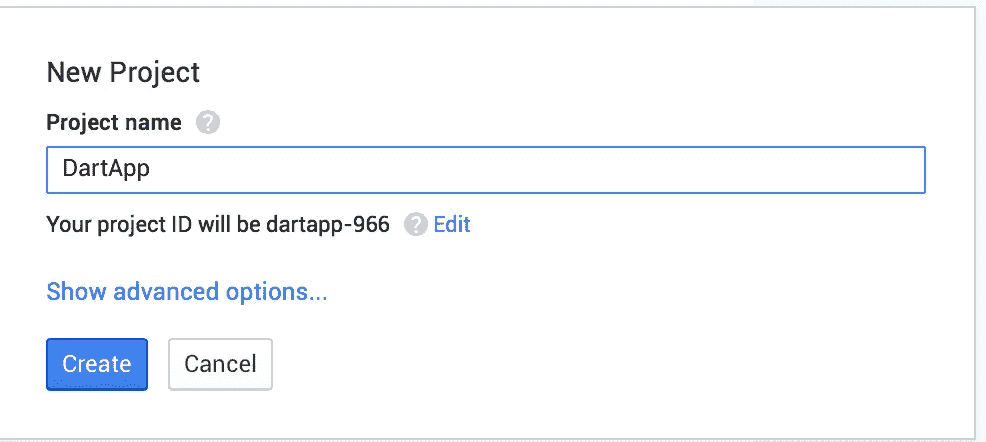
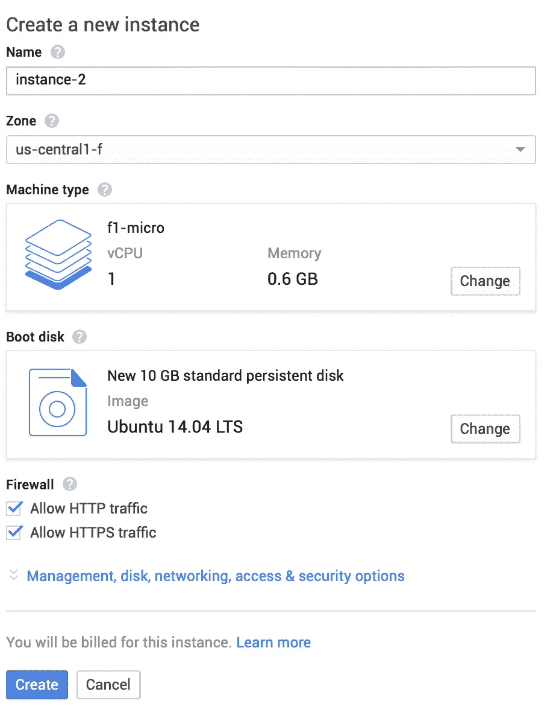
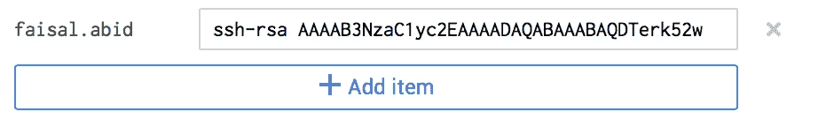
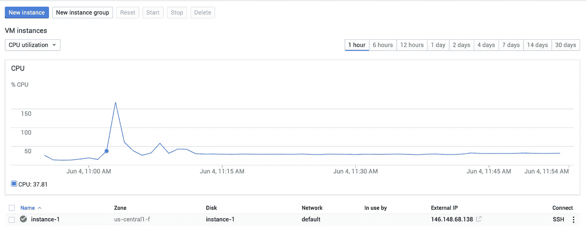
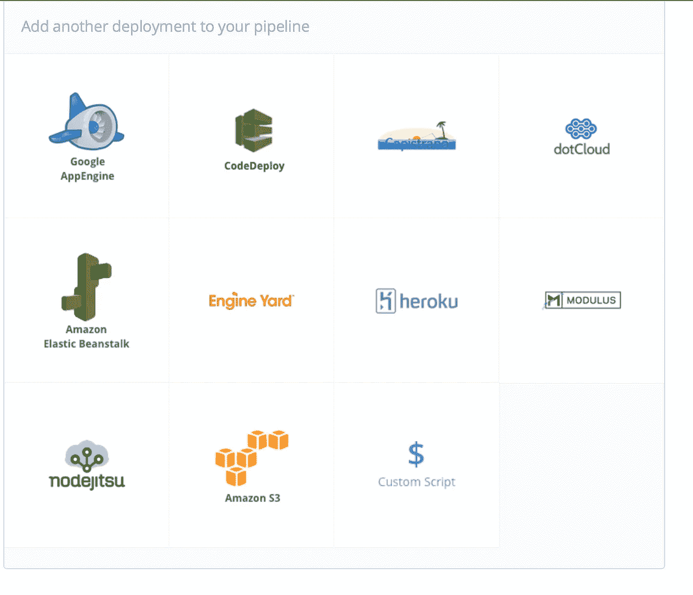
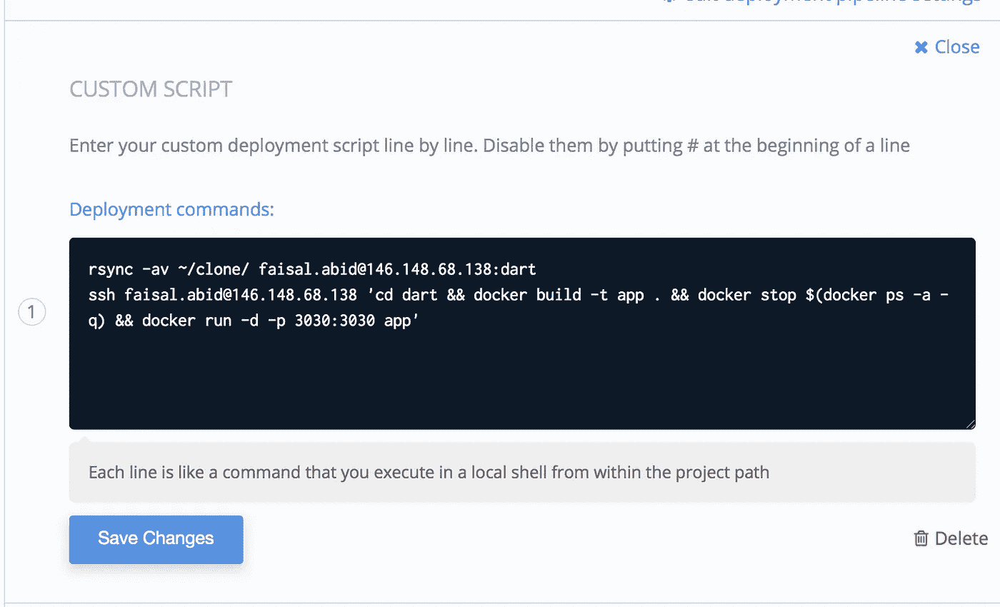
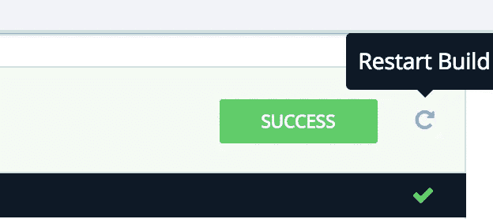
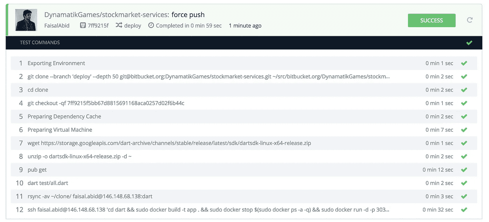

# 使用 Codeship 将 Dart 部署到 Google 计算引擎上，并进行持续集成和部署。

> 原文：<https://medium.com/google-cloud/deploying-dart-onto-google-compute-engine-with-continuous-integration-and-deployment-using-codeship-90cc45d6652e?source=collection_archive---------0----------------------->

哇，多么拗口的标题。试着说 10 次。

您会注意到，将 Dart 部署到 Google 云上的方法并不多见。App Engine 不支持托管虚拟机，虽然在技术上支持 Dart，但它尚未退出测试，所以我不信任它。

将 Dart 部署到您的服务器的一种方法是安装 Dart、FTP stuff 并运行 dart bin/server.dart。

我个人讨厌这种方法，我喜欢在部署之前让一切自动化和测试。

我希望每天向主分支提交 100 次，对每一次提交运行 100 次单元测试，如果都通过了，那么我希望代码自动部署到生产中。

我们如何实现 Dart 部署的涅槃？让我们假设您已经准备好了 Dart 服务器应用程序，并且已经准备好了某种单元测试(即使您没有也没关系！，只需跳过本教程的持续集成部分)

这个教程很长，如果你迷路了，请留下一些反馈，告诉我哪里可以做得更好！

第一步是让某种 CI(持续集成)系统运行起来。这将在您推送到 github 或 bitbucket 存储库时运行您的测试。

我最近用过的最好的 CI 工具之一是 Codeship。


Codeship.com

# **在代码船上设置 Dart**

注册 Codeship 时，请连接您的 Github 或 Bitbucket 帐户。当需要配置项目时，选择 Dart 作为技术。

请注意，当前的 Codeship SDK 已经过时，因此您必须在配置期间安装最新版本的 Dart。



```
wget [https://storage.googleapis.com/dart-archive/channels/stable/release/latest/sdk/dartsdk-linux-x64-release.zip](https://storage.googleapis.com/dart-archive/channels/stable/release/latest/sdk/dartsdk-linux-x64-release.zip)
unzip -o dartsdk-linux-x64-release.zip -d ~
pub get
```

这只是告诉 Codeship 下载最新的 sdk，解压并运行 pub get on 它。

接下来，如果您有单元测试，您可以告诉 Codeship 在测试配置管道部分运行它们。



现在，我这里只有 dart test/all.dart 来运行我的 dart 单元测试。

点击“保存”,转到“仪表板”,按照入门步骤推进您的项目。忽略它可能向您询问的任何部署选项，我们稍后将再次讨论。

对你的主分支进行 git 推送，让 codeship 发挥它的魔力。如果一切顺利，你会看到这个。


如果失败了，看看是什么测试失败了，并修复它。这是生产前的第一道(如果不是最后一道)防线，所以一定要通过！

## **太好了，CI 现在设置好了！**

很好，现在 CI 已经设置好了，可以开始工作了。你写代码，你推动，你测试运行，如果一切顺利，Codeship 给你绿灯，你是清白的。

现在怎么办？我如何将它部署到谷歌计算引擎(GCE)

# **为飞镖设置 GCE**

我将假设您没有 GCE 服务器设置。让我们带你走一遍。

转到 console.developers.com，为您的 Dart 应用程序创建一个新项目。单击左上角的蓝色新建项目按钮。



在左侧边栏中，单击虚拟机实例。

并单击新建实例。

按照下面的屏幕截图设置您的新实例。出于测试目的，我们将使用 ubuntu 14.04LTS 的微实例。

现在还不要点击创建！跟着截图走



在点击创建之前，请点击管理磁盘、网络、访问和安全选项蓝色链接。

然后点击访问和安全，并在这里添加您的公共 ssh 密钥。

要在 mac 上获得 ssh 密钥，请尝试以下命令。它通常应该显示您的公钥

```
cat ~/.ssh/id_rsa.pub
```

一旦你有了它，把它放在框里，用户名框会自动填充。



在这之后，你就可以走了。显示您登录 ssh 的用户名。点击创建，看它去！

一两分钟后，你会看到你的仪表板与你的真棒新 GCE 服务器运行。



# **在 GCE 机器上设置 Docker**

Docker 是一种在虚拟化安全容器中运行应用程序的简单方法。用软件污染主机系统的日子已经一去不复返了，现在您只需要一个包含您的应用程序及其所有依赖项的 Docker 实例。

在 GCE 机器上安装 Docker 非常简单。

SSH 到您的机器中，

```
ssh (username)@ip
```

并遵循以下步骤

## 在 Ubuntu 上安装 Docker

确保您已经安装了 Ubuntu 版本的必备软件。然后，使用来自 https://docs.docker.com/installation/ubuntulinux/[的以下步骤安装 Docker](https://docs.docker.com/installation/ubuntulinux/)

验证您已经安装了 wget。

```
$ which wget
```

如果没有安装 wget，请在更新管理器后安装它:

```
$ sudo apt-get update $ sudo apt-get install wget
```

获取最新的 Docker 包。

```
$ wget -qO- [https://get.docker.com/](https://get.docker.com/) | sh
```

系统会提示您输入 sudo 密码。然后，它下载并安装 Docker 及其依赖项。

验证 docker 安装正确。

```
$ sudo docker run hello-world
```

该命令下载一个测试映像，并在容器中运行它。

完美。如果你跟着做，并且所有这些都有效，你做得很好！

## **准备 GCE 接受代码船部署**

现在，在我们离开 ssh 之前，请转到您的主目录(~/)并创建一个名为 dart 的文件夹。(mkdir 飞镖)

在一个新的标签中，回到 Codeship，进入项目设置，点击常规。

从这里获取 Codeship 的公共 ssh 密钥。这将让 Codeship 轻松部署到您的服务器上。

然后回到您的终端，在中打开 allowed_hosts。ssh 并粘贴来自 codeship 的密钥

```
vim ~/.ssh/allowed_hosts
```

嘣！

概括地说，您已经设置了 Docker 并允许 Codeship 访问您的 GCE。这将使它能够进行连续部署，这是我们接下来要设置的。

# 设置 Dart 应用程序以支持 Docker

为了让 Docker 了解你的申请，你需要建立一个 Docker 文件。Dockerfile 是一个简单的脚本，它告诉 Docker 要安装什么，如何运行您的应用程序，以及要暴露哪些端口。在项目目录的根目录下创建一个 docker 文件。

我们的 Dart 特定 docker 文件如下所示。

```
FROM google/dartWORKDIR /appADD pubspec.* /app/RUN pub getADD . /appRUN pub get — offlineCMD []EXPOSE 3030ENTRYPOINT [“/usr/bin/dart”, “bin/server.dart”]
```

**来自 google/dart** 告诉 Docker 我们想使用 google/dart docker 的基本映像。更多细节可以在这里找到【https://registry.hub.docker.com/u/google/dart/ 

**WORKDIR /app** 正在 Docker 容器中创建一个名为 app 的目录。

**添加 pubspec。* /app/** 正在将 pubspec 文件添加到 app 文件夹中。

**跑酒馆 get** 就是跑酒馆 get。

**添加。/app** 正在将您的其余文件添加到 app 目录中

我们跑了两次酒馆，找出为什么[https://registry.hub.docker.com/u/google/dart/](https://registry.hub.docker.com/u/google/dart/)

接下来我们**暴露端口 3030** 。如果您的应用程序使用不同的端口，那么在这里更改它。

最后，我们告诉 Docker 如何通过**入口点**运行我们的应用。通过以文件作为参数执行 dart 命令。

犯这个推那个。由于我们没有对代码做任何修改，你的单元测试应该会通过，Codeship 应该会给你一个绿灯。

接下来，是时候部署它了！

# 使用 Codeship 持续部署到 GCE

在 Codeship 中，转到项目设置和部署。

单击自定义脚本作为您的部署管道



在这里，您将看到一个用于输入部署脚本的框。这个脚本很简单，只包含几个命令。



首先， **rsync -av** 将 Codeship 在每次推送时创建的克隆目录中的所有文件复制到我们之前在您的主机 GCE 系统上创建的 dart 文件夹中。

接下来，我们通过 ssh 运行一些命令。这些命令基本上是我们将 cd 运行到 dart 目录中，构建 docker 映像，停止所有以前运行的 docker 实例，并在映像内绑定到端口 3030 的端口 3030 上运行 docker 应用程序。

```
rsync -av ~/clone/ username@ip:dartssh username@ip ‘cd dart && docker build -t app . && docker stop $(docker ps -a -q) && docker run -d -p 3030:3030 app’
```

命令摘要

```
cd dart 
#change into the dart folder that has all the source codedocker build -t app .  
#build the current folder into an image called appdocker stop $(docker ps -a -q) 
#stop all currently running docker instancesdocker run -d -p 3030:3030 app 
#run the newly created app image. binding to port 3030 on host system to port 3030 in docker image
```

请记住，如果您使用了不同的端口，或者想要绑定到主机系统上的不同端口，请在脚本中进行更改。

# 现在一起测试它


现在是我们测试整个流程的时候了。最简单的方法就是在 Codeship 中点击重启构建。



点击重启将运行所有的单元测试。如果通过，它将运行您的部署工作流，瞧！访问您的 ip:port，您将看到您的 Dart 应用程序正在运行！



# 摘要

有点漫长，但值得一试。这将为您节省无数时间，当您在周五晚上对系统进行快速更改并想要部署它时。Codeship 可以轻松确保您的代码不会在生产中崩溃，Dart 结合 GCE 的强大功能将使您的应用程序飞起来。

