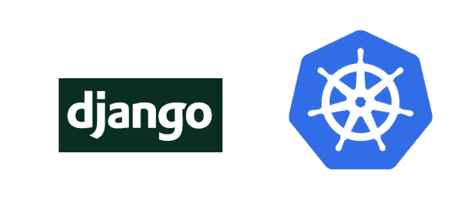

# 将 Django、Postgres 和 Redis 容器部署到 Kubernetes(第 2 部分)

> 原文：<https://medium.com/google-cloud/deploying-django-postgres-and-redis-containers-to-kubernetes-part-2-b287f7970a33?source=collection_archive---------1----------------------->



这是我关于将 Django 应用程序部署到 Kubernetes 的系列文章的第二部分。[点击此处](/google-cloud/deploying-django-postgres-redis-containers-to-kubernetes-9ee28e7a146#.hxa3x1fsg)阅读第一部分，在这里我将一个 Django 应用打包并在 Kubernetes 上运行，仅使用内存缓存和 SQLite 数据库。第 2 部分假设您已经完成了第 1 部分的步骤，并且您的 Django 应用程序可以使用外部 IP，只是没有连接适当的数据库或缓存。

在本教程结束时，您将拥有 Django 应用程序和一个 PostgreSQL 数据库，受 Kubernetes 秘密数据库密码和 Redis 缓存保护，以及由 CDN 提供的静态文件。

和以前一样，你可以在 [Github](https://github.com/waprin/kubernetes_django_postgres_redis) 上找到本教程的所有代码、带有完整说明的自述文件和问题跟踪器。如果你遇到任何后续问题，你可以在 Github 问题跟踪上提交问题，并提到 waprin@，或者在 Twitter 上提到我。

如果你对在 Google Cloud 上运行 Django 的其他方法和教程感兴趣，我最近发布了一个在 Google Cloud 上运行 Django 的[新登录页面](http://cloud.google.com/python/django)，其中包括在 Google App Engine 标准环境、Google App Engine 灵活环境(以前是托管虚拟机)、Google Compute Engine 和使用 Google CloudSQL(完全托管 MySQL)的 Google Container Engine(Kubernetes)上运行 Django 的新快速入门指南。看看吧！同样，如果你遇到任何问题，请在 Github 或 Twitter 上给我留言。

Redis 和 Postgres 都不是高可用性的设置——我将在下一篇文章中解决这个问题。

# 步骤 0:一些调试技巧

在本教程中有很多步骤要走，我自己通常不会 100%正确地完成它们。如果遇到问题，请记住以下一些有用的命令:

```
$ kubectl logs <pod name>
```

kubectl 日志将显示容器的标准输出/错误，这通常是我查找问题的第一个地方。如果你需要更深入地挖掘，你可以在容器上运行一些命令，比如“cat”一个文件。

```
$ kubectl exec <frontend-pod> -- cat /etc/secrets/djangouserpw
```

如果你想看到一个资源的所有 Kubernetes 元信息，试试“kubectl describe ”:

```
$ kubectl describe pod <pod_name>$ kubectl describe service <service_name>$ kubectl describe rc <rc_name>
```

当我遇到问题时，最简单的方法就是删除并重建资源。

```
$ kubectl delete rc frontend$ kubectl create -f kubernetes_configs/frontend.yaml
```

# 步骤 1:部署 Redis

Redis 是一种流行的内存键值存储，通常用于缓存，尽管它也可以用作主数据库或队列。在本例中，我们将重点关注仅将其用作缓存，因此我们不需要任何磁盘存储。对于我们的用例，它跟踪到目前为止页面的访问者数量。让我们快速浏览一下 mysite/settings.py 中的 Django 配置:

```
CACHES = {
    'default': {
        'BACKEND': 'redis_cache.RedisCache',
        'LOCATION': [
            '%s:%s' % (os.getenv('REDIS_MASTER_SERVICE_HOST', '127.0.0.1'),
                       os.getenv('REDIS_MASTER_SERVICE_PORT', 6379)),
            '%s:%s' % (os.getenv('REDIS_SLAVE_SERVICE_HOST', '127.0.0.1'),
                       os.getenv('REDIS_SLAVE_SERVICE_PORT', 6379))
        ],
        'OPTIONS': {
            'PARSER_CLASS': 'redis.connection.HiredisParser',
            'PICKLE_VERSION': 2,
            'MASTER_CACHE': '%s:%s' % (
                os.getenv('REDIS_MASTER_SERVICE_HOST', '127.0.0.1')
                , os.getenv('REDIS_MASTER_SERVICE_PORT', 6379))
        },
    },
```

如你所见，我们使用了 [django-redis-cache](https://github.com/sebleier/django-redis-cache) 和 [hiredis](https://github.com/redis/hiredis) Python 库让 django 与 redis 对话。默认情况下，我们将主机和端口配置为 localhost 和默认的 Redis 端口(6379)，但是我们可以替换这些环境变量来进行不同的配置。

在 Kubernetes 集群中，REDIS_MASTER_SERVICE_HOST 将由任何名为“REDIS_MASTER”的服务的虚拟 IP 自动填充。这意味着只要我们创建“redis_master”和“redis_slave ”,并将它们配置为侦听 6379，所有这些环境变量都会自动填充。

注意，如果您只有一个 Redis 主服务器，将 REDIS_MASTER_SLAVE_HOST 指向同一个主机也可以。

您可以用一个命令在 Kubernetes 中创建 Redis 集群:

```
$ kubectl create -f kubernetes_configs/redis_cluster.yaml
```

就是这样！好的，但是让我们添加一些关于正在发生的事情的上下文。再一次，在本地运行容器是有益的。Redis 在 [DockerHub](https://hub.docker.com/_/redis/) 上有官方图片，所以我们可以在本地运行。

```
$ brew install redis # install redis cli locally on OS X
$ eval $(docker-machine env dev) # initialize my Docker client to my ‘dev’ machine 
$ docker run -p 6379:6379 redis # Pull and run the official Redis docker image
$ redis-cli -h $(docker-machine ip dev)
```

如果您在 Linux 工作站上工作并直接运行 Docker，那么您可以通过 localhost:6379 访问您的本地 Redis，但是如果您使用 Docker-Machine，您必须首先获得您的虚拟机的 IP。您还必须安装 Redis CLI。在 OS X，我用自制软件来完成这个任务。

您可以使用 Redis 本地映像在本地运行您的应用程序。

现在让我们回过头来看看我们在 [kubernetes Redis 配置](https://github.com/waprin/kubernetes_django_postgres_redis/blob/master/kubernetes_configs/redis_cluster.yaml)中到底做了什么。我们正在创建两个服务，一个用于读写主机，一个用于只读从机。我们将主复制控制器设置为仅创建一个副本。

```
replicas: 1
```

另一方面，从属复制控制器将从两个副本开始，如果需要，可以扩展到更多副本:

```
$ kubectl scale rc redis-slave --replicas=5
```

您可能注意到的最后一件事是，从属服务器的图像字段被设置为 gcr.io/google_samples/gb-redisslave:v1，而不仅仅是 redis。gcr 映像是 PHP 留言簿示例中的一个公共映像，它扩展了基本映像并启动 Redis，但允许它以可以连接到 master 的只读从属模式启动。你可以[自己看一下图像](https://github.com/kubernetes/kubernetes/tree/master/examples/guestbook/redis-slave)。

# 步骤 2:部署 PostgreSQL

因为 Django 设置被配置为使用 Redis 服务和 PostgreSQL 服务，所以在我们重新构建没有 NODB 标志的应用程序之前，您应该首先设置 Postgres。Postgres 需要一个持久磁盘。这些指令将使用一个谷歌持久磁盘，但是 [Kubernetes 文档包含了如何将它更改为亚马逊 EBS 卷的指令](http://kubernetes.io/docs/user-guide/volumes/#awselasticblockstore)。

对于 README.md 中的容器引擎说明，您可以创建一个 500GB 的磁盘，如下所示:

```
$ gcloud compute disks create pg-data --size 500GB
```

接下来，我们需要创建数据库。首先，我们将创建一个 Kubernetes Secret 来包含我们的数据库密码。创建一个秘密可以让我们在集群中存储诸如密码或 SSL 证书之类的东西，而无需将其添加到映像本身或存储到不安全的存储中。你可能想知道为什么我们在 Postgres 中使用秘密而不是 Redis。在这两种情况下，我们都没有公开任何一个外部服务，这意味着我们不需要秘密，但在这两种情况下，使用秘密来保护您的数据可能仍然更安全。您使用您的最佳判断，但是在这种情况下，我认为演示如何使用 Kubernetes 的秘密来存储密码会有所帮助。

秘密将以 base64 格式保存，所以你必须对它进行编码。注意:base64 是一种压缩格式，但它不是加密格式，base64 格式的密码和明文一样不安全。在 OS X 或 Linux 上，您可以使用命令行:

```
$ echo mysecretpassword | base64
```

打开“kubernetes _ configs/db _ password . YAML ”,用上述 base64 命令的输出替换<your-base64-encoded-pw-here>。</your-base64-encoded-pw-here>

```
**apiVersion:** v1
**kind:** Secret
**metadata:
  name:** db-passwords
**data:
  djangouserpw:** bXlzZWNyZXRwYXNzd29yZAo=
```

然后，将机密添加到集群中:

```
$ kubectl create -f kubernetes_configs/db_password.yaml
```

现在，如果你运行“kubectl get secrets ”,你可以看到你创建的秘密，db-passwords。

一旦创建了秘密，您就可以创建 Postgres pod。我们可以在“kubernetes _ configs/postgres . YAML”中查看我们的配置。

```
**spec:
  containers:** - **name:** postgres
    **image:** gcr.io/$GCLOUD_PROJECT/postgres-pw
    *# disable this in production* **imagePullPolicy:** Always
    **ports:** - **containerPort:** 5432
    **volumeMounts:** - **name:** postgresdata
      **mountPath:** /usr/local/var/postgres
    - **name:** secrets
      **mountPath:** /etc/secrets
      **readOnly:** true
  *# PostgreSQL Data
  # Replace this with the persistent disk of your choice
  # TODO: replace with Persistent Volume* **volumes:** - **name:** postgresdata
    **gcePersistentDisk:** *# your disk name here* **pdName:** pg-data
      **fsType:** ext4
  - **name:** secrets
    **secret:
      secretName:** db-passwords
```

像往常一样，我们正在为我们的数据库创建一个服务，以便其他 Pods 可以与我们的服务对话。我们还为 Postgres 容器创建了一个复制控制器，但是与 Redis master 示例一样，将其限制为一个 Pod。一次只有一个 Pod 可以读写持久性磁盘，因此在我们进行高可用性设置之前，拥有更多 Pod 没有任何意义。创建具有一个副本的复制控制器而不是直接创建 Pod 的优点是，如果复制控制器失败，它将重新启动我们的 Pod，因为它的任务是始终确保一个标签为“name=postgres”的 Pod 一直存在。

在创建 Postgres 映像之前，我们必须构建它。我们不能只部署普通的 Postgres 映像，因为我们需要添加几行代码从秘密文件中读取密码，并在我们的数据库配置中使用它。看看[postgres _ image/docker file](https://github.com/waprin/kubernetes_django_postgres_redis/blob/master/postgres_image/Dockerfile)看看这是怎么做到的。这个秘密通过 Pod 配置挂载到/etc/secrets/djangouserpw 中，然后 docker 文件将它读入一个环境变量。不幸的是，目前 secrets 只能作为文件而不是环境变量使用，所以您必须自己添加这些行。

```
ENTRYPOINT []CMD export POSTGRES_DB=guestbook; export POSTGRES_USER=django_user; export POSTGRES_PASSWORD=$(cat /etc/secrets/djangouserpw) ;./docker-entrypoint.sh postgres;
```

要构建和推送映像，请转到“postgres_image/Dockerfile”目录并运行以下命令:

```
$ cd postgres_image
$ gcloud config set project <your-project-id>
$ make build
$ make push
```

Makefile 只是别名 Docker 命令来构建图像并将其推送到 Google 容器注册表。或者，您可以构建一个图像并将其推送到 DockerHub。

上传图像后，编辑“kubernetes _ configs/postgres . YAML”并替换“waprin/postgres_image”以反映您刚刚推送的 Docker 图像的图像名称，该名称应为“gcr . io/your-project-id/postgres-pw”。或者，当然，你可以只使用我的图像，因为它应该是同样的事情。完成后，创建 Postgres Pod:

```
$ kubectl create -f kubernetes_configs/postgres.yaml
```

# 步骤 3:重新部署 Django 应用程序并运行迁移

现在，如果我们运行“kubectl get services ”,我们应该会看到我们的 Postgres 和 Redis 服务(redis-slave 和 redis-master)。我们可以运行“kubectl get rc”来查看每个复制控制器，运行“kubectl get pods”来查看 rc 创建的每个容器(副本)。

因为我们之前已经用' NODB '环境变量集构建了 Django 映像，所以我们想禁用它。再次切换到“guestbook”目录，确保“ENV NODB”行被注释掉。

```
***# Comment it out and rebuild this image once you have Postgres and Redis services in your cluster* #ENV** NODB 1
```

完成后，重新构建容器并再次推送(记住这些 make 命令是 docker build/docker push 的别名):

```
$ make build
$ make push
```

我们需要做的下一件事是编辑复制控制器配置。因为我们需要一个数据库密码，所以我们也需要在前端安装 Kubernetes Secret。它已经在“kubernetes _ config/fronted . YAML”中，只是被注释掉了，所以取消注释:

```
*# uncomment the following lines with NODB set to 0, so you can mount the DB secrets* **volumeMounts:** - **name:** secrets
    **mountPath:** /etc/secrets
    **readOnly:** true
**volumes:** - **name:** secrets
  **secret:
    secretName:** db-passwords
```

由于您更改了复制控制器的定义，此时，最简单的方法就是删除 rc 并重新创建它:

```
$ kubectl delete rc frontend$ kubectl create -f kubernetes_configs/frontend.yaml
```

如果您想避免停机，那么最好的方法可能是“ [kubectl 修补](http://kubernetes.io/docs/user-guide/kubectl/kubectl_patch/)”资源。

如果您没有更新复制控制器定义，只是想改变映像，最安全的方法是[滚动更新](http://kubernetes.io/docs/user-guide/rolling-updates/)，它将一次旋转 1 个新容器，并且只有在新容器成功启动时才会继续。

```
$ kubectl rolling-update frontend \
--image=gcr.io/${GCLOUD_PROJECT}/guestbook
```

如果像我一样，您喜欢危险的生活，并且不介意短暂的停机时间，您可以改为编辑 frontend.yaml 文件以指向您的新映像，将复制控制器缩小到 0(杀死所有 pod)，然后再将其放大。

```
$ kubectl scale rc frontend --replicas=0 # kill your pods
$ kubectl scale rc frontend --replicas=3 # new image
```

在任何情况下，我们需要更改的不仅仅是映像，以便装载机密，因此在这种情况下，删除/创建或修补整个复制控制器是必要的。

最后一步是运行我们的数据库迁移。Kubernetes 的一个优点是，我们可以使用“kubectl exec”命令来执行容器中的任何命令。因此，要运行迁移，我们只需选择一个仲裁前端单元，并从那里运行它们。

首先，获取您的 pod 列表，以便您可以选择一个前端 pod:

```
$ kubectl get pods
```

然后，选择一个前端单元，并使用它来运行迁移:

```
$ kubectl exec $(FRONTEND_POD_NAME) -- python /app/manage.py migrate
```

或者您可以使用我设置的 Makefile 别名来自动完成这项工作:

```
$ make migrations
```

完成后，我们可以再次执行“kubectl get services”来获取前端的外部 IP。如果一切顺利，应用程序现在应该服务并正确维护状态。

```
$ kubectl get services
NAME CLUSTER-IP EXTERNAL-IP PORT(S) AGEfrontend 10.67.245.107 104.154.27.239 80/TCP 8hkubernetes 10.67.240.1 <none> 443/TCP 9hpostgres 10.67.255.67 <none> 5432/TCP 9hredis-master 10.67.244.152 <none> 6379/TCP 8hredis-slave 10.67.240.128 <none> 6379/TCP 8h
```

# 步骤 4:提供静态内容

虽然应用程序现在应该正确地保存数据，但我们仍然在设置中打开了调试标志。如果我们把它拿掉，我们会发现所有的 CSS 样式表和 Javascript 都不见了。这是因为该应用程序被配置为使用 Django 的静态文件处理程序，这适用于调试用途，但不适用于在生产环境中提供文件。

为静态内容提供服务有多种选择，任何 CDN(内容交付网络)都足够了。虽然我明显有点偏见，但谷歌云存储是一个不错的选择，因为它既是一个全球可用的文件存储库*又是一个 CDN。*

要使用 GCS 作为静态文件处理程序选项，首先创建一个可公开访问的 GCS bucket:

```
$ gsutil mb gs://<your-project-id>
$ gsutil defacl set public-read gs://<your-project-id>
```

当然，我有一个 Makefile 别名做同样的事情:

```
$ make bucket
```

接下来，将 Django 静态内容收集到 settings 指定的本地文件夹中。静态 _ 根

```
$ python manage.py collectstatic
```

最后，将您的内容上传到 GCS(替换<your-gcs-bucket>)</your-gcs-bucket>

```
$ gsutil rsync -R static/ gs://<your-gcs-bucket>/static
```

现在，您可以更改设置。STATIC_URL 指向这个桶名和 when 设置。DEBUG 设置为 False，它将从此 URL 提供服务。

```
***STATIC_URL = 'https://storage.googleapis.com/your-project/static/'***
```

此时，您应该有一个运行在 Postgres 数据库和 Redis 缓存上的 Django 应用程序，它们都运行在 Kubernetes 中。

在我们服务的高可用性方面还有一些工作要做。下次见！