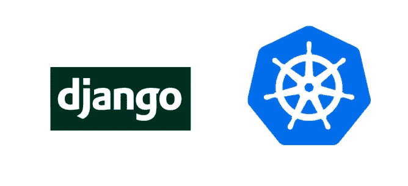
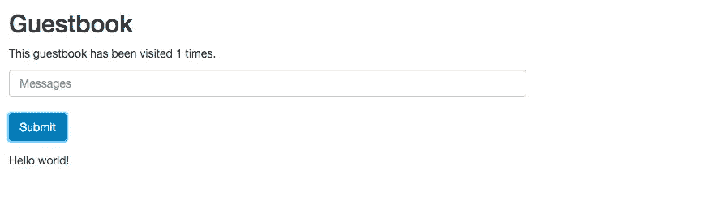
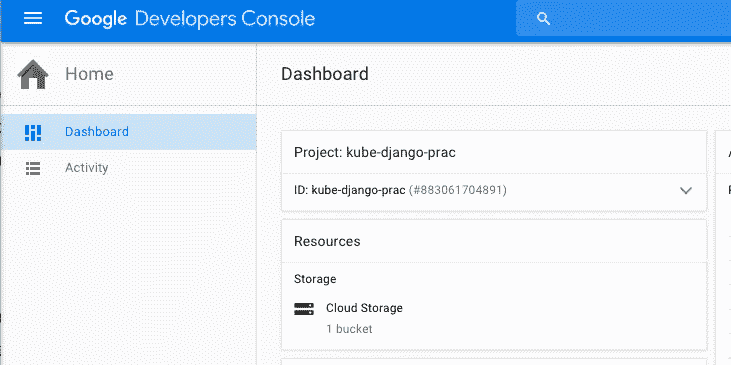

# 将 Django、Postgres、Redis 集装箱部署到 Kubernetes

> 原文：<https://medium.com/google-cloud/deploying-django-postgres-redis-containers-to-kubernetes-9ee28e7a146?source=collection_archive---------0----------------------->



Django 是最受欢迎的开源 web 框架之一，可能没有哪个 Django 用户比 Instagram 更引人注目了，insta gram 在他们的[博客帖子中深入介绍了他们如何设置 Django 堆栈的细节。](http://instagram-engineering.tumblr.com/post/13649370142/what-powers-instagram-hundreds-of-instances)虽然他们使用了多种技术，但最突出的部分是 Django、PostgreSQL 和 Redis。这一系列博客文章将详细介绍如何在 [Kubernetes](http://kubernetes.io/) 上部署整个堆栈，尽管第一篇文章将只关注 Django 部分。

这篇博文基于我在 Django 旧金山会议上的一次演讲。你可以看看这个[滑梯](https://speakerdeck.com/waprin/deploying-django-on-kubernetes)或者[看讲座](https://www.youtube.com/watch?v=HKKUgWuIZro)。

# 先决条件

这将是一个由多个部分组成的教程，假设您已经对 Django 有所了解，并且已经将它连接到数据库和缓存。如果你以前没有用过 Django，我首先推荐你阅读它的优秀教程[。](https://docs.djangoproject.com/en/1.9/intro/tutorial01/)

对容器有一些了解也是有帮助的，特别是 [Docker](https://www.docker.com/) ，你需要首先安装它。如果你感到困惑，请参考 Docker 文档。Docker 只在 Linux 上运行，但你可以通过运行 Linux 虚拟机在 Mac 或 Windows 上使用它。您使用 Docker Machine 与 Linux 机器进行交互，Docker Machine 是标准 Docker 工具包的一部分。

本教程的所有代码可以在以下位置找到:

[https://github.com/waprin/kubernetes_django_postgres_redis](https://github.com/waprin/kubernetes_django_postgres_redis)

这个 repo 是我目前在容器引擎上的全栈 Django/Postgres/Redis 的最佳尝试，但对于第一篇博客文章，我们将专注于设置容器引擎(Google Cloud 上的 Kubernetes)并在其中部署 Django。我们现在跳过 Redis 和 Postgres，只使用内存缓存 SQLite。如果您想跳过本课，请阅读 repo 中的整个 README.md，以获得关于部署整个项目的简单说明。

如果您有任何问题，请使用 [Github 问题跟踪器](https://github.com/waprin/kubernetes_django_postgres_redis/issues)。如果您有任何改进，请提交一个拉取请求。你也可以在[推特](https://twitter.com/waprin_io)上烦我。

# Kubernetes 简介

传统上，您可能会将 Django 部署到某种虚拟机实例中。缺点是，如果您想在同一台机器上安装其他应用程序，可能会出现库冲突。不拍摄机器映像也很难再现应用程序状态，因为机器映像往往不可移植且启动缓慢。

容器，最常使用的是 [Docker](https://www.docker.com/) 格式，是产生不可变的、快速启动的、与其他应用程序隔离的应用程序映像的好方法。但是当您想要将一组容器部署到一个集群时，您会面临一系列挑战。

*   如何在机器上安排一个容器？
*   一个容器如何与另一个容器对话，即使它在不同的机器上？
*   我在哪里存储我的数据和秘密？
*   我如何手动和自动缩放它？
*   我如何确保我的容器保持健康，并在出现故障时被替换？
*   我如何安全地部署新容器并回滚坏容器？
*   我如何处理名称空间和授权？

Kubernetes 是由 Google 发起的一个完全开源的项目，旨在帮助解决这些问题。它提供了一个容器调度器和大量的特性，为在虚拟机或裸机集群上构建基于容器的平台提供了工具。

Google Cloud 提供了一个名为 Container Engine 的产品，它提供了一个完全托管的 Kubernetes，因此您永远不必管理自己的 Kubernetes 集群。如果你喜欢自己处理所有的操作，你可以在谷歌计算引擎、亚马逊 EC2、其他云 VPS 提供商或者你自己的硬件上运行 Kubernetes。您甚至可以使用 vagger 在本地运行单节点集群。

确保 Kubernetes 在各种平台上顺利运行是一项巨大的社区工作。幸运的是，Kubernetes 有一个充满活力的社区，并且一直在寻找新的贡献者来帮助改进它。

# Kubernetes 的核心概念

在开始部署 Django 之前，最好回顾一下 Kubernetes 的一些核心概念。

*   **节点** —节点是运行组成集群的 Docker 容器的 Linux 机器。通常这些将是云 VPS 实例，尽管对于那些在本地运行 Kubernetes 的，它们可能是实际的机器。
*   **Pods** —这是编排的基本单位。一个舱有一个或多个容器在里面运行。一个Pod 可以有任意数量的标签，服务和复制控制器使用这些标签来匹配 Pod。
*   **复制控制器** —复制控制器根据提供的标签控制给定Pod 的数量。您可能正好需要 1 个或 10 个给定的 Pod，复制控制器将监控您的**Pod，并在出现故障时启动新的 Pod。您可以手动或自动放大或缩小这些。**
*   ****服务** —服务是一个 Pod 如何与另一个 Pod 对话，即使它们在不同的节点上。一项服务在 Kubernetes 创建的虚拟专用网络(10.0.0.0/8)上提供一个 IP，该 IP 将循环到与给定的**标签匹配的不同 **Pods** 。**可以使用环境变量或推荐的 Kube-DNS 插件来发现服务的 IP。**

# **步骤 1:在本地运行应用程序**

**首先，您需要设置一个 Python 开发环境。按照这些说明在 [OS X](http://docs.python-guide.org/en/latest/starting/install/osx/) 、 [Linux](http://docs.python-guide.org/en/latest/starting/install/linux/) 或 [Windows](http://docs.python-guide.org/en/latest/starting/install/win/) 上进行设置。**

**我也是 [virtualenvwrappers](https://virtualenvwrapper.readthedocs.org/en/latest/) 的忠实粉丝，用一些漂亮的别名来创建一个 virtualenv。**

```
$ mkvirtualenv guestbook
$ git clone [https://github.com/waprin/kubernetes_django_postgres_redis](https://github.com/waprin/kubernetes_django_postgres_redis)
$ cd guestbook
$ pip install -r requirements.txt
```

**Django 应用程序已经配置为接受一个环境变量，该变量将指定我们是否要连接到一个名为 NODB 的真实数据库和缓存。在后面的帖子中，我们将禁用 NODB，并与 Postgers 和 Redis 交谈，但现在，让我们保持简单。**

```
$ export NODB=1
```

**现在我们可以使用 Django 开发服务器来看看这个应用在本地工作站上的样子**

```
$ python manage.py runserver
```

**我们可以查看该应用程序，并在您的 web 浏览器中点击链接，发表一些留言簿帖子:**

```
[http://locahost:8000](http://locahost:8000)
```

**您应该看到:**

****

**如果您看到关于缺少表或无法连接到数据库的错误，您可能没有将 NODB=1 正确导出到您的环境中。**

# **步骤 2:创建容器**

**要将我们的应用程序部署到 Kubernetes，第一步是制作一个 Docker 映像进行部署。**

**我们有一个典型的 Django 应用程序，它由一个包含项目目录的根目录和项目中每个应用程序的目录组成。**

**我们需要一个服务器来服务我们的 Django 应用程序，不建议将由“python manage.py runserver”创建的本地开发服务器用于生产。我们可以使用任何可以通过 WSGI 与 Django 对话的服务器，包括 Apache，但是在这种情况下，我们将使用 Gunicorn，它是服务 Django 应用程序的流行选择。**

**从 Ubuntu 这样的简单 Linux 发行版开始，我们需要使用 apt-get 安装几个 Python 依赖项和几个 Python 依赖项，比如 pip。**

**对于初始设置，我的 docker 文件扩展了一个基本映像来完成这个任务。**

```
***#*** [***https://github.com/GoogleCloudPlatform/python-docker***](https://github.com/GoogleCloudPlatform/python-docker)**FROM** gcr.io**/**google_appengine**/**python
```

**尽管名字如此，这个基本 Dockerfile 文件并不特定于 App Engine。你可以点击链接查看到底安装了什么。**

**我们还需要安装我们的应用程序需要的任何依赖项，最简单的方法是在我们的容器中实际创建一个 virtualenv，并运行一个“pip install ”,作为 Docker 构建步骤的一部分。**

```
***# Create a virtualenv for the application dependencies.
# If you want to use Python 3, add the -p python3.4 flag.* RUN** virtualenv **/**env

***# Set virtualenv environment variables. This is equivalent to running
# source /env/bin/activate. This ensures the application is executed within
# the context of the virtualenv and will have access to its dependencies.* ENV** VIRTUAL_ENV **/**env
**ENV** PATH **/**env**/**bin:$PATH

***# Install dependencies.* ADD** requirements.txt **/**app**/**requirements.txt
**RUN** pip install **-**r **/**app**/**requirements.txt
```

**您会注意到，由于我们部署的应用程序没有数据库，我们启用了 NODB 环境变量。**

```
**ENV** NODB 1
```

**最后，我们添加代码并启动 Gunicorn:**

```
**CMD** export DJANGO_PASSWORD=$(cat **/**etc**/**secrets**/**djangouserpw); gunicorn **-**b :$PORT mysite.wsgi
```

**现在您可以忽略这些秘密，因为这是为了向数据库进行身份验证，设置 NODB 标志将避免这种需要。**

**要构建映像，您需要进行 docker 构建。在 OS X，我首先确保我创建了一个 VirtualBox 机器:**

```
$ docker-machine **create --***driver virtualbox default*
```

**然后我启动它，并确保创建它的环境变量已经初始化:**

```
$ docker-machine start dev
$ eval $(docker-machine env dev)
```

**最后，我构建了我的图像，并对其进行了适当的标记**

```
$ docker build -t waprin/my-guestbook-app .
```

**然后，我可以在本地运行我的映像:**

```
$ docker run -p 8080:8080 waprin/my-guestbook-app
```

**我通过运行以下命令获得 Docker 主机的 IP 地址:**

```
$ docker-machine ip
```

**然后，通过访问该 IP，我可以看到我的应用程序**

```
[http://192.168.99.100](http://192.168.99.100:):8080
```

# **步骤 3:创建 Kubernetes 集群**

**对于本教程，我们将使用 Google 的托管 Kubernetes 服务，称为容器引擎。或者，你可以自己在谷歌计算引擎或其他云提供商如亚马逊网络服务上运行 Kubernetes。容器引擎的优点是 Google 为您管理您的 Kubernetes 主服务器，大大简化了 Kubernetes 集群的操作。**

**首先，你需要创建一个谷歌云账户，并使用[云控制台](https://console.developers.google.com)创建一个新项目。如果你是谷歌云的新手，你可以注册 3 个月 300 美元的免费试用。一旦您有了一个帐户，创建一个新的项目并记下项目 ID，它有时但不总是与您给项目起的名字相同。**

****

**这里 kube-django-prac 是项目的名称，也是项目 ID**

**Container Engine 将为您创建 Google Compute Engine 实例，您将为这些实例的使用付费**

**虽然你可以从[云控制台](https://console.developers.google.com)创建一个容器引擎集群，但我更喜欢你使用 [gcloud 命令行工具](https://cloud.google.com/sdk/gcloud/)。**

```
gcloud components update # make sure it’s up to date
gcloud config set project <project-id># Create the cluster with 2 nodes
gcloud container clusters create guestbook --scopes "https://www.googleapis.com/auth/userinfo.email","cloud-platform" --num-nodes 2 # Configure kubectl with the right context
gcloud container clusters get-credentials guestbook
```

**这里我们创建了两个节点。请注意，对于 Container Engine，您将为您正在创建的实例付费(但对于最多 5 个节点，没有额外费用)。**

**完成本教程后，为了避免重复收费，请删除实例。**

```
# Only run this when you're done the tutorial
gcloud container clusters delete guestbook
```

**与 Kubernetes 集群交互的主要 CLI 将是 kubectl。一开始，唯一存在的服务应该是 Kubernetes，你不应该有任何 pod。**

```
$ kubectl get services$ kubectl get pods
```

# **步骤 4:将我们的应用程序部署到 Kubernetes**

**现在我们有了一个应用程序容器和一个 Kubernetes 集群。**

**最后，回到 repo 的根目录，将 cd 放入“kubernetes_config ”,其中包含所有不同的 kubernetes 配置。现在，我们将关注 frontend.yaml，它代表我们的 Django 控制器。**

**我们正在创建一个复制控制器，它将创建许多运行我们之前创建的映像的 pod。我们指定启动 3 个副本，这意味着如果任何容器死亡，我们的复制控制器将用一个新的容器替换它。**

```
**apiVersion:** v1
**kind:** ReplicationController
**metadata:
  name:** frontend
  **labels:
    name:** frontend
**spec:
  replicas:** 3
  **template:
    metadata:
      labels:
        name:** frontend
    **spec:
      containers:** - **name:** guestbook
        *# Replace  with your project ID or use `make template`* **image:** waprin/my-guestbook-app 

        *# This setting makes nodes pull the docker image every time before
        # starting the pod. This is useful when debugging, but should be turned
        # off in production.* **imagePullPolicy:** Always
        **ports:** - **containerPort:** 8080
```

**我们要做的第一个改变是使用我们之前创建的图像。在回购协议中，我使用:gcr.io/$GCLOUD_PROJECT/guestbook,，因为我将我的图像推送到谷歌容器注册表，它类似于公共 Docker 注册表，但在你的谷歌项目中是私有的，以防你想对你的图像保密。无论如何，让我们用我之前创建的图像替换它:**

```
# replace with the image you tagged earlier
$ docker push waprin/my-guestbook-app
```

**然后在 frontend.yaml**

```
# Replace with your image id in frontend.yaml
image: waprin/my-guestbook-app
```

**创建复制控制器后，我们可以自动或手动扩展它。自动缩放是一个测试特性，我将在本系列的后续文章中演示，但手动缩放将非常简单:**

```
$ kubectl scale rc frontend --replicas=3
```

**接下来，您会注意到我们正在创建一项服务。由于我们希望向外部流量公开我们的 web 应用程序(与我们的数据库不同，我们的缓存服务将在后面介绍)，我们使用 LoadBalancer 类型为 HTTP 负载平衡器提供外部 IP。这假设你的云提供商支持外部负载平衡器，谷歌和亚马逊都支持。**

```
**apiVersion:** v1
**kind:** Service
**metadata:
  name:** frontend
  **labels:
    name:** frontend
**spec:
  type:** LoadBalancer
  **ports:** - **port:** 80
    **targetPort:** 8080
  **selector:
    name:** frontend
```

**将 image 属性替换为推送的 Docker 映像后，让我们创建服务和复制控制器:**

```
$ kubectl create -f kubernetes_configs/frontend.yaml
```

**负载平衡器和外部 IP 可能需要几分钟的时间来配置。完成后，当你跑的时候**

```
$ kubectl get services
```

**您应该会看到类似这样的内容:**

```
$ kubectl get servicesNAME CLUSTER_IP EXTERNAL_IP PORT(S) SELECTOR AGEfrontend 10.67.240.157 104.197.69.33 80/TCP name=frontend 1mkubernetes 10.67.240.1 <none> 443/TCP <none> 10m
```

**在您的 web 浏览器中访问外部 IP 应该访问您部署在云中的应用程序！**

**然而，由于我们的应用程序控制器的每个实例都有自己版本的 SQLite 数据库和内存缓存，所以直到我们在下一篇文章中添加 Postgres 和 Redis，应用程序才会正常运行。**

# **包扎**

**请注意，虽然我为谷歌云工作，但这不是谷歌的官方产品或公司声明。**

**如果你在学习本教程的过程中有任何问题，请联系我的 Github 追踪器或 T2 推特。下一篇文章将会通过 Postgres 和 Redis，希望你能跟上！**