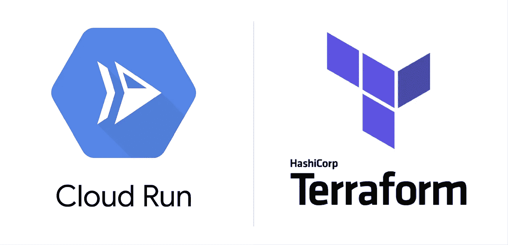
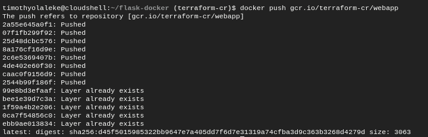
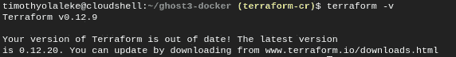
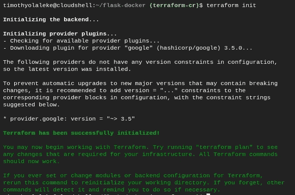
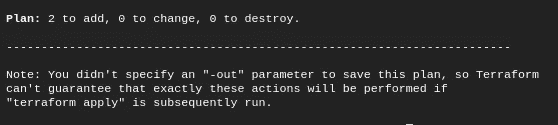
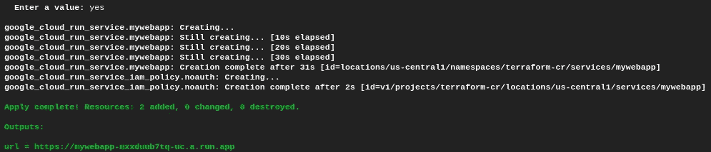

# 使用 Terraform 在云上运行无服务器部署

> 原文：<https://medium.com/google-cloud/deploying-docker-images-to-cloud-run-using-terraform-ee8ae4ecb72e?source=collection_archive---------0----------------------->



> 在本文中，我们将把一个无服务器的 Flask web 应用程序部署到 Cloud Run，方法是将它的 [Docker 映像](https://github.com/Timtech4u/ghost3-docker)构建到 Container Registry 中，并使用 Terraform 将我们的部署配置为代码。

> [Terraform](https://www.terraform.io/) 是一个基础设施代码工具，用于跨各种云提供商安全高效地构建、更改和版本控制基础设施。
> 
> [Cloud Run](https://cloud.google.com/run/) 是一个托管计算平台，使您能够运行可自动扩展的无状态无服务器容器。
> 
> [容器注册中心](https://cloud.google.com/container-registry)是一个私有的容器映像注册中心，运行在 Google Cloud 上。
> 
> [Flask](https://github.com/pallets/flask) 是一个用 Python 编写的微型 web 框架。

# 先决条件

*   创建一个[谷歌云平台(GCP)项目](https://console.cloud.google.com/project)，或者使用一个现有的项目。
*   设置[云 SDK](https://cloud.google.com/sdk/) ，或者使用[云外壳](https://cloud.google.com/shell/)。
*   启用[云运行 API](https://console.developers.google.com/apis/api/run.googleapis.com/overview) 。
*   启用[容器注册 API](https://console.developers.google.com/apis/api/containerregistry.googleapis.com/overview) 。
*   克隆[样本代码](https://github.com/Timtech4u/flask-docker)或者用 *Dockerfile* 设置你自己的代码。

对于本指南，我将坚持使用默认启用了 Terraform 的 Cloud Shell。

如果您在本地 PC 上使用 Cloud SDK，您需要一个服务帐户来使用 Terraform，请在此处创建一个。

*注意****terra form-Cr****是我的 GCP 项目 ID，你应该用你的替换它。*

# 将 Docker 图像推送到容器注册表

我们需要构建 Docker 映像并将其推送到项目的容器注册表中，以便 Terraform 可以访问它。

您可以将源代码克隆到 Cloud Shell 中，并在其目录中执行以下命令。

```
$ docker build -t gcr.io/terraform-cr/webapp .
$ docker push gcr.io/terraform-cr/webapp
```



输出

如果这对你不起作用，请查看官方文档中的其他步骤[这里](https://cloud.google.com/container-registry/docs/pushing-and-pulling)。

云运行将仅检索托管在容器注册表中的容器，而不从其他来源检索。

如果你的 Docker 图像在 [Docker Hub](http://hub.docker.com/) 上，我制作了一个简短的视频，讲述了如何将 Docker 图像推送到容器注册表。请订阅😉

将 Docker 映像部署到 Google 云运行

# 使用 Terraform 部署到云运行

云壳上启用了 Terraform，可以通过执行 ***terraform -v*** 命令进行验证。安装的 Terraform 版本是 v0.12.9。



地形版本

如果你想了解这一部分的更多细节，请查阅[云运行-地形资源文档](https://www.terraform.io/docs/providers/google/r/cloud_run_service.html)。

下一步是创建一个 **main.tf** 文件，这是一个 Terraform 配置文件，你可以在这里找到我的:

```
# Filename: main.tf# Configure GCP project
provider "google" {
  project = "terraform-cr"
}# Deploy image to Cloud Run
resource "google_cloud_run_service" "mywebapp" {
  name     = "mywebapp"
  location = "us-central1"
  template {
    spec {
      containers {
        image = "gcr.io/terraform-cr/webapp"
      }
    }
  }
  traffic {
    percent         = 100
    latest_revision = true
  }
}# Create public access
data "google_iam_policy" "noauth" {
  binding {
    role = "roles/run.invoker"
    members = [
      "allUsers",
    ]
  }
}# Enable public access on Cloud Run service
resource "google_cloud_run_service_iam_policy" "noauth" {
  location    = google_cloud_run_service.mywebapp.location
  project     = google_cloud_run_service.mywebapp.project
  service     = google_cloud_run_service.mywebapp.name
  policy_data = data.google_iam_policy.noauth.policy_data
}# Return service URL
output "url" {
  value = "${google_cloud_run_service.mywebapp.status[0].url}"
}
```

现在让我们在谷歌云壳上初始化 Terraform。

```
$ terraform init
```



输出

然后，让我们在 **main.tf** 文件中规划代码，看看基础设施是什么样子的:

```
$ terraform plan
```



截断输出

最后，我们可以申请执行，请确保输入'**是**'进行批准。

```
$ terraform apply
```



截断输出

```
Outputs:url = [https://mywebapp-mxxduub7tq-uc.a.run.app](https://mywebapp-mxxduub7tq-uc.a.run.app)
```

# 后续步骤

Terraform 允许您删除使用的每个资源(包括 GCP 项目)，为此，执行以下命令，确保输入' **yes** 进行批准。

```
$ terraform destroy
```

到目前为止，我们已经能够使用 Terraform 将我们的部署作为代码提供给云运行。这可以帮助您更快地部署应用程序。

如果你想在 Google Cloud 上自动化更多的工作流程，下面的资源会派上用场。

*   [Terraform Google 云提供商文档](https://www.terraform.io/docs/providers/google/index.html)
*   [谷歌云构建文档](https://cloud.google.com/cloud-build/docs/)
*   我博客上的自动化技巧。