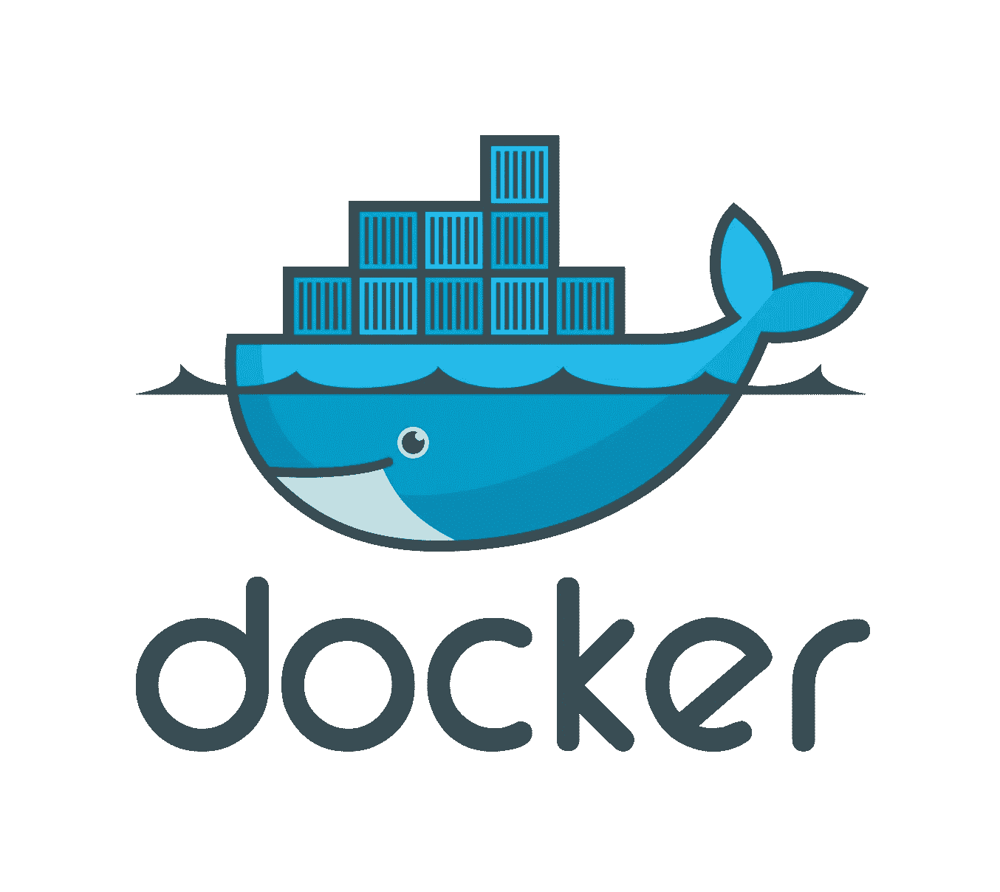

# 使用 Kubernetes 引擎将 Docker 图像部署到 Google Cloud

> 原文：<https://medium.com/google-cloud/deploying-docker-images-to-google-cloud-using-kubernetes-engine-637af009e594?source=collection_archive---------0----------------------->

这篇文章假设您已经有了一个工作的 docker 映像，可以在本地机器上构建和运行，显然还有一个 Google Cloud 帐户，其中激活了所有必要的 API，并且在您的机器上安装了 Google Cloud SDK。如果一切正常，你就可以走了！



我做的第一件事是确保我的代码上有一个最新的 GitHub repo，我通常用以下格式保存它:

```
- .
- app
-- <APP CODE>
-- main.py
- Dockerfile
```

我在 Github 中建立了一个新的存储库，然后在执行最终的`git push origin master`之前，使用`git add .`和`git commit -m "Some Message"`确保存储库是最新的

现在，让我们开始构建 Docker 映像，并将其推送到 Google Cloud 的容器注册表中。首先发布:

```
docker build -t myimage .
```

请随意在您的本地机器上测试:

```
docker run -d --name mycontainer -p 80:80 myimage
```

一旦使用完`docker ps`、`docker kill pid`和`docker rm pid`的组合，就可以终止/删除该进程。

在推送到 Google Cloud 之前，我们必须快速地用 Google Cloud 需要的必要信息来标记我们的图像。确保在 Google Cloud 仪表板中用正确的项目 ID 替换了`<PROJECT NAME>`。问题:

```
docker tag myimage gcr.io/<PROJECT NAME>/myimage:v1
```

我们现在可以使用 Google Cloud SDK 安装的`gcloud`命令将它推送到 Google Cloud 的容器注册表中。注册表类似于 Docker Cloud，但与 Google 的控制台和 Kubernetes 引擎结合得很好。推动它:

```
gcloud docker -- push gcr.io/<PROJECT NAME>/myimage:v1
```

现在，如果你打开谷歌云控制台，转到容器注册表，你应该会看到你的新 Docker 图像。干得好！

我们现在需要让我们的形象在 Kubernetes 引擎服务。Kubernetes Engine 是 Google 托管的 Kubernetes 版本，它使您能够创建一个“节点”集群来服务您的容器。首先，按照 Kubernetes 引擎仪表板中的提示创建一个集群。然后转到“工作负载”,点击“部署”按钮。

确保您单击了“选择现有的 Google 容器注册表映像”按钮，然后选择您的存储库和标签(最初将是 v1)。点击“完成”，给它一个有用的名字，然后点击“部署”。

在右边的面板中，您会看到使用负载平衡器将您的映像“暴露”到互联网的选项。去做这个吧。然后，您将获得一个面向互联网的端点，您可以在其上测试您的部署。恭喜您，您刚刚使用 Kubernetes 引擎将 docker 映像部署到 Google Cloud！