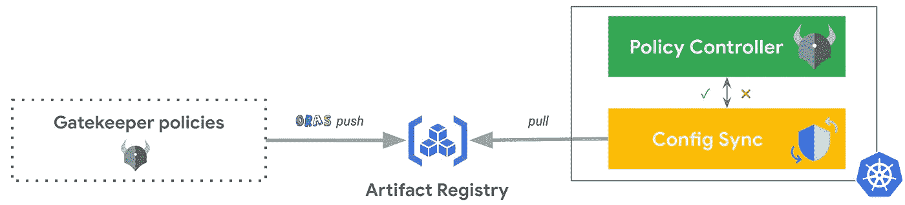

# 以 OCI 映像、GitOps 方式部署网关守护设备策略

> 原文：<https://medium.com/google-cloud/deploying-gatekeeper-policies-as-oci-artifacts-the-gitops-way-e1233429ae2?source=collection_archive---------4----------------------->

*2023 年 2 月 10 日更新—* [*本帖现精选于 ORAS 官方博客*](https://oras.land/blog/gatekeeper-policies-as-oci-image/) *！*🎉

*2023 年 1 月 16 日更新，在谷歌云控制台中使用新的配置同步用户界面，列出同步的资源及其状态。*

*2023 年 1 月 10 日更新，有一些* `*gator test*` *的例子。自从* [*版本 3.11.0*](https://github.com/open-policy-agent/gatekeeper/releases/tag/v3.11.0) *以来，我们现在可以直接作为 OCI 映像测试网守策略，太棒了！*

从 [Anthos 配置管理 1.13.0](https://cloud.google.com/anthos-config-management/docs/release-notes#September_15_2022) 开始，除了同步存储在 Git 仓库中的文件，现在[可以用 GitOps 的方式同步 OCI 图像和舵图，配置同步](https://cloud.google.com/blog/products/containers-kubernetes/gitops-with-oci-artifacts-and-config-sync)。

在这篇博客中，让我们看看如何将[开放策略代理(OPA)网关守护](https://open-policy-agent.github.io/gatekeeper/website/docs/)策略部署为 OCI 映像，这要归功于`[oras](https://oras.land/)`、Google 工件注册和配置同步。

以下是你将通过这篇博客实现的目标:

*   创建网关守护设备策略
*   用本地文件测试此策略
*   创建工件注册库
*   将把关者策略(`K8sAllowedRepos`)作为 OCI 映像推送到工件注册库
*   使用此远程 OCI 映像测试此策略
*   使用配置同步和策略控制器设置 GKE 集群
*   使用配置同步将网关守护设备策略部署为 OCI 映像
*   在集群中测试该策略
*   在结束本博客时，寻找机会创建第二个把关者策略(`RSyncAllowedRepos`)；)

*为了在这篇博客中说明这一点，我们将利用* [*策略控制器*](https://cloud.google.com/anthos-config-management/docs/concepts/policy-controller) *，但是如果您自己* [*安装 OSS 网关守护设备*](https://open-policy-agent.github.io/gatekeeper/website/docs/install) *，也可以使用相同的方法。*



# 设置环境

以下是你在这篇博客中需要的工具:

*   `[gcloud](https://cloud.google.com/sdk/docs/install)`
*   `[oras](https://oras.land/cli/)`
*   `[kubectl](https://kubernetes.io/docs/tasks/tools/#kubectl)`
*   `[gator](https://open-policy-agent.github.io/gatekeeper/website/docs/gator/)`

初始化本博客中使用的公共变量:

```
PROJECT_ID=FIXME-WITH-YOUR-PROJECT-ID
REGION=us-east4
ZONE=us-east4-a
```

为了避免在整个教程中重复命令中的`--project`，让我们设置当前项目:

```
gcloud config set project ${PROJECT_ID}
```

# 创建网关守护设备策略

我们创建一个由一个`Constraint`和一个`ConstraintTemplate`组成的网关守护设备策略。您可以用自己的策略列表轻松复制这个场景。

```
mkdir policies
```

定义一个`ConstraintTemplate`，它可以确保容器图像以指定列表中的一个字符串开始:

```
cat <<EOF> policies/k8sallowedrepos.yaml
apiVersion: templates.gatekeeper.sh/v1
kind: ConstraintTemplate
metadata:
  annotations:
    description: Requires container images to begin with a string from the specified list.
  name: k8sallowedrepos
spec:
  crd:
    spec:
      names:
        kind: K8sAllowedRepos
      validation:
        openAPIV3Schema:
          type: object
          properties:
            repos:
              description: The list of prefixes a container image is allowed to have.
              type: array
              items:
                type: string
  targets:
  - target: admission.k8s.gatekeeper.sh
    rego: |
      package k8sallowedrepos
      violation[{"msg": msg}] {
        container := input.review.object.spec.containers[_]
        satisfied := [good | repo = input.parameters.repos[_] ; good = startswith(container.image, repo)]
        not any(satisfied)
        msg := sprintf("container <%v> has an invalid image repo <%v>, allowed repos are %v", [container.name, container.image, input.parameters.repos])
      }
      violation[{"msg": msg}] {
        container := input.review.object.spec.initContainers[_]
        satisfied := [good | repo = input.parameters.repos[_] ; good = startswith(container.image, repo)]
        not any(satisfied)
        msg := sprintf("initContainer <%v> has an invalid image repo <%v>, allowed repos are %v", [container.name, container.image, input.parameters.repos])
      }
      violation[{"msg": msg}] {
        container := input.review.object.spec.ephemeralContainers[_]
        satisfied := [good | repo = input.parameters.repos[_] ; good = startswith(container.image, repo)]
        not any(satisfied)
        msg := sprintf("ephemeralContainer <%v> has an invalid image repo <%v>, allowed repos are %v", [container.name, container.image, input.parameters.repos])
      }
EOF
```

为`Pods`定义一个关联的`Constraint`，该`Pods`需要其容器映像来自允许的注册中心:

```
cat <<EOF> policies/pod-allowed-container-registries.yaml
apiVersion: constraints.gatekeeper.sh/v1beta1
kind: K8sAllowedRepos
metadata:
  name: pod-allowed-container-registries
spec:
  enforcementAction: deny
  match:
    kinds:
    - apiGroups:
      - ""
      kinds:
      - Pod
  parameters:
    repos:
    - gcr.io/config-management-release/
    - gcr.io/gkeconnect/
    - gke.gcr.io/
    - ${REGION}-docker.pkg.dev/${PROJECT_ID}/
EOF
```

*注意:我们允许系统容器图像先用 3 个* `*repos*` *。对于最后一个例子，假设您在这个* `*${REGION}-docker.pkg.dev/${PROJECT_ID}/*` *工件注册存储库中拥有自己的容器映像。*

# 用本地文件测试此策略

让我们创建一个简单的`Pod`来测试这个策略:

```
cat <<EOF> nginx-pod.yaml
apiVersion: v1
kind: Pod
metadata:
  name: nginx
spec:
  containers:
  - name: nginx
    image: nginx:latest
    ports:
    - containerPort: 80
EOF
```

现在，让我们使用`gator` CLI 针对该策略在本地测试这个`Pod`。不用任何 Kubernetes 集群就可以非常方便地测试策略！

```
gator test -f nginx-pod.yaml -f policies/
```

输出类似于:

```
["pod-allowed-container-registries"] Message: "container <nginx> has an invalid image repo <nginx:latest>, allowed repos are...
```

# 设置工件注册库

创建工件注册库:

```
gcloud services enable artifactregistry.googleapis.com
ARTIFACT_REGISTRY_REPO_NAME=oci-artifacts
gcloud artifacts repositories create ${ARTIFACT_REGISTRY_REPO_NAME} \
    --location ${REGION} \
    --repository-format docker
```

# 将网关守护设备策略作为 OCI 映像推送到工件注册中心

登录到工件注册表:

```
gcloud auth configure-docker ${REGION}-docker.pkg.dev
```

使用`[oras](https://oras.land/)`在工件注册表中推送网关守护设备策略:

```
oras push \
    ${REGION}-docker.pkg.dev/${PROJECT_ID}/${ARTIFACT_REGISTRY_REPO_NAME}/my-policies:1.0.0 \
    policies/
```

请注意，您的 OCI 图像已经上传到 Google 工件注册库中:

```
gcloud artifacts docker images list ${REGION}-docker.pkg.dev/${PROJECT_ID}/${ARTIFACT_REGISTRY_REPO_NAME}
```

# 使用此远程 OCI 映像测试此策略

现在，让我们使用`gator` CLI 在本地测试之前根据该策略创建的`Pod`作为远程 OCI 映像。非常方便地在不同的地方共享和评估您的策略(例如，在本地，在持续集成过程中，等等)。)!

```
gator test -f nginx-pod.yaml -i ${REGION}-docker.pkg.dev/${PROJECT_ID}/${ARTIFACT_REGISTRY_REPO_NAME}/my-policies:1.0.0
```

输出类似于:

```
["pod-allowed-container-registries"] Message: "container <nginx> has an invalid image repo <nginx:latest>, allowed repos are...
```

# 使用配置同步和策略控制器设置 GKE 集群

创建在机群中注册的 GKE 集群以启用配置管理:

```
gcloud services enable container.googleapis.com
CLUSTER_NAME=gatkeeper-oci-cluster
gcloud container clusters create ${CLUSTER_NAME} \
    --workload-pool=${PROJECT_ID}.svc.id.goog \
    --zone ${ZONE}

gcloud services enable gkehub.googleapis.com
gcloud container fleet memberships register ${CLUSTER_NAME} \
    --gke-cluster ${ZONE}/${CLUSTER_NAME} \
    --enable-workload-identity

gcloud beta container fleet config-management enable
```

在此 GKE 群集中安装配置同步和策略控制器:

```
cat <<EOF > acm-config.yaml
applySpecVersion: 1
spec:
  configSync:
    enabled: true
  policyController:
    enabled: true
    templateLibraryInstalled: false
EOF

gcloud beta container fleet config-management apply \
    --membership ${CLUSTER_NAME} \
    --config acm-config.yaml
```

*注意:在这个场景中，我们没有安装* [*默认的约束模板库*](https://cloud.google.com/anthos-config-management/docs/latest/reference/constraint-template-library) *，因为我们想要部署我们自己的* `*ConstraintTemplate*` *。*

# 使用配置同步将网关守护设备策略部署为 OCI 映像

创建一个专用的 Google 云服务帐户，对工件注册库进行细粒度的访问(`roles/artifactregistry.reader`):

```
OCI_PULLER_GSA_NAME=configsync-oci-sa
OCI_PULLER_GSA_ID=${OCI_PULLER_GSA_NAME}@${PROJECT_ID}.iam.gserviceaccount.com
gcloud iam service-accounts create ${OCI_PULLER_GSA_NAME} \
    --display-name=${OCI_PULLER_GSA_NAME}
gcloud artifacts repositories add-iam-policy-binding ${ARTIFACT_REGISTRY_REPO_NAME} \
    --location $REGION \
    --member "serviceAccount:${OCI_PULLER_GSA_ID}" \
    --role roles/artifactregistry.reader
```

允许配置同步同步特定`RootSync`的资源:

```
ROOT_SYNC_NAME=root-sync-policies
gcloud iam service-accounts add-iam-policy-binding \
   --role roles/iam.workloadIdentityUser \
   --member "serviceAccount:${PROJECT_ID}.svc.id.goog[config-management-system/root-reconciler-${ROOT_SYNC_NAME}]" \
   ${OCI_PULLER_GSA_ID}
```

设置配置同步以从工件注册表部署此 OCI 映像:

```
cat << EOF | kubectl apply -f -
apiVersion: configsync.gke.io/v1beta1
kind: RootSync
metadata:
  name: ${ROOT_SYNC_NAME}
  namespace: config-management-system
spec:
  sourceFormat: unstructured
  sourceType: oci
  oci:
    image: ${REGION}-docker.pkg.dev/${PROJECT_ID}/${ARTIFACT_REGISTRY_REPO_NAME}/my-policies:1.0.0
    dir: .
    auth: gcpserviceaccount
    gcpServiceAccountEmail: ${OCI_PULLER_GSA_ID}
EOF
```

通过运行命令`gcloud alpha anthos config sync resources list`或从云控制台导航到 ***Kubernetes 引擎>配置&策略>配置*** ，列出配置同步所同步的资源及其状态:


瞧啊。这就是以 GitOps 方式通过配置同步将网关守护设备策略部署为 OCI 映像的简单之处。

# 在集群中测试该策略

现在让我们尝试在 Kubernetes 集群中部署之前创建的`Pod`:

```
kubectl apply -f nginx-pod.yaml
```

输出类似于:

```
Error from server (Forbidden): error when creating "nginx-pod.yaml": admission webhook "validation.gatekeeper.sh" denied the request: [pod-allowed-container-registries] container <nginx> has an invalid image repo <nginx:latest>, allowed repos are...
```

# 结论

在本文中，多亏了`[oras](https://oras.land/)`，您能够将一个网关守护设备策略(`Constraint`和`ConstraintTemplate`)打包成一个 OCI 映像，并将其推送到 Google 工件注册表。最后，您看到了如何使用 Workload Identity 访问 Google Artifact Registry，将这个私有 OCI 映像与 Config Sync 的`RootSync`设置中的`spec.oci.auth: gcpserviceaccount`设置同步。

GitOps 的持续协调将在现在存储在 OCI 注册表中的期望状态和运行在 Kubernetes 中的实际状态之间进行协调。作为 OCI 映像的网关守护设备策略现在就像从 OCI 注册中心获取的 Kubernetes 集群的任何容器映像一样。这种来自 OCI 注册中心的持续协调(不与 Git 交互)在可伸缩性、性能和安全性方面有很多好处，因为您将能够跨您的集群配置对 OCI 映像的细粒度访问。

# 准备好接受另一项把关政策了吗？

实际上，让我们再一次根据我们刚刚得出的结论创建另一个网关守护设备策略:

> OCI 图像现在就像您的 Kubernetes 集群的任何容器图像一样，因为它们是从 OCI 注册表中提取的。

因此，让我们也为此创建一个网关守护设备策略，在这里我们可以确保由配置同步拉取的任何 OCI 映像仅仅来自我们自己的私有工件注册库。

定义一个`ConstraintTemplate`，它可以确保 OCI 图像以指定列表中的一个字符串开始:

```
cat <<EOF> policies/rsyncallowedrepos.yaml
apiVersion: templates.gatekeeper.sh/v1
kind: ConstraintTemplate
metadata:
  annotations:
    description: Requires OCI images to begin with a string from the specified list.
  name: rsyncallowedrepos
spec:
  crd:
    spec:
      names:
        kind: RSyncAllowedRepos
      validation:
        openAPIV3Schema:
          type: object
          properties:
            repos:
              description: The list of prefixes an OCI image is allowed to have.
              type: array
              items:
                type: string
  targets:
  - target: admission.k8s.gatekeeper.sh
    rego: |
      package rsyncallowedrepos
      violation[{"msg": msg}] {
        image := input.review.object.spec.oci.image
        satisfied := [good | repo = input.parameters.repos[_] ; good = startswith(image, repo)]
        not any(satisfied)
        msg := sprintf("<%v> named <%v> has an invalid image repo <%v>, allowed repos are %v", [input.review.kind.kind, input.review.object.metadata.name, image, input.parameters.repos])
      }
EOF
```

为`[RootSyncs](https://cloud.google.com/anthos-config-management/docs/reference/rootsync-reposync-fields)` [和](https://cloud.google.com/anthos-config-management/docs/reference/rootsync-reposync-fields) `[RepoSyncs](https://cloud.google.com/anthos-config-management/docs/reference/rootsync-reposync-fields)`定义一个关联的`Constraint`，它们需要从允许的注册中心获得它们的 OCI 映像:

```
cat <<EOF> policies/rsync-allowed-artifact-registries.yaml
apiVersion: constraints.gatekeeper.sh/v1beta1
kind: RSyncAllowedRepos
metadata:
  name: rsync-allowed-artifact-registries
spec:
  enforcementAction: deny
  match:
    kinds:
    - apiGroups:
      - configsync.gke.io
      kinds:
      - RootSync
      - RepoSync
  parameters:
    repos:
    - ${REGION}-docker.pkg.dev/${PROJECT_ID}/${ARTIFACT_REGISTRY_REPO_NAME}
EOF
```

我们不会部署也不会测试这些资源，但是您已经明白了这一点，我们只是增加了更多的治理和安全性。我们现在能够控制集装箱图像和作为 OCI 图像的 Kubernetes 清单的来源。很酷，不是吗？！

# 下一步是什么

*   [使用配置同步](https://cloud.google.com/blog/products/containers-kubernetes/gitops-with-oci-artifacts-and-config-sync)以 GitOps 方式部署 OCI 工件和舵图
*   [从神器注册表同步舵图](https://cloud.google.com/anthos-config-management/docs/how-to/sync-helm-charts-from-artifact-registry)
*   [从工件注册表同步 OCI 工件](https://cloud.google.com/anthos-config-management/docs/how-to/sync-oci-artifacts-from-artifact-registry)
*   [带有 Helm 的 CI/gitop、GitHub 操作、GitHub 容器注册和配置同步](/google-cloud/836913e74e79)
*   [带有 Helm 的 CI/gitop、GitHub 操作、Google 工件注册表和配置同步](/google-cloud/b48604191fda)

*原帖*[*Mathieu-Benoit . github . io*](https://mathieu-benoit.github.io/)*。*