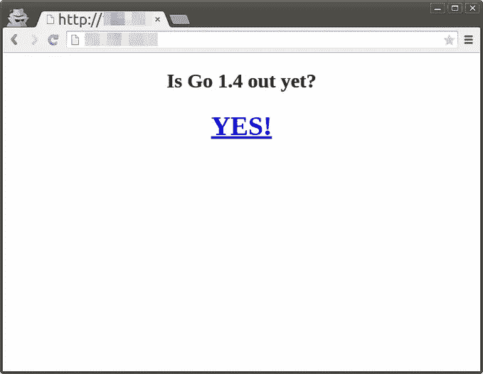
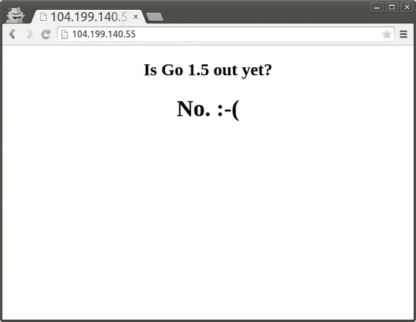

# 在容器引擎上部署带有 Kubernetes 的 Go 服务器

> 原文：<https://medium.com/google-cloud/deploying-go-servers-with-kubernetes-on-container-engine-3fee717a7e2a?source=collection_archive---------6----------------------->

> 注:Cross 发布在[我的博客](http://www.ianlewis.org/en/deploying-go-servers-kubernetes)上。

我试着在容器引擎上运行一个 Go 应用程序，但是
找不到我要找的东西。有一些关于如何使用 Go 和 Docker，以及如何使用 Kubernetes 的指南，但没有多少关于 Go 应用程序和容器引擎的。我还发现部署应用程序很容易，但大多数指南缺乏关于如何通过定期升级来维护应用程序的最佳实践的信息，所以我决定研究一下，并自己写一篇关于它的帖子。

请务必查看[容器引擎文档](https://cloud.google.com/container-engine/docs/)，以获取关于所用概念和命令的详细信息。

这篇文章是 Go 博客上[用
Docker](https://blog.golang.org/docker) 部署 Go 服务器文章的延续。请确保您完成了 Docker 映像的构建。

# 将 Docker 图像推送到 Google 容器注册表

你将需要 gcloud 工具，所以确保你已经安装了 [Google Cloud
SDK](https://cloud.google.com/sdk/#Quick_Start) 。接下来，你需要[在谷歌开发者
控制台](https://developers.google.com/console/help/#creatingdeletingprojects)上创建一个项目。记下项目 id。

使用正确的配置设置您的 gcloud 工具。用您的项目 id 替换
下面的 *<项目 id >* 。用您选择的区域替换 *<区域>* :

```
$ gcloud config set project <project-id>
$ gcloud config set compute/zone <zone>
```

一旦你完成了，你将需要使用 docker 标记
图片。

```
$ docker tag outyet gcr.io/<project-id>/outyet:v1
```

这将设置存储库，并用版本“v1”对其进行标记。接下来将
图像推送到注册表中。您可能会收到关于安装“预览版”
组件的警告。当被询问时，只需说“是”来安装它们。

```
$ gcloud preview docker push gcr.io/<project-id>/outyet:v1
```

# 库伯内特构型

我们将为我们的应用程序创建一个[复制控制器](https://github.com/GoogleCloudPlatform/kubernetes/blob/master/docs/replication-controller.md)和[服务](https://github.com/GoogleCloudPlatform/kubernetes/blob/master/docs/services.md)。

复制控制器配置我们的应用程序将如何在 Kubernetes 中运行和维护，该服务允许我们的容器作为一个逻辑服务/应用程序被访问。用下面的内容创建一个 *outyet-rc.yml* 文件。我们将使用新版本的 API:

```
kind: ReplicationController
apiVersion: v1
metadata:
name: outyet-v1
spec:
  replicas: 3
  selector:
    name: outyet
    version: “1”
  template:
  metadata:
    labels:
      name: outyet
      version: “1”
  spec:
    containers:
      — image: gcr.io/<project-id>/outyet:v1
        name: outyet
        ports:
          — containerPort: 8080
            hostPort: 8080
            protocol: TCP
```

接下来，我们将为我们的应用程序创建一个服务。用下面的内容创建一个“outyet-service.yml ”:

```
kind: Service
apiVersion: v1
metadata:
  name: outyet
  labels:
    name: outyet
spec:
  ports:
    — port: 80
      targetPort: 8080
      protocol: TCP
  selector:
    name: outyet
  type: LoadBalancer 
```

# 部署容器引擎集群

接下来，我们将部署我们的容器引擎集群。我们将再次使用 gcloud 工具。您可能会收到关于安装“alpha”组件的
警告。当被询问时，只需说“是”来安装它们。

```
$ gcloud alpha container clusters create outyet
$ gcloud config set container/cluster outyet
```

# 创建复制控制器

创建集群后，我们可以部署应用程序。首先，我们将创建复制控制器:

```
$ gcloud alpha container kubectl create -f outyet-rc.yml
```

豆荚需要几分钟才能出来。您可以使用以下命令查看 pod 是否准备好了
:

```
$ gcloud alpha container kubectl get pods
```

这些豆荚一开始会说它们的状态是“待定”,但当它们准备好时会变成
*运行*。

# 创建服务

使用以下命令创建服务。

```
$ gcloud alpha container kubectl create -f outyet-service.yml
```

创建服务后，通过查看该命令的
输出，我们可以看到它已经创建:

```
$ gcloud alpha container kubectl get services
```

该服务使用容器引擎的*负载平衡器*特性为我们的服务建立一个
网络负载平衡器。我们可以使用以下命令获取服务的外部 IP:

```
$ gcloud compute forwarding-rules list
```

这将显示我们服务的 IP 地址。记下 IP 地址。
最后，我们可以创建一个防火墙规则来允许访问我们的节点:

```
$ gcloud compute firewall-rules create outyet-http — allow tcp:80 — target-tags k8s-outyet-node
```

现在我们可以在 *http:// < IP 地址> /* 查看应用



# 升级应用程序

Go 1.4 已经推出，所以应用程序并不令人兴奋。让我们更新它，以便它
检查 Go 1.5。让我们覆盖 docker 文件的 CMD，使它看起来像这样:

```
FROM golang:onbuild
CMD [“go-wrapper”, “run”, “-version=1.5”]
EXPOSE 8080
```

接下来，我们将构建、标记和推送更新的 docker 映像:

```
$ docker build -t outyet .
$ docker tag outyet gcr.io/<project-id>/outyet:v2
$ gcloud preview docker push gcr.io/<project-id>/outyet:v2
```

接下来让我们更新我们的 *outyet-rc.yml* 中所有显示为 *v1* 的地方，并将其更改为 *v2* 。

```
 kind: ReplicationController
apiVersion: v1
metadata:
  name: outyet-v2
spec:
  replicas: 3
  selector:
    name: outyet
    version: “2”
  template:
    metadata:
      labels:
        name: outyet
        version: “2”
    spec:
      containers:
        — image: gcr.io/<project-id>/outyet:v2
          name: outyet
          ports:
            — containerPort: 8080
              hostPort: 8080
              protocol: TCP
```

接下来，将我们的复制控制器 *outyet-v1* 滚动更新到我们新的
*outyet-v2* :

```
$ gcloud alpha container kubectl rollingupdate outyet-v1 -f outyet-rc.yml — update-period=10s
```

这应该需要大约 30 秒来运行，因为我们有 3 个副本，并且我们已经将每个副本的更新周期设置为 10 秒。

运行之后，我们可以再次刷新我们的应用程序，看看 Go 1.5 是否已经发布:)



# 清除

请确保删除您的群，这样您就不会被收取太多费用:)

```
$ gcloud alpha container clusters delete outyet
```

# 结论

我真的认为容器是未来每个人开发应用程序的方式，所以希望这给了你一个如何部署 Go 应用程序并使用容器引擎升级它的想法。下一步，尝试一下 Kubernetes repo 中的许多示例应用程序。