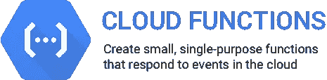

# 通过 5 个简单的步骤部署谷歌云功能

> 原文：<https://medium.com/google-cloud/deploying-google-cloud-functions-in-5-easy-steps-21f6d837c6bb?source=collection_archive---------2----------------------->



最近我做了一个项目，其中涉及部署谷歌云功能来做这些事情。

这是开始使用 GCF 的简单方法。

首先，您需要已经创建了一个项目。如果没有，转到[https://console.cloud.google.com](https://console.cloud.google.com)并创建它。您还需要至少访问一次 Google Cloud Functions 部分，以确保 GCF API 已启用。你还需要为一个函数创建一个存储桶——这没有什么难度，随便取个名字就行了👍

第二，你需要在你的机器上安装 Google Cloud SDK。你可以从[这里](https://cloud.google.com/sdk/)下载或者直接用 brew:

```
brew install google-cloud-sdk
```

第三，你需要为 Google Cloud SDK 设置当前项目。目录结构还不需要在那里。

```
gcloud auth login
gcloud config set project <project_name>
```

第四步！我们需要一个 nodejs 项目设置。只需在期望的项目中执行`yarn init`并使用新的云函数的内容创建 index.js 就足够了，如下所示:

```
exports.fetch = **function**(req, res) { res.send('Hello, world!'); }
```

最后一步🎉

```
gcloud beta functions deploy <your_function_name> --entry-point=<your_entry_point_name_exported_by_index.js> --trigger-http --stage-bucket=<your_stage_bucket>
```

示例:

```
gcloud beta functions deploy react-server-side-rendering-service --entry-point=render --trigger-http --stage-bucket=my-awesome-startup-gcf-bucket
```

就是这样！😎

你好，我是瓦莱里。我在阿姆斯特丹生活和写作。我写了这篇文章，所有观点都是我自己的。如果你喜欢读它，一定要在推特上关注我[https://twitter.com/viatsko](https://twitter.com/viatsko)