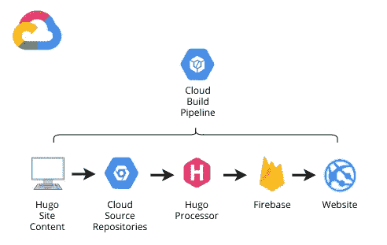
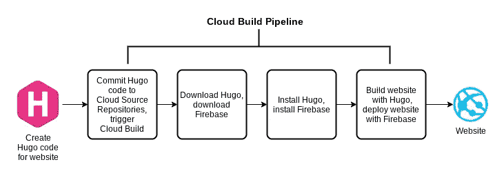
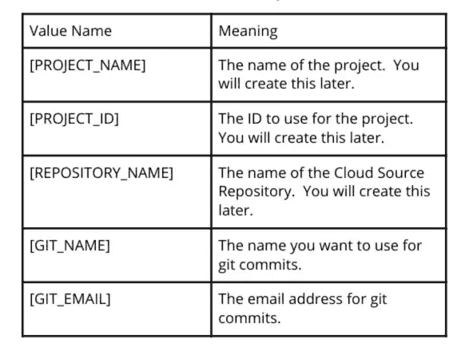
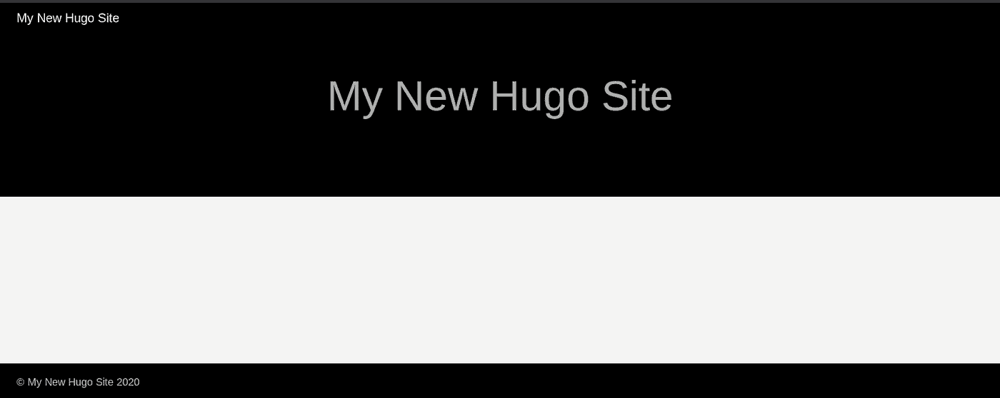
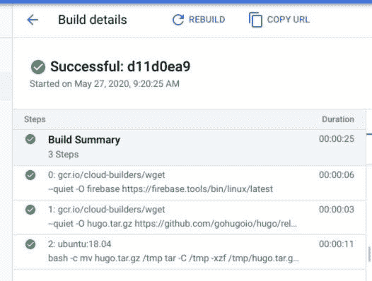

# 通过云构建和 Firebase 管道以极快的速度部署 Hugo 网站

> 原文：<https://medium.com/google-cloud/deploying-hugo-websites-at-warp-speed-with-a-cloud-build-and-firebase-pipeline-12b53dbc1d31?source=collection_archive---------1----------------------->



像 Hugo 这样的静态网络平台已经变得流行起来，因为它们能够制作不需要网络服务器的网站。使用静态 web 平台，不需要修补操作系统，也不需要维护 web 服务器软件。然而，存在各种操作复杂性。您可能希望对您的帖子进行版本控制，在内容交付网络(“CDN”)上托管您的网站，并提供 SSL 证书。

您可以通过使用持续集成/持续部署管道来解决这些流程问题。这些管道使开发人员能够通过自动化整个部署过程来快速创新。网站发布平台将使内容作者能够提交新内容，新内容又会启动管道，管道又会执行所有发布任务。

在本文中，我将向您展示如何利用 Google Cloud 来创建一个管道，用于部署基于静态站点构建器 Hugo 的网站。你创建你的网页内容，通过 Hugo 运行它，Hugo 反过来生成网页。我们将使用以下谷歌云服务:

*   云资源存储库将保存内容。该服务提供了私有的 Git 兼容存储库，当提交到分支时，可以触发云构建管道。如果您愿意，也可以使用 GitHub。
*   Firebase 将托管该网站。Firebase 是一个应用程序框架，提供内容交付网络(CDN)和 SSL 证书。
*   云构建将用于创建管道。管道由步骤组成，每个步骤都在一个容器中运行，以产生构建工件。

# 假设和前提条件

以下是我对未来的假设。

*   您可以通过适当的权限访问 Google Cloud 帐户。
*   你熟悉谷歌云的核心概念，如项目和计费账户。
*   你对云控制台和云外壳的使用已经驾轻就熟了。
*   您了解与 Git 相关的概念，如克隆和提交代码。

# 先来一张图

我想从我们将要建造的东西的图片开始。



目标是能够提交代码并让它触发管道，管道将依次部署网站。我们的旅程将分为两部分。首先，我们将在本地构建站点，并手动将其部署到 Firebase，这样我们就可以了解整个过程。其次，我们将通过使用云构建来构建管道，从而实现流程的自动化。

# 手动部署

我们将手动构建网站，看看端到端流程会发生什么。我们还将执行一些一次性的任务来启动和运行 Firebase，并查看站点的外观。

# 定义参数

您需要选择一些将在本文后面使用的值。当您看到文章中的值名称时，请替换您的选择。



# 创建一个 Firebase 项目

让我们从创建一个 Firebase 项目开始。这将依次建立一个底层的 Google Cloud 项目，并将其配置为使用 Firebase。然后，我们需要设置计费并启用一些 API。

1.  在新的浏览器标签中打开 [Firebase 控制台](https://console.firebase.google.com)。
2.  点按“添加项目”或“创建项目”
3.  为项目输入“[项目名称]”。如果您希望值为“[PROJECT_ID]”，请编辑建议的项目 ID。点击“继续”。
4.  在“谷歌分析”页面，禁用谷歌分析，因为这是一个演示。点按“创建项目”
5.  在新的浏览器标签中打开[谷歌云控制台](https://console.cloud.google.com/)。
6.  将 Firebase 项目链接到一个记帐帐户。如果您没有权限执行此操作，请与您组织的管理员合作为您执行此操作。没有付费帐户，您将无法进入下一部分。
7.  在“API 和服务”菜单中，启用以下 API:

*   云构建
*   云资源存储库

# 创建存储库

现在我们有了一个项目，我们需要创建一个存储库，并将其克隆到云 Shell 中，为将来的提交做准备。

打开云 Shell，确保默认项目 ID 设置为 Firebase 项目的 ID。进入下面。

```
cd ~gcloud source repos create [REPOSITORY_NAME]gcloud source repos clone [REPOSITORY_NAME]
```

我们现在已经克隆了存储库。现在，您应该会在主目录下看到一个同名的目录。

# 在本地安装 Hugo

我们现在将在云壳环境中安装 Hugo，这样我们就可以在本地构建网站。

1.  打开云 Shell，确保默认项目 ID 设置为 Firebase 项目的 ID。
2.  从 Linux 档案的[版本 0.69.2 安装 Hugo 可执行文件。将 Hugo 可执行文件放在云 Shell 主目录之外的一个目录中，比如~/bin，并将~/bin 添加到您的路径中。](https://github.com/gohugoio/hugo/releases/download/v0.69.2/hugo_0.69.2_Linux-64bit.tar.gz)
3.  在下面输入命令。

```
cd ~hugo new site [REPOSITORY_NAME] --force
```

hugo 命令将在与克隆的存储库相关联的目录中生成站点支架。

这将在存储库中构建站点的框架。通常 hugo 命令会创建目录。- force 选项将在已经存在的存储库目录中创建站点。

# 安装雨果主题

雨果没有一个默认的主题，所以我们现在将安装阿南刻主题。以下是执行此操作的说明。

1.  在临时目录下下载文件[https://github . com/bud parr/go Hugo-theme-an anke/archive/master . zip](https://github.com/budparr/gohugo-theme-ananke/archive/master.zip)。
2.  提取目录“gohugo-theme-ananke-master”，重命名为“ananke”。
3.  将“ananke”目录移到~/[REPOSITORY_NAME]/themes 目录下。
4.  使用以下命令将主题添加到 Hugo 配置文件中:

```
echo "theme = “ananke"' >> ~/[REPOSITORY_NAME]/config.toml
```

# 预览网站

您现在可以预览站点了。打开云壳，输入下面的命令。

```
 cd ~/[REPOSITORY_NAME]hugo server -D --port 8080
```

现在使用云壳的 Web 预览功能查看站点。



# 将现场部署到 Firebase

既然我们已经在本地查看了该网站，我们将对 Firebase 执行一次性部署以验证配置。

1.  如果您之前关闭了云壳，请将其打开。
2.  CD ~/[存储库名称]
3.  你将被要求访问一个谷歌登录网址。*不要点击 URL，而是将 URL 复制并粘贴到您的浏览器中。*将得到的授权码粘贴到提示中。
4.  firebase init
    使用箭头键和空格键选择主机。当询问项目选项时，选择“使用现有项目”，然后选择[项目名称]。对于公共目录，选择默认值“public”。要配置为单页应用程序，请选择默认值“N”。
5.  firebase deploy
    应用程序部署完成后，您将会收到一个托管 URL。点击它，你会看到由 Firebase CDN(内容交付网络)提供服务的同一个网站。如果您收到一般的“欢迎”消息，请等待几分钟，让 CDN 初始化并刷新浏览器窗口。保存此主机 URL 以备后用。

# 让我们自动化吧！

既然我们已经配置了项目并了解了端到端部署流程，我们将通过创建云构建管道来自动化该流程。

# 配置版本

云构建使用存储库根目录中名为 [cloudbuild.yaml](https://cloud.google.com/cloud-build/docs/configuring-builds/create-basic-configuration) 的文件来执行构建。

1.  如果云壳尚未打开，请将其打开。
2.  CD ~/[存储库名称]
3.  使用您最喜欢的文本编辑器创建包含以下文本的 cloudbuild.yaml 文件。请注意，Hugo 下载 URL 所在的行实际上与前面的破折号在同一行，firebase deploy 命令出现在下面两行，但实际上是一行。另外，请记住，在 YAML 语法中，间距确实很重要。

```
steps:
- name: 'gcr.io/cloud-builders/wget'
  args:
  - '--quiet'
  - '-O'
  - 'firebase'
  - '[https://firebase.tools/bin/linux/latest'](https://firebase.tools/bin/linux/latest')

- name: 'gcr.io/cloud-builders/wget'
  args:
  - '--quiet'
  - '-O'
  - 'hugo.tar.gz'
  - '[https://github.com/gohugoio/hugo/releases/download/v${_HUGO_VERSION}/'hugo_extended_${_HUGO_VERSION}_Linux-64bit.tar.gz](https://github.com/gohugoio/hugo/releases/download/v${_HUGO_VERSION}/'hugo_extended_${_HUGO_VERSION}_Linux-64bit.tar.gz)
  waitFor: ['-']

- name: 'ubuntu:18.04'
  args:
  - 'bash'
  - '-c'
  - |
    mv hugo.tar.gz /tmp
    tar -C /tmp -xzf /tmp/hugo.tar.gz
    mv firebase /tmp
    chmod 755 /tmp/firebase
    /tmp/hugo
    /tmp/firebase deploy --project ${_FIREBASE_PROJECT_NAME} --non-interactive --only hosting -m "Build ${BUILD_ID}"

substitutions:
  _HUGO_VERSION: 0.69.2
```

关于这个文件的一些观察。

1.  该文件中有三个命名的步骤，每个步骤都由一个容器映像执行。前两步使用 Google 支持的构建器执行 wget 命令来下载 Hugo 和 Firebase 工具。这两个步骤并行进行。使用 wget 构建器比手动安装 wget 更快。
2.  第三步使用一个标准的 Ubuntu 容器来安装 Hugo 和 Firebase，然后构建并部署站点。您还可以创建包含 Hugo 和 Firebase 的构建器容器。我选择这种方法有两个原因。第一，能够更改 Hugo 的版本很有用。第二，我想获得具有最新功能的最新版本的 Firebase。
3.  该文件还使用了两个定制的[替代变量](https://cloud.google.com/cloud-build/docs/configuring-builds/substitute-variable-values) (_HUGO_VERSION 和 _FIREBASE_PROJECT_NAME)，以允许该模板在不同的环境中使用。
4.  Hugo 和 Firebase 二进制文件被创建并安装在一个临时目录中，这样它们就不会被意外地部署到网站上。

# 执行初始提交

现在我们已经创建了站点中的所有文件，让我们将站点提交回云资源存储库。在此之前，我们需要创建一个. gitignore 文件来防止提交额外的文件。打开一个云外壳，输入下面的命令。

```
cd ~/[REPOSITORY_NAME]echo "public" >> .gitignoreecho "resources" >> .gitignoregit config --global user.mail "[GIT_NAME]"git config --global user.email "[GIT_EMAIL]"git add .git commit -m "Add app to Cloud Source Repositories"git push -u origin master
```

# 创建云构建触发器

为了在变更提交到存储库时启动云构建，我们需要定义一个云构建触发器。按照这些[步骤](https://cloud.google.com/cloud-build/docs/automating-builds/create-manage-triggers)创建触发器，进行以下更改:

1.  为触发器选择一个名称，如“提交到主分支”。
2.  对于事件，选择“Push to a branch”，选择我们之前创建的云源存储库，选择“master”作为分支。
3.  对于构建配置文件类型，接受 cloudbuild.yaml 的默认位置。
4.  添加替代变量 _FIREBASE_PROJECT_NAME，并将其设置为“[项目名称]”的值(不带引号)。

# 更新云构建服务帐户

云构建服务帐户需要拥有使用 Firebase 部署网站的权限。

1.  转到云控制台的 IAM 部分。
2.  找到包含“cloudbuild.gserviceaccount.com”的条目，并将角色“Firebase Hosting Admin”添加到其中。请注意，这个角色是 Firebase 产品组的一部分。

# 测试管道

既然已经创建了管道，现在可以对站点进行更改并提交它，看看更改是否会传播。

1.  如果云壳尚未打开，请将其打开。
2.  CD ~/[存储库名称]
3.  编辑 config.toml 文件，将标题改为不同的名称，如“我的新 Hugo 网站”,并保存更改后的文件。
4.  git 添加。
5.  git commit -m“更新的网站磁贴”
6.  git push -u 原始主机
7.  转到云构建控制台并检查构建历史。您应该看到一个成功的部署，如果没有，请查阅构建日志来确定问题。浏览到您之前收到的托管 URL。如果没有，可以转到 Firebase 控制台，检查项目以找到域名。CDN 更新可能需要几分钟时间。
8.  构建成功完成后，查看构建详细信息。总构建时间为 25 秒。



# 总结一下

Cloud Build 可以编排一个管道，将 Hugo 网站快速部署到 Firebase，Firebase 提供 CDN 和 SSL 证书。云构建允许您定制流程以适应您的需求。较短的部署时间允许您快速创新，并且不费吹灰之力就能测试您的网站版本。更多信息请参考[云构建](https://cloud.google.com/cloud-build/docs)和 [Firebase](https://firebase.google.com/docs) 文档。