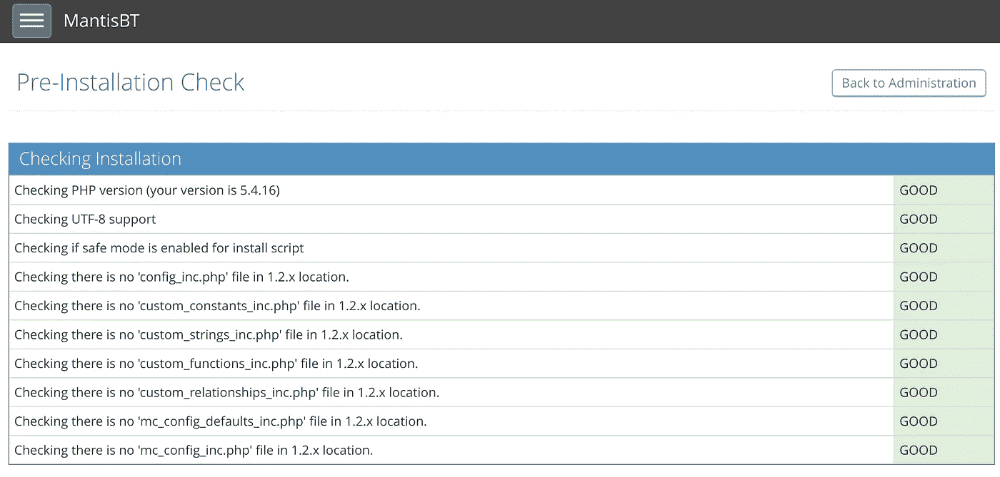
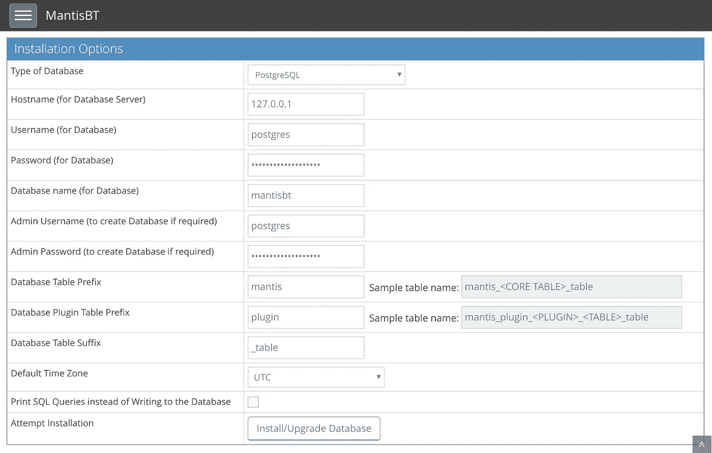

# 在谷歌云平台上部署螳螂错误跟踪器

> 原文：<https://medium.com/google-cloud/deploying-mantis-bug-tracker-on-google-cloud-platform-c1810dcc0c71?source=collection_archive---------1----------------------->

## *利用 CentOS 7、Caddy、云 SQL 和 gcloud CLI*


# 概观

## 用例

目前，作为一名独立的安全研究员，我需要一个解决方案来记录和跟踪发现的漏洞。在前一家公司，这是通过定制的内部软件实现的。或者，安全行业的人可能熟悉 [Project Zero 的问题跟踪器](https://bugs.chromium.org/p/project-zero/issues/list)，在那里利用了 bug 跟踪软件 [Monorail](https://groups.google.com/a/chromium.org/forum/#!msg/infra-dev/OotYpVzgnBw/fAfheRp9BQAJ) 。

**当然，还有许多其他开源的 bug 跟踪软件解决方案。我发现 Mantis Bug Tracker 在用户界面和配置之间提供了恰当的平衡，并提供了一个自动化的 API。诚然，我没有愤怒地使用它，但我渴望得到它的设置，并了解更多关于谷歌云平台。**

**不要跑题到漏洞披露，追踪器上列出的错误将是那些通过自动化(因此需要分类)或人工调查发现的错误的结果。我没有预见到信息会通过这种方式公开，考虑到负载和成本较低，我选择在谷歌云平台上使用小型(f1-micro)实例。**

**使用[定价计算器](https://cloud.google.com/products/calculator/)，1 个月的持续使用折扣预计约为 16 美元(撰写本文时为美元)。当然，这可能会根据您部署应用程序的地区和您需要的实例大小而有所不同。**

## **流行语摘要**

**本文介绍了在[谷歌云平台](https://cloud.google.com/) (GCP)上部署[螳螂错误追踪器](https://mantisbt.org/) (MantisBT)的过程。MantisBT 将安装在[谷歌计算引擎](https://cloud.google.com/compute/docs/)上，在这个场景中是一个 [CentOS](https://www.centos.org/) 7 虚拟机，使用 [Caddy](https://caddyserver.com/) 作为 web 服务器，并使用 FastCGI 代理对 PHP-FPM 的请求，以便为应用程序提供服务。 [Google Cloud SQL](https://cloud.google.com/sql/docs/) 将被用作 MantisBT 的数据库后端。**

**这篇文章分为两部分:第 1 部分侧重于创建计算和 SQL 实例，而第 2 部分介绍了应用程序的安装过程。**

# **第 1 部分:实例设置**

## **谷歌云 SDK**

**Google Cloud 上使用的所有服务和实例都可以通过 [web 控制台](https://console.cloud.google.com)进行实例化。然而，我对更加熟悉用于快速部署和重新部署服务的`gcloud`命令行实用程序很感兴趣。谷歌已经提供了一个[快速启动](https://cloud.google.com/sdk/docs/quickstarts)来安装和初始化云 SDK。如果你还没有这样做，我鼓励你这样做。**

**您可以创建一个新项目或使用命令下列出的当前配置的项目；**

```
gcloud config list
```

**要创建和切换，请在以下命令中用`PROJECT_ID`代替唯一名称；**

```
gcloud projects create PROJECT_ID
gcloud config set core/project PROJECT_ID
```

**计算实例和云 SQL 的进一步设置将在此项目中进行。您可能会发现，如果在进行给定的项目时还没有启用 API，那么您将被要求启用 API。**

## **计算实例**

**compute 实例将充当 web 服务器，运行使用 Caddy 提供的 MantisBT 应用程序。**

**根据您使用的是新项目还是现有项目，允许 HTTP(S)流量通过防火墙的默认规则可能不存在。您可以使用以下命令查看当前的防火墙规则列表。**

```
gcloud compute firewall-rules list
```

**如果输出中没有允许`tcp:80`和`tcp:443`的规则，执行以下两个命令来添加这些规则。**

```
gcloud compute firewall-rules create default-allow-http \ 
    --allow=tcp:80 --target-tags http-servergcloud compute firewall-rules create default-allow-https \
    --allow=tcp:443 --target-tags https-server
```

**如果您希望为您的 MantisBT 实例分配一个静态 IP 地址，使用下面的命令创建一个，用`ADDRESS_NAME`替换主机名。**

```
gcloud compute addresses create ADDRESS_NAME
```

**该地址可以在的输出中看到；**

```
gcloud compute addresses list
```

**创建一个 A 记录，让您的 DNS 提供商将一个域指向此 IP 地址。如果您希望稍后使用 Caddy 自动获得一个带有 Let's Encrypt 的证书，这是必需的。这将提供对您的 MantisBT 应用程序的安全访问。**

**现在用下面的命令创建计算实例，替换`INSTANCE_NAME`为创建的虚拟机命名，例如`mantisbt`。同样，将`ADDRESS_NAME`改为之前使用的。注意，使用的标签反映了为创建的防火墙规则指定的`--target-tags`。作用域的使用允许 VM 连接并使用云 SQL 数据库。创建实例的更多选项可在[参考文档](https://cloud.google.com/sdk/gcloud/reference/compute/instances/create)中找到。**

```
gcloud compute instances create INSTANCE_NAME               \
    --image-family centos-7 --image-project centos-cloud    \
    --machine-type=f1-micro --tags=http-server,https-server \
    --address=ADDRESS_NAME                                  \
    --scopes=default,cloud-platform,sql-admin
```

**一旦命令返回状态`RUNNING`，您就可以用以下命令测试 SSH 访问；**

```
gcloud compute ssh INSTANCE_NAME
```

**这将为 Google Compute Engine 创建一个密钥对(如果在`~/.ssh/google_compute_engine`还没有的话),并更新项目的元数据以允许使用这个密钥。**

**在 SSH 会话中键入`exit`返回到您的本地提示符，我们将继续设置 Google Cloud SQL。**

## **谷歌云 SQL**

**目前有两个为云 SQL 提供的数据库引擎，MySQL 和 PostgreSQL，后者仍处于测试阶段。云 SQL 上的 PostgreSQL 目前不支持高可用性和复制。在我的用例中，这不是特别需要的，但是根据您的部署，这是值得考虑的。Google 的文档提供了关于[配置高可用性实例的说明](https://cloud.google.com/sql/docs/mysql/configure-ha)。我将继续使用 PostgreSQL。**

**使用下面的命令，替换`SQL_INSTANCE_NAME`为云 SQL 实例命名，`GCE_ZONE`和`REGION`为计算实例的位置，这可以用`gcloud compute instances list`检查。**

```
gcloud sql instances create SQL_INSTANCE_NAME --tier=db-f1-micro  \
    --database-version=POSTGRES_9_6 --storage-type=HDD            \
    --storage-size=10 --storage-auto-increase                     \
    --activation-policy=ALWAYS --backup --backup-start-time=00:00 \
    --maintenance-release-channel=production                      \
    --maintenance-window-day=FRI --maintenance-window-hour=12     \
    --gce-zone=GCE_ZONE --region=REGION
```

**这在硬盘驱动器上创建了一个具有 0.6GB RAM 和 10GB 存储空间的共享核心实例，硬盘驱动器将在必要时增加(而不是减少)。每日午夜备份，维护窗口在星期五中午。**

**最后，使用以下命令设置默认的`postgres`用户帐户密码，用上面创建命令中使用的名称替换`SQL_INSTANCE_NAME`。**

```
gcloud sql users set-password postgres no-host \
    --instance=SQL_INSTANCE_NAME --prompt-for-password
```

## **部分摘要**

**在本节中，您已经创建了安装和运行 MantisBT 的基础设施和平台。这包括:**

*   **安装和初始化云 SDK 以及配置项目**
*   **创建防火墙规则**
*   **保留静态 IP 地址**
*   **创建一个计算实例，分配上述规则和 IP 地址**
*   **使用 SSH 连接到实例**
*   **创建具有备份和维护计划的托管云 SQL 实例。**

**至此，本文的剩余部分将集中于安装 MantisBT 和 Caddy，以及云 SQL 代理来安全地连接到数据库后端。**

# **第 2 部分:应用程序安装过程**

## **连接到实例**

**以下用于安装和配置软件的命令都发生在您之前创建的计算实例上。您可以使用安全地连接到实例；**

```
gcloud compute ssh INSTANCE_NAME
```

## **云 SQL 代理**

**云 SQL 实例在创建时是不公开的。希望通信的客户端及其相关 IP 地址必须被添加到[白名单](https://cloud.google.com/sql/docs/postgres/configure-ip)。此外，强烈建议您使用安全套接字层(SSL)协议连接到数据库。这确保了在客户端和云 SQL 数据库之间传输的数据是安全的。**

**使用云 SQL 代理时，需要将 IP 地址列入白名单，配置和管理服务器/客户端证书以实现安全通信。有关云 SQL 代理如何工作的更多信息，请参见参考文档[关于云 SQL 代理](https://cloud.google.com/sql/docs/postgres/sql-proxy)。总之，它自动加密流量并处理对数据库的访问。**

**您可能会发现，您需要启用云 SQL API 来让代理工作。可以通过 [API 库](https://console.cloud.google.com/apis/library/sqladmin.googleapis.com)启用。此外，当创建计算实例时，我们添加了`cloud-platform`和`sql-admin`范围。这意味着默认服务帐户可以管理云 SQL 实例。或者，您可以创建一个特定的[服务帐户](https://cloud.google.com/sql/docs/postgres/sql-proxy#create-service-account)，并在启动云 SQL 代理时传递凭证文件。**

**首先下载云 SQL 代理；**

```
curl https://dl.google.com/cloudsql/cloud_sql_proxy.linux.amd64 \
  -o cloud_sql_proxy
```

**使应用程序可执行，并转移到`/usr/local/bin`。**

```
chmod +x cloud_sql_proxy
sudo mv cloud_sql_proxy /usr/local/bin
```

**为了在引导时启动该过程，我们将基于[该注释](https://github.com/GoogleCloudPlatform/cloudsql-proxy/issues/4#issuecomment-246962809)和[堆栈溢出答案](https://stackoverflow.com/a/44459517)创建一个 systemd 服务单元配置文件。将`CONNECTION_NAME`替换为[云 SQL 仪表板](https://console.cloud.google.com/sql/instances)上给出的实例连接名称。这就是形式上的`PROJECT_ID:REGION:SQL_INSTANCE_NAME`。**

```
[Unit]
Description=Google Cloud Compute Engine SQL Proxy
After=networking.service
Before=google-shutdown-scripts.service[Service]
Type=simple
WorkingDirectory=/run/cloudsql
ExecStart=/usr/local/bin/cloud_sql_proxy -dir=/run/cloudsql -instances=CONNECTION_NAME=tcp:127.0.0.1:5432
Restart=always
StandardOutput=journal
User=root[Install]
WantedBy=multi-user.target
```

**将此文件另存为`/etc/systemd/system/cloud-sql-proxy.service`，并设置适当的权限；**

```
sudo chmod 0644 /etc/systemd/system/cloud-sql-proxy.service
```

**创建工作目录；**

```
sudo mkdir /run/cloudsql
```

**最后，启用并启动代理；**

```
sudo systemctl daemon-reload
sudo systemctl enable cloud-sql-proxy
sudo systemctl start cloud-sql-proxy
```

**您可以使用`journalctl`检查日志输出，看看代理是否启动并运行，或者是否有任何错误；**

```
journalctl -u cloud-sql-proxy
```

## **MantisBT 和 PHP-FPM**

**我们首先安装 PHP 和 MantisBT 所需的附加模块。如果您之前使用了 MySQL 数据库，那么在下面的命令中用`php-pgsql`代替`php-mysql`;**

```
sudo yum install php php-pgsql php-mbstring php-fpm php-soap \ 
    policycoreutils-python
```

**CentOS 默认使用`apache`用户和组来运行 Apache Web 服务器。在这个实例中，我们使用 Caddy，与 PHP-FPM 相关的默认配置文件使用`apache`用户和组。为了清楚起见，我们将创建一个新用户并相应地更新配置文件，因为我们没有使用 Apache。**

```
sudo mkdir /srv/www
sudo groupadd -g 33 www-data
sudo useradd -g www-data --no-user-group --home-dir /srv/www \
    --no-create-home --shell /usr/sbin/nologin --system      \
    --uid 33 www-data
sudo chown www-data:www-data /srv/www
```

**修改`/etc/php-fpm.d/www.conf`替换线条；**

```
user = apache
group = apache
```

**分别以`www-data`为用户和组；**

```
user = www-data
group = www-data
```

**另外更新 PHP 会话存储的所有权；**

```
sudo chown root:www-data /var/lib/php/session
```

**就像云 SQL 代理服务一样，我们可以让 PHP-FPM 在引导时启动并开始执行；**

```
sudo systemctl enable php-fpm
sudo systemctl start php-fpm
```

**我们还在`/srv/www`中为`www-data`用户创建了一个主目录。为了提供文件服务，必须设置适当的文件上下文，否则 SELinux 将阻止进程为 MantisBT 应用程序提供服务。**

```
sudo semanage fcontext -a -t httpd_sys_content_t "/srv/www(/.*)?"
```

**安装 MantisBT 只需要下载并解压源代码即可。**

```
cd /srv/wwwsudo -u www-data curl -O "https://kent.dl.sourceforge.net/project/mantisbt/mantis-stable/2.6.0/mantisbt-2.6.0.tar.gz"sudo -u www-data tar xf mantisbt-2.6.0.tar.gz
sudo -u www-data mv mantisbt-2.6.0 mantisbt
sudo -u www-data rm -rf .pki mantisbt-2.6.0.tar.gz
```

## **小盒子**

**Caddy 为现代 web 服务器提供了一系列的[功能](https://caddyserver.com/features)，其中简单的配置、安全的默认设置和自动证书设置以及使用 Let's Encrypt 进行的更新脱颖而出。**

**考虑到我的实例将接收的低流量，Caddy 或者任何 web 服务器都足以满足请求。然而，正如本文中所做的其他决定一样，如果这不能满足您的需求，您可能希望寻找一个替代方案。**

**有几种方法可以获得 Caddy，或者通过[下载](https://caddyserver.com/download)或者[发布](https://github.com/mholt/caddy/releases/latest)页面。如果您选择这种方法，请在使用官方 Caddy 二进制文件时遵守[许可](https://caddyserver.com/products/licenses)细节。或者，您可以从源代码构建 Caddy，如下所示；**

```
sudo yum install golang git
go get github.com/mholt/caddy/caddy
sudo cp `go env GOPATH`/bin/caddy /usr/local/bin
```

**我们需要在 Caddy 二进制文件上设置一些额外的属性，以允许它绑定到端口 80 和 443，而不需要成为 root 用户，另外还要为 SELinux 设置一些属性；**

```
sudo setcap cap_net_bind_service=+ep /usr/local/bin/caddy
sudo semanage fcontext -a -t httpd_exec_t /usr/local/bin/caddy
sudo restorecon /usr/local/bin/caddy
sudo setsebool -P httpd_can_network_connect_db on
```

**这个[要点](https://gist.github.com/TomHetmer/cba23c3e0e36227d7a13e8a5d742e510)为 Caddy 设置 SELinux 属性提供了有用的指导。**

**像安装的其他服务一样，我们将按照本例的指导设置一个 systemd 服务单元。首先，创建必要的目录；**

```
sudo mkdir /etc/caddy
sudo chown -R root:www-data /etc/caddy
sudo mkdir /etc/ssl/caddy
sudo chown -R www-data:root /etc/ssl/caddy
sudo chmod 0770 /etc/ssl/caddy
```

**Caddy 将使用`/etc/ssl/caddy`目录来加密证书。SELinux 处于强制模式时，尽管有用户权限，Caddy 将无法写入该目录。我们必须进一步设置文件上下文，就像安装 MantisBT 一样。**

```
sudo semanage fcontext -a -t httpd_sys_rw_content_t /etc/ssl/caddy
sudo restorecon /etc/ssl/caddy
```

**接下来我们将创建所谓的`Caddyfile`，Caddy 的配置文件。将以下内容放入`/etc/caddy/Caddyfile`文件中。在为实例创建地址时，将`DOMAIN_NAME`替换为之前为其配置了 A 记录的域。或者，您可以在此处使用 IP 地址，但是不会向您颁发证书，也不会安全地连接到 MantisBT 实例。另外，将`EMAIL_ADDRESS`替换为您的电子邮件地址，以同意[订户协议](https://letsencrypt.org/repository/)。**

```
DOMAIN_NAME
tls EMAIL_ADDRESS
root /srv/www/mantisbt
gzip
status 404 {
        /composer
        /config
        /core
        /doc
        /lang
        /library
        /plugins
        /scripts
        /vendor
}
fastcgi / 127.0.0.1:9000 php
log stdout
errors stderr
```

**和更新权限；**

```
sudo chown www-data:www-data /etc/caddy/Caddyfile
sudo chmod 444 /etc/caddy/Caddyfile
```

**从向导中取出`caddy.service` systemd 单元文件；**

```
cd ~/
curl -O [https://raw.githubusercontent.com/mholt/caddy/master/dist/init/linux-systemd/caddy.service](https://raw.githubusercontent.com/mholt/caddy/master/dist/init/linux-systemd/caddy.service)
```

**并将服务设置为启用并启动 Caddy**

```
sudo mv caddy.service /etc/systemd/system/
sudo chown root:root /etc/systemd/system/caddy.service
sudo chmod 644 /etc/systemd/system/caddy.service
sudo systemctl daemon-reload
sudo systemctl enable caddy.service
sudo systemctl start caddy.service
```

**查看 Caddy 的`journalctl`输出，您应该看到关于证书成功发布并写入磁盘的日志记录。**

```
journalctl -u caddy
```

**通过访问您的域，您现在应该看到通过安全连接设置和配置数据库的页面。**

## **MantisBT 配置**

****

**MantisBT 预安装清单**

**当访问您的域时，您将被自动重定向到 MantisBT 安装程序。您应该会看到上面的清单，每个相应的项目都标有“良好”字样。**

**再往下是供您填写的安装选项。主要是数据库类型(postgres)、数据库服务器(127.0.0.1，因为我们使用的是本地代理)、用户名(postgres)和前面设置的密码。最后是数据库名(mantisbt)。你可以在下面的截图中看到这些选项。**

****

**MantisBT 安装选项**

**单击“安装/升级数据库”。**

**在接下来的页面中，安装程序试图写入`/srv/www/mantisbt/config/config_inc.php`，但由于 SELinux 而失败。这样就可以了，按照说明将它生成的配置复制到文件中；**

```
sudo -u www-data vim /srv/www/mantisbt/config/config_inc.php
```

**同时，还有很多[配置选项](https://mantisbt.org/docs/master/en-US/Admin_Guide/html/admin.config.html)你也不妨设置一下。将此作为个人实例，我选择了禁用注册，例如通过将以下内容添加到`config_inc.php`文件中。**

```
$g_allow_signup = OFF;
```

**你可能也注意到了移除`admin`目录以及修改管理员密码的指令。出于安全原因，这一点至关重要。您可以使用删除`admin`目录；**

```
sudo -u www-data rm -rf /srv/www/mantisbt/admin
```

**要更改管理员密码，请先使用默认凭据登录。用户名是“administrator”，密码是“root”，两者都没有引号。然后会提示您更改密码。**

## **部分摘要**

**在本节中，您已经为 MantisBT 部署安装并配置了必要的应用程序和服务。这包括:**

*   **将云 SQL 代理设置为服务**
*   **安装了 PHP-FPM 并重新配置为使用`www-data`用户**
*   **获取了尾数源代码**
*   **将 Caddy 部署为服务**
*   **为 SELinux 设置适当的权限、功能和文件上下文。**
*   **创建了一个简单的 Caddyfile**
*   **通过 web 界面安装和配置了 MantisBT。**

# **结束语**

**恭喜你，你现在已经有一个运行在 Google 云平台上的 MantisBT 实例了。[管理指南](https://mantisbt.org/docs/master/en-US/Admin_Guide/html/index.html)提供了对 MantisBT 进一步设置的更多见解，可能对您有所帮助。**

**我相信你会同意我们已经讨论了大量的材料。我希望这对你有用，并在这一过程中学到了一些东西。我感谢任何反馈或回应，所以请随意评论！**