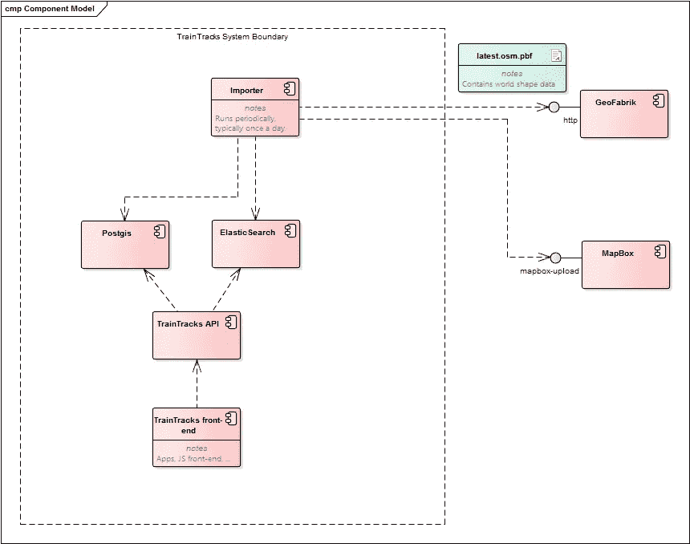

# 通过 Kubernetes 部署 OpenStreetMaps 服务

> 原文：<https://medium.com/google-cloud/deploying-openstreetmaps-services-through-kubernetes-615c27a7653c?source=collection_archive---------2----------------------->

让一些东西走出你小小的本地实验室去面对外面的世界，既令人兴奋又令人害怕。这很可怕，因为你不知道到底会发生什么，同样，出于同样的原因，这也很令人兴奋。

不幸的是，推出一个比静态网站稍微复杂一点的服务也是令人望而生畏的。诚然，有了云平台，如[谷歌云](https://cloud.google.com/)和他们的[极其慷慨的试用程序](https://cloud.google.com/free-trial/)(免费运行 300 美元的虚拟机、SQL 数据库等)，事情变得更容易了。我再也不用向 ISP 索要静态 IP 地址，也不用摆弄路由器来确保端口转发配置正确。

免费试用，登上谷歌云

基于 Docker 服务编写了我的[基于 OpenStreetMaps 的列车跟踪服务](/@duizendnegen/writing-a-custom-openstreetmaps-service-with-docker-468a4498fb6e#.rofnpn5yi)，自然我想用同样的技术部署这些容器。使用 Docker 直接部署仍然处于测试阶段，但是一个不同的服务已经在很长一段时间内动摇了它:在 Google [容器引擎](https://cloud.google.com/container-engine/)中的 [Kubernetes](http://kubernetes.io/) 。

# 架构介绍

部署策略与所选择的架构紧密相关。如果你开发一个 SaaS 应用程序，不选择[多租户架构](https://en.wikipedia.org/wiki/Multitenancy)而是选择定制的东西是相当令人惊讶的。另一方面，当从许多现有的开源软件中拼凑出一些东西时，能够选择和混合编程语言、操作系统和数据库是一种福气。

粗略的架构模型，概述外部依赖关系和内部系统组成

该系统由用于存储路线数据和关系的 Postgis 和用于查询火车站的弹性搜索实例组成。这背后的 OpenStreetMaps 数据以最初由 OpenRailwayMap 演示的方式从 GeoFabrik 定期导入。最后，MapBox 使用其上传 API 来利用其出色的图块处理能力。

# 学习码头公司

我在 Docker 的学习之路还远未结束。我会说我在前进的过程中吸收了新的信息。起初，仅仅能够启动一个容器并对其执行一些命令就感觉很棒，也足够了。对于 Postgis 和 ElasticSearch 服务的持久性来说，了解更多关于 Docker 卷的信息是必不可少的。事实证明这并不坏，如果你认为它是一个远程连接的硬盘驱动器，你可以随意连接和拆卸。让多个服务访问同一个卷仍然让我毛骨悚然，所以我偏离了这个方向。

在 Docker 上已经变得合理的 apt，运行 Kubernetes 需要额外的学习步骤。熟悉集装箱、服务和数量对这个项目至关重要。有趣的是，到目前为止我发现的最好的指南是《T2 儿童图解指南》。

# 创建容器

Kubernetes 附带了一个[优秀的 CLI 概述](http://kubernetes.io/docs/user-guide/kubectl-overview/)，一个[Docker 用户快速入门指南](http://kubernetes.io/docs/user-guide/docker-cli-to-kubectl/)和一个[备忘单](http://kubernetes.io/docs/user-guide/kubectl-cheatsheet/)。我急切地使用它们来找出如何让服务运行起来。我最常用的命令选项当然是 *-o yaml* ，将待运行的命令输出到一个文件中以供检查和存储。事实上，我的开发实践是运行这些命令，然后用*ku bectl create-f<filename>*来运行捕获的指令。

在标记了我的 API 映像之后，我将它推送到 [Google 的容器注册表](https://cloud.google.com/container-registry/docs/pushing)，并且，不需要额外的持久性，能够通过将一个部署与一个服务相结合来相对简单地发布它，仅仅通过配置运行这个部署的副本的数量就可以自动冗余。

获得一个带有附加卷的容器，并因此启动和运行更多的持久性功能需要更多的技巧。幸运的是这条路已经铺好了:我无意中发现了一篇关于如何在 Google 容器引擎中运行 Postgres 的优秀文章。这似乎意味着最好预先创建一个单独的磁盘，将它挂载到一个新启动的 VM，用 ext4 格式化它，然后运行创建命令。

顺序很重要:应该首先执行持久性命令，然后执行声明，因为没有这些，部署就不知道在哪里存储数据。最后，该服务向外界公开数据库。

我对我的 ElasticSearch 实例使用了相同的方法，只有一些必需的环境变量不同。

使用 Mapbox 上的演示 Javascript 前端使用 API

# 后续步骤

更好的方法是使用内部网络，将所有提到的容器放在一个容器中，但是我至少对我在现场推动这些服务的成就感到有些自豪。下一步:一个改进的站对站路由服务，并更新部署。

*我错过了 Kubernetes 关于入职的精彩文章吗？是我把事情复杂化了还是我走了太多捷径？其他明显的疏忽？欢迎任何反馈。*