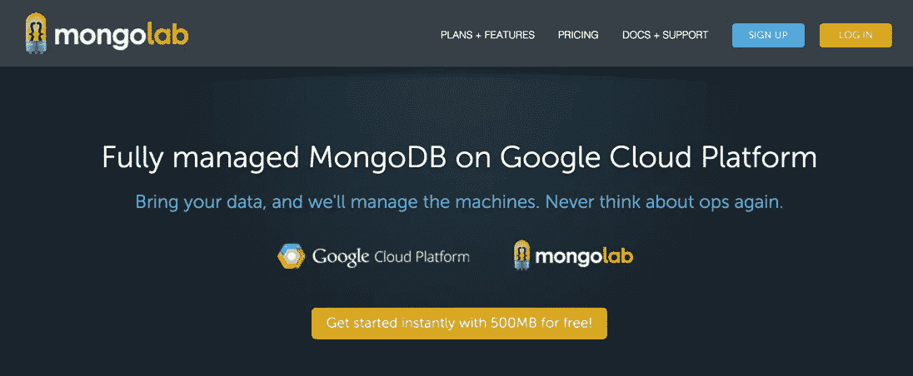

# 将解析服务器部署到 Google App Engine

> 原文：<https://medium.com/google-cloud/deploying-parse-server-to-google-app-engine-6bc0b7451d50?source=collection_archive---------0----------------------->


最近，Parse 宣布他们将[关闭](http://blog.parse.com/announcements/moving-on/)他们的移动后端服务。如果你已经在 Parse 上构建了一个应用，这可能是个坏消息。好消息是，他们给开发者 12 个月的时间来寻找新的解决方案，并且他们提供了一条[运行你自己的](http://blog.parse.com/announcements/introducing-parse-server-and-the-database-migration-tool/)解析兼容服务的道路。有一个很棒的迁移指南，介绍了[将解析数据](https://parse.com/docs/server/guide)导出到 MongoDB，并运行构建在 Node.js 和 express 上的解析服务器。

本指南将涵盖在 [Google App Engine](http://cloud.google.com/nodejs) 和 [MongoLab](https://mongolab.com/google/) 上运行解析服务器。你可以在我们的 [node.js 开发者中心](https://cloud.google.com/nodejs/resources/frameworks/parse-server)了解如何在 App Engine 上设置 parse 和大量其他 node.js 应用。

## 建立一个 MongoLab 数据库

首先，注册一个 [MongoLab](https://mongolab.com/google/) 账户(如果你还没有的话)。



当您到达仪表板时，创建一个新的数据库:


确保选择谷歌云平台作为云提供商。我使用免费层开始:


数据库可用后，单击仪表板中的标题。您需要创建一个用户:


接下来，复制数据库的连接字符串。我们将在 node.js 应用程序中使用它。


现在我们有了一个数据库——让我们转到 node.js 应用程序。

## 设置解析服务器

让解析服务器在 Google Cloud 上运行的最简单的方法是从 GitHub 上的示例开始。

```
git clone [https://github.com/GoogleCloudPlatform/nodejs-docs-samples.git](https://github.com/GoogleCloudPlatform/nodejs-docs-samples.git)
cd appengine/parse-server
npm install
```

现在您需要设置一些配置变量。打开 config.json，设置本地配置。您可以在[迁移指南](https://parse.com/docs/server/guide)中了解更多关于解析配置的信息:

```
{
 “DATABASE_URI”: “mongodb://localhost:27017/dev”,
 “CLOUD_PATH”: “./cloud/main.js”,
 “APP_ID”: “<your-app-id>”,
 “MASTER_KEY”: “<your-master-key>”,
 “FILE_KEY”: “<your-file-key>”,
 “PARSE_MOUNT_PATH”: “/parse”,
 “SERVER_URL”: “<your-server-url>”
}
```

这将帮助我们在本地运行解析服务器。现在尝试一下:

```
npm start
```

现在让我们将应用程序部署到应用程序引擎！

## 部署到 Google 应用引擎

接下来，我们将应用程序部署到谷歌应用程序引擎。如果卡住了，也可以按照 [node.js 入门指南。](http://cloud.google.com/nodejs)

首先在[谷歌云平台控制台](https://console.cloud.google.com/)中创建一个项目:


接下来，[启用计费](https://console.cloud.google.com/project/_/settings)。您可以通过免费试用在 App Engine 管理的虚拟机上运行应用程序。

安装[谷歌云 SDK](https://cloud.google.com/sdk/) 。运行“gcloud init”并使用您的 Google 帐户登录。最后—部署您的应用:

```
gcloud preview app deploy
```

部署完成后，导航至[http://<your-app-id>. appspot . com](http://%3Cyour-app-id%3E.appspot.com)并查看:


你已经准备好了。要了解更多关于在 Google cloud 上运行 node.js 应用程序的信息，请查看我们的[文档](http://cloud.google.com/nodejs)，或者看看我们在 GitHub 上的其他[示例。](http://github.com/GoogleCloudPlatform/nodejs-docs-samples)让我们知道您的想法！