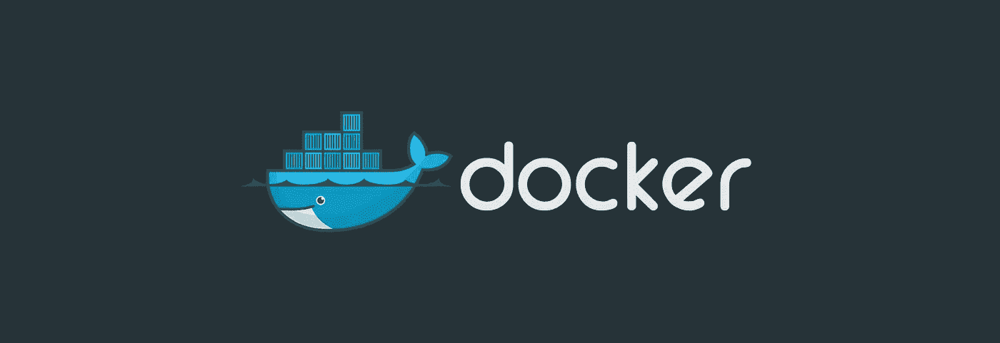

# 使用 Docker 部署 Scipy & Numpy

> 原文：<https://medium.com/google-cloud/deploying-scipy-numpy-with-docker-205e9afac3b0?source=collection_archive---------0----------------------->

## *最初发布于 2015 年 9 月 2 日之前的博客*



码头工人很体面，对吗？谷歌表示同意。这是他们云托管平台的核心部分。

# 一点背景

**TL；DR** :没有 Debian 的 SciPy 和 NumPy 的`pip`轮 **>** 我们必须在`pip install` **>** 期间从源代码编译它需要很长时间。

在过去的几周里，我与所有主要的主机提供商合作，努力为一个特定的 Python 项目找到最合适的归宿。每个平台都有一个棘手的问题，那就是需要编译 SciPy。棘手的问题并不是让编译变得更容易——这通常很容易——而是如果从源代码编译所花费的时间。

如果你只在 MacBook 上使用 SciPy，你可能会奇怪我在说什么。`pip install scipy`对你来说不到 30 秒？是的，确实如此...在 MacOS 上。这要归功于 pip 团队不久前推出的一个叫做 [pip wheel](https://pip.pypa.io/en/latest/reference/pip_wheel.html) 的小巧功能。这使得发布到包索引的项目的维护者可以预先构建他们的项目，并让您下载这些项目。简而言之，你下载一份已经为你的硬件和操作系统编译好的 SciPy。

像 SciPy 这样维护软件包的聪明人可以为流行的操作系统和硬件风格构建各种轮子。不幸的是，SciPy 团队目前只为 MacOS 发布了一个轮子。

最后，这意味着当我们在 Linux 虚拟机上`pip install scipy numpy`时，我们必须等待它们编译；这太费时间了。运行您的 CI 作业以发布新版本，这需要 20 分钟？不理想；失败的可能性也更高。

# 解决方案

我认为最好的方法是创建 2 个 Docker 图像。

[**wheel . docker**](https://dajos.azurewebsites.net/deploying-scipy-to-docker/#wheel.docker)—第一个`Dockerfile`负责创建一个`/wheelhouse`文件夹，里面装满了从我的应用程序`requirements.txt`文件中构建的包。仅当`requirements.txt`改变时，才需要构建该图像。当一个项目达到某个稳定点(生产？).

[**main . docker**](https://dajos.azurewebsites.net/deploying-scipy-to-docker/#main.docker)—第二个`Dockerfile`将从第一个和`pip install --no-index -f /wheelhouse`中构建。这意味着，它将只使用我们在第一次构建中创建的`.whl`包。这将大大减少在每次部署中将我们的需求安装到虚拟环境中所需的时间。

每个`Dockerfile`的内容如下。

更进一步。我之前提到过 CI 工作。我为此部署创建了 2 个作业。主要工作是在部署之前负责运行`main.docker`构建和测试。它还依赖于车轮作业。车轮作业将检查`requirments.txt`自上次构建以来是否已被修改。如果是的话，那么当它编译轮子的时候，我们有一个很长的构建，但是几乎总是会跳过这个构建。

最终结果是，现在大多数部署只需要不到一分钟的时间(包括测试和发布),而从源代码开始完整构建需要大约 30 分钟。

# `wheel.docker`

构建时，记得为`main.docker`到`FROM ...`进行适当标记。比如:`docker build -t myapp/wheels/build -f wheel.docker .`

```
# [START docker]
FROM google/python  
# [END docker]# [START system dependencies]
RUN apt-get install -y \  
    libpng-dev \
    freetype* \
    libblas-dev \
    liblapack-dev \
    libatlas-base-dev \
    gfortran
# [END system dependencies]# [START app environment]
WORKDIR /app  
ADD requirements.txt /app/requirements.txt  
RUN virtualenv /env  
RUN /env/bin/pip install --upgrade pip  
# [END app environment]# [START install & configure wheel]
RUN /env/bin/pip install wheel  
ENV PIP_WHEEL_DIR=/wheelhouse  
ENV WHEELHOUSE=/wheelhouse  
ENV PIP_FIND_LINKS=/wheelhouse  
# [START install & configure wheel]RUN while read p; do /env/bin/pip wheel $p; done < requirements.txt
```

# `main.docker`

如果使用该文件，可能需要更改`ENTRYPOINT`。

```
# [START docker]
FROM myapp/wheels/build  
# [END docker]# [START configure app env]
WORKDIR /appRUN while read p; \  
    do /env/bin/pip install --no-index -f /wheelhouse $p; \
    done < requirements.txtADD . /app  
# [END configure app env]EXPOSE 8080  
CMD []# [START Application Definition]
ENTRYPOINT ["/env/bin/python", "/app/wsgi.py"]  
# [END Application Definition]
```