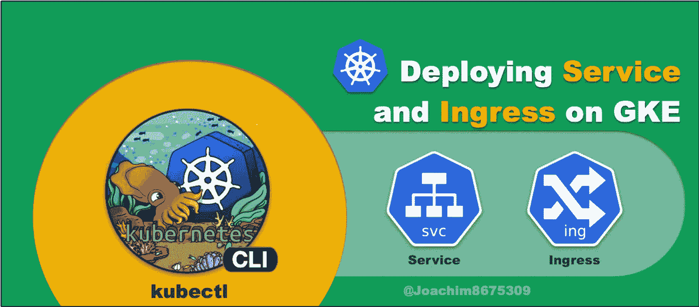
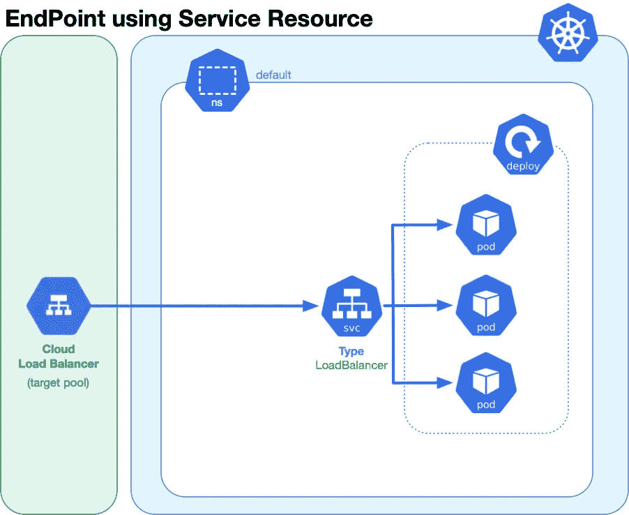
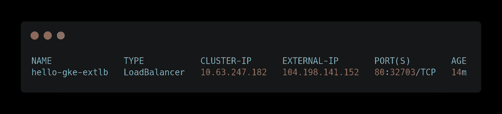
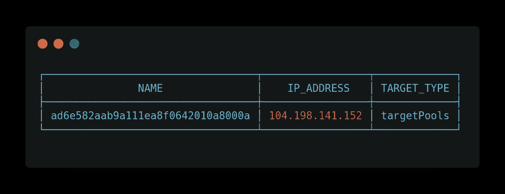
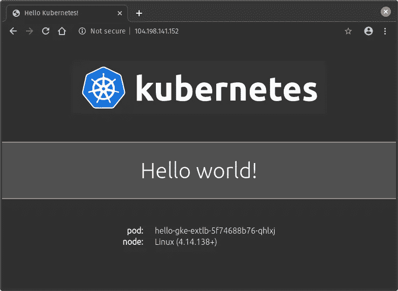
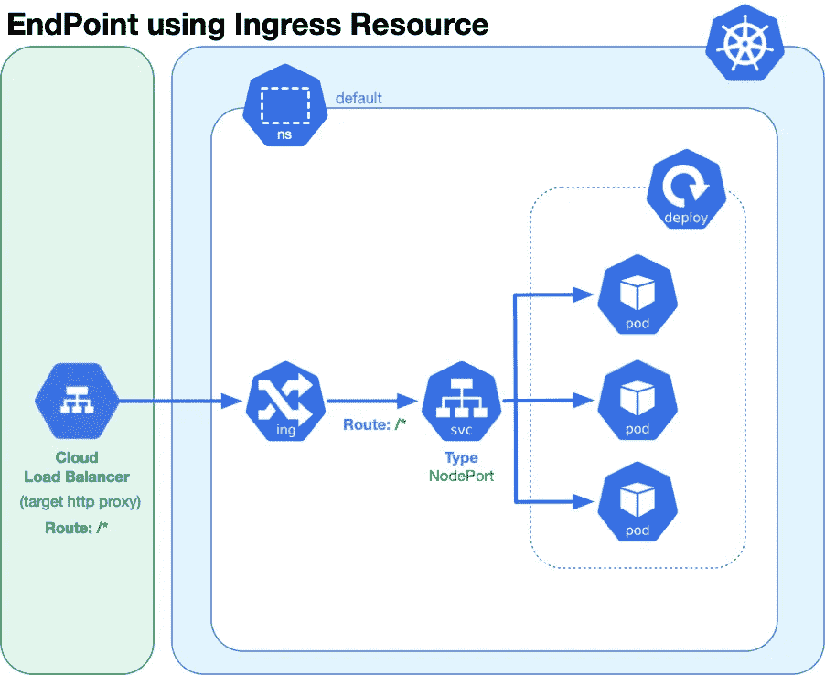
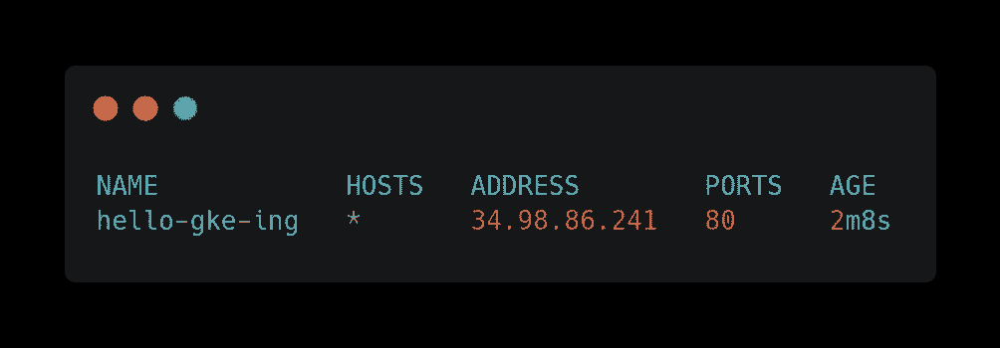
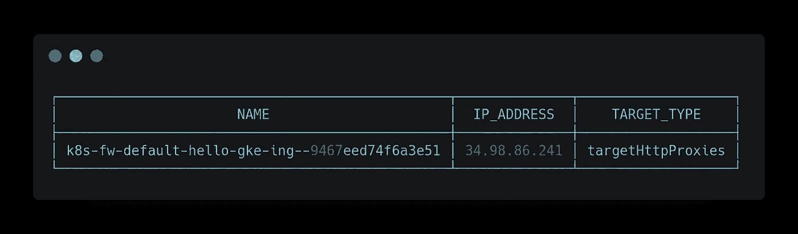
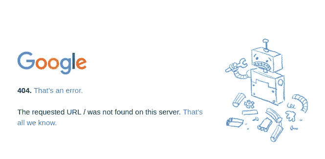
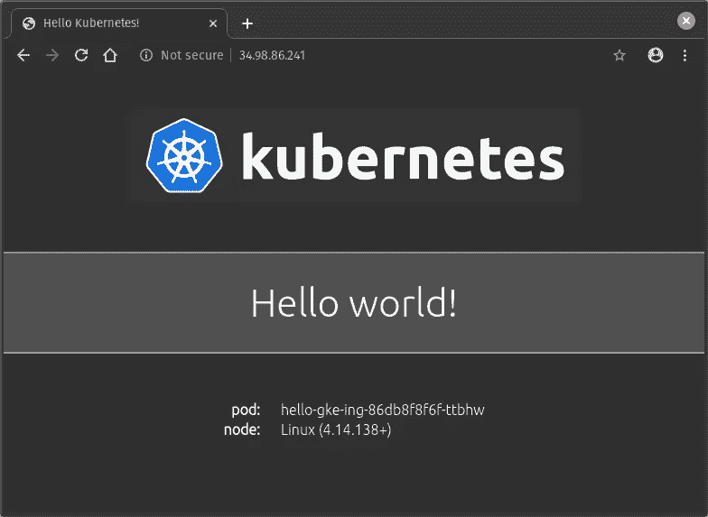

# 在 GKE 部署服务或入口

> 原文：<https://medium.com/google-cloud/deploying-service-or-ingress-on-gke-59a49b134e3b?source=collection_archive---------0----------------------->



## GKE 入门:具有服务和入口的端点

在使用[](https://cloud.google.com/kubernetes-engine)**([**Google Kubernetes 引擎**](https://cloud.google.com/kubernetes-engine) )提供了一个[](https://kubernetes.io)**集群并部署了一个 web 应用程序(如`hello-kubernetes`)之后，我们希望通过一个 [**端点**](https://en.wikipedia.org/wiki/Web_API#Endpoints) 来访问它们。****

****在 [**Kubernetes**](https://kubernetes.io/) 上有两个公共路径可以用于 [**端点**](https://en.wikipedia.org/wiki/Web_API#Endpoints) :****

*   ****一个`LoadBalancer`类型的 [**服务**](https://kubernetes.io/docs/concepts/services-networking/service/) 资源( [**svc**](https://kubernetes.io/docs/concepts/services-networking/service/) )，它将提供一个外部 [**网络负载平衡器**](https://cloud.google.com/load-balancing/docs/network) 。****
*   ****一个 [**入口**](https://kubernetes.io/docs/concepts/services-networking/ingress/) 资源( [**ing**](https://kubernetes.io/docs/concepts/services-networking/ingress/) )，将 web 流量路由到服务。****

# ****以前的文章****

****在以前的文章中，我们讨论了构建或供应 [**GKE**](https://cloud.google.com/kubernetes-engine) 集群。****

## ****使用云 SDK 进行资源调配****

****[](/@Joachim8675309/building-a-gke-with-cloud-sdk-99fee12bf0a6) [## 使用云 SDK 构建 GKE

### 为 Google Kubernetes 引擎提供 Google Cloud SDK

medium.com](/@Joachim8675309/building-a-gke-with-cloud-sdk-99fee12bf0a6) 

## 使用 Terraform 进行供应

[](/@Joachim8675309/building-gke-with-terraform-869df1cd3f41) [## 用地形建造 GKE

### 用 Terraform 提供 Google Kubernetes 引擎

medium.com](/@Joachim8675309/building-gke-with-terraform-869df1cd3f41) 

# 先决条件

您将需要以下工具要求:

*   [**Google Cloud SDK**](https://cloud.google.com/sdk/install) 授权给你的谷歌账户，注册谷歌项目。在本文中，我们将使用虚构的项目`acme-quality-team`。
*   [](https://kubernetes.io/docs/tasks/tools/install-kubectl/)**(读作 *koob-cuttle* )是 Kubernetes 客户端 cli 工具，用于与集群交互并安装 Kubernetes 清单。**

# **建设 GKE 集群**

**在之前的文章中(见上文)，有关于如何使用[**Google Cloud SDK**](https://cloud.google.com/sdk/install)或 [**Terraform**](https://www.terraform.io/) 来配置集群的教程。你可以用它们来做这个练习。**

**如果您想在这个练习中快速上手，可以运行下面的代码:**

```
**gcloud** container clusters create \
  **--num-nodes** 1 \
  **--region us-central1** \
  "a-simple-cluster"
```

**对于一个三节点集群，此过程大约需要 3 分钟，其中一个节点位于`us-central1`中的唯一可用性区域。**

**您可以看到使用以下命令创建的集群和节点:**

```
**gcloud** container clusters list **--filter** "a-simple-cluster"
**gcloud** compute instances list **--filter** "a-simple-cluster"
```

# **具有服务资源的端点**

**服务资源充当代理，路由部署在 [**Kubernetes**](https://kubernetes.io/) 集群内工作节点上的流量指定 pod。为了创建一个 [**端点**](https://en.wikipedia.org/wiki/Web_API#Endpoints) ，我们将使用一个特定的服务类型`LoadBalancer`。这将在 [**谷歌云**](https://cloud.google.com/) 中提供一个第 4 层负载均衡器。**

****

****负载平衡器服务类型为**的服务资源**

## **部署部署控制器**

**我们首先需要使用 [**部署控制器**](https://kubernetes.io/docs/concepts/workloads/controllers/deployment/) 来部署应用程序，以便在我们的集群中部署三个 pod。创建一个名为`hello_gke_extlb_deploy.yaml`的文件，内容如下:**

**使用以下命令进行部署:**

```
**kubectl** apply **--filename** hello_gke_extlb_deploy.yaml
```

## **部署服务负载平衡器类型**

**现在，我们部署一项服务，将流量连接到其中一个 pod。**

**创建一个名为`hello_gke_extlb_svc.yaml`的文件，内容如下:**

**使用以下命令进行部署:**

```
**kubectl** apply **--filename** hello_gke_extlb_svc.yaml
```

## **测试连接**

**您可以通过以下方式检查服务的状态:**

```
**kubectl** get services **--field-selector** metadata.name=hello-gke-extlb
```

**最初，您可能会在`EXTERNAL-IP`列下看到 pending。这意味着 [**谷歌云**](https://cloud.google.com/) 正在提供网络负载平衡器。几分钟后，您应该会看到类似这样的内容:**

****

****ku bectl get 服务的输出****

**我们还可以在集群外的相应网络负载平衡器处达到峰值:**

```
**gcloud** compute forwarding-rules list \
  **--filter** description~hello-gke-extlb \
  **--format** \
  "table[box](name,IPAddress,target.segment(-2):label=TARGET_TYPE)"
```

**它应该会显示如下内容:**

****

**将 IP 地址复制到 web 浏览器中。使用上面的输出，您可以在 web 浏览器中键入:`[http://104.198.141.152](http://104.198.141.152.in)`,然后看到类似这样的内容:**

****

****通过 NLB 的网络浏览器显示****

## **清除**

**您可以通过以下方式删除这些资源:**

```
**cat** hello_gke_extlb_*.yaml | **kubectl** delete **--filename** -
```

# **具有入口资源的端点**

**入口本质上是一个 [**反向代理**](https://en.wikipedia.org/wiki/Reverse_proxy) ，使用公共声明语言(入口资源)来配置规则以将 web 流量路由回服务。实现方式取决于您希望安装的 ingress 控制器，例如[**ingress-nginx**](https://github.com/kubernetes/ingress-nginx)、[**ha proxy-ingress**](https://github.com/jcmoraisjr/haproxy-ingress)、 [**traefik**](https://github.com/containous/traefik) 或 [**ambassador**](https://github.com/datawire/ambassador) 等等。**

**[**GKE**](https://cloud.google.com/kubernetes-engine) 与 [**ingress-gce**](https://github.com/kubernetes/ingress-gce) 捆绑在一起，或者被描述为:**

> **GCE L7 负载平衡器控制器，管理通过 Kubernetes Ingress API 配置的外部负载平衡器。**

****

****节点端口类型的入口资源和服务资源****

## **部署部署控制器**

**使用部署控制器部署 web 应用程序。创建一个名为`hello_gke_ing_deploy.yaml`的文件，内容如下:**

**使用以下命令进行部署:**

```
**kubectl** apply **--filename** hello_gke_ing_deploy.yaml
```

## **部署服务节点端口类型**

**默认的 [**GKE**](https://cloud.google.com/kubernetes-engine) 入口(`gce`)仅适用于`NodePort`或`LoadBalancer`服务类型。由于我们只需要一个 [**端点**](https://en.wikipedia.org/wiki/Web_API#Endpoints) 通过入口，我们将选择`NodePort`。**

**创建一个名为`hello_gke_ing_svc.yaml`的文件，内容如下:**

**使用以下命令进行部署:**

```
**kubectl** apply **--filename** hello_gke_ing_svc.yaml
```

## **部署入口**

**入口可以根据主机名和 URL 路径路由 web 流量。在我们的简单实现中，我们将把所有东西(`/*`)路由到我们指定的服务。然后，该服务会将流量进一步路由到三个可用 pod 中的一个。**

**创建一个名为`hello_gke_ing_ing.yaml`的文件，内容如下:**

**使用以下命令进行部署:**

```
**kubectl** apply **--filename** hello_gke_ing_ing.yaml
```

## **测试连接**

**您可以运行这个命令来查看入口的运行情况:**

```
**kubectl** get ingress
```

**您应该会看到类似这样的内容:**

****

**我们还可以在相应的 http 代理上看到 [**谷歌云**](https://cloud.google.com/) 规定:**

```
**gcloud** compute forwarding-rules list \
  **--filter** description~hello-gke-ing \
  **--format** \
  "table[box](name,IPAddress,target.segment(-2):label=TARGET_TYPE)"
```

**该输出应该类似于以下内容:**

****

**复制 IP 地址并将其输入到浏览器中，例如:web 浏览器中的`http://34.98.86.241`。最初，as 可能会看到一个 404 错误，这可能意味着谷歌仍在设置。**

****

**来自 GLBC 的谷歌 404 错误**

**几分钟后，该 URL 最终应该可以工作了:**

****

****通过 GLBC 的网络浏览器显示****

## **清除**

**您可以通过以下方式删除这些资源:**

```
**cat** hello_gke_ing_*.yaml | **kubectl** delete **--filename** -
```

# **资源**

**这里有一些与本文所涉及的内容相关的文档的参考资料。**

## **博客源代码**

**我把这篇博客中使用的源代码放在这里:**

*   **[https://github . com/darkn 3 rd/blog _ tutorials/tree/master/kubernetes/gke _ 3 _ service _ ingress](https://github.com/darkn3rd/blog_tutorials/tree/master/kubernetes/gke_3_service_ingress)**

## **库伯内特斯**

**这些是 Kubernetes 概念的概述。**

*   ****服务资源**:[https://kubernetes . io/docs/concepts/services-networking/Service/](https://kubernetes.io/docs/concepts/services-networking/service/)**
*   ****入口资源**:[https://kubernetes . io/docs/concepts/services-networking/Ingress/](https://kubernetes.io/docs/concepts/services-networking/ingress/)**
*   ****部署控制器**:[https://kubernetes . io/docs/concepts/workloads/controllers/Deployment/](https://kubernetes.io/docs/concepts/workloads/controllers/deployment/)**

## **GKE(谷歌 Kubernetes 引擎)**

**这些是特定于实施的文档。**

*   ****服务类型负载平衡器**:[https://cloud . Google . com/kubernetes-engine/docs/concepts/Service # services _ of _ Type _ load balancer](https://cloud.google.com/kubernetes-engine/docs/concepts/service#services_of_type_loadbalancer)**
*   ****入口**:[https://cloud . Google . com/kubernetes-engine/docs/concepts/Ingress](https://cloud.google.com/kubernetes-engine/docs/concepts/ingress)**

## **谷歌云**

*   ****云负载均衡**:[https://cloud.google.com/load-balancing](https://cloud.google.com/load-balancing)**
*   ****网络负载均衡**:[https://cloud.google.com/load-balancing/docs/network](https://cloud.google.com/load-balancing/docs/network)**
*   ****HTTPS 负载均衡**:[https://cloud . Google . com/Load-Balancing/docs/https/setting-up-https](https://cloud.google.com/load-balancing/docs/https/setting-up-https)**
*   ****设置网络负载平衡**:[https://cloud . Google . com/Load-Balancing/docs/Network/setting-up-Network](https://cloud.google.com/load-balancing/docs/network/setting-up-network)**
*   ****目标池(L4 LB)**:[https://cloud.google.com/load-balancing/docs/target-pools](https://cloud.google.com/load-balancing/docs/target-pools)**
*   ****目标代理(L7 磅)**:[https://cloud.google.com/load-balancing/docs/target-proxies](https://cloud.google.com/load-balancing/docs/target-proxies)**

# **结论**

**本文的目标是演示如何在 [**Kubernetes**](https://kubernetes.io) 上为您的 web 应用程序添加一个 [**端点**](https://en.wikipedia.org/wiki/Web_API#Endpoints) ，并展示如何将[**【GKE】**](https://cloud.google.com/kubernetes-engine)与 [**Google Cloud**](https://cloud.google.com/) 集成以提供这些 [**端点**](https://en.wikipedia.org/wiki/Web_API#Endpoints) 。**

**我希望这在你的[](https://kubernetes.io)**与 [**GKE**](https://cloud.google.com/kubernetes-engine) 的冒险中有用。在以后的文章中，我将进一步扩展这一点，展示如何集成来自 [**Kubernetes**](https://kubernetes.io) 的 DNS 名称和 TLS 证书的管理。********