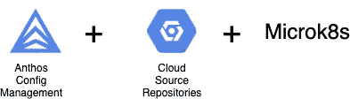
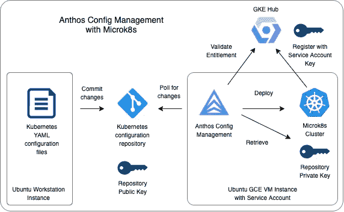

# 使用 Anthos 配置管理部署到 Microk8s

> 原文：<https://medium.com/google-cloud/deploying-to-microk8s-with-anthos-config-management-49a39ac821ce?source=collection_archive---------0----------------------->

[Anthos 配置管理](https://cloud.google.com/anthos/config-management)使您能够为您的混合云和多云 Kubernetes 部署大规模自动化策略和安全性。在高层次上，您将 Kubernetes 代码提交到一个中央 Git 存储库，然后 Anthos Config Management 将代码部署到所有注册的集群。简而言之，Anthos 配置管理允许您将 GitOps 实践引入到多云容器管理的世界中。

基于 GKE 的集群和 [Anthos 附属集群](https://cloud.google.com/anthos/docs/setup/attached-clusters)都支持 Anthos 配置管理，这是一个部署选项，将 Anthos 的范围扩展到运行在其他云环境中的 Kubernetes 集群。虽然我通常使用 GKE 集群，但我决定尝试将 Microk8s 集群附加到 Anthos。 [Microk8s](https://microk8s.io/) 是一个在物联网和边缘环境中看到的 Kubernetes 平台。虽然 Microk8s 本身不是官方支持的 Anthos 平台，但是您可以尝试使用 MicroK8s 来了解更多关于 Anthos 配置管理的知识，并了解它如何为组织带来好处。

该项目使用以下谷歌云服务:

*   [计算引擎](https://cloud.google.com/compute)为单节点 Microk8s 集群提供 Ubuntu 实例。Ubuntu 将使用 [cloud-init](https://cloudinit.readthedocs.io/en/latest/) 安装 Microk8s 并生成 shell 脚本和其他文件以节省时间。
*   [云资源存储库](https://cloud.google.com/source-repositories)将提供基于 Git 的存储库，我们将把工作负载提交给它。
*   [Anthos 配置管理](https://cloud.google.com/anthos/config-management)将执行从存储库到 Microk8s 集群的部署。

# 先来一张图

下面是这些组件如何组合在一起的示意图。

*   创建一个工作站实例，Terraform 从该实例中用于部署四件事情:(1)一个 IAM 服务帐户，(2)一个使用由服务帐户提供的权限的带有 Microk8s 的 Google 计算引擎实例，(3)一个由云源存储库提供的 Kubernetes 配置报告，以及(4)一个公共/私有密钥对。
*   GCE 实例将使用服务帐户密钥向 GKE 中心注册 Microk8s 集群。尽管在本演练中我们将使用 Microk8s 而不是 GKE，但是 GKE 中心作为一个注册点，使集群对 Anthos 可用。
*   公钥/私钥对中的公钥将被注册到存储库中，而私钥将被注册到 Microk8s 集群中。
*   Anthos 配置管理将被配置为指向存储库和分支来轮询更新。
*   当 Kubernetes YAML 文档被推送到存储库的适当分支时，Anthos Config Management 将使用私钥连接到存储库，检测针对分支的提交，获取文件并将文档应用到 Microk8s 集群。

如果你想了解更多，请查看这个库。您将找到关于如何使用 Anthos Config Management 构建如上所示的基础设施并将应用程序部署到 Microk8s 的说明。

# 几句结束语

Anthos 配置管理使您能够将代码从 Git 存储库部署到已经向 Anthos 注册的 Kubernetes 集群。Google Cloud 目前支持 GKE、AKS 和 EKS 集群，但是您也可以尝试其他兼容的集群，包括 Microk8s。

这个例子展示了如何注册一个 Microk8s 集群，以便从云资源存储库提供的存储库中接收部署。您可以将它扩展到更大数量的集群，所有集群都可以从对存储库的提交中接收更新。简而言之，Anthos 配置管理允许您将 Git-ops 实践带到 Kubernetes 部署的世界中。