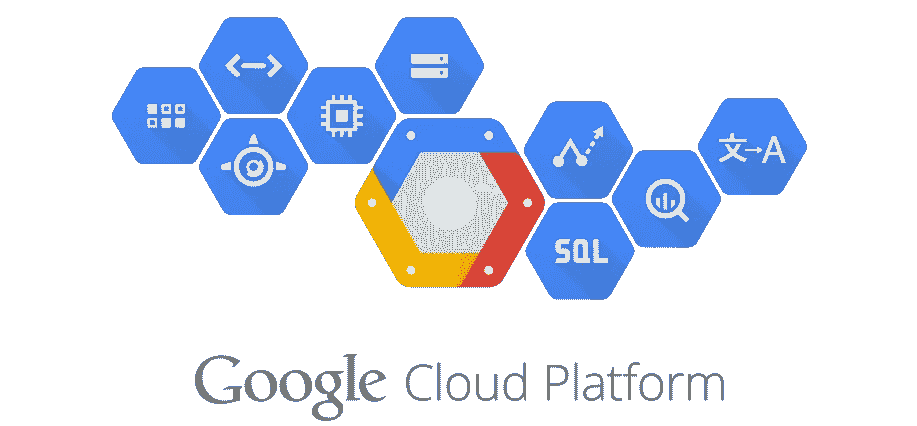
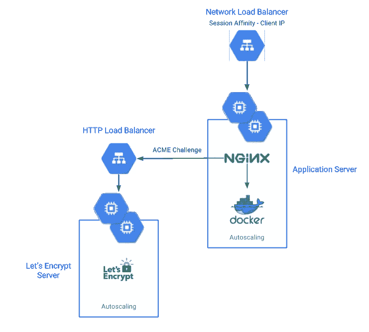

# 使用加密证书将 WebSockets 集群部署到 GCP

> 原文：<https://medium.com/google-cloud/deploying-websockets-cluster-to-gcp-with-lets-encrypt-certificates-5ebb7fc1e245?source=collection_archive---------6----------------------->

部署 WebSockets 集群本身并不是一项简单的任务，您需要一个特殊的负载平衡器，它具有保持连接活动的会话关联性，更不用说向该方添加加密 SSL 证书了。

在这篇文章中，我希望通过分享大量的 bash 代码和我在 GCP 部署 WebSockets 集群的经验，让我们加密 SSL 证书。在这里，我将讨论高级概念，而在 GitHub 资源库中，我将深入探讨低级命令。

让我们从绘制架构开始，以使总体规划尽可能清晰:

架构概述

如您所见，该架构由两个主要组件组成，应用服务器和加密服务器。它们都是受管理的实例组，位于负载平衡器之后。

接下来，让我们深入了解架构的每个部分，我们将从网络负载平衡器开始。这个负载平衡器应该接收来自端口 80 和 443 (HTTP/S)的所有域流量，并将其路由到应用程序实例组。必须为此负载平衡器启用会话关联，以保持 WebSockets 连接路由到同一服务器，否则连接将保持重新连接。我们必须使用网络负载平衡器，因为其他人不支持 WebSockets。此外，一个静态 IP 地址必须连接到这个负载平衡器，这样我们就能够用这个地址更新我们的 DNS 区域文件。

应用服务器运行 Nginx 来处理请求的路由和 SSL 终止。Docker 用于应用程序本身(你的代码！).在初始化时，应用服务器从 Google 云存储中下载相关域的 SSL 证书以及 dhparam.pem 文件(稍后，我将解释它们是如何到达那里的)。Nginx 将所有 ACME challenge HTTP 请求(由 Let's Encrypt 用来验证域)路由到 Let's Encrypt 负载平衡器(该负载平衡器的 IP 存储为项目元数据)。所有其他 HTTP 请求都被重定向到 HTTPS。HTTPS 请求被路由(使用反向代理)到带有应用程序代码的 Docker 映像(代理显然支持 WebSockets)。一个每日 cron 作业被配置为从 GCS 同步证书，并在发生变化时重启 Nginx。

HTTP 负载平衡器是一个简单的负载平衡器，它将所有端口 80 请求路由到 Let's Encrypt 实例组。

让我们加密更新服务器使用`letsencrypt` Docker 映像来触发更新请求，并使用 Apache2 web 服务器来处理 ACME 挑战。Apache2 不需要任何配置，因为它在安装后已经被设置为服务于一个目录。使用 Docker 映像，我们将更新我们的域证书，然后将它们上传到 GCS，GCS 中的相关路径也存储为项目元数据(不要担心，有一个脚本可以处理一切)。目前，我没有设置 cron 作业来自动更新证书，但这是完全可行的。

现在我们已经理解了每一部分，让我们运行一些代码。前往 [GitHub 库](http://bit.ly/2gWsG9B)并克隆项目。项目本身和脚本都有完整的文档记录，所以我只简单解释一下需要做什么。

首先，打开`pre-deploy.sh`，编辑`BUCKET`和`BUCKET_LOCATION`，然后运行脚本。这可能需要一段时间，因为它会生成一个 dhparam.pem 文件，这是一项 CPU 密集型任务。完成后，GCS 中应该有一个全新的 bucket，它包含 dhparam 文件以及一个存储 bucket 路径的新项目元数据。

接下来，我们将部署让我们加密的实例组，因此打开`letsencrypt`目录。如果您愿意，您可以更改一些`deploy.sh`参数，以适应您的使用情况。您必须更改`startup.sh`中的`EMAIL`参数。这封电子邮件将用于注册您的 SSL 证书与让我们加密。现在我们可以运行部署脚本了，应该不会花很长时间，我们就会在 GCP 控制台中看到一个新实例。第一次颁发证书时，我们必须将 DNS 区域文件设置为这个全新实例的外部 IP(我们还不能部署应用程序服务器，因为它们需要证书，这就是为什么我们必须第一次使用这个工具)。然后，SSH 进入实例，请注意，实例完全安装所有东西需要大约 3m 的时间。你可以`tail`安装日志`/var/log/daemon.log`来跟踪进度。安装完成后，我们可以运行更新脚本`sudo /root/renew.sh yourdomain.com`。第一次它可能会问你一些问题，但过一会儿它会颁发证书并将它们上传到 GCS。

现在已经为部署应用程序实例组做好了一切准备。同样，您可以编辑部署参数以满足您的需求。在`startup.sh`中，您必须编辑`DOMAIN`，这当然是应用服务器的域。您还需要编辑`DOCKER_IMAGE`，它应该指向您的应用程序 Docker 图像(如果您想使用，我为演示创建了一个简单的 websockets 服务器)。`DOCKER_PORT`应设置为您的 Docker 映像所显示的端口。保存所有东西并运行`deploy.sh`，同样需要大约 3m 的时间让实例自己安装，但同时我们可以返回到我们的 DNS 区域文件并更新它以指向我们全新的网络负载平衡器。一个静态的 IP 附在上面，应该是改不了的。

就是这样！你现在在 Google 云平台上有了一个正在运行的 websockets 集群，由 Let's Encrypt 提供的免费 SSL 证书保护。如果您觉得缺少了什么或者需要修改，我们非常欢迎您对这个库做出贡献。

*感谢阅读！如果你喜欢这个，请推荐它，这样其他人也可以通过点击心形按钮来欣赏。*

请随时通过 [Twitter](https://twitter.com/idoshamun) 、 [Linkedin](https://il.linkedin.com/in/ido-shamun-aa8628a3) 和这里的 [Medium](/@idoshamun) 联系我。