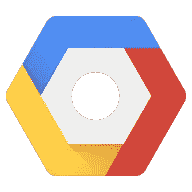

# 在 GCP 上使用 Docker 和 Kubernetes 部署 NodeJS 应用程序

> 原文：<https://medium.com/google-cloud/deploying-your-nodejs-app-with-docker-and-kubernetes-on-gcp-5dee8df5d896?source=collection_archive---------0----------------------->



谷歌云平台

这个教程很容易理解，但是推荐一些技术经验！

# 假设

*   您已经有一个 NodeJS 应用程序
*   你要么使用 GCP [云外壳](https://console.cloud.google.com/cloudshell/)，要么在你的本地外壳上安装`gcloud`、`kubectl`和`docker`
*   您有一个启用了 [Kubernetes 引擎 API](https://console.cloud.google.com/apis/api/container.googleapis.com) 的 GCP 项目

# 配置您的项目

首先，我们需要为您的项目配置一些设置:

```
gcloud config set project kube-tutorial-194819
gcloud config set compute/zone us-west1-a
```

这会将当前项目设置为您的项目(在这种情况下，我的项目是`kube-tutorial-194819`，然后将默认计算区域设置为`us-west1-a`

# 将你的应用归档

现在，我们需要将您的应用程序放入 Docker 容器中，这样我们就可以将它部署到我们将创建的 Kubernetes 集群中。

转到 Node 应用程序的根目录，使用您喜欢的 shell 编辑器创建一个`Dockerfile`和`.dockerignore`文件:

`nano Dockerfile`并把这作为它的内容:

```
FROM node:carbon

WORKDIR /usr/src/app

COPY package*.json ./

RUN npm install

COPY . .

EXPOSE 8080
CMD [ "npm", "start" ]
```

这个 Docker 映像获取 Node 的最新版本，然后更改目录，复制`package.json`文件，运行`npm install`，复制所有内容，并运行`npm start`来启动您的应用程序监听端口 8080。你可以在这里找到更多关于这个[的细节](https://nodejs.org/en/docs/guides/nodejs-docker-webapp/)。

接下来，我们将制作我们的`.dockerignore`文件:

`nano .dockerignore`

```
node_modules
npm-debug.log
```

像`.gitignore`一样，`.dockerignore`文件告诉系统在构建时要忽略哪些文件和目录。

## 上传你的码头图片到 GCR

现在让我们构建我们的映像，并将其部署到 [Google 容器注册表](https://cloud.google.com/container-registry/)！

`docker build -t gcr.io/kube-tutorial-194819/kube-tutorial:latest .`

这用标签建立了我们的形象:

`gcr.io/kube-tutorial-194819/kube-tutorial:latest`

该标签的格式为`gcr.io/[PROJECT_ID]/[APP_NAME][:version]`

我们用`gcr.io/[PROJECT_ID]`开始图像的标签是很重要的，这样 Docker 就知道我们会把图像推到哪里。

接下来，我们将继续推进我们的私有容器注册表:

`gcloud docker -- push gcr.io/kube-tutorial-194819/kube-tutorial`

# 部署到 Google Kubernetes 引擎

既然我们的应用程序已经 Dockerized，我们可以设置我们的部署。

```
gcloud container clusters create kube-tutorial
gcloud container clusters get-credentials kube-tutorial
```

这将创建一个名为`kube-tutorial`的集群，然后验证我们的 shell 以使用该集群。

最后，我们将在群集上运行部署:

```
kubectl run kube-tutorial \
--image gcr.io/kube-tutorial-194819/kube-tutorial:latest \
--port 8080
```

这将创建部署，并使用我们刚刚推送到容器注册中心的映像将其命名为`kube-tutorial`，然后指定我们将公开的端口为 8080。现在让我们向世界展示我们的部署:

```
kubectl expose deployment kube-tutorial --type "LoadBalancer"
```

现在我们的应用程序已经部署好了！要找到负载平衡器给我们的外部 IP，请运行以下命令:

```
kubectl get service kube-tutorial
```

您可能会将<pending>视为外部 IP，但请稍等片刻，然后重新运行该命令，最终您会看到它。继续将那个外部 IP 地址输入到你的浏览器中，添加`:8080`来指定端口。</pending>

# 摘要

*   在本教程中，我们学习了如何 Dockerize 你的 NodeJS 应用程序。
*   然后，我们将 Docker 图像上传到 Google 容器注册表。
*   最后，我们将这个映像部署到 Google Kubernetes 引擎上的一个 Kubernetes 集群中。

# 走向

下次我们将了解 Kubernetes 的版本控制，以及将更新部署到您的应用程序是多么容易！

如有疑问，在下方评论！