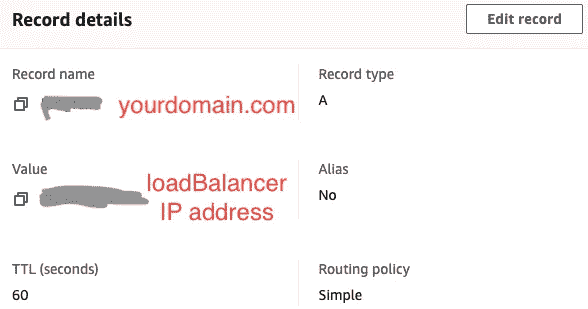

# 部署管理器:生产就绪的 Web 应用程序

> 原文：<https://medium.com/google-cloud/deployment-manager-production-ready-web-application-c5ec68b070a6?source=collection_archive---------0----------------------->

我们将使用**谷歌云部署管理器**创建一组谷歌云资源、**谷歌云存储**以及 **HTTPS 负载平衡**，并将它们作为一个单元进行管理，以提供来自定制域的静态内容。

[**停止这种疯狂，立刻给我看全部代码**](https://github.com/luillyfe/website-IoC)

目标将类似于这里的，因为我们将做几乎相同的事情，但是这次使用**部署管理器**工具并设置 **https 负载平衡器**。

## 先决条件

启用 google 部署管理器 API 和 Google 计算 API，并设置您的 Google 帐户和项目。

## 为什么？

> 我们希望以声明式/结构化的方式定义资源，将它们作为一个单元进行分组，并创建一个任何人都可以轻松复制并获得一致结果的环境。

[真诚媒体](https://unsplash.com/@sincerelymedia?utm_source=medium&utm_medium=referral)在 [Unsplash](https://unsplash.com?utm_source=medium&utm_medium=referral) 上拍摄的照片

请记住，每个资源都有:

**资源定义. yaml**

## 逐步地

*   创建一个**桶**
*   将您的生产申请提交到您的**桶**
*   设置一个**负载平衡器**和 **SSL 证书**(由 google 管理)
*   将你的**负载平衡器**连接到你的**铲斗**
*   使用 A 记录将您的域指向您的**负载平衡器**

> 我不知道你是否意识到，但是写作很难。因此，我将采取不同的方法。我将把模板文件分解成可读的代码片段，而不是用文字来解释，这样你就可以对它们在做什么有一定的了解。

# 创建存储桶

**Google 存储桶托管我们的静态 web 应用**

## 将您的生产应用程序同步到桶

**gcloud 命令将您的构建文件同步到 bucket**

## 向互联网公开您的应用程序

**公开我们的桶的内容**

## 分配专业页面

**页面后缀 index.html**

# 设置负载平衡器和 SSL 证书

> “Google Cloud 可能需要 60-90 分钟来提供证书，并通过负载平衡器使站点可用。”

## 配置后端服务

**后端桶**

## 配置主机规则和路径匹配器(URL 映射)

**网址地图**

## 配置前端服务

**全局转发规则**

**全球地址**

**SSL 证书**

**目标 HTTPS 代理**

## 部署资源

**预览您的部署**

**提交您的部署**

## 将您的域连接到负载平衡器

我们必须在我们的域名和负载平衡器 ip 地址之间建立一种关系，希望对我们来说这就是 A 记录(IPv4)的用途。

**一条记录**

下图向我们展示了亚马逊 53 号公路上 **A 记录**的样子:

亚马逊路线 53 的记录

检查我们的 SSL 证书状态怎么样？

## 有用的链接

 [## 托管静态网站|云存储|谷歌云

### 编辑描述

cloud.google.com](https://cloud.google.com/storage/docs/hosting-static-website)  [## 静态网站示例和提示|云存储|谷歌云

### 本页展示了使用桶来托管静态网站的例子和提示。索引页面(也称为网络服务器…

cloud.google.com](https://cloud.google.com/storage/docs/static-website)