# 利用数据融合和 Composer 设计 GCP 数据湖

> 原文：<https://medium.com/google-cloud/designing-a-data-lake-on-gcp-with-data-fusion-and-composer-e2ea0a753525?source=collection_archive---------1----------------------->

随着越来越多的组织将其数据平台迁移到云，也需要云技术来利用组织中的现有技能，同时确保成功迁移。

在许多组织中，ETL 开发人员通常是数据团队的重要组成部分。这些开发人员精通基于 GUI 的 ETL 工具以及复杂 SQL 的使用，并且已经或正在开始开发 Python 等语言的编程技能。

在这个由 3 部分组成的文章系列中，我将分享

*   一个可扩展的数据湖架构，用于在谷歌云平台(GCP)上存储和消费结构化数据，使用适合上述技能组合的数据集成和编排服务*【本文】*
*   [详细的解决方案设计](https://nehajo.medium.com/building-a-data-lake-on-gcp-using-data-fusion-and-composer-49d1ba4b1d73)使用数据融合和 Cloud Composer 轻松扩展接收
*   通过云数据目录实现数据湖的可发现性*【即将推出】*

我将在不久的将来为那些可能对重用感兴趣的人发布这个解决方案的代码。请查看这篇文章的更新，其中包含代码的链接。

## **谁会觉得这篇文章有用**

本系列文章将对解决方案架构师和设计人员有所帮助，他们可以开始使用 GCP，并希望在 GCP 建立一个数据平台/数据湖。

## **用例的关键需求**

在设计架构时，我考虑了一些宽泛的要求。这些细节如下:

1.  利用组织中现有的 **ETL 技能集**

2.从**混合源**获取，如本地 RDBMS(如 SQL Server、Postgres)、平面文件和第三方 API 源。

3.在作业编排中支持**复杂的依赖关系管理**，不仅针对摄取作业，还包括定制的摄取前和摄取后任务。

4.设计一个**精益**代码库和配置驱动的摄取管道

5.启用数据**可发现性**，同时仍然确保适当的访问控制

# 解决方案架构

为满足上述要求而设计的数据湖架构如下所示。该架构中涉及的关键 GCP 服务包括数据集成、存储、编排和数据发现服务。

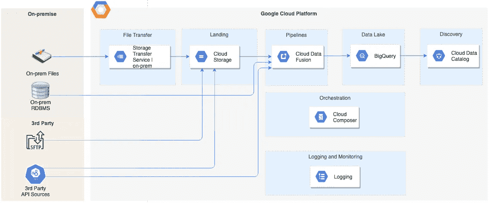

*数据湖架构*

# 工具选择的注意事项

GCP 提供一套全面的数据和分析服务。每个功能都有多个服务选项，服务的选择需要架构师和设计人员考虑一些适用于他们独特场景的方面。

在下面的部分中，我描述了在选择数据湖体系结构中使用的不同类型的服务时要考虑的因素，以及我最终选择每种类型的服务背后的基本原理。

不同服务组合的架构设计有多种方式，这里描述的只是其中一种方式。根据您独特的需求、优先级和考虑事项，有其他方法可以在 GCP 上构建数据湖。

# 数据集成服务

下面的决策树详细说明了在 GCP 上选择数据集成服务时需要考虑的因素。

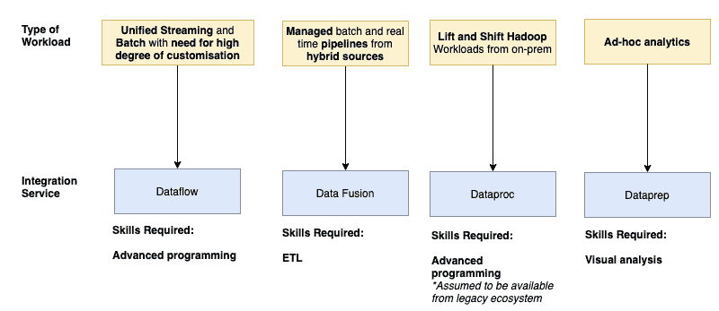

*GCP 数据集成服务方案及选择考虑*

**选择集成服务**

对于我的使用案例，数据必须从各种数据源获取，包括本地平面文件和 RDBMS，如 Oracle、SQL Server 和 PostgreSQL，以及第三方数据源，如 SFTP 服务器和 API。预计未来源系统的种类将会增加。此外，这是为其设计的组织在其数据和分析团队中有很强的 ETL 技能。

考虑到这些因素，选择[云数据融合](https://cloud.google.com/data-fusion)来创建数据管道。

**什么是云数据融合？**

[云数据融合](https://cloud.google.com/data-fusion)是一种基于 GUI 的数据集成服务，用于构建和管理数据管道。它基于 [CDAP](https://github.com/cdapio/cdap) ，这是一个为内部和云资源构建数据分析应用的开源框架。它为 GCP、其他公共云和内部资源提供了各种现成的连接器。

下面是数据融合中一个简单管道的截图。

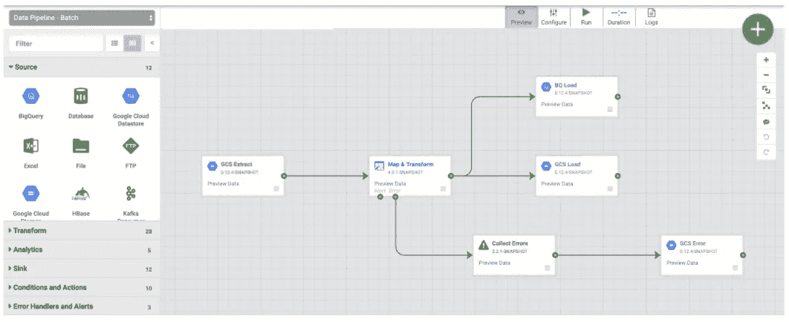

*样本数据融合管道*

**引擎盖下是什么？**

在幕后，数据融合在一个 [Dataproc](https://cloud.google.com/dataproc) 集群上执行流水线。每当执行管道时，数据融合会自动将基于 GUI 的管道转换为 Dataproc 作业以供执行。它支持两个执行引擎选项:MapReduce 和 Apache Spark。

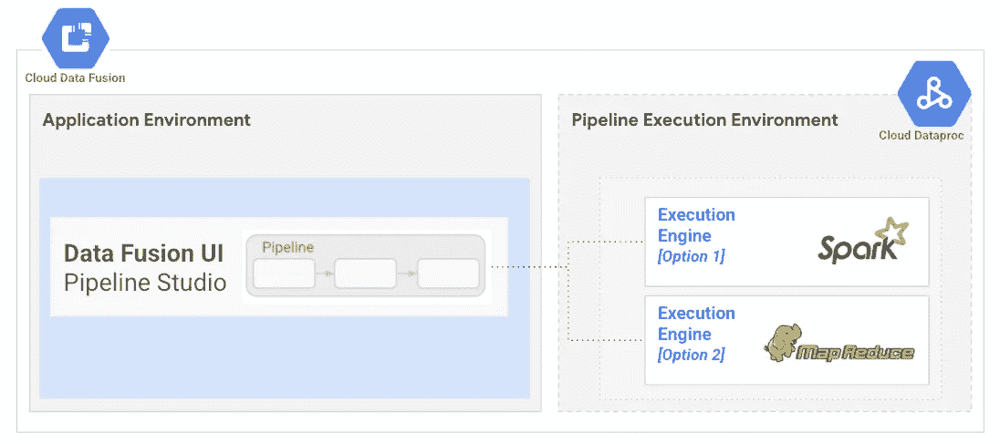

*数据融合:引擎盖下*

利用数据融合，您还能做些什么？

除了能够创建基于无代码 GUI 的管道之外，数据融合还提供了可视化数据分析和准备功能、简单的编排功能以及管道的粒度沿袭。

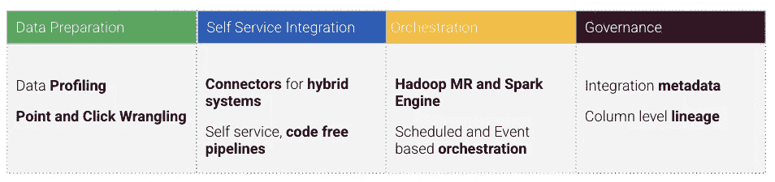

*数据融合提供的功能*

# 管弦乐编曲

下面的决策树详细说明了在 GCP 上选择流程编排服务时需要考虑的事项。

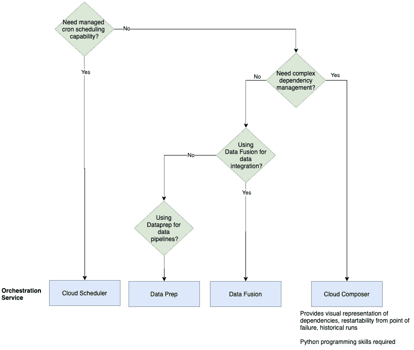

*GCP 上的编排选项和选择考虑事项*

我的用例需要管理复杂的依赖关系，比如聚合和分散的执行控制。此外，访问历史运行和日志等操作信息的 UI 功能，以及从故障点重新启动工作流的功能也很重要。由于这些需求，[云作曲家](https://cloud.google.com/composer)被选为编排服务。

**什么是云作曲家？**

[Cloud Composer](https://cloud.google.com/composer) 是一款完全托管的工作流编排服务。它是开源的 Apache Airflow 的托管版本，并与许多其他 GCP 服务完全集成。

气流中的工作流以 [**有向无环图**](https://airflow.apache.org/docs/apache-airflow/stable/concepts.html#dags) **(DAG)的形式表示。**DAG 只是一组需要执行的**任务**。下面是一个简单的气流 DAG 的截图。

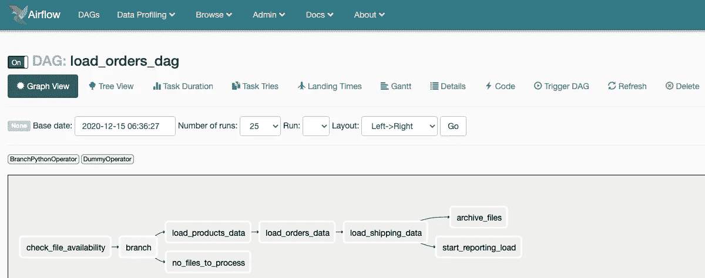

*样本合成器(气流)DAG*

使用 Python 定义气流 Dag。

[*这里的*](https://cloud.google.com/composer/docs/how-to/using/writing-dags) *是一个关于你如何能够* [*写出你的第一个 DAG*](https://cloud.google.com/composer/docs/how-to/using/writing-dags) *的教程。有关更详细的阅读，请参见 Apache Airflow 文档中的* [*教程*](https://airflow.apache.org/docs/apache-airflow/stable/tutorial.html) *。*气流[操作员](https://airflow.apache.org/docs/apache-airflow/stable/concepts.html#operators)用于在 DAG 中执行任务。气流运营商可用于大量 GCP 服务以及其他公共云。不同的 [GCP 操作器](http://airflow.apache.org/docs/apache-airflow-providers-google/stable/operators/cloud/index.html)见[该气流文件页](http://airflow.apache.org/docs/apache-airflow-providers-google/stable/operators/cloud/index.html)。

# 数据融合和 Composer 之间的职责分离

在概述的数据湖解决方案中，[数据融合](https://cloud.google.com/data-fusion)纯粹用于从源到目的地的数据移动。 [Cloud Composer](https://cloud.google.com/composer) 用于编排数据融合管道以及在数据融合之外执行的任何其他定制任务。可以为诸如审计日志记录、将数据字典应用于表、归档文件或自动化集成生命周期中的任何其他任务之类的任务编写定制任务。这将在本系列的下一篇文章中详细描述。

# 数据湖存储

数据湖的存储层需要考虑接收的数据的性质及其用途。下图(鸣谢 [GCP 网站](https://cloud.google.com/solutions/data-lifecycle-cloud-platform#store))提供了基于这些考虑因素的存储服务选择决策树。

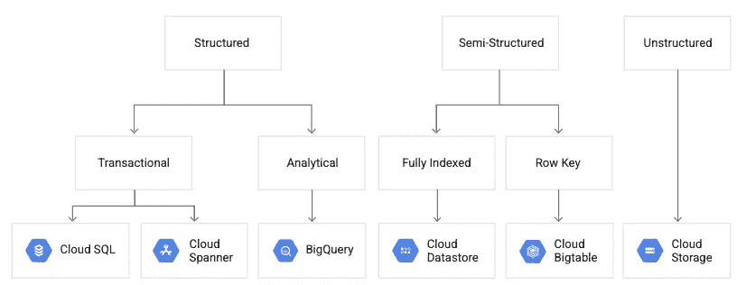

***演职员表:图片来自*** [***GCP 网站***](https://cloud.google.com/solutions/data-lifecycle-cloud-platform#store) ***。****GCP 上的数据库选项以及何时使用哪个服务*

由于本文旨在解决将用于分析用例的结构化数据的解决方案架构，因此 GCP [BigQuery](https://cloud.google.com/bigquery) 被选为该数据湖解决方案的存储服务/数据库。

# 数据发现

[云数据目录](https://cloud.google.com/data-catalog)是数据发现的 GCP 服务。这是一个完全托管和高度可扩展的数据发现和元数据管理服务，可从 BigQuery、PubSub 和 Google 云存储中自动发现技术元数据。

使 BigQuery、云存储和 PubSub 中的数据资产在数据目录中可用不需要额外的流程或工作流。数据目录自我发现数据资产，并使其可供用户进一步发现。

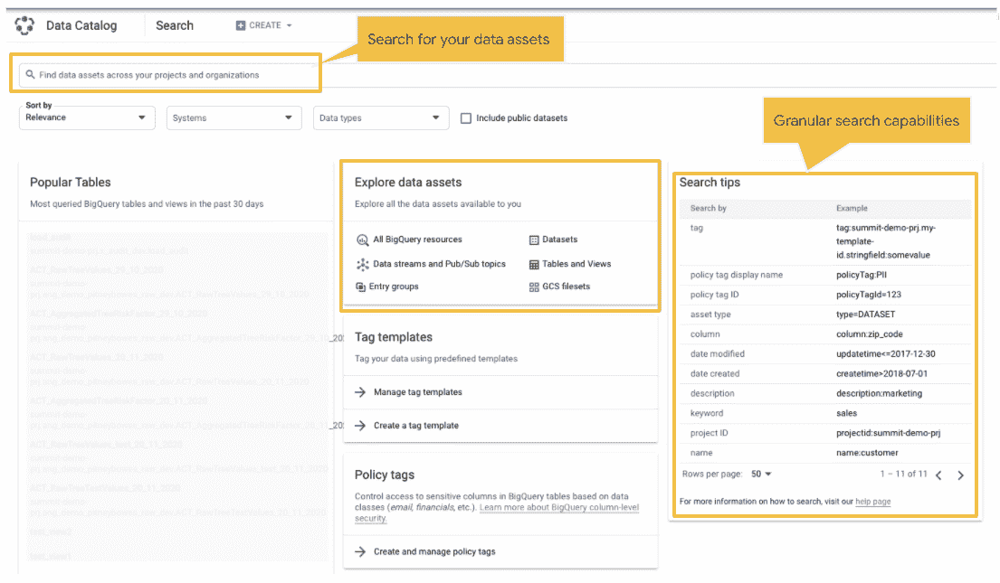

*GCP 数据目录*

# 再次一瞥建筑…

既然我们对选择数据融合和 Cloud Composer 服务的原因有了更好的理解，架构的其余部分就不言自明了。

我想谈及的另外一个方面是选择 GCS 着陆层的原因。

*数据湖架构*

## 在 GCS 上登陆还是不登陆档案？

在该解决方案中，来自本地平面文件和 SFTP 的数据在被吸收到湖中之前被放入 [Google 云存储](https://cloud.google.com/storage)中。这是为了满足只允许集成服务访问选择性文件的要求。这是为了防止任何敏感文件暴露在数据湖中。

下面是一个决策矩阵，其中包含了在将文件加载到 BigQuery 之前决定是否将文件放在 GCS 上时需要考虑的几点。很有可能你会看到这些因素的组合，你决定采取的方法将是对所有这些因素都适用的方法。

**源系统:内部部署和 SFTP 文件**

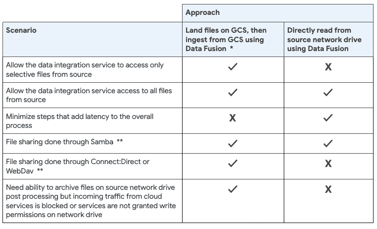

情景和方法

**使用 GCP 云* [*本地存储传输服务*](https://cloud.google.com/storage-transfer/docs/on-prem-overview) *，或者通过编写在本地运行的定制脚本，可以将文件从网络驱动器复制或移动到 GCS。*

***支持 Samba，但不支持其他共享文件的协议/工具，如 Connect:Direct、WebDav 等。*

**源系统:第三方 API**

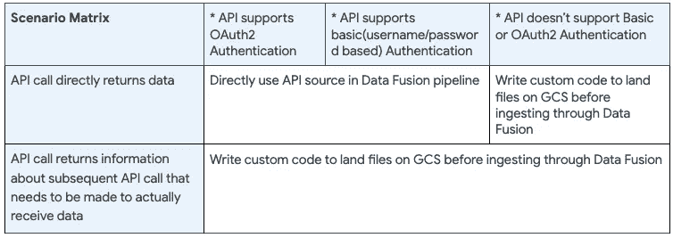

*决策矩阵*

** API 源的数据融合现成源连接器(即 HTTP 源插件)支持源 API 的基本认证(基于 id/密码)和基于 OAUTH2 的认证。*

关系数据库管理系统

对于来自内部 RDBMS 系统的数据，该体系结构中没有使用着陆区。数据融合管道使用现成的 JDBC 连接器直接从源 RDBMS 读取数据。这是因为在这些源中没有敏感数据需要被限制进入数据湖。

# 外卖食品

总而言之，GCP 为数据和分析提供了一套全面的服务，每项任务都有多种服务选项。在决定哪种服务选项适合您的独特情况时，您需要考虑一些会影响您所做选择的因素。

在本文中，我提供了一些您需要考虑的因素，以便根据您的需求来决定合适的 GCP 服务，从而设计一个数据湖。

此外，我还描述了数据湖的 GCP 体系结构，该体系结构从各种混合来源吸收数据，ETL 开发人员是技能集可用性的关键角色。

# 接下来呢？

在本系列的下一篇文章中，我已经详细描述了将结构化数据接收到基于本文详述的架构的数据湖中的解决方案设计。