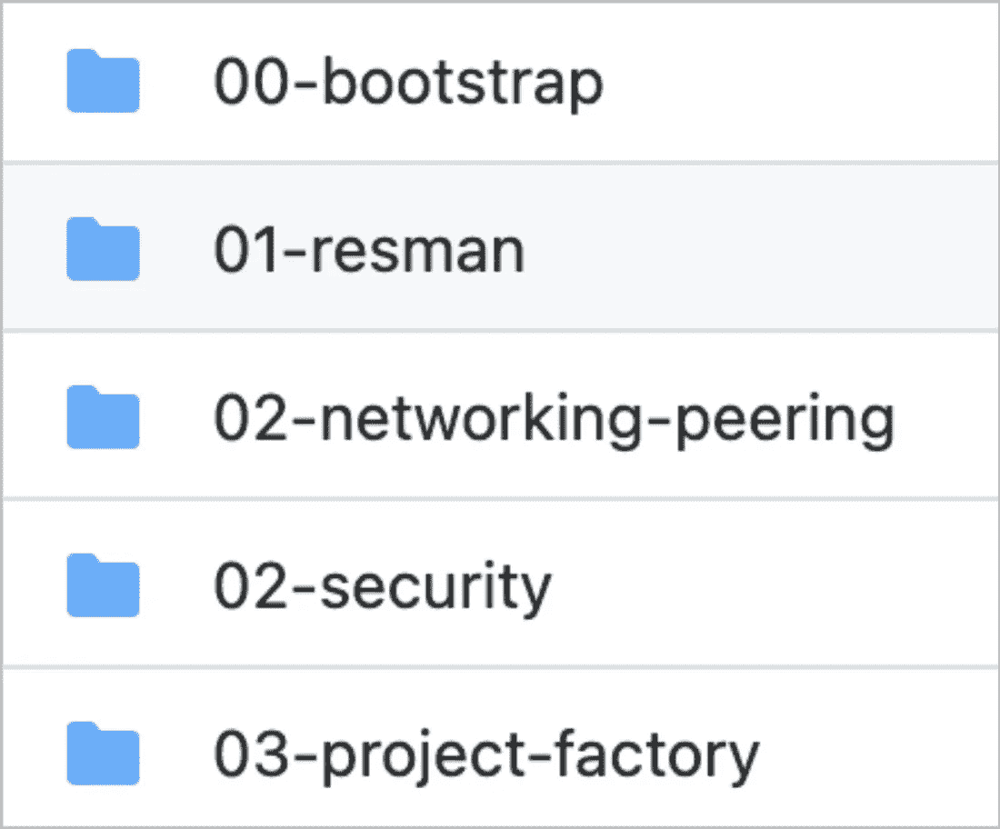
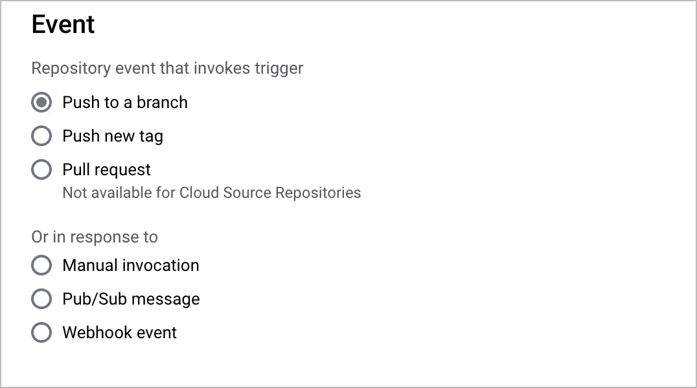
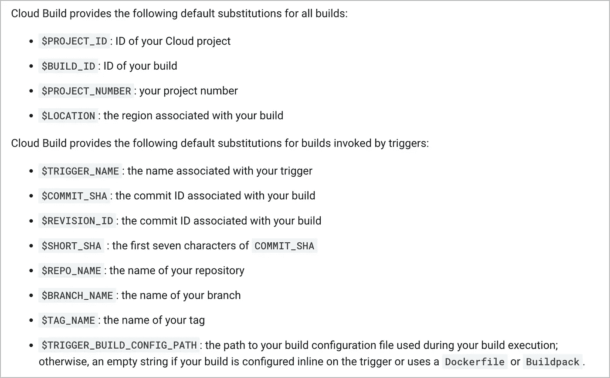
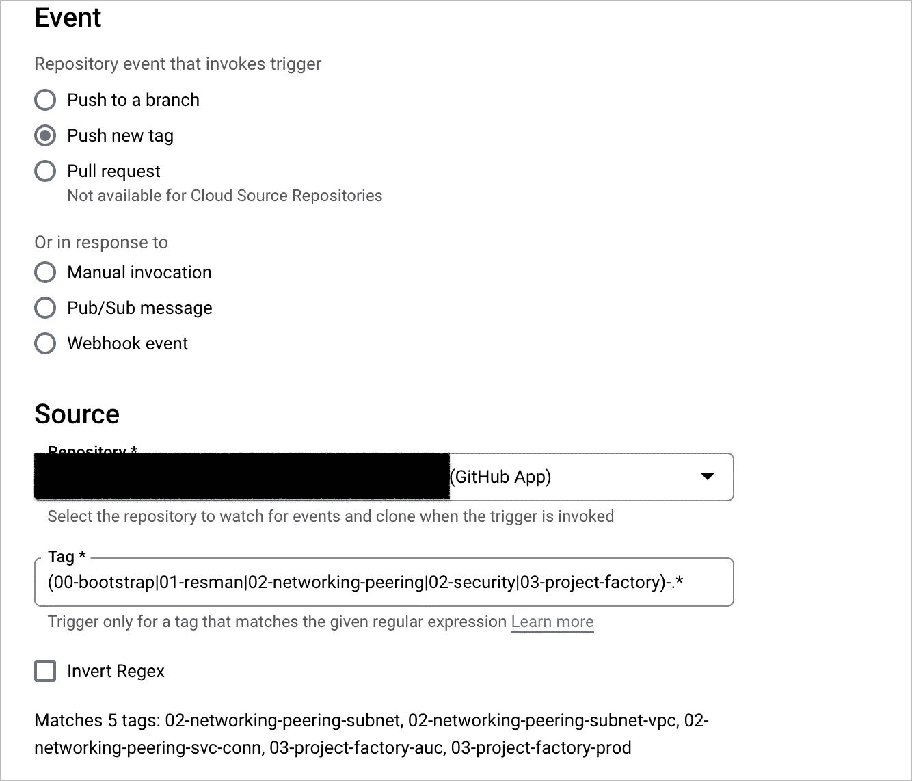
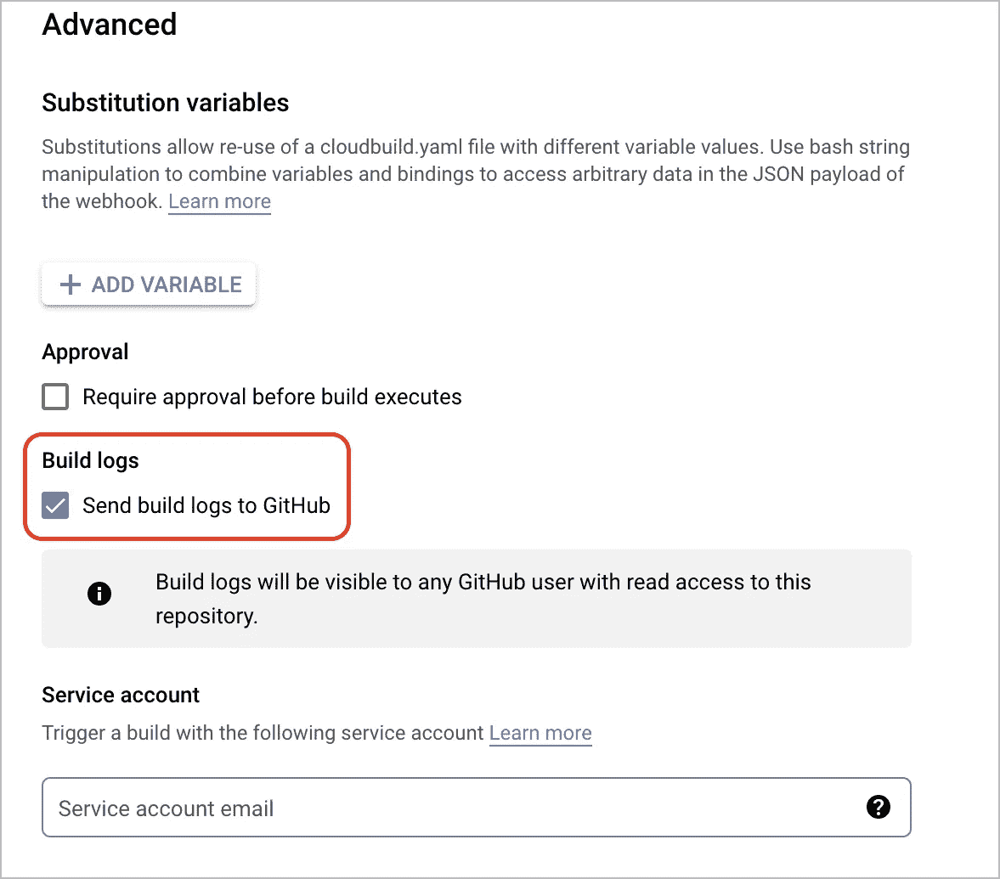

# 使用 Git 标签和 Google Cloud Build 为基于文件夹的 Terraform 代码设计 CI/CD 管道

> 原文：<https://medium.com/google-cloud/designing-ci-cd-pipeline-for-folder-based-terraform-code-using-git-tags-and-google-cloud-build-10283620ae78?source=collection_archive---------3----------------------->


[绿色变色龙](https://unsplash.com/@craftedbygc?utm_source=medium&utm_medium=referral)在 [Unsplash](https://unsplash.com?utm_source=medium&utm_medium=referral) 上的照片

本文假设读者有一些使用 Terraform、GitHub 和 Google Cloud Build 的经验。让我们快速更新一下关于 Google Cloud Build 的知识。Google Cloud Build 是由 Google 提供的无服务器构建、测试和部署平台，可帮助用户:

*   跨所有编程语言快速构建软件，包括 Java、Go、Node.js 等等
*   跨多个环境部署，例如虚拟机、无服务器、Kubernetes 或 Firebase
*   在您的私有网络中访问云托管的完全受管 CI/CD 工作流
*   通过数据驻留将静态数据保留在某个地理区域或特定位置

要更详细地了解 Google Cloud Build，请参考官方产品链接:

[](https://cloud.google.com/build) [## 云构建无服务器 CI/CD 平台|谷歌云

### 发送反馈在我们的无服务器 CI/CD 平台上构建、测试和部署。新客户可获得 300 美元的免费积分，用于…

cloud.google.com](https://cloud.google.com/build) 

# **什么是“基于文件夹”的地形代码？**

让我们首先理解我们所说的“基于文件夹”的 Terraform 代码是什么意思。简单来说，基于文件夹的 terraform 代码将有多个文件夹，每个文件夹包含一些 Terraform 代码。文件夹通常用于隔离和独立管理属于不同应用程序或服务的 Terraform 代码。对于在彼此之间共享 terraform 输出的服务来说，将所有这些服务文件夹放在同一个 Git 存储库下是理想的。例如，我们可以为引导、资源管理、网络、安全和项目工厂服务对 Terraform 代码进行分组。所有这些文件夹都位于为设置登录区而创建的 git 存储库的根目录下。请参考下面的截图:



# **挑战**

由于这种文件夹结构，我们将不得不进入每个文件夹并执行所需的 Terraform 命令。由于我们使用 Google Cloud Build 作为我们的 CICD 平台，我们需要一种方法来告诉 Cloud Build 它需要导航到哪个文件夹来运行 terraform init，计划和应用命令。

以下是我们可以使用的不理想的替代方案或方法的总结:

1.  对于 N 个文件夹，我们可以创建相应的 N 个云构建触发器，每个触发器都有各自的文件夹路径，在[用户定义的替换](https://cloud.google.com/build/docs/configuring-builds/substitute-variable-values#using_user-defined_substitutions)中，如“_WORKSTREAM_PATH”。这些触发器的触发事件将是主分支或主分支的“推送至分支”。这种方法的问题在于它根本不是动态的。随着文件夹数量的增加，管理相应的云构建触发器变得越来越困难。此外，每当对主分支/主分支的提交被合并时，所有 N 个云构建触发器将被同时执行，而不管由此对其他服务的任何可能影响
2.  创建以 N 个文件夹命名的 N 个分支也不是一个好主意，因为我们必须分别管理这 N 个分支。处理不断增加的文件夹数量和分支合并将是一场噩梦(仅举几例)

# **解决方案**

如果我们仔细观察可用于云构建触发器的事件触发器选项，我们可以看到以下内容:



如果我们探索“推送新标签”选项，会怎么样？

每当 git 标签被推送到已经为其创建了云构建触发器的相应 git 存储库时,“Push new tag”事件调用云构建触发器。当 git 标签被推送到 git 存储库时，连接的云构建触发器在它的一个名为“$TAG_NAME”的替换中捕获标签名称。除了这种替换，云构建还捕获以下默认替换:



要了解更多关于云构建替换的信息，请点击这里的链接。

由于 Cloud Build 在替换“$TAG_NAME”中捕获标记名，我们可以用我们的 Terraform 文件夹之一来命名标记。这是传达云构建 CICD 管道应该使用哪个 Terraform 文件夹来运行所需的 Terraform 命令的一种非常容易和简单的方式。对于前面显示的文件夹结构图，git 标记名可以采用以下格式:

*   02-联网-对等-201768
*   00-自举测试
*   03-项目-工厂-产品
*   02-安全-scc

在云构建触发器中，我们可以使用以下正则表达式来确保只有所需的标记名调用云构建触发器:

*(00-bootstrap | 01-resman | 02-networking-peering | 02-security | 03-project-factory)。**

同样的可以在下面的截图中看到:



我们可以再次确保使用带有以下正则表达式的简单 shell 命令从 cloudbuild.yaml 中的 git 标记获得正确的 stage/folder 名称:

```
$ echo "$TAG_NAME" | egrep -o "(00-bootstrap|01-resman|02-networking-peering|02-security|03-project-factory)" > EXTRACTED_TAG
```

# 完整的 CI/CD 战略

首先，我们需要为每个阶段/文件夹创建一个拉请求触发器。在这些触发器中，必须将 _WORKSTREAM_PATH 用户定义的替换设置为相应的阶段/文件夹。例如，如果我们有 5 个阶段，那么我们将需要相应的 5 个拉请求触发器。这些拉请求触发器将按特定顺序执行 terraform init、terraform validate 和 terraform plan。

我们希望每个阶段/文件夹都有单独的拉请求触发器，以确保它们相互之间是解耦的。如果所有阶段都有一个管道/触发器，那么其中一个阶段的代码错误会阻塞整个管道，从而无法对其他阶段进行更改。解耦管道的变更可以在每个阶段独立展开。此外，如果我们只有一个用于所有阶段的 CICD 管道，将需要很多时间来完成它的执行。随着每个服务文件夹中资源数量的增加，CICD 管道的执行时间会持续增加。

Cloud Build 有一个方便的特性，我们可以将构建日志发送到 GitHub，这样您就可以在 pull 请求中直接看到执行日志。下面的屏幕截图显示了启用的选项:



一旦我们对 terraform 计划感到满意，我们就可以继续合并拉取请求。合并拉请求不会自动触发 terraform 应用管道。这是因为我们已经创建了一个云构建触发器，该触发器仅在推送 git 标签时被调用，而不是将提交推送到分支。

现在，为了对您最近推送/合并的提交运行 terraform apply，我们需要为相应的阶段/文件夹推送一个标记，该阶段/文件夹的更改请求是为其提出的。有两种方法可以做到这一点:

1.  我们可以使用 GitHub 控制台发布带有所需标签的版本。**注意:**根本不需要创建一个发布来推送标签。只有在使用 GitHub 控制台时，这才是必需的
2.  我们可以使用 git 命令来推送所需的标签。使用以下命令来完成此操作:

```
$ git tag <tag_name>
$ git push origin <tag_name>
```

一旦推送标签，将调用云构建触发器，该触发器将使用标签名称导航到正确的文件夹，以执行 terraform apply 命令以及 terraform init 和 terraform plan。

# **云构建 yaml 文件示例**

## **拉请求 yaml 文件**

## 推送标签 yaml 文件