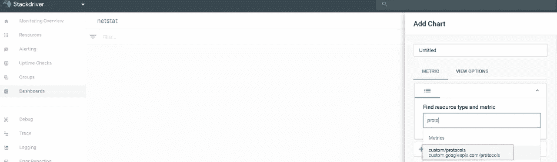

# 使用 Stackdriver 进行详细的网络监控

> 原文：<https://medium.com/google-cloud/detailed-network-monitoring-with-stackdriver-ca712f4d12b7?source=collection_archive---------1----------------------->

你经历了一次大规模的网络中断，太好了...网络智囊团深入研究了日志文件，很快意识到他们必须处理的只是一般的连接超时日志消息。除此之外的一切都是猜测。很明显出了问题，但是如果没有详细的主机到主机级别的 TCP/IP 跟踪，此类事件的通常结果是令人沮丧的“让我们添加详细的网络监控并等待它再次发生”。

上述场景凸显了网络故障排除能力的普遍缺陷。网络流量事件转瞬即逝，几乎不留痕迹。这样做有一个很好的理由:如果一个典型的 Linux 服务器中的所有网络指标都被记录下来，那么数据量将是巨大的。然而，Stackdriver (SD)等远程监控系统可以通过收集、组织和聚合大量指标数据来提供帮助。它还提供图表来轻松检测异常值，并在使用警报时提前向您发出警告。

SD 服务使用安装在受监控虚拟机上的代理，收集重要指标并将其传输到运行在 Google Cloud 上的 SD 服务器。该代理是广泛使用的 [collectd](http://collectd.org) 守护程序的定制版本。但是，并非所有标准的 collectd 插件都包含在 SD 代理默认安装中。

在这篇文章中，我们将介绍构建 collectd [*协议*](https://collectd.org/wiki/index.php/Plugin:Protocols) 插件并让它与我们的 SD 代理一起工作的过程。
协议插件从主机捕获网络统计数据，并将其转化为 SD 指标。
我们将获得 SD 代理代码，构建插件，将插件添加到 SD 代理配置中，并观察从插件发出的结果网络指标。(请注意，自 SD 代理版本 5 . 5 . 2–379 起，协议插件二进制文件包含在安装包中，如果您想跳过插件构建过程，请跳至“配置插件”部分)

让我们开始吧:

在 google cloud 上启动一个 Debian 8 VM:
导航到[console.cloud.google.com](http://console.cloud.google.com)，(如果你还没有的话，注册 300 美元的免费积分)然后点击 Cloud Shell 按钮。(BDW；使用 Cloud Shell 非常棒，因为它预先配置了您的身份、项目以及 SDK 和 gcloud CLI 的最新副本。如果您愿意，也可以使用云控制台 GUI)


输入以下命令(调整服务帐户名称)

接下来，SSH 到新创建的虚拟机，并安装所需的组件:

```
sudo apt-get update -y && sudo apt-get upgrade -y
sudo apt-get install -y build-essential git flex bison pkg-config automake libtool-bin
```

协议插件的构建取决于 SD 代理源。我们将继续检查 SD 代理代码:

```
git clone [https://github.com/Stackdriver/collectd.git](https://github.com/Stackdriver/collectd.git)
```

准备和建立代理代码，其中包括我们想要的插件。

```
cd collectd/
./build.sh 
./configure
make
```

我们现在有了一个与 SD 代理兼容的内置版本的协议插件。您可以使用以下命令确认这一点

```
ls -la ./src/.libs/protocols.so
```

让我们在同一台主机上安装代理，以确认插件是否正常工作。这些命令来自 [SD 安装指南](https://cloud.google.com/monitoring/agent/install-agent#linux-install)

```
curl -sSO https://dl.google.com/cloudagents/install-monitoring-agent.sh
sudo bash install-monitoring-agent.sh
```

我们现在可以将插件二进制文件复制到代理目录中

```
sudo cp ./src/.libs/protocols.so /opt/stackdriver/collectd/lib/x86_64-linux-gnu/collectd/
```

# 配置插件:

创建一个插件配置文件，该文件将在代理启动时自动加载

```
sudo nano /opt/stackdriver/collectd/etc/collectd.d/protocols.conf
```

并将以下文本放入文件中:

请注意“Plugin”标记中的各种“Value”regex 语句。这些将 collectd 守护进程配置为只处理带有一组选定关键字的指标，这些关键字指示 TCP/IP 问题。“IgnoreSelected false”告诉 collectd 忽略不匹配的度量(还有许多其他度量，请参见/proc/net/netstat 文件)。

“PreCache”部分添加了“stackdriver_metric_type”元数据标记。这将使用这些指标配置 SD 代理。它们将作为[自定义指标](https://cloud.google.com/monitoring/custom-metrics/)包含在我们的项目中。如果没有这些元数据，SD 代理将简单地忽略这些值。如果有兴趣阅读关于这个语法的更多信息，SD [代理定制指标文档](https://cloud.google.com/monitoring/agent/custom-metrics-agent)页面有关于如何配置定制指标的所有细节。

现在重新启动代理:

```
sudo service stackdriver-agent restart
```

并确认插件已成功加载

```
sudo journalctl -r -u stackdriver-agent.service \| grep "plugin_load: plugin \"protocols\""
```

此时，剩下要做的就是分发插件，配置剩余的受监控虚拟机，并观察结果数据。
由于这是插件的定制版本，建议将其保存在一个安全的地方( [GCS](https://cloud.google.com/storage/) 是一个不错的选择)，并将安装合并到启动脚本中。

回到谷歌云控制台，前往[监控](http://console.cloud.google.com/monitoring)部分。


进入 SD 控制台后，单击“仪表板”，然后单击“创建仪表板”。为仪表板命名，然后单击“添加图表”。开始键入“protocols ”,新添加的自定义指标将会出现。(验证网络统计数据是否成功的另一个快速方法是使用 Metrics Explorer，试试看)



SD 图表的一个很好的特性是能够关注收集的数据的特定子集，并过滤掉其余部分。在这种情况下，我们只想关注 TCP 超时。我们添加了一个 regex 过滤器，显示所有名称中带有“超时”的指标


(^.*超时。*$作为度量过滤器)

于是；代理现在配置了协议插件，可以捕获重要的网络统计数据。数据将在 Stackdriver 中保留 6 周，为我们提供历史 TCP/IP 连接数据。我们现在可以及时回到“网络出了问题”的地方，深入检查故障的原因和方式。

例如，在以下情况下，3 个虚拟机将导致第 4 个虚拟机出现网络拥塞，导致数据包丢失，服务器无法接受新连接。我们将使用 iperf3 进行模拟:

```
On the server VM launch multiple servers: iperf3 -s -p [5201..5204]
On the client VMs: iperf3 -c 4th-VM-IP  -t28800 -P128 -p[5201..5204]
```

更有趣的是，第四台虚拟机上的 iperf3 服务器旁边正在运行一项密集的 PD 磁盘活动(一项基于网络的磁盘服务)。

下面的图表向我们展示了三个 iperf3 客户端出现 TCP 故障(三个浅驼峰)，但它也清楚地显示了第四个虚拟机网络(巨大驼峰)的破产是根本原因。


总之:当需要分析网络故障时，对任何网络绑定服务进行详细的网络监控将对您的未来有益。Stackdriver 为您提供了收集各种 TCP/IP 指标的选项，以直观的方式绘制它们，并深入了解以前的网络事件。