# 在云数据融合中使用 DLP 插件的云 KMS 的确定性加密/解密

> 原文：<https://medium.com/google-cloud/deterministic-encryption-decryption-with-cloud-kms-using-dlp-plugin-in-data-fusion-f237bd2aa5da?source=collection_archive---------2----------------------->

> **目标**:为了加密和解密 datafusion 管道中的数据，可以使用 DLP 插件。这篇文章提供了在云 KMS 数据融合中进行确定性加密和解密的分步指南。

# 步骤:

## **1。KMS 键**

管理加密密钥并使用这些密钥执行加密操作。

**1.1** 进入安全→密钥管理。(如果未启用，请启用 Api。)

你可以按照这里的步骤[或者继续下面的步骤。](https://cloud.google.com/kms/docs/creating-keys#kms-create-symmetric-encrypt-decrypt-gcloud)

**1.2** 创建对称加密密钥，创建密钥环:

*所需角色权限:cloud kms . key rings . create*[*参见*](https://cloud.google.com/kms/docs/reference/permissions-and-roles)

从密钥管理创建一个密钥环。提及钥匙圈的名称和位置。

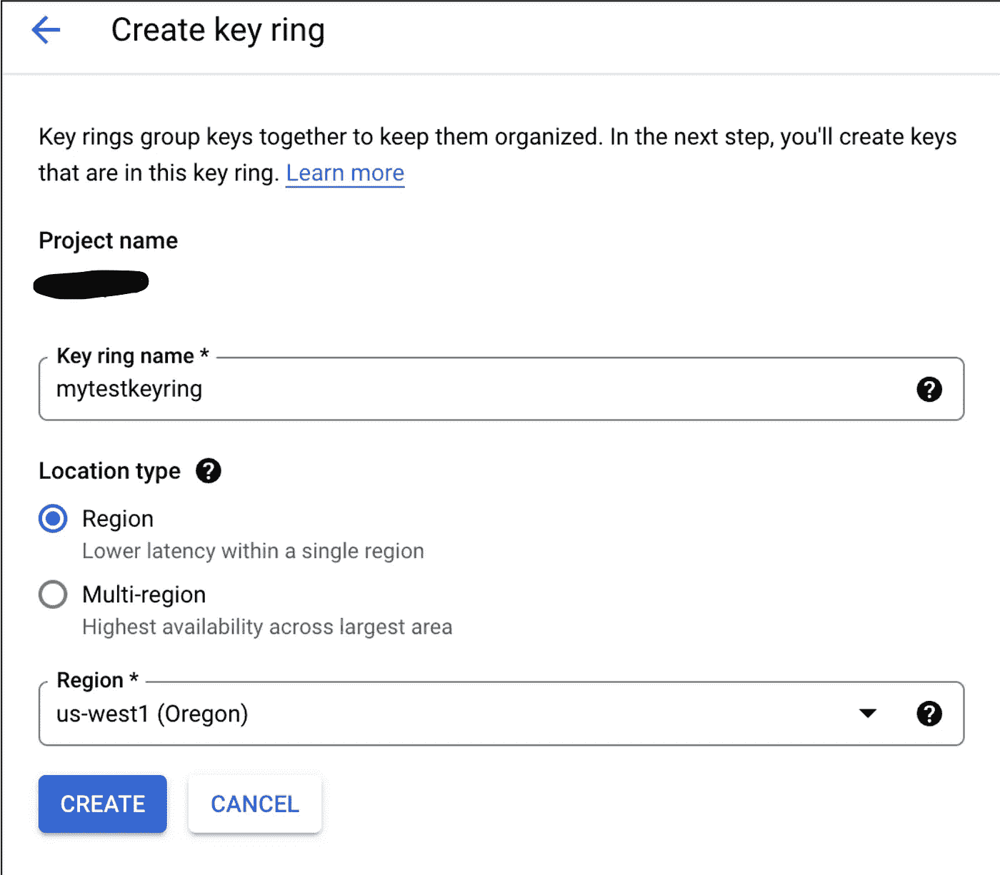

**1.3** 创建钥匙圈后，创建一把钥匙，并根据需要提及其他细节。

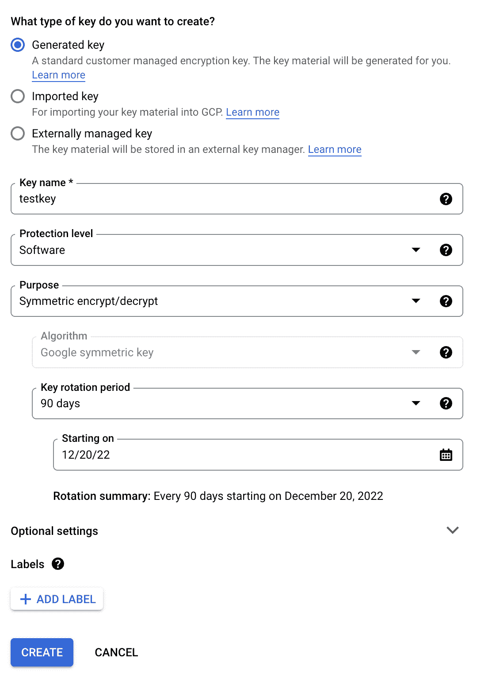

1.4 复制密钥的资源名称，我们将在接下来的步骤中使用它。

```
projects/xxxxxxx/locations/us-west1/keyRings/mytestkeyring/cryptoKeys/testkey
```

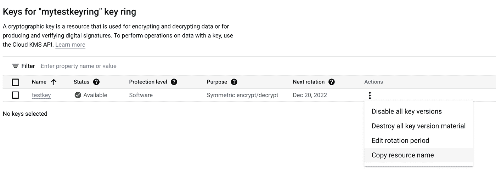

1.5 创建一个包装密钥(点击[此链接](https://cloud.google.com/dlp/docs/create-wrapped-key)或继续此处) :

在具有所需权限的用户的云外壳中，执行以下命令以获取包装的密钥:

a.

```
openssl rand -out "./aes_key.bin" 32 
```

b.

```
base64 -i ./aes_key.bin
```

*是 BASE64_ENCODED_AES_KEY，你得到的输出类似于下面:*uedo 6/yKx+zcg 2 cz 1 dbwpvzmvnk/c+jws 7 owpkmc/s =

c.要包装 AES 密钥，请使用 curl 向云 KMS API 发送以下请求

**替换从步骤 1.4 和 b 返回的密钥**和 BASE64_ENCODED_AES_KEY

```
curl "https://cloudkms.googleapis.com/v1/projects/xxxxxx/locations/us-west1/keyRings/mytestkeyring/cryptoKeys/testkey:encrypt" \
  --request "POST" \
  --header "Authorization:Bearer $(gcloud auth application-default print-access-token)" \
  --header "content-type: application/json" \
  --data "{\"plaintext\": \"uEDo6/yKx+zCg2cZ1DBwpwvzMVNk/c+jWs7OwpkMc/s=\"}"
```

记下您得到的响应中密文的值。那是你包好的钥匙。我们将在接下来的步骤中使用它。

## **2 DLP 模板**

2.1 要创建 DLP 模板，请转到安全→数据丢失防护。如果未启用，请启用 Api。

2.2 从配置选项卡创建模板。您可以按照步骤[这里的](https://cloud.google.com/dlp/docs/creating-templates-inspect)来创建模板。

2.3 创建模板后，复制路径如下:

> 项目/xxxxxxx/位置/美国西部 1/检查模板/模板 1

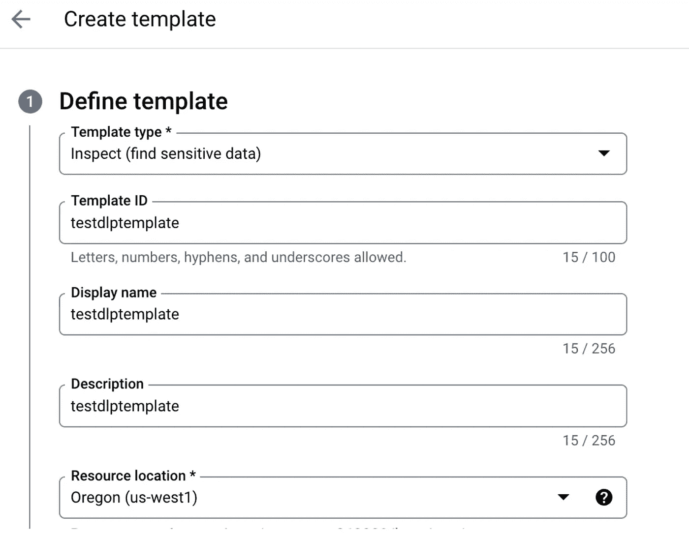

## 3 数据融合管道

启用数据融合 api。完成后，使用数据融合→实例创建一个数据融合实例

授予云数据融合使用所选 Dataproc 服务帐户的权限。单击创建。

启动可能需要大约 20 分钟。

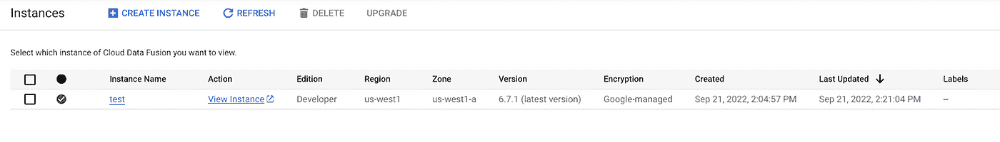

一旦实例启动，从顶部菜单进入 HUB，搜索“数据丢失”，部署插件“数据丢失预防”

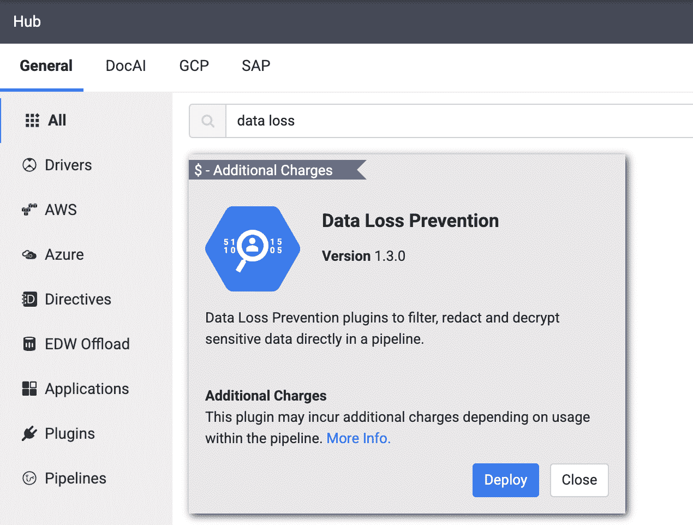

从左侧菜单中选择“管道中的工作室”。我们将创建下面的管道。为了简单和理解，我们将在同一管道中加密和解密。

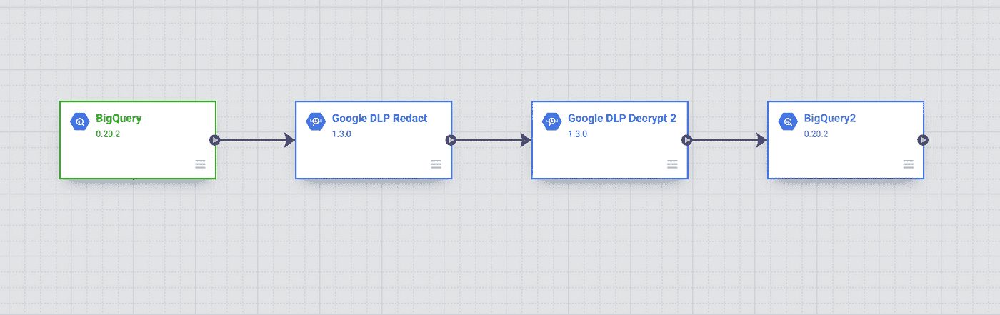

1.  来源:大查询

从源中选择大查询，在属性中浏览数据集和表。填写所需信息后，单击验证。您还可以检查输出模式。

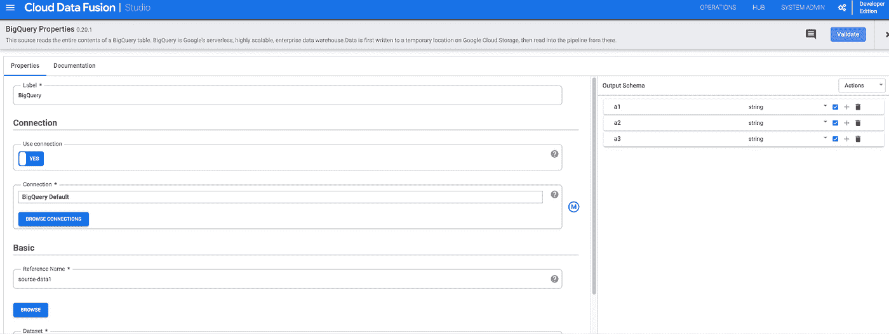

你可以在“转换”中看到 DLP 相关的转换。

2.对于加密—从转换中选择 Google DLP 密文。

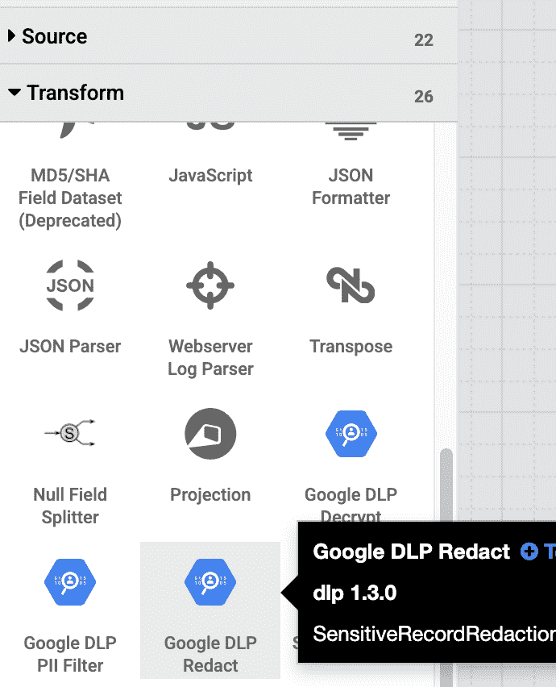

连接一个大查询源和 DLP 编校。大查询源的列将在 DLP 编校中可用。

*   在“属性”部分，选择“是”以使用自定义模板*
*   并粘贴步骤 2.1 中的模板路径，提到相同的资源位置。
*   在匹配中选择确定性加密，并选择要加密的输入字段。
*   使用加密密钥类型作为“KMS 包装密钥”。
*   分别提及步骤 1.4、1.5.c 中的 KMS 资源 ID 和包装密钥。
*   使用您选择的代理键。

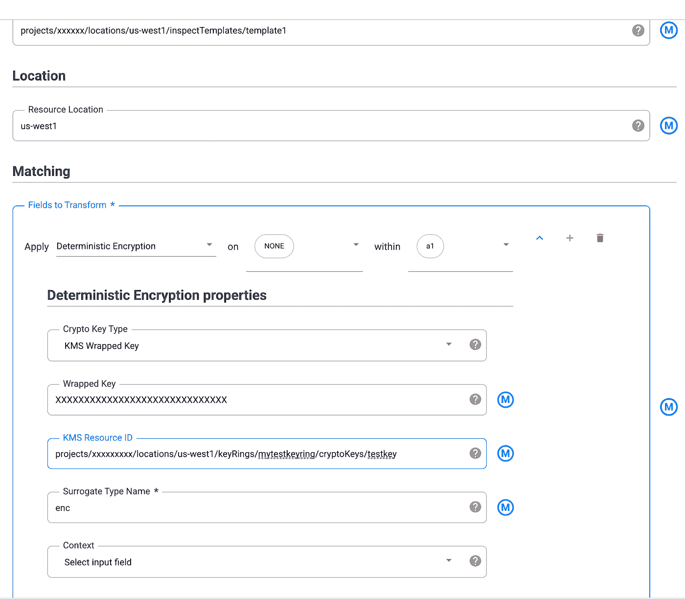

3.对于解密—从转换中使用 DLP decrypt，并提及与加密相同的所有细节。

4.Sink:从 sink 中选择 Big query 并浏览 sink 表。确保它具有与 DLP decrypt 的输出相同的匹配模式。

确保验证每个节点。此外，授予 DLP 和 KMS 相关角色所需的权限。

*【在使用具有 KMS 包装密钥的确定性加密时，云 KMS 密钥加密器/解密器角色必须被授予云数据丢失防护服务代理】*

转到预览部分并运行。

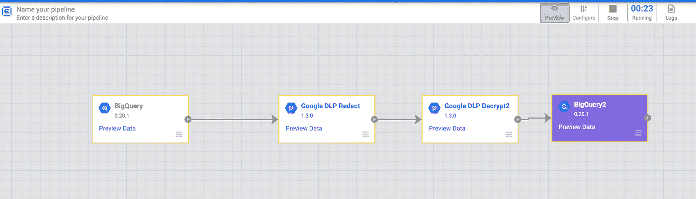

成功后，使用预览数据检查样本结果。其中 a1 列是加密的。这是谷歌 DLP 编校的输出。

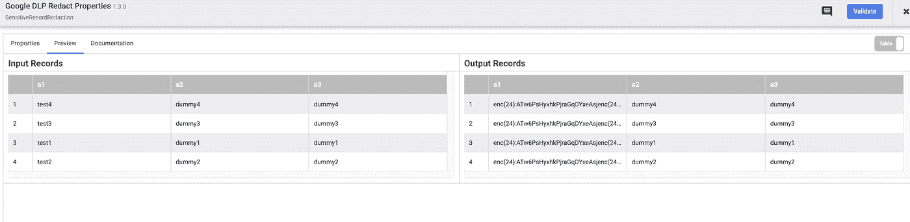

下面是解密后的预览数据。

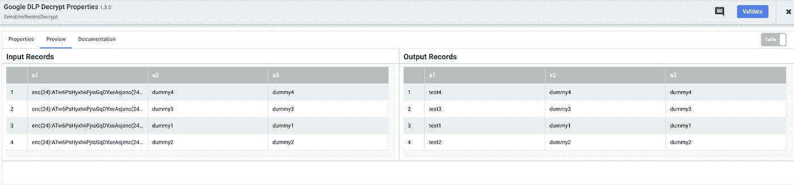

您可以在源和接收器之间添加更多的转换。完成后，使用 deploy 部署管道。