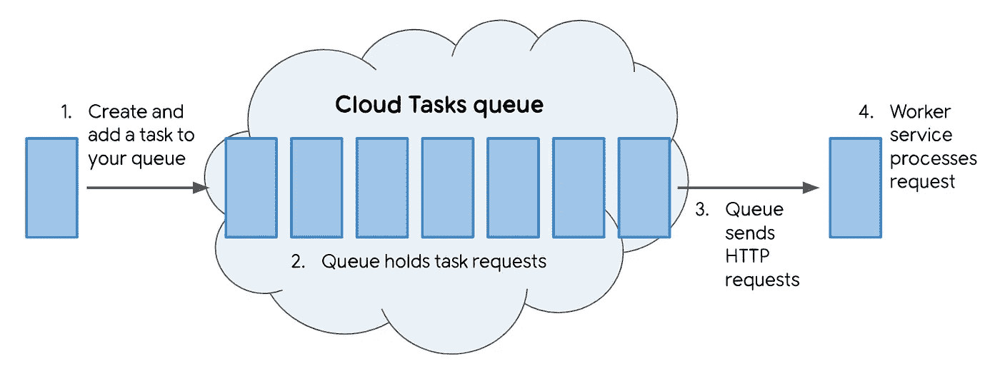

# 使用 ngrok 在本地开发您的云任务管道！

> 原文：<https://medium.com/google-cloud/develop-your-cloud-tasks-pipeline-locally-with-ngrok-5bee3693600f?source=collection_archive---------0----------------------->

任务队列允许您通过将请求添加到队列中以便将来执行，来减轻服务的后台工作负担。使用像云任务这样的托管服务有很多优点，但是在开发工作者服务时，很难模拟来自队列的最终任务请求。



示例云任务管道

ngrok 是一个向公共互联网公开本地 web 服务器的工具，它有一个方便的 UI 来检查发送到服务器的请求和服务器的响应。在本教程中，我们将学习如何使用 ngrok 在本地测试将任务添加到云任务队列的管道，以及如何使用 worker 服务处理任务请求。

*****这种方法存在将您的网络暴露在外的内在风险。在本教程中，我们将使用 Google Cloud Shell 的沙盒环境来最小化这些风险。这个过程可以在您的本地机器上复制，通过不暴露您的公共 URL 和最小化您的隧道暴露的时间来降低风险。* ****

ngrok 并不是 SSH 隧道的唯一选项，还有其他类似的工具如 [localtunnel.me](https://localtunnel.github.io/www/) 、 [burrow.io](https://burrow.io/) 、 [serveo](https://serveo.net/) ，或者您可以设置自托管远程端口转发。

1.  [开始之前](#b50e)
2.  [创建队列](#a003)
3.  [启动你的服务器](#8497)
4.  [启动 ngrok](#5c84)
5.  [创建任务](#af73)
6.  [清理](#2009)
7.  [接下来的步骤](#83ad)

# 开始之前

1.  [创建或选择谷歌云平台项目](https://console.cloud.google.com/projectselector/appengine/create)。
2.  将一个 [Google App Engine 应用](https://console.cloud.google.com/appengine)添加到您的项目中。
3.  启用[云任务 API](https://console.cloud.google.com/apis/library/cloudtasks.googleapis.com/?q=cloud%20tasks) 和[数据存储 API](https://console.cloud.google.com/apis/library/datastore.googleapis.com?q=datastore) 。
4.  打开[云壳编辑器](https://ssh.cloud.google.com/cloudshell/editor)。云壳为访问托管的项目和资源提供内置授权。如果您使用本地机器，通过[创建服务帐户](https://cloud.google.com/docs/authentication/getting-started#creating_a_service_account)和[将密钥设置为环境变量](https://cloud.google.com/docs/authentication/getting-started#setting_the_environment_variable)来设置 API 的认证。
5.  在云壳终端中:

*   [下载](https://ngrok.com/download)并解压 ngrok:

```
wget [https://bin.equinox.io/c/4VmDzA7iaHb/ngrok-stable-linux-amd64.zip](https://bin.equinox.io/c/4VmDzA7iaHb/ngrok-stable-linux-amd64.zip)unzip ngrok-stable-linux-amd64.zip
```

*   安装 Python 依赖项:

```
pip install --user flask google-cloud-datastore google-cloud-tasks
```

# 创建队列

首先，让我们创建一个队列来保存和发送您的任务请求。云壳已经预装了[云 SDK](https://cloud.google.com/sdk/docs/initializing) ，让你可以访问`gcloud`命令行工具。

1.  使用以下命令创建一个名为“my-queue”的队列:

```
gcloud tasks queues create my-queue
```

2.记下关于队列的一些信息:项目、位置和名称。使用`gcloud` CLI 确定这些值:

```
gcloud tasks queues describe my-queue# Output
name: projects/**my-project-id**/locations/**us-central1**/queues/**my-queue
...**
```

# 启动您的服务器

其次，我们将运行一个端点为`/update_counter`的 Python Flask 应用程序，它将接收云任务请求并更新存储在云数据存储中的值。

1.  创建一个名为`main.py`的文件，并复制以下代码:

2.在云 Shell 终端中，使用以下命令启动应用服务器:

```
python main.py
```

Flask 应用程序被设置为在端口 8080 上运行。我们还将设置 ngrok 来监听这个端口。

# 启动 ngrok

在创建第一个任务之前，我们需要启动 ngrok。

1.  在您的云 Shell 终端(➕)中打开另一个选项卡，并使用以下命令启动 ngrok:

```
./ngrok http 8080
```


ngrok 控制台用户界面

2.记下转发 URL。在本例中，URL 是 https://2da88316.ngrok.io。

3.ngrok 在端口 4040 上提供了一个实时的 web UI，您可以在这里检查通过您的隧道运行的所有 HTTP 流量。要打开检查 UI，请单击右上角的 Web 预览按钮，然后选择“更改端口”。输入 4040，点击“更改并预览”。这将从云外壳在您的浏览器中打开 [http://localhost:4040](http://localhost:4040/) 。


# 创建任务

现在，让我们创建一个任务并将其添加到您的队列中。

1.  创建一个名为`create_http_task.py`的文件，并复制以下代码:

2.用上述值更新变量 project、queue、location 和 url:

```
project = ‘my-project-id’
queue = ‘my-queue’
location = ‘us-central1’
url = ‘https://**2da88316**.ngrok.io/update_counter'
```

确保您的 URL 保留了“https”和端点“/update_counter”，以便请求可以正确地路由到处理程序。

3.现在发送一个以 ngrok 公共 URL 为目标的创建任务请求:

```
python create_http_task.py
```

4.看[检验 UI](http://localhost:4040) 。如果设置正确，您将看到 200 OK 响应


您还可以查看请求和响应的详细信息，包括时间、持续时间、头、查询参数和请求负载以及网络上的原始字节。


您可以在检查 UI 中重放请求，以减少 API 调用。

# 自定义请求正文和标题

云任务 API 强制将任务请求主体编码为字节数组。请求体被添加到`task['http_request']['body']`下的任务字典中。在`create_http_task.py`中，字符串变量`payload`已经用`.encodes()`方法编码成一个字节数组。

通过将[报头](https://googleapis.github.io/google-cloud-python/latest/tasks/gapic/v2beta3/types.html#google.cloud.tasks_v2beta3.types.HttpRequest.headers)字段添加到`http_request`字典，尝试改变请求的内容类型，从默认的“应用程序/八位字节流”。Flask route 可以根据这个内容类型解析请求体。

用您选择的语言了解更多关于任务对象的信息: [Python](https://googleapis.github.io/google-cloud-python/latest/tasks/gapic/v2/types.html#google.cloud.tasks_v2.types.Task) 、 [Node.js](https://googleapis.dev/nodejs/tasks/latest/google.cloud.tasks.v2.html#.Task) 、[。NET](https://googleapis.github.io/google-cloud-dotnet/docs/Google.Cloud.Tasks.V2/api/Google.Cloud.Tasks.V2.Task.html) ， [Go](https://godoc.org/google.golang.org/genproto/googleapis/cloud/tasks/v2#Task) ， [Java](https://googleapis.dev/java/google-api-grpc/latest/com/google/cloud/tasks/v2/Task.html) ， [PHP](https://googleapis.github.io/google-cloud-php/#/docs/google-cloud/v0.105.0/tasks/v2/task) ， [Ruby](http://googleapis.github.io/google-cloud-ruby/docs/google-cloud-tasks/latest/Google/Cloud/Tasks/V2/Task.html) 。

# 使用谷歌应用引擎目标

为了使用 ngrok 的公共 URL，您必须使用 HTTP 目标。尽管您可以轻松地将`http_request`更改为`appengine_http_request`并将`url`更改为`relative_uri`来定位应用引擎端点。

使用 App Engine 目标将提供额外的功能，如 [App Engine Routing](https://googleapis.github.io/google-cloud-python/latest/tasks/gapic/v2beta3/types.html#google.cloud.tasks_v2beta3.types.AppEngineHttpRequest.app_engine_routing) 字段，以将您的请求定制到您的应用的特定服务、版本和实例以及[特殊头](https://cloud.google.com/tasks/docs/creating-appengine-handlers#reading_request_headers)。

# 打扫

*   在终端中使用`CTRL+C`关闭 ngrok 实例。
*   在终端中使用`CTRL+C`关闭本地 Python 服务器。
*   为了避免因使用资源而向您的 Google 云平台帐户收取费用，请转到控制台并删除您的项目。

# 后续步骤

在[云任务概述](https://cloud.google.com/tasks/docs/dual-overview)中了解更多关于云任务服务的信息。