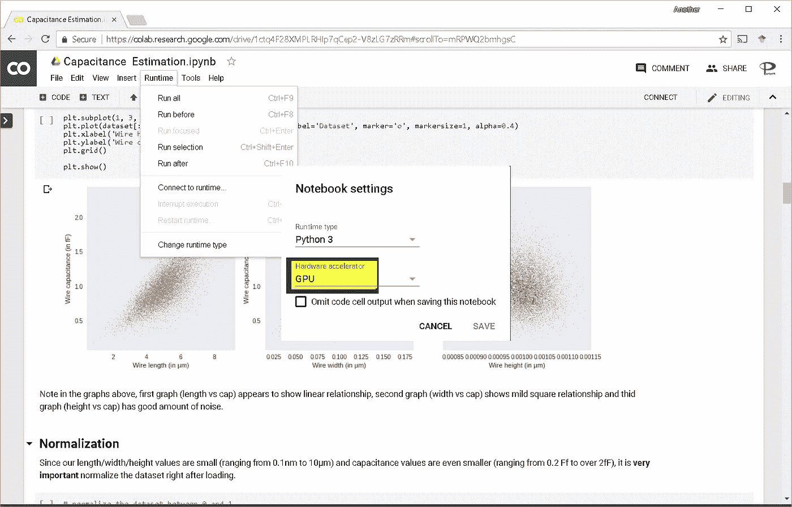

# 使用免费的 GPU 在云中开发自己的深度学习应用程序

> 原文：<https://medium.com/google-cloud/develop-your-own-deep-learning-app-in-the-cloud-with-free-gpus-176a8480ab46?source=collection_archive---------1----------------------->

云端 GPU 深度学习

*【鸣谢:此素材来源为* [*设计自动化中的机器智能。*](http://amzn.to/2paZ53b)

*机器智能和深度学习技术正在飞速发展。声称这一名声是因为它必将使各行各业的自动化达到前所未有的程度。设计自动化，一个已经自动化半导体设计几十年的领域，正在迎头赶上。Paripath 使用这些技术已经有几年了，并决定使用博客、开放源代码、书籍和其他宣传材料来传播这些信息。在本文中，我希望通过一步一步地引导读者(从工程师到高管)在云端开发一个电容估算应用程序，从而让他们开始深度学习。*

## ***在 chrome 浏览器中安装谷歌协作应用***

*这一步就像启动你的 chrome 浏览器 [***点击这个链接***](https://chrome.google.com/webstore/detail/colaboratory/flckfnigdgnmmidlohfbfccgpakpeagd) 安装 chrome 扩展一样简单。这个 chrome 扩展基于 [jupyter notebook](http://jupyter.org/) ，一个机器学习的开源 web 开发环境。点击“添加到 chrome”将在您的 CHROME 浏览器中安装开发环境。*

**

*在 Chrome 中安装 Google Colab 应用程序*

## ***创建/打开协作笔记本。***

*下面的 URL 包含了基于导线物理特性的电容估算的开放源代码的合作笔记本。一旦点击链接[https://drive . Google . com/file/d/1 ctq 4 f 28 xmplrhip 7 qcep 2-V8 zlg 7 zrrm/view？usp=sharing](https://drive.google.com/file/d/1ctq4F28XMPLRHIp7qCep2-V8zLG7zRRm/view?usp=sharing) ，它在你的 chrome 浏览器中打开，如图所示。*

**

*打开 Colab 笔记本*

*点击上图中箭头所示的合作链接。这将在您的浏览器中打开笔记本。*

## *运行应用程序*

*笔记本打开后，按“ **CTRL+F9** ”或点击“运行时- >运行全部”即可运行，如下图所示*

**

*带有代码和文本的 Colab 笔记本*

***分析结果***

*一旦你点击“ **CTRL+F9** ”，运行在 google farm 上的远程服务器会立刻产生结果。您可以分析模型结果并根据自己的需要进行调整。*

**

*带有结果和图表的 Colab 笔记本*

***免费使用 GPU***

*如果你的应用花费的时间比平时长，你可以通过点击“运行时->更改运行时类型”免费使用 GPU，如下图所示:*

**

*在 Google Cloud 中使用 GPU*

***总结***

*现在，您已经使用 google 提供的 GPU 在云中开发了您的第一个机器学习应用程序，考虑一下您已经拥有了在下一个应用程序中部署机器学习所需的所有信息。祝你好运！*

# *参考:*

1.  *[Tensorflow:面向所有人的开源机器学习框架](https://www.tensorflow.org/)*
2.  *关于[设计自动化中的机器智能的书](http://amzn.to/2paZ53b)*
3.  *EDA 和 CAD 中的[机器智能短期课程](https://www.udemy.com/vsd-machine-intelligence-in-eda-cad)*
4.  *面向 EDA 和 CAD 的开源[机器学习应用](https://srohit0.github.io/mida)*