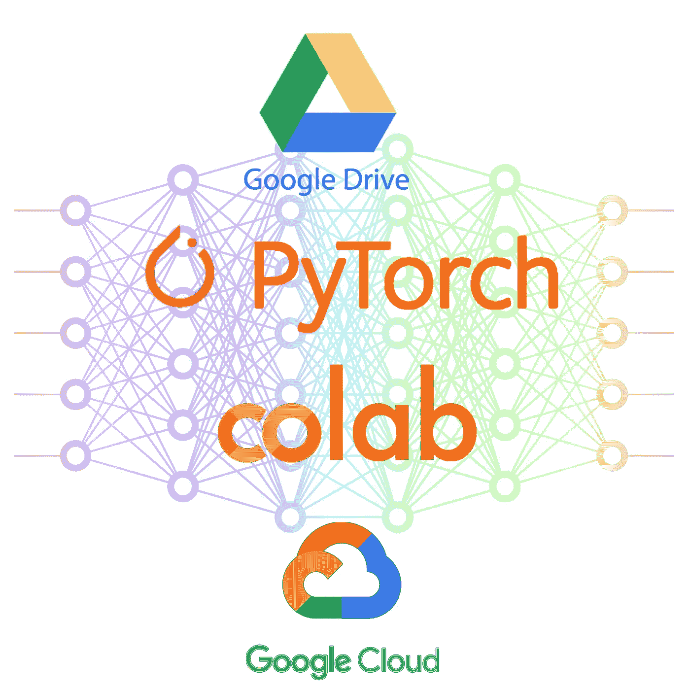
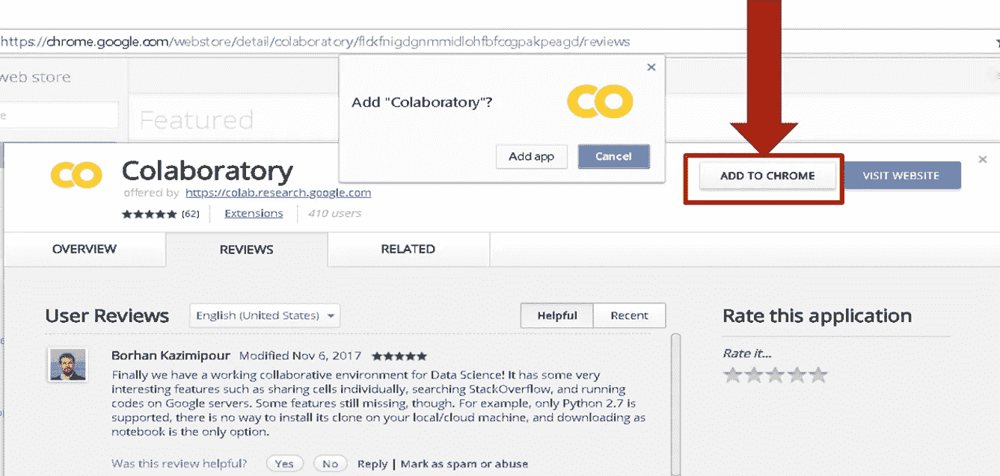
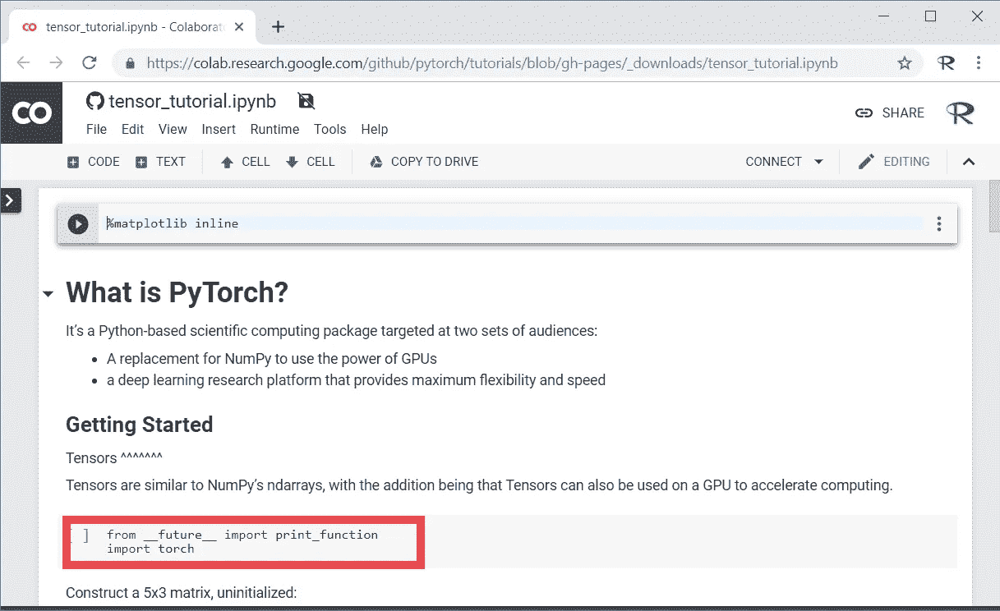
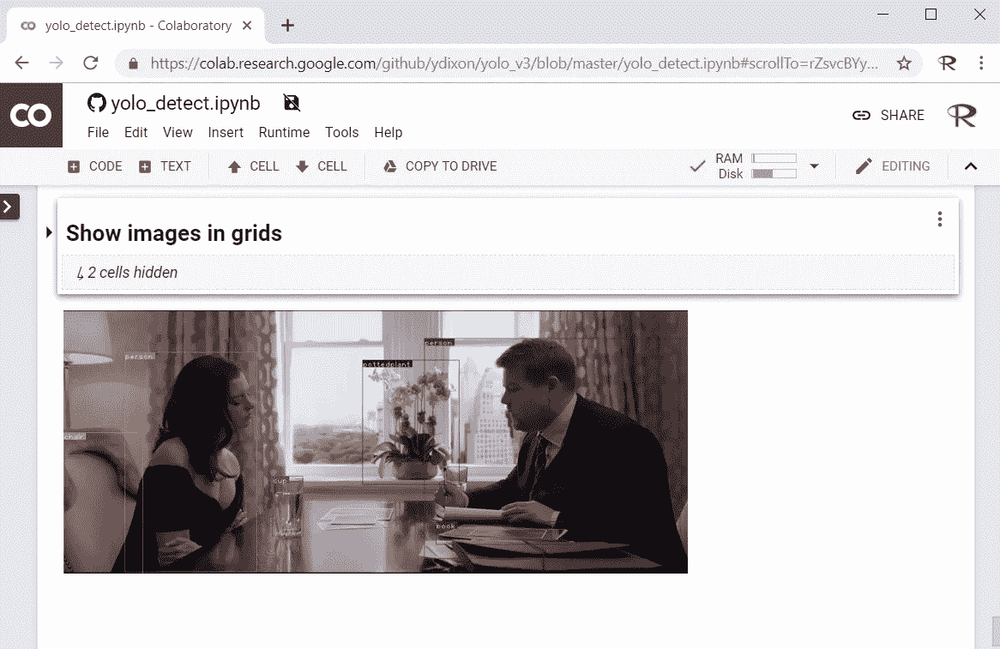
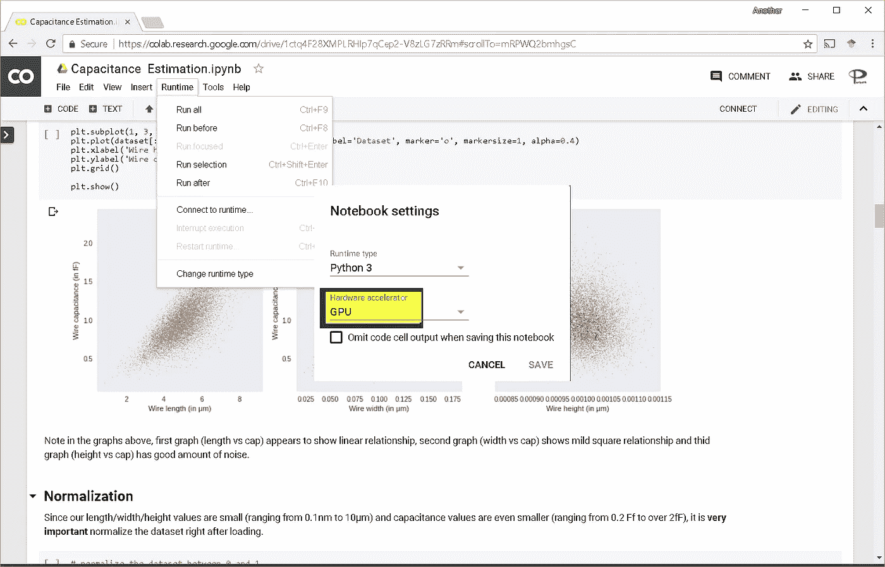

# 开发您自己的 PyTorch 应用程序

> 原文：<https://medium.com/google-cloud/develop-your-own-pytorch-app-52fd10cb8a21?source=collection_archive---------3----------------------->

谷歌的深度学习基础设施与脸书的 Pytorch 相结合

## 在云中使用免费的 GPU

**第一步:在 chrome 浏览器中安装谷歌协作应用**

这一步就像启动你的 chrome 浏览器和 [***点击这个链接***](https://chrome.google.com/webstore/detail/colaboratory/flckfnigdgnmmidlohfbfccgpakpeagd) 安装 chrome 扩展一样简单。这个 chrome 扩展基于 [jupyter notebook](http://jupyter.org/) ，一个机器学习的开源 web 开发环境。点击“添加到 chrome”将在您的 CHROME 浏览器中安装开发环境。

在 Chrome 中安装 Google Colab 应用程序

**步骤 2:创建/打开合作笔记本**以下 URL 包含合作笔记本，其中包含基于导线物理特性估算电容的开源代码。一旦你点击链接[https://py torch . org/tutorials/beginner/blitz/tensor _ tutorial . html # getting-started](https://pytorch.org/tutorials/beginner/blitz/tensor_tutorial.html#getting-started)，它就会在你的 chrome 浏览器中打开，如图所示。

PyTorch 教程(鸣谢:pytorch.org)

**第三步:修改应用程序以添加您的功能。**

拿着这个笔记本，删除代码，开始添加您的自定义功能。我在 colab 中使用 pytorch 成功地使用了使用 [yolo 算法](https://pjreddie.com/darknet/yolo/)的对象检测。

google colab 中使用 pytorch 的 yolo 对象检测

**第四步:免费使用 GPU**

如果你的应用花费的时间比平时长，你可以通过点击“运行时->更改运行时类型”免费使用 GPU，如下图所示:

在 Google Cloud 中使用 GPU

**总结**

现在你已经使用谷歌提供的 GPU 在云中开发了你的第一个 [pytorch](https://pytorch.org/) 应用程序，考虑一下你已经拥有了在下一个应用程序中部署深度学习所需的所有信息。祝你好运！

**参考:**

1.  [PyTorch:深度学习研究平台](https://pytorch.org/)
2.  关于设计自动化中的机器智能的书
3.  EDA 和 CAD 中的[机器智能短期课程](https://www.udemy.com/vsd-machine-intelligence-in-eda-cad)
4.  面向 EDA 和 CAD 的开源[机器学习应用](https://srohit0.github.io/mida)